[Questions et réponses d'entrevue C](https://www.youtube.com/playlist?list=PLk6CEY9XxSIB9jwcI0SP_FbamuqSWxvse)

# Initialisation désignée en C

* Question:

  Qu'est-ce que l'initialisation désignée en C?

* Réponse:

  1. Il fournit un moyen rapide d'initialiser des éléments spécifiques dans un tableau
     2. Il fournit un moyen d'initialiser explicitement les membres de structure
  
  ~~~~c
  struct Str {
      int a;
      int b;
  };
  
  int main()
  {
      int arr1[10] = {[3] = 10, [6] = 20}; 
      // int arr1[10] = {[3]10, [6]20};
      // This is not allowed in C++, you need to initialize all elements like this
      // int arr1[2] = {[0] = 10, [1] = 20}; // OK
      // int arr1[2] = {[1] = 10, [0] = 20}; // order NOK
      for(int i = 0; i < 10; ++i) {
          printf("%d ", arr1[i]);
      }
  
      printf("\n*********************\n");
  
      int arr2[10] = {[6] = 10, [3] = 20}; // This is not allowed in C++
      for(int i = 0; i < 10; ++i) {
          printf("%d ", arr2[i]);
      }
      
      int arr3[] = {[0 ... 9] = 1, [10 ... 98] = 2, [99] = 3 }; // This is not allowed in C++
      for(int i = 0; i < 100; ++i) {
          printf("%d ", arr3[i]);
      }
      
      printf("\n*********************\n");
  
      struct Str s1 = {.a = 10, .b = 20};
      // struct Str s1 = {a : 10, b : 20};
      printf("%d\n", s1.a);
      printf("%d\n", s1.b);
  
      struct Str s2 = {.b = 100, .a = 200}; // This order is not allowed in C++
      printf("%d\n", s2.a);
      printf("%d\n", s2.b);
  
      return 0;
  }
  
  ~~~~

# Comment imprimer quelque chose sans point-virgule?

* Question:

  Comment imprimer quelque chose sans point-virgule?

* Réponse:

  ~~~~c
  int main()
  {
      if(printf("Hello World!\n")) {}
  
      while(!printf("Hello World\n")) {}
  
      return 0;
  }
  ~~~~

# Comment écrire votre propre fonction atoi en C & C ++?

* Question:

  Comment écrire votre propre fonction atoi en C & C ++?

* Réponse:

  atoi: ASCII to Int

  ~~~~c
  int my_atoi(char *str) {
      int res = 0;	// initialize result
      int sign = 1;	// initialize sign as positive
      int i = 0;		// initialize index of first digit
  
      // if number is negative, the update sign
      if(str[0] == '-') {
          sign = -1;
          i++;
      }
  
      while(str[i] != '\0') {
          res = res * 10 + str[i] - '0';
          i++;
      }
  
      return res * sign;
  }
  
  int main()
  {
      char str[] = "-1234"; // char *str = "-1234";
      int val = my_atoi(str);
      printf("%d\n", val);
  
      return 0;
  }
  ~~~~

# Big Endian et Little Endian

* Question:

  Qu'est-ce que Big Endian et Little Endian?

* Réponse:

  Big Endian et Little Endian est un moyen de lire la mémoire, dans l'un d'eux, nous lisons du début à la fin et un autre lit de la fin au début.

  ~~~~
  0x12345678
  					  Address
  				Low ----------- High
  Big Endian: 		12 34 56 78
  Little Endian: 		78 56 34 12 
  ~~~~

  Vérification:

  ~~~~c
  unsigned int i = 1;
  char *c = (char*)&i;
  if(*c) {
  	printf("Little Endian\n");
  }
  else {
  	printf("Big Endian\n");
  }
  ~~~~

  

# Comment renvoyer un tableau 2D à partir d'une fonction en C & C ++

* Question: 

  Comment retourner un tableau bidimensionnel à partir d'une fonction en C et C ++?

* Réponse:

  1. Utilisation d'un tableau dynamique
     2. Utilisation d'un mot-clé statique
     3. Utilisation de la technique struct

  Example:

  1. tableau dynamique

     ~~~~c++
     const int N = 3;
     
     void print_array(int **arr) {
     	for (int i = 0; i < N; ++i) {
     		for (int j = 0; j < N; ++j) {
     			cout << arr[i][j];
     		}
     		cout << endl;
     	}
     }
     
     int **get_array() {
     	int **arr = new int*[N];
     	for (int i = 0; i < N; ++i) {
     		arr[i] = new int[N];
     		for (int j = 0; j < N; ++j) {
     			arr[i][j] = i + j;
     		}
     	}
     	return arr;
     }
     
     int main()
     {
     	int **arr;
     	arr = get_array();
     	print_array(arr);
     	return 0;
     }
     ~~~~

  2. mot-clé statique

     ~~~~c++
     const int N = 3;
     
     void print_array(int arr[][N]) {
     	for (int i = 0; i < N; ++i) {
     		for (int j = 0; j < N; ++j) {
     			cout << arr[i][j];
     		}
     		cout << endl;
     	}
     }
     
     int ((*get_array)())[N] {
     	static int arr[N][N] = {
     		{0, 1, 2},
     		{3, 4, 5},
     		{6, 7, 8}
     	};
     
     	return arr;
     }
     
     /*typedef (*double_pointer)[N];
     double_pointer get_array() {
     	// ...
     }*/
     
     int main()
     {
     	int (*arr)[N]; // a pointer which holds N number of arrays
     	arr = get_array();
     	print_array(arr);
     	return 0;
     }
     ~~~~

  3. technique struct

     ~~~~c++
     const int N = 3;
     
     struct ArrStruct {
     	int arr[N][N];
     };
     
     void print_array(ArrStruct var) {
     	for (int i = 0; i < N; ++i) {
     		for (int j = 0; j < N; ++j) {
     			cout << var.arr[i][j];
     		}
     		cout << endl;
     	}
     }
     
     ArrStruct get_array() {
     	ArrStruct var;
     	for (int i = 0; i < N; ++i) {
     		for (int j = 0; j < N; ++j) {
     			var.arr[i][j] = i + j;
     		}
     	}
     
     	return var;
     }
     
     int main()
     {
     	ArrStruct arr;
     	arr = get_array();
     	print_array(arr);
     	return 0;
     }
     ~~~~

# Pointeur de fonction en C

* Question:

  1. Qu'est-ce que le pointeur de fonction et comment le créer?
  2. Appel d'une fonction à l'aide d'un pointeur de fonction.
  3. Comment passer un pointeur de fonction comme argument?
  4. Comment retourner un pointeur de fonction?
  5. Comment utiliser un tableau de pointeurs de fonction?
  6. Où utiliser le pointeur de fonction?

* Réponse

  1. Qu'est-ce que le pointeur de fonction et comment le créer?

     La variable de pointeur normal stocke l'adresse d'une autre variable, le pointeur de fonction stocke l'adresse d'une fonction

     Comment créer ?

     ~~~~c
     int add(int a, int b) {
     	return a + b;
     }
     
     int main() {
         int (*fun)(int, int) = add;
     	// or
         // int (*fun)(int, int) = &add;
         
         return 0;
     }
     ~~~~

  2. Appel d'une fonction à l'aide d'un pointeur de fonction.

     ~~~~c
     int add(int a, int b) {
     	return a + b;
     }
     
     int main() {
         int (*fun)(int, int) = add;
     	// or
         // int (*fun)(int, int) = &add;
         
         int c = fun(1, 2);
     	// or
     	// int c = (*fun)(1, 2);
         
         return 0;
     }
     ~~~~

  3. Comment passer un pointeur de fonction comme argument?

     ~~~~c
     int add(int a, int b) {
     	return a + b;
     }
     
     int func(int (*someFun)(int, int)) {
     	int c = someFun(1, 2);
     	return c;
     }
     
     int main() {
         int c = func(add);
         
         return 0;
     }
     ~~~~

  4. Comment retourner un pointeur de fonction?

     ~~~~c
     int add(int a, int b) {
     	return a + b;
     }
     
     int sub(int a, int b) {
     	return a - b;
     }
     
     typedef int(*mathFun)(int, int);
     mathFun fun(int type) {
     	if(type == 1)
     		return add;
     	if(type == 2)
     		return sub;
     }
     
     //int (*fun(int type))(int, int) {
     //}
     
     int main() {
         int (*someFun)(int, int);
         someFun = fun(1);
         int c = someFun(1, 2);
         
         return 0;
     }
     ~~~~

  5. Comment utiliser un tableau de pointeurs de fonction?

     ~~~~c
     int add(int a, int b) {
     	return a + b;
     }
     
     int sub(int a, int b) {
     	return a - b;
     }
     
     typedef int(*mathFun)(int, int);
     
     int main() {
         mathFun arr[2] = {add, sub};
         // int (*arr[2])(int, int) = {add, sub};
         int c = arr[0](1, 2);
         int d = arr[1](1, 2);
         
         return 0;
     }
     ~~~~

  6. Où utiliser le pointeur de fonction?

     Passer l'adresse de la fonction à une autre fonction

Pourquoi malloc est plus rapide que calloc?

* Question: 

  Why malloc is faster than calloc?

* Réponse:

  malloc retourne la mémoire telle qu'elle provient du système d'exploitation, mais calloc récupère la mémoire du noyau ou du système d'exploitation et l'initialise avec zéro. Cette initialisation prend du temps.

  ~~~~c++
  int main()
  {
  	int* int_ptr1 = (int*)malloc(5 * sizeof(int));
  	memset(int_ptr1, 0, sizeof(int_ptr1)); // use calloc instead of these 2 lines
  
  	int* int_ptr2 = (int*)calloc(5, sizeof(int));
  
  	free(int_ptr1);
  	free(int_ptr2);
  
  	return 0;
  }
  ~~~~

# Quelle est la valeur de retour de printf et scanf en C / C ++?

* Question: 

  Quelle est la valeur de retour de printf et scanf en C / C ++?

* Réponse:

  1. printf retourne le nombre de caractères imprimés avec succès et
  2. scanf retourne le nombre d'éléments lus avec succès depuis la console.

  ~~~~c++
  int main()
  {
  	char array[100];
  	int val;
  
  	int printf_out = printf("%s", "hi there\n");
  	int scanf_out = scanf("%s %d", array, &val);
  
  	cout << printf_out << endl; // 9
  	cout << scanf_out << endl;  //2
      
      // printf("%d\n", printf_out); // 9
  	// printf("%d\n", scanf_out); // 2
  
  	return 0;
  }
  ~~~~

# Pointeur suspendu en C

* Question: 

  Qu'est-ce que le pointeur suspendu en C?

* Réponse: 

  Le pointeur suspendu se produit lorsque nous pointons vers un emplacement mémoire dans une variable de pointeur mais que nous l'avons déjà libéré auparavant.

  ~~~~c++
  void func(int* ptr) {
  	cout << *ptr << endl;
  	delete ptr;
  }
  
  int main()
  {
  	int* p1 = new int(10);
  	int* p2 = p1; // p1 and p2 point to the same memory location
  	func(p2);
  
  	cout << *p1 << endl; // undefined behavior, the memory which points p1 has been already freed
  	
  	return 0;
  }
  ~~~~

# Qu'est-ce qu'une erreur de segmentation et comment la trouver en C & C ++?

* Question:

  Qu'est-ce qu'une erreur de segmentation?

* Réponse:

   Une erreur de segmentation se produit en raison d'une violation d'accès à la mémoire.

   1. débordement de pile (stack overflow)
   2. violation d'écriture
   3. violation de lecture
   4. et bien d'autres mais tous sont liés à une erreur de mémoire.

* Question:

   Comment déboguer l'erreur de segmentation?

* Réponse:

   Après "Segmentation default (core dumped)", un fichier core est créé. Et utilisez gdb pour déboguer ce fichier core.

~~~~
g++ -g app.cpp

gdb a.out core
~~~~

# Littéraux de chaîne (String Literals) en C et C ++

* Question:

  Que sont les littéraux de chaîne (String Literals) en C et C ++?

* Réponse:

  Littéraux de chaîne:
  1. Ils sont des chaînes constantes et ne peuvent pas être modifiés !!
     2. Le pointeur peut être changé pour pointer vers une autre chaîne !!
     3. Les chaînes littérales étant constantes par nature, l'application du mot-clé const donne un avantage supplémentaire.
     4. La création d'un tableau de chaîne n'est pas une chaîne littérale.
     5. Nous pouvons changer la chaîne de tableau non const.
     6. Expérimentez avec le passage de fonction.
     7. Chaîne RAW dans C ++ 11.

  ~~~~c
  void func(char * ptr) {
      ptr[2] = 'v';
      printf("ptr = %s\n", ptr);
  }
  
  int main()
  {
      char * str1 = "Hello World";
      //str1[2] = 'a'; // str1 is constant string which cannot be changed, runtime error
  
      char * str2 = "Hello C";
      str2 = str1; // OK
      printf("str1 = %s\n", str1); // str1 = Hello World
      printf("str2 = %s\n", str2); // str2 = Hello World
  
      const char * str3 = "Hello Hello";
      //str3[2] = 'a'; // compile time error
  
      char arr[] = "abcdef"; // array of characters is not string literals
      arr[2] = 'x'; // OK
      printf("arr = %s\n", arr); // arr = abxdef
  
      //func(str1); // runtime error, str1 is constant string
      func(arr); // OK
  
      return 0;
  }
  ~~~~

  ~~~~c++
  // Raw string in C++11
  
  int main()
  {
      string str = R"(Hello\nWorld)";
      cout << str << endl; // Hello\nWorld
      
      return 0;
  }
  ~~~~

# sizeof est une fonction OU un opérateur? Comment ça fonctionne?

* Question:

  sizeof est une fonction OU un opérateur? Comment ça fonctionne?

* Réponse:

  1. C'est un opérateur, pas une fonction.
  2. Ceci est évalué à la compilation et non à l'exécution.
  3. Il n'effectue pas l'opération donnée comme expression.
  4. Les parenthèses sont facultatives.

  ~~~~c
  int main()
  {
      int x = 0;
  
      printf("%d\n", sizeof(x++)); // 4, x++ will not be evaluated 
      printf("%d\n", x); // 0
  
      return 0;
  }
  ~~~~

# Champs de bits en C et C ++

* Question:

  What is bit field in C & C++? 

* Réponse:

  1. Il est utilisé pour réduire la taille de "class (en C ++) / struct" si nous le pouvons.
2. L'alignement de force est possible en utilisant des champs de bits sans nom de taille 0.
  3. La prise de pointeurs vers des membres de champ de bits n'est pas autorisée car ils ne peuvent pas commencer à une limite d'octet.
  4. L'affectation d'une valeur hors plage à un membre de champ de bits est définie par l'implantation.
  5. Nous pouvons avoir des membres statiques dans une structure, mais les champs de bits ne peuvent pas être statiques
  6. Le tableau de champs de bits n'est pas autorisé
  
  
  
  Exemple:
  
  1. Il est utilisé pour réduire la taille de "class (en C ++) / struct" si nous le pouvons.
  
     ~~~~c
     struct Date
     {
     	unsigned int d : 5;
     	unsigned int m : 4;
     	unsigned int y;
     };
     
     int main()
     {
       struct Date d;
         d.d = 8;
   	d.m = 8;
     	d.y = 2020;
     
         printf("%d/%d/%d\n", d.d, d.m, d.y);
         printf("%d\n", sizeof(struct Date)); // 8
     
         return 0;
     }
     ~~~~
  
  2. L'alignement de force est possible en utilisant des champs de bits sans nom de taille 0.
  
     ~~~~c
     struct Node1
     {
     	unsigned int a : 6;
     	unsigned int b : 9;
     };
     
     // with forced alignment
     struct Node2
     {
     	unsigned int a : 6;
     	unsigned int : 0;
   	unsigned int b : 9;
     };
   
     int main()
     {
         printf("%d\n", sizeof(struct Node1)); // 4
         printf("%d\n", sizeof(struct Node2)); // 8
     
         return 0;
     }
     ~~~~
  
  3. La prise de pointeurs vers des membres de champ de bits n'est pas autorisée car ils ne peuvent pas commencer à une limite d'octet.
  
     ~~~~c
     struct Node
     {
     	unsigned int a : 5;
     	unsigned int b : 5;
     	unsigned int c;
     };
   
     int main()
   {
         struct Node t;
         // printf("%d\n", &t.a); // Not allowed
         // printf("%d\n", &t.b); // Not allowed
         printf("%d\n", &t.c); // Allowed, because c is not bit field member
     
         return 0;
     }
     ~~~~
  
  4. L'affectation d'une valeur hors plage à un membre de champ de bits est définie par l'implantation.
  
     ~~~~c
     struct Node
     {
     	unsigned int a : 2;
     	unsigned int b : 2;
     	unsigned int c : 2;
   };
     
   int main()
     {
         struct Node n;
         n.a = 5;
         printf("%d\n", n.a); //  not a good practice
     
         return 0;
     }
     ~~~~

  5. Nous pouvons avoir des membres statiques dans une structure, mais les champs de bits ne peuvent pas être statiques

     ~~~~c
     struct Node
     {
     	// static unsigned int a : 5; // error
     	unsigned int b : 2;
     	unsigned int c : 2;
     };
   ~~~~
  
6. Le tableau de champs de bits n'est pas autorisé
  
     ~~~~c
     struct Node
     {
     	// unsigned int x[10] : 2; // error
     	unsigned int a : 2;
     };
     ~~~~
  
  Remarque:
  
  1. Les champs de bits proviennent du langage C, il n'y a aucune différence en C ++
  2. Il est utilisé pour réduire la taille de "class (en C++) / struct" si nous le pouvons.
  3. Cette fonctionnalité est excellente dans les systèmes embarqués car la mémoire est insuffisante
  4. Rembourrage structurel en C / C ++
  5. Uniquement les types intégraux: bool, char, signed char, unsigned char, char16_t, char32_t, wchar_t, short, int, long, long long, unsigned short, insigned int, unsigned long, unsigned long long

# Trouver le nième Node à partir de l'arrière dans une liste simplement chaînée ( singly linked list)

* Question:

  Comment trouver le nième nœud de l'arrière dans une liste simplement chaînée un seul parcours?

  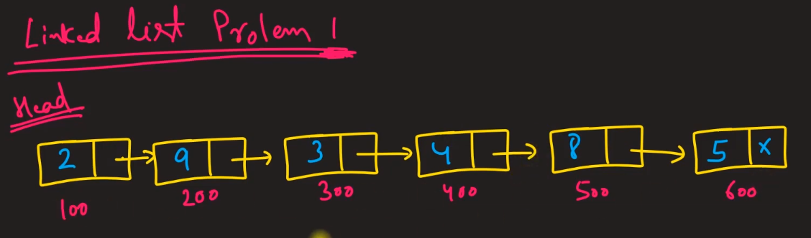

* Réponse:

  L'idée est que nous maintiendrons deux pointeurs et un pointeur se déplacera vers le nième nœud, puis nous déplacerons les deux pointeurs en même temps, et au moment où le premier pointeur atteindra le dernier nœud, le deuxième pointeur sera au nœud souhaité .

# Rechercher si deux listes chaînées ont un point d'intersection

* Question:

  Comment savoir si deux listes chaînées ont un point d'intersection?

  

* Réponse:

  * Solution 1:

    Utilisez un indicateur (flag) "visité"

  * Solution 2:

     Parcourez la première liste chaînée et enregistrez l'adresse du dernier nœud dans une variable temporaire. Parcourez ensuite la deuxième liste chaînée pour vérifier si son dernier nœud a la même valeur que la variable temporaire.

  * Solution 3:

     Calculez la différence (n) entre le nombre de nœuds des deux listes chaînées et déplacez la position «n» de la plus grande liste chaînée. Ensuite, déplacez ces deux listes chaînées ensemble, vérifiez si elles atteignent le même nœud.

# Rechercher s'il existe un cycle (boucle) dans une liste chaînée

* Question:

  Comment savoir s'il y a un cycle (boucle) dans une liste chaînée?

  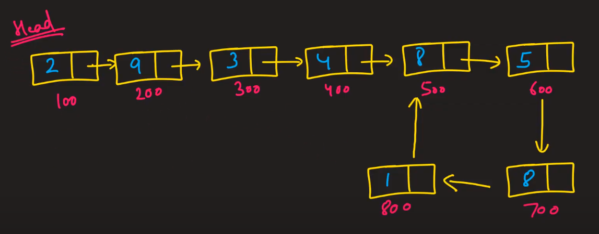

* Réponse:

  1. Marquez chaque nœud avec un drapeau "visité"
  2. Conservez un ensemble de hachage de tous les nœuds vus jusqu'à présent

  3. Problème de tortue et lièvre (tortue et lapin) - "Tortoise and Hare problem" OU algorithme de recherche de cycle de Floyd.

     Utilisez 2 pointeurs: un lent et un rapide.

     Déplacez le pointeur lent d'une position à la fois et déplacez le pointeur rapide de deux positions à la fois. Vérifiez si le pointeur lent et le pointeur rapide atteignent le même nœud.

     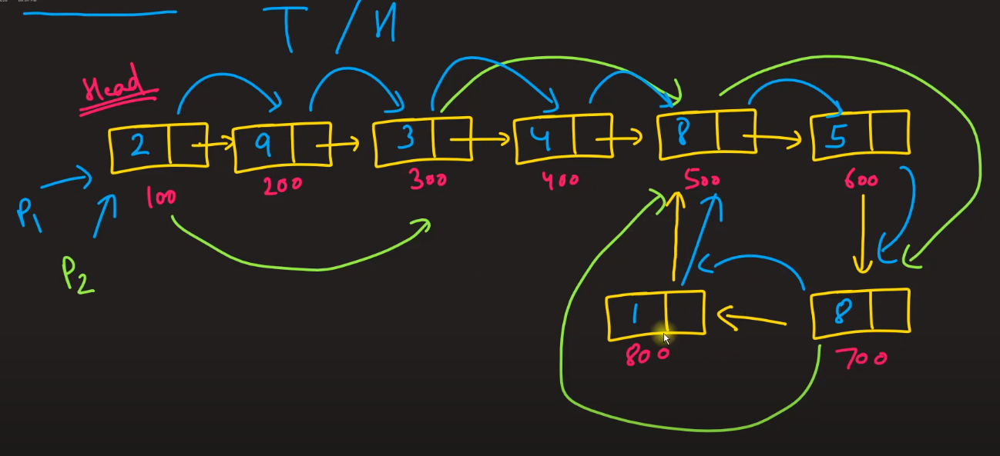

# C MCQ #1

* Question:

  Que retourne la fonction printf après l'impression?

  

* Réponse: D

# C MCQ #2

* Question:

  Que retourne la fonction scanf après avoir pris des valeurs?

  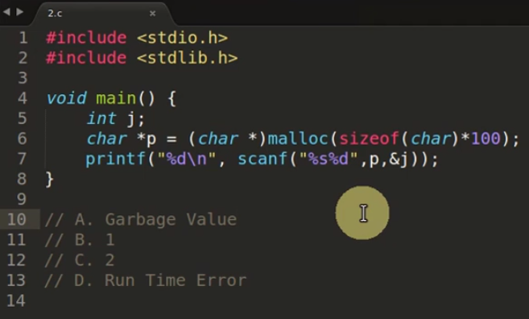

* Réponse: C

  

# C MCQ #3

* Question:

  

* Réponse: A

# C MCQ #4

* Question:

  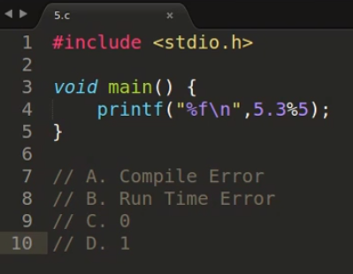

* Réponse: A *

  erreur: opérandes non valides en% binaire - (error: invalid operands to binary %)

  Nous pourrions utiliser fmod (5.3, 5) (#include <math.h>), puis nous obtenons 0,300000

# C MCQ #5

* Question:

  Qu'est-ce que la déclaration dans le code ci-dessous?

  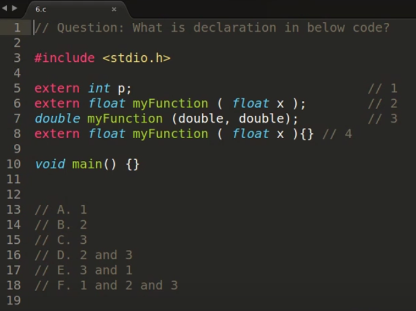

* Réponse: F

# C MCQ #6

* Question:

  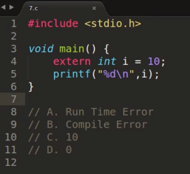

* Réponse: B *

  erreur: 'i' a à la fois 'extern' et initialiseur - (error: 'i' has both 'extern' and initializer)

# C MCQ #7

* Question:

  

* Réponse: D

# C MCQ #8

* Question:

  

* Réponse: A *

  age est initialisé à 1, sal sera de 0,000000 et le pointeur sera un pointeur nul.

# C MCQ #9

* Question:

  

* Réponse: D *

  Le compilateur fonctionne sur la tokenisation.

# C MCQ #10

* Question:

  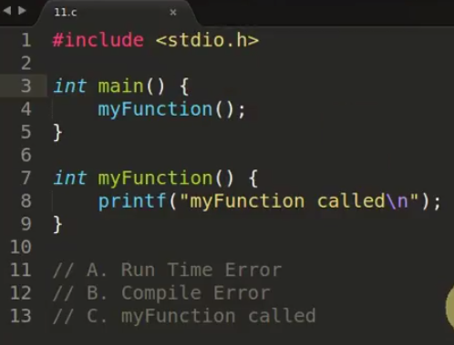

* Réponse: C *

  avertissement: déclaration implicite de la fonction 'myFunction' - (warning: implicit declaration of function 'myFunction')

  
  
  En C ++, ce sera une erreur. 
  
  erreur: 'MyFunction' n'a pas été déclaré dans cette portée - (error: 'MyFunction' was not declared in this scope)

# C MCQ #11

* Question:

  

* Réponse: C

# C MCQ #12

* Question:

  

* Réponse: C *

  N'oubliez pas '\ n' (dans "502 \ n")

# C MCQ #13

* Question:

  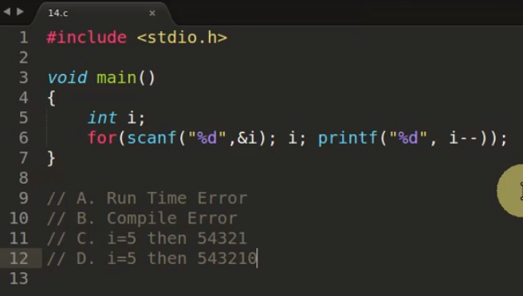

* Réponse: C

# C MCQ #14

* Question:

  

* Réponse: D *

  Identique à printf("%s", "HiThisIsRupesh");

# C MCQ #15

* Question:

  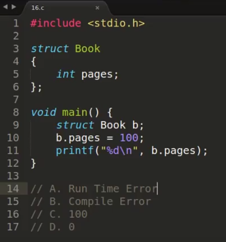

* Réponse: C

# C MCQ #16

* Question:

  

* Réponse: B

  erreur: instruction break pas dans la boucle ou le switch - (error: break statement not within loop or switch)

# C MCQ #17

* Question:

  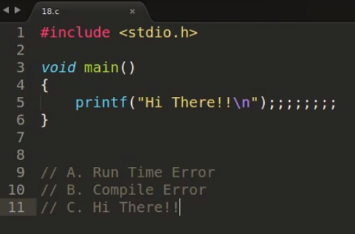

* Réponse: C

# C MCQ #18

* Question:

  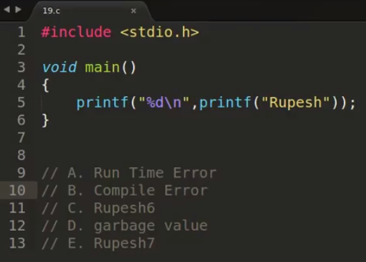

* Réponse: C

# C MCQ #19

* Question:

  

* Réponse: C *

  4 octets utilisés pour enregistrer 'a' dans Big Endian

  ~~~~
  00001010 00000000 00000000 00000000
  ~~~~

# C MCQ #20

* Question:

  

* Réponse: C *

  Il y a 20 emplacements et nous prenons seulement 9 caractères de 'str' et les poussons dans les emplacements

  Remarque:

  20 12

  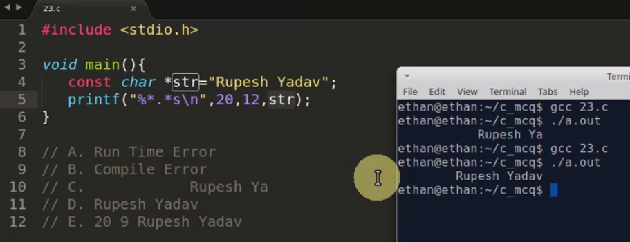

  20 20

  

# C MCQ #21

* Question:

  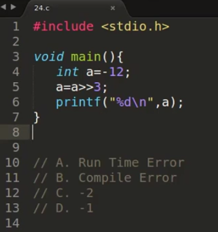

* Réponse: C *

  ~~~~
  12  == 00001100
  -12 == 11110100
  after shifting (-12 >> 3)
  	   11111110 == -2
  ~~~~

# C MCQ #22

* Question:

  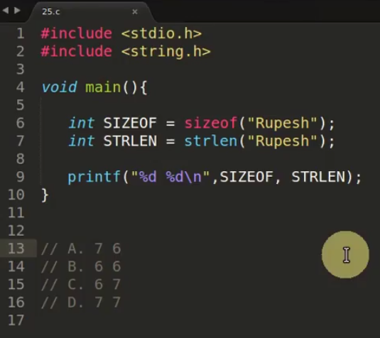

* Réponse: A

  sizeof est un opérateur, retourne 6 + 1 (terminateur nul '\ 0')

  strlen est une fonction, retourne 6 (le nombre de caractères)

# C MCQ #23

* Question:

  

* Réponse: A + D *

  Solution:

  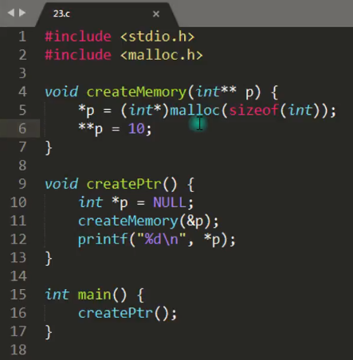

# C MCQ #24

* Question:

  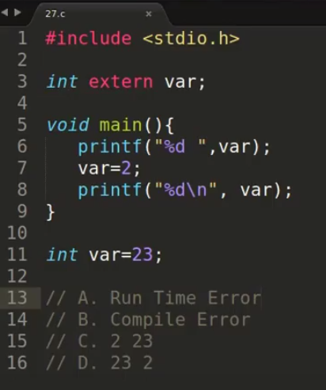

* Réponse: D *

  

# C MCQ #25

* Question:

  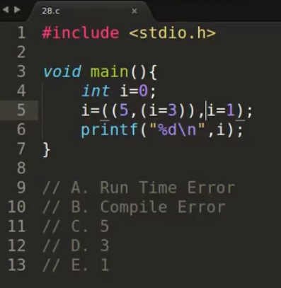

* Réponse: E *

# C MCQ #26

* Question:

  

* Réponse: C

# C MCQ #27

* Question:

  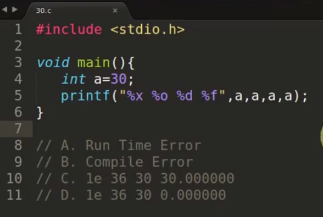

* Réponse: D *

  avertissement: le format '%f' attend un argument de type 'double' - (warning: format '%f' expects argument of type 'double')

  Si vous avez un entier (int) et que vous l'imprimez avec '%f', le résultat est toujours 0,000000

# C MCQ #28

* Question:

  

* Réponse: B

  erreur: lvalue requise comme opérande gauche de l'affectation - (error: lvalue required as left operand of assignment)

# C MCQ #29

* Question:

  

* Réponse: D

  if(x = 0) est considéré comme if(0), et if(x = 1) est considéré comme if(1)

# C MCQ #30

* Question:

  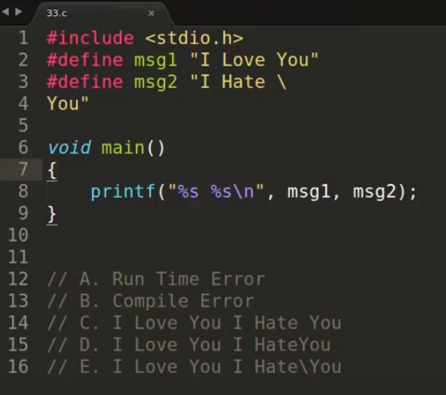

* Réponse: C

# C MCQ #31

* Question:

  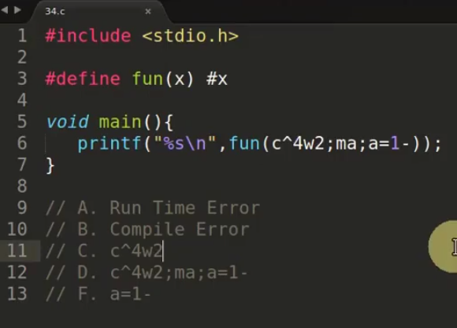

* Réponse: D *

  La signification de hash # est quelle que soit la valeur à l'intérieur de 'x', elle sera entourée de guillemets doubles ""

  `fun(c^4w2;ma;a=1-)` sera `"c^4w2;ma;a=1-"`

# C MCQ #32

* Question:

  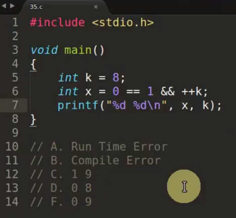

* Réponse: D *

  `++ k` n'est pas exécuté car le résultat de` 0 == 1` est 0

  Note:

  

# C MCQ #33

* Question:

  

* Réponse: A

# C MCQ #34

* Question:

  

* Réponse: A

# C MCQ #35

* Question:

  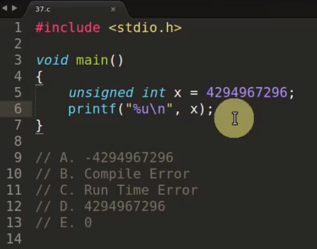

* Réponse: E *

  ~~~~
  unsigned in
  range 0 ---- 4294967295
  ~~~~

# C MCQ #36

* Question:

  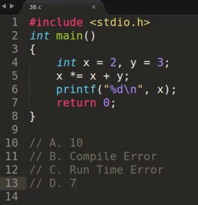

* Réponse: A

  Identique à `x = x * (x + y);`

# C MCQ #38

* Question:

  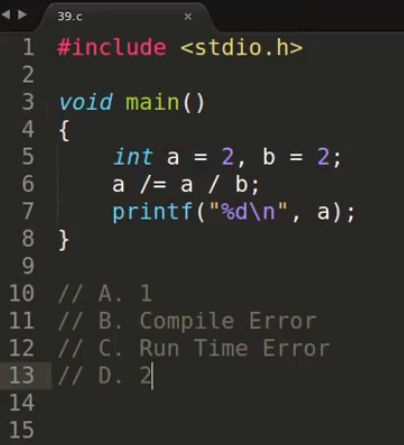

* Réponse: D

  Identique à `a = a / (a / b);`

# C MCQ #39

* Question:

  

* Réponse: C

# C MCQ #40

* Question:

  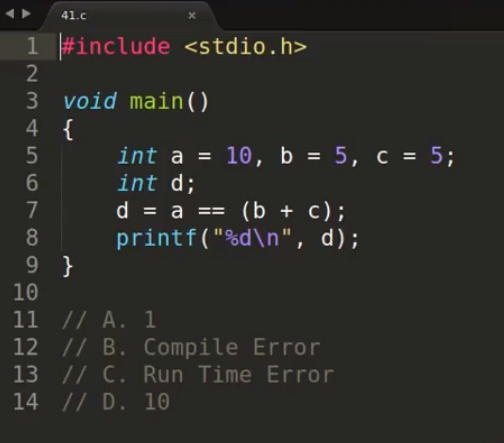

* Réponse: A

# C MCQ #41

* Question:

  

* Réponse: D *

# C MCQ #42

* Question:

  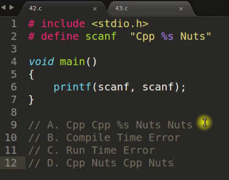

* Réponse: A *

# C MCQ #43

* Question:

  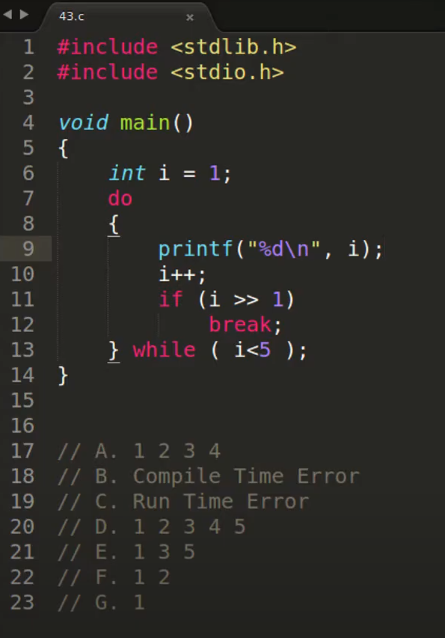

* Réponse: G

# C MCQ #44

* Question:

  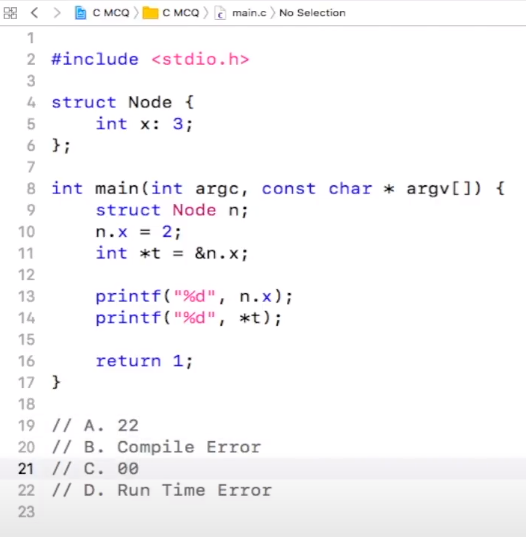

* Réponse: B *

  erreur: adresse du champ de bits demandée - (error: address of bit-field requested)
  
  ligne 11

# C MCQ #45

* Question:

  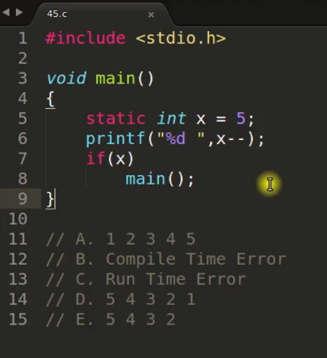

* Réponse: D *

  En C, la fonction main peut être utilisée en récursivité.

# C MCQ #46

* Question:

  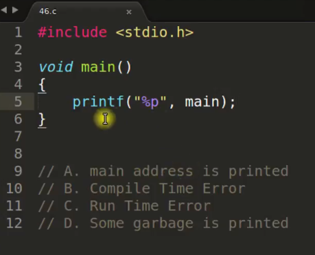

* Réponse: A *

# C MCQ #48

* Question:

  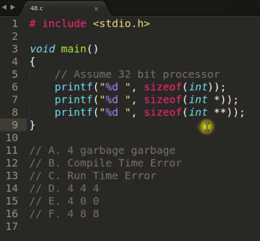

* Réponse: D

# C MCQ #49

* Question:

  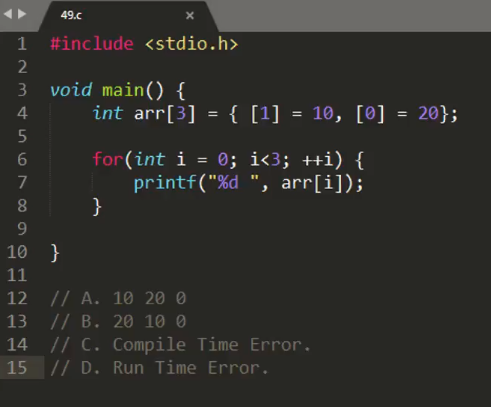

* Réponse: B

# C MCQ #55

* Question:

  

* Réponse: A

# C MCQ #67

* Question:

  Le code ci-dessous fonctionne-t-il?

  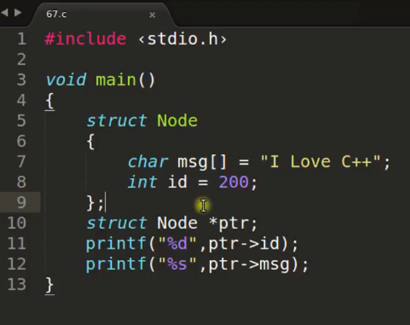

* Réponse:

  Erreur de compilation

  Dans la structure C, il n'y a que des types de données, nous ne pouvons pas initialiser les types de données.

  Le code ci-dessous compilera, mais affichera les valeurs inutiles.

  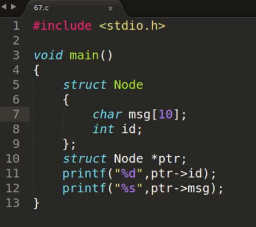

# C MCQ #75

* Question:

  

* Réponse: D

# C MCQ #76

* Question:

  

* Réponse: B *

  Segmentation fault (core dumped)

# C MCQ #77

* Question:

  Quelle est la valeur de var?

  

* Réponse: 3

# C MCQ #81

* Question:

  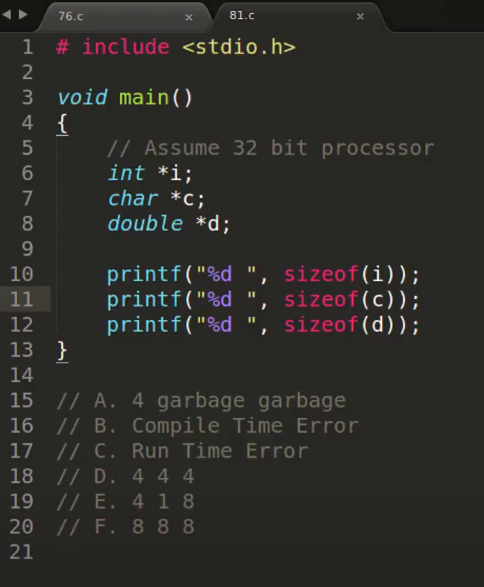

* Réponse:  D

# C MCQ #88

* Question:

  

* Réponse: A

# C MCQ #90

* Question:

  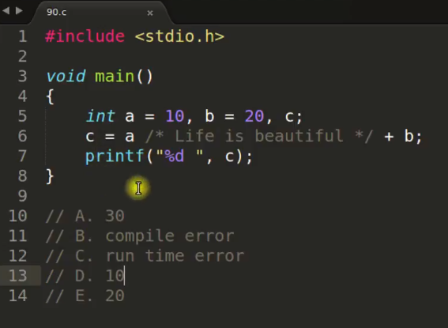

* Réponse: A

