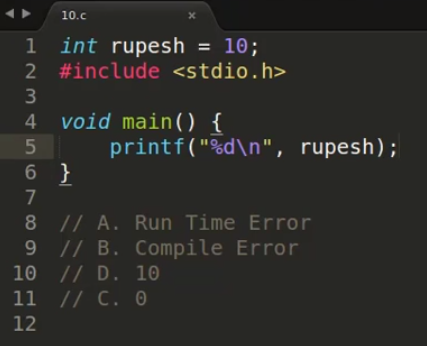
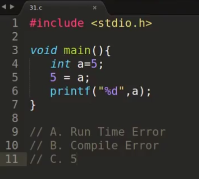
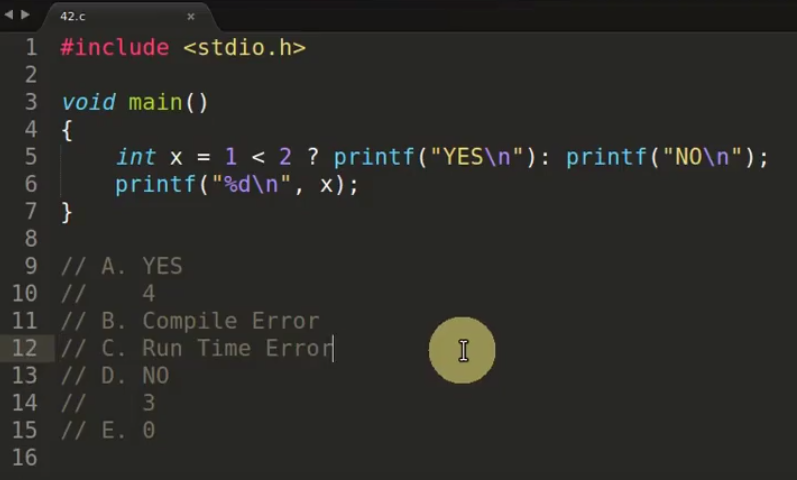
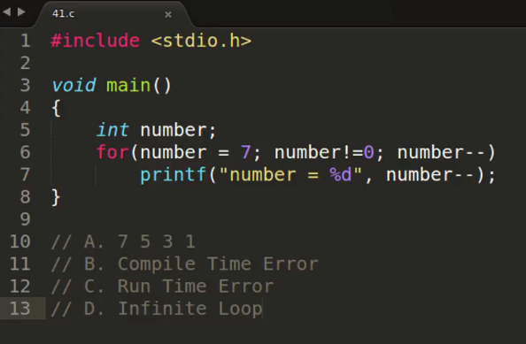
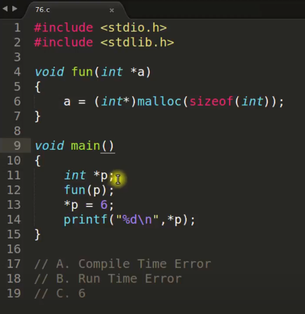
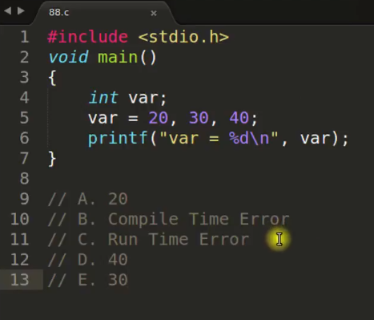

[C Interview Questions And Answers](https://www.youtube.com/playlist?list=PLk6CEY9XxSIB9jwcI0SP_FbamuqSWxvse)

# Designated Initialization In C

* Question:

  What is designated initialization in C?

* Answer:

  1. It provides a quick way of initialising specific elements in an array
  2. It provides a way of explicitly initialising struct members
  
  ~~~~c
  struct Str {
      int a;
      int b;
  };
  
  int main()
  {
      int arr1[10] = {[3] = 10, [6] = 20}; 
      // int arr1[10] = {[3]10, [6]20};
      // This is not allowed in C++, you need to initialize all elements like this
      // int arr1[2] = {[0] = 10, [1] = 20}; // OK
      // int arr1[2] = {[1] = 10, [0] = 20}; // order NOK
      for(int i = 0; i < 10; ++i) {
          printf("%d ", arr1[i]);
      }
  
      printf("\n*********************\n");
  
      int arr2[10] = {[6] = 10, [3] = 20}; // This is not allowed in C++
      for(int i = 0; i < 10; ++i) {
          printf("%d ", arr2[i]);
      }
      
      int arr3[] = {[0 ... 9] = 1, [10 ... 98] = 2, [99] = 3 }; // This is not allowed in C++
      for(int i = 0; i < 100; ++i) {
          printf("%d ", arr3[i]);
      }
      
      printf("\n*********************\n");
  
      struct Str s1 = {.a = 10, .b = 20};
      // struct Str s1 = {a : 10, b : 20};
      printf("%d\n", s1.a);
      printf("%d\n", s1.b);
  
      struct Str s2 = {.b = 100, .a = 200}; // This order is not allowed in C++
      printf("%d\n", s2.a);
      printf("%d\n", s2.b);
  
      return 0;
  }
  
  ~~~~

# How To Print Something Without Semicolon?

* Question:

  How to print something without semicolon?

* Answer:

  ~~~~c
  int main()
  {
      if(printf("Hello World!\n")) {}
  
      while(!printf("Hello World\n")) {}
  
      return 0;
  }
  ~~~~

# How To Write Your Own atoi Function In C & C++?

* Question:

  How to write you own atoi function in C & C++?

* Answer:

  atoi: ASCII to Int

  ~~~~c
  int my_atoi(char *str) {
      int res = 0;	// initialize result
      int sign = 1;	// initialize sign as positive
      int i = 0;		// initialize index of first digit
  
      // if number is negative, the update sign
      if(str[0] == '-') {
          sign = -1;
          i++;
      }
  
      while(str[i] != '\0') {
          res = res * 10 + str[i] - '0';
          i++;
      }
  
      return res * sign;
  }
  
  int main()
  {
      char str[] = "-1234"; // char *str = "-1234";
      int val = my_atoi(str);
      printf("%d\n", val);
  
      return 0;
  }
  ~~~~

# Big Endian And Little Endian

* Question:

  What is Big Endian and Little Endian?

* Answer:

  Big Endian and Little Endian is a way to read memory, in one of them we read from beginning to end and another reads from end to beginning.

  ~~~~
  0x12345678
  					  Address
  				Low ----------- High
  Big Endian: 		12 34 56 78
  Little Endian: 		78 56 34 12 
  ~~~~

  Check:

  ~~~~c
  unsigned int i = 1;
  char *c = (char*)&i;
  if(*c) {
  	printf("Little Endian\n");
  }
  else {
  	printf("Big Endian\n");
  }
  ~~~~

  

# How To Return 2D Array From Function In C & C++

* Question: 

  How to return a two-dimensional array from function in c and c++?

* Answer:

  1. Using dynamic array
  2. Using static keyword
  3. Using struct technique

  Example:

  1. dynamic array

     ~~~~c++
     #include <stdio.h>
     #include <stdlib.h>
     
     
     const int N = 3;
     
     void print_array(int **arr) {
     	for (int i = 0; i < N; ++i) {
     		for (int j = 0; j < N; ++j) {
     			printf("%d", arr[i][j]);
     		}
     		printf("\n");
     	}
     }
     
     int **get_array() {
     	int **arr = (int**)malloc(N * sizeof(int*));
     	for (int i = 0; i < N; ++i) {
     		arr[i] = (int)malloc(N * sizeof(int));
     		for (int j = 0; j < N; ++j) {
     			arr[i][j] = i + j;
     		}
     	}
     	return arr;
     }
     
     int main()
     {
     	int **arr;
     	arr = get_array();
   	print_array(arr);
     	return 0;
   }
     ~~~~
  
  2. static keyword
  
     ~~~~c++
     const int N = 3;
     
     void print_array(int arr[][N]) {
     	for (int i = 0; i < N; ++i) {
     		for (int j = 0; j < N; ++j) {
     			cout << arr[i][j];
     		}
     		cout << endl;
     	}
     }
     
     int (*(get_array)())[N] {
     	static int arr[N][N] = {
     		{0, 1, 2},
     		{3, 4, 5},
     		{6, 7, 8}
     	};
     
     	return arr;
     }
     
     /*typedef (*double_pointer)[N];
     double_pointer get_array() {
     	// ...
     }*/
     
     int main()
     {
         int (*arr)[N]; // a pointer which holds N number of arrays
         arr = get_array();
       print_array(arr);
     
       return 0;
     }
     ~~~~
  
  3. struct technique
  
     ~~~~c++
     const int N = 3;
     
     struct ArrStruct {
     	int arr[N][N];
     };
     
     void print_array(ArrStruct var) {
     	for (int i = 0; i < N; ++i) {
     		for (int j = 0; j < N; ++j) {
     			cout << var.arr[i][j];
     		}
     		cout << endl;
     	}
     }
     
     ArrStruct get_array() {
     	ArrStruct var;
     	for (int i = 0; i < N; ++i) {
     		for (int j = 0; j < N; ++j) {
     			var.arr[i][j] = i + j;
     		}
     	}
     
     	return var;
     }
     
     int main()
     {
     	ArrStruct arr;
     	arr = get_array();
     	print_array(arr);
     	return 0;
     }
     ~~~~

# Function Pointer In C

* Question:

  1. What Is Function Pointer And How To Create it?
  2. Calling a Function Using a Function Pointer.
  3. How to Pass a Function Pointer as an Argument?
  4. How to Return a Function Pointer?
  5. How to Use Array of Function Pointers?
  6. Where To Use Function Pointer? 

* Answer

  1. What Is Function Pointer And How To Create it?

     Normal pointer variable stores the address of other variable, function pointer stores address of a function

     How to create ?

     ~~~~c
     int add(int a, int b) {
     	return a + b;
     }
     
     int main() {
         int (*fun)(int, int) = add;
     	// or
         // int (*fun)(int, int) = &add;
         
         return 0;
     }
     ~~~~

  2. Calling a Function Using a Function Pointer.

     ~~~~c
     int add(int a, int b) {
     	return a + b;
     }
     
     int main() {
         int (*fun)(int, int) = add;
     	// or
         // int (*fun)(int, int) = &add;
         
         int c = fun(1, 2);
     	// or
     	// int c = (*fun)(1, 2);
         
         return 0;
     }
     ~~~~

  3. How to Pass a Function Pointer as an Argument?

     ~~~~c
     int add(int a, int b) {
     	return a + b;
     }
     
     int func(int (*someFun)(int, int)) {
     	int c = someFun(1, 2);
     	return c;
     }
     
     int main() {
         int c = func(add);
         
         return 0;
     }
     ~~~~

  4. How to Return a Function Pointer?

     ~~~~c
     int add(int a, int b) {
     	return a + b;
     }
     
     int sub(int a, int b) {
     	return a - b;
     }
     
     typedef int(*mathFun)(int, int);
     mathFun fun(int type) {
     	if(type == 1)
     		return add;
     	if(type == 2)
     		return sub;
     }
     
     //int (*fun(int type))(int, int) {
     //}
     
     int main() {
         int (*someFun)(int, int);
         someFun = fun(1);
         int c = someFun(1, 2);
         
         return 0;
     }
     ~~~~

  5. How to Use Array of Function Pointers?

     ~~~~c
     int add(int a, int b) {
     	return a + b;
     }
     
     int sub(int a, int b) {
     	return a - b;
     }
     
     typedef int(*mathFun)(int, int);
     
     int main() {
         mathFun arr[2] = {add, sub};
         // int (*arr[2])(int, int) = {add, sub};
         int c = arr[0](1, 2);
         int d = arr[1](1, 2);
         
         return 0;
     }
     ~~~~

  6. Where To Use Function Pointer? 

     Pass the function's address to another function

# Why malloc Is Faster Than calloc?

* Question: 

  Why malloc is faster than calloc?

* Answer:

  malloc returns memory as it gets from OS, but calloc gets memory from kernel or OS and initializes it with zero. That initialization takes time.

  ~~~~c++
  int main()
  {
  	int* int_ptr1 = (int*)malloc(5 * sizeof(int));
  	memset(int_ptr1, 0, sizeof(int_ptr1)); // use calloc instead of these 2 lines
  
  	int* int_ptr2 = (int*)calloc(5, sizeof(int));
  
  	free(int_ptr1);
  	free(int_ptr2);
  
  	return 0;
  }
  ~~~~

# What Is Return Value Of printf And scanf In C/C++?

* Question: 

  What is return value of printf and scanf in C/C++?

* Answer:

  1. printf returns the number of characters printed successfully and
  2. scanf returns the number of elements read successfully from console.

  ~~~~c++
  int main()
  {
  	char array[100];
  	int val;
  
  	int printf_out = printf("%s", "hi there\n");
  	int scanf_out = scanf("%s %d", array, &val);
  
  	cout << printf_out << endl; // 9
  	cout << scanf_out << endl;  //2
      
      // printf("%d\n", printf_out); // 9
  	// printf("%d\n", scanf_out); // 2
  
  	return 0;
  }
  ~~~~

# Dangling Pointer In C

* Question: 

  What is dangling pointer in C?

* Answer: 

  Dangling pointer happens when we point to some memory location in some pointer variable but we have already freed it before.

  ~~~~c++
  void func(int* ptr) {
  	cout << *ptr << endl;
  	delete ptr;
  }
  
  int main()
  {
  	int* p1 = new int(10);
  	int* p2 = p1; // p1 and p2 point to the same memory location
  	func(p2);
  
  	cout << *p1 << endl; // undefined behavior, the memory which points p1 has been already freed
  	
  	return 0;
  }
  ~~~~

# What Is Segmentation Fault & How To Find That In C & C++?

* Question: 

  What is segmentation fault?

* Answer: 

  Segmentation fault occurs because of memory access violation.

  1. stack overflow
  2. writing violation
  3. reading violation
  4. and many more but all are related to memory error.

* Question: 

  How to debug segmentation fault?

* Answer: 

  After "Segmentation default (core dumped)", a core file is created. And use gdb to debug this core file.

~~~~
g++ -g app.cpp

gdb a.out core
~~~~

# String Literals In C & C++

* Question:

  What is string literals in C & C++?

* Answer:

  String Literals:
  1. They are constant string and can't be changed!!
  2. Pointer can be changed to point to some other string!!
  3. As String Literals are constant by nature applying const keyword gives extra benefit.
  4. Creating array of string is not string literals.
  5. We can change non const array string.
  6. Experiment with function passing.
  7. RAW String In C++11.

  ~~~~c
  #include <stdio.h>
  #include <stdlib.h>
  
  
  void func(char * ptr) {
      ptr[2] = 'v';
      printf("ptr = %s\n", ptr);
  }
  
  int main()
  {
      char * str1 = "Hello World";
      //str1[2] = 'a'; // str1 is constant string which cannot be changed, runtime error
  
      char * str2 = "Hello C";
      str2 = str1; // OK
      printf("str1 = %s\n", str1); // str1 = Hello World
      printf("str2 = %s\n", str2); // str2 = Hello World
  
      const char * str3 = "Hello Hello";
      //str3[2] = 'a'; // compile time error
  
      char arr[] = "abcdef"; // array of characters is not string literals
      arr[2] = 'x'; // OK
      printf("arr = %s\n", arr); // arr = abxdef
  
      //func(str1); // runtime error, str1 is constant string
      func(arr); // OK

      return 0;
  }
  
  ~~~~
  
  ~~~~c++
  // Raw string in C++11
  
  int main()
  {
      string str = R"(Hello\nWorld)";
      cout << str << endl; // Hello\nWorld
      
      return 0;
  }
  ~~~~

# sizeof Is A Function OR An Operator? How It Works?

* Question:

  sizeof is a function or an operator? How it works?

* Answer:

  1. It is an operator not function.
  2. This is evaluated at compile not run time.
  3. It doesn't perform the operation given as expression.
  4. Parenthesis are optional.

  ~~~~c
  int main()
  {
      int x = 0;
  
      printf("%d\n", sizeof(x++)); // 4, x++ will not be evaluated 
      printf("%d\n", x); // 0
  
      return 0;
  }
  ~~~~

# Bit Fields In C & C++

* Question:

  What is bit field in C & C++? 

* Answer:

  1. It is used to reduce the size of "class (in C++) / struct" if we can.
2. Force alignment is possible using unnamed bit fields of size 0.
  3. Taking pointers to bit field members are not allowed as they may not start at a byte boundry.
  4. Assigning an out-of-range value to a bit field member is implentation defined
  5. We can have static members in a structure, but bit fields cannot be static
  6. Array of bit fields is not allowed

  

  Example:

  1. It is used to reduce the size of "class (in C++) / struct" if we can.
  
     ~~~~c
     #include <stdio.h>
     #include <stdlib.h>
     
     
     struct Date
     {
     	unsigned int d : 5;
     	unsigned int m : 4;
     	unsigned int y;
     };
     
   int main()
     {
       struct Date d;
         d.d = 8;
        	d.m = 8;
     	d.y = 2020;
     
         printf("%d/%d/%d\n", d.d, d.m, d.y);
         printf("%d\n", sizeof(struct Date)); // 8
  
      return 0;
  }
  
  ~~~~
  
  2. Force alignment is possible using unnamed bit fields of size 0.
  
     ~~~~c
     struct Node1
     {
     	unsigned int a : 6;
     	unsigned int b : 9;
     };
     
     // with forced alignment
     struct Node2
     {
     	unsigned int a : 6;
     	unsigned int : 0;
      	unsigned int b : 9;
     };
      
     int main()
     {
         printf("%d\n", sizeof(struct Node1)); // 4
         printf("%d\n", sizeof(struct Node2)); // 8
     
         return 0;
     }
     ~~~~
  
  3. Taking pointers to bit field members are not allowed as they may not start at a byte boundry.
  
     ~~~~c
     struct Node
     {
     	unsigned int a : 5;
     	unsigned int b : 5;
     	unsigned int c;
     };
      
     int main()
      {
         struct Node t;
         // printf("%d\n", &t.a); // Not allowed
         // printf("%d\n", &t.b); // Not allowed
         printf("%d\n", &t.c); // Allowed, because c is not bit field member
     
         return 0;
     }
     ~~~~
  
  4. Assigning an out-of-range value to a bit field member is implentation defined
  
     ~~~~c
     struct Node
     {
     	unsigned int a : 2;
     	unsigned int b : 2;
     	unsigned int c : 2;
      };
     
     int main()
     {
         struct Node n;
         n.a = 5;
         printf("%d\n", n.a); //  not a good practice
         return 0;
     }
     ~~~~

  5. We can have static members in a structure, but bit fields cannot be static

     ~~~~c
     struct Node
     {
     	// static unsigned int a : 5; // error
     	unsigned int b : 2;
     	unsigned int c : 2;
     };
     ~~~~
6. Array of bit fields is not allowed

   ~~~~c
   struct Node
   {
       // unsigned int x[10] : 2; // error
       unsigned int a : 2;
   };
   ~~~~

  Note:

  1. Bit fields are from C language, there is no difference in C++
  2. It is used to reduce the size of "class (in C++) / struct" if we can.
  3. This feature is great in embedded systems because there is scarcity of memory
  4. Structural Padding in C/C++
  5. Only integral types: bool, char, signed char, unsigned char, char16_t, char32_t, wchar_t, short, int, long, long long, unsigned short, insigned int, unsigned long, unsigned long long

# Find n'th Node From Back In a Singly Linked List

* Question:

  How to find n'th node from back in a singly linked list with one traversal?

  

* Answer:

  The idea is we will maintain two pointers and one pointer will move to n'th node and then we will move both the pointer at the same time, and by the time first pointer is reaching to the last node second pointer would be at desired node.

# Find If Two Linked List Have Intersection Point

* Question:

  How to find if two linked list have intersection point?

  

* Answer:

  * Solution 1:

    Use a "visited" flag

  * Solution 2:

    Traverse the first linked list and save the address of the last node in a temp variable. Then traverse the second linked list to check if its last node has the same value as temp.

  * Solution 3:

    Calculate the difference (n) between the number of node of the two linked list and move the bigger linked list 'n' position. Then move these two linked list together, check if they reach the same node.

# Find If There Is A Cycle (Loop) In a Linked List

* Question:

  How to find if there is a cycle (loop) in a linked list?

  

* Answer:

  1. Mark Each Node with a flag "visited"
  2. Keep a hash set of all nodes seen so far 

  3. Tortoise and Hare problem (Turtle and Rabbit) OR Floyd's cycle-finding algorithm.

     Use 2 pointers: one Slow and one Fast.

     Move the Slow pointer one position at one time and move the Fast pointer two position at one time. Check if the Slow pointer and Fast pointer reach the same node.

     

# C MCQ #1

* Question:

  What does printf function returns after printing?

  

* Answer: D

# C MCQ #2

* Question:

  What does scanf function returns after taking values?

  

* Answer: C

  

# C MCQ #3

* Question:

  

* Answer: A

# C MCQ #4

* Question:

  

* Answer: A *

  error: invalid operands to binary %

  We could use fmod(5.3, 5) (#include <math.h>), then we get 0.300000

# C MCQ #5

* Question:

  What is declaration in below code?

  

* Answer: F

# C MCQ #6

* Question:

  

* Answer: B *

  error: 'i' has both 'extern' and initializer

# C MCQ #7

* Question:

  

* Answer: D

# C MCQ #8

* Question:

  

* Answer: A *

  age is initialized to 1, and sal will be 0.000000 and pointer will be a null pointer.

# C MCQ #9

* Question:

  

* Answer: D *

  The compiler works on tokenization.

# C MCQ #10

* Question:

  

* Answer: C *

  warning: implicit declaration of function 'myFunction'

  
  
  In C++, it will be an error. 
  
  error: 'MyFunction' was not declared in this scope

# C MCQ #11

* Question:

  

* Answer: C

# C MCQ #12

* Question:

  

* Answer: C *

  Do not forget '\n' (in "502\n")

# C MCQ #13

* Question:

  

* Answer: C

# C MCQ #14

* Question:

  

* Answer: D *

  Same as printf("%s", "HiThisIsRupesh");

# C MCQ #15

* Question:

  

* Answer: C

# C MCQ #16

* Question:

  

* Answer: B

  error: break statement not within loop or switch

# C MCQ #17

* Question:

  

* Answer: C

# C MCQ #18

* Question:

  

* Answer: C

# C MCQ #19

* Question:

  

* Answer: C *

  4 bytes used to save 'a' in Big Endian

  ~~~~
  00001010 00000000 00000000 00000000
  ~~~~

# C MCQ #20

* Question:

  

* Answer: C *

  There are 20 slots and we take only 9 characters from 'str' and push them into the slots

  Note:

  20 12

  

  20 20

  

# C MCQ #21

* Question:

  

* Answer: C *

  ~~~~
  12  == 00001100
  -12 == 11110100
  after shifting (-12 >> 3)
  	   11111110 == -2
  ~~~~

# C MCQ #22

* Question:

  

* Answer: A

  sizeof is an operator, returns 6 + 1 ('\0' null terminator)

  strlen is a function, return 6 (the number of characters)

# C MCQ #23

* Question:

  

* Answer: A + D *

  Solution:

  

# C MCQ #24

* Question:

  

* Answer: D *

  

# C MCQ #25

* Question:

  

* Answer: E *

# C MCQ #26

* Question:

  

* Answer: C

# C MCQ #27

* Question:

  

* Answer: D *

  warning: format '%f' expects argument of type 'double'

  If you have an integer and you print it with '%f', the result is always 0.000000

# C MCQ #28

* Question:

  

* Answer: B

  error: lvalue required as left operand of assignment

# C MCQ #29

* Question:

  

* Answer: D

  if(x = 0) is considered as if(0), and if(x = 1) is considered as if(1)

# C MCQ #30

* Question:

  

* Answer: C

# C MCQ #31

* Question:

  

* Answer: D *

  The significance of hash # is whatever the value is inside 'x', it will be enclosed with double quotes""

  `fun(c^4w2;ma;a=1-)` will be `"c^4w2;ma;a=1-"`

# C MCQ #32

* Question:

  

* Answer: D *

  `++k` is not executed because the result of `0 == 1` is 0

  Note:

  

# C MCQ #33

* Question:

  

* Answer: A

# C MCQ #34

* Question:

  

* Answer: A

# C MCQ #35

* Question:

  

* Answer: E *

  ~~~~
  unsigned int
  range 0 ---- 4294967295
  ~~~~

# C MCQ #36

* Question:

  

* Answer: A

  Same as `x = x * (x + y);`

# C MCQ #38

* Question:

  

* Answer: D

  Same as `a = a / (a / b);`

# C MCQ #39

* Question:

  

* Answer: C

# C MCQ #40

* Question:

  

* Answer: A

# C MCQ #41

* Question:

  

* Answer: D *

# C MCQ #42

* Question:

  

* Answer: A *

# C MCQ #43

* Question:

  

* Answer: G

# C MCQ #44

* Question:

  

* Answer: B *

  error: address of bit-field requested
  
  line 11

# C MCQ #45

* Question:

  

* Answer: D *

  In C, main function can be used in recursion.

# C MCQ #46

* Question:

  

* Answer: A *

# C MCQ #48

* Question:

  

* Answer: D

# C MCQ #49

* Question:

  

* Answer: B

# C MCQ #55

* Question:

  

* Answer: A

# C MCQ #67

* Question:

  Does the below code work?

  

* Answer:

  Compile time error

  In C structure, there are only data types, we cannot initialize the data types.

  The below code will compile, but print garbage values.

  

# C MCQ #75

* Question:

  

* Answer: D

# C MCQ #76

* Question:

  

* Answer: B *

  Segmentation fault (core dumped)

# C MCQ #77

* Question:

  What is the value of var?

  

* Answer: 3

# C MCQ #81

* Question:

  

* Answer:  D

# C MCQ #88

* Question:

  

* Answer: A

# C MCQ #90

* Question:

  

* Answer: A

