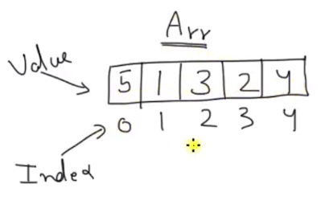
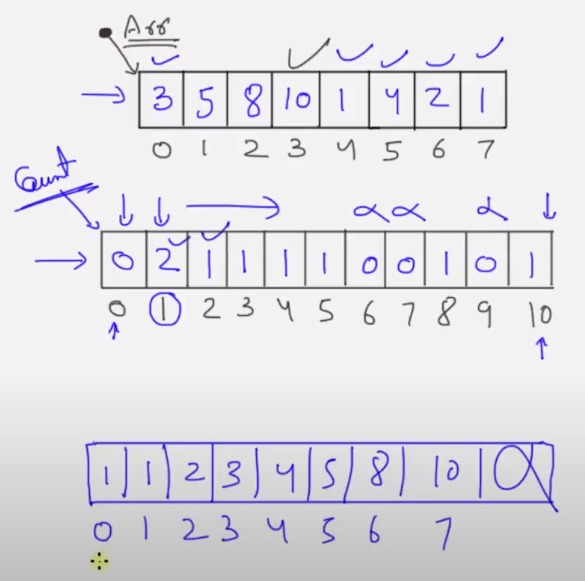
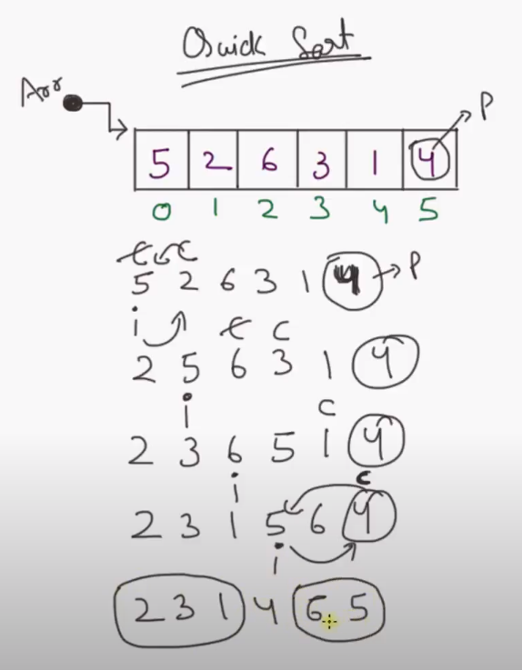

[Sorting Algorithms](https://www.youtube.com/playlist?list=PLk6CEY9XxSICqQ9wicEpRh3jYNTtSHVOy)

[Binary Search](https://www.youtube.com/playlist?list=PLk6CEY9XxSICTSMyFM3GxRIwiZ7uqlJ9H)

# Sorting Algorithms

## Bubble Sort

* Question:

  What is Bubble Sort?

* Answer:

  

  ~~~~c++
  void swap_int(int* x, int* y) {
  	int tmp = *x;
  	*x = *y;
  	*y = tmp;
  }
  
  void bubble_sort(int arr[], int n) {
  	int i, j;
  
  	for (i = 0; i < n - 1; ++i) {
  		//cout << "Pass: " << i + 1 << endl;
  		for (j = 0; j < n - i - 1; j++) {
  			if (arr[j] > arr[j + 1])
  				swap_int(&arr[j], &arr[j + 1]);
  		}
  	}
  }
  
  void bubble_sort_optimized(int arr[], int n) {
  	int i, j;
  	int flag;
  
  	for (i = 0; i < n - 1; ++i) {
  		flag = 0;
  		//cout << "Pass: " << i + 1 << endl;
  		for (j = 0; j < n - i - 1; j++) {
  			if (arr[j] > arr[j + 1]) {
  				swap_int(&arr[j], &arr[j + 1]);
  				flag = 1;
  			}
  		}
  		if (flag == 0)
  			break;
  	}
  }
  
  int main()
  {
  	int arr[] = { 5, 1, 3, 2, 4 };
  	int n = sizeof(arr) / sizeof(arr[0]);
  	//bubble_sort(arr, n);
  	bubble_sort_optimized(arr, n);
  
  	for (int i = 0; i < n; ++i) {
  		cout << arr[i] << " ";
  	}
  	cout << endl;
  	
  	return 0;
  }
  ~~~~

  

  Time Complexity: O(n2)

## Selection Sort

* Question:

  What is Selection Sort?

* Answer:

  

  ~~~~c++
  void swap_int(int* x, int* y) {
  	int tmp = *x;
  	*x = *y;
  	*y = tmp;
  }
  
  void selection_sort(int arr[], int n) {
  	int i, j, min_index;
  
  	for (i = 0; i < n - 1; ++i) {
  		min_index = i;
  		for (j = i + 1; j < n; ++j) {
  			if (arr[j] < arr[min_index]) {
  				min_index = j;
  			}
  		}
  
  		if (min_index != i) {
  			swap_int(&arr[min_index], &arr[i]);
  		}
  	}
  }
  
  int main()
  {
  	int arr[] = { 5, 1, 3, 2, 4 };
  	int n = sizeof(arr) / sizeof(arr[0]);
  
  	selection_sort(arr, n);
  
  	for (int i = 0; i < n; ++i) {
  		cout << arr[i] << " ";
  	}
  	cout << endl;
  	
  	return 0;
  }
  ~~~~

  

  Time Complexity: O(n2)

## Insertion Sort

* Question:

  What is Insertion Sort?

* Answer:

  

  ~~~~c++
  void swap_int(int* x, int* y) {
  	int tmp = *x;
  	*x = *y;
  	*y = tmp;
  }
  
  void insertion_sort(int arr[], int n) {
  	for (int i = 0; i < n - 1; ++i) {
  		int j = i + 1;
  		while (j > 0 && arr[j] < arr[j - 1]) {
  			swap_int(&arr[j], &arr[j - 1]);
  			j--;
  		}
  	}
  }
  
  
  int main()
  {
  	int arr[] = { 5, 1, 3, 2, 4 };
  	int n = sizeof(arr) / sizeof(arr[0]);
  
  	insertion_sort(arr, n);
  
  	for (int i = 0; i < n; ++i) {
  		cout << arr[i] << " ";
  	}
  	cout << endl;
  	
  	return 0;
  }
  ~~~~

  

  Min Time Complexity: O(n), the array is already sorted

  Max Time Complexity: O(n2)

  Stable sort? Yes

  Sorting inplace? Yes

## Counting Sort

* Question:

  What is Counting Sort?

* Answer:

  

  

  Time Complexity: O(n+k), which n is number of elements and k is range

  

  Note:

  1. This is efficient sorting algorithm if range is almost similar to the number of objects to be sorted
  2. It is best when the range is equal to number of objects to be sorted
  3. It is used in radix sort as a part of algorithms

## Merge Sort

* Question:

  What is Merge Sort?

* Answer:

  

  ~~~~c++
  void mergeIt(int arr[], int l, int m, int r) {
  	int i, j, k;
  	int leftArraySize = m - l + 1, rightArraySize = r - m;
  	int* left = new int[leftArraySize];
  	int* right = new int[rightArraySize];
  
  // Fill left and right arrays
  	for (i = 0; i < leftArraySize; ++i)
  		left[i] = arr[l + i];
  	for (j = 0; j < rightArraySize; ++j)
  		right[j] = arr[m + 1 + j];
  
  	i = 0; j = 0; k = l;
  
  // Compare left and right array elements
  // and which ever is holding smaller value put that inside main array
  	while (i < leftArraySize && j < rightArraySize) {
  		if (left[i] <= right[j]) {
  			arr[k] = left[i];
  			i++;
  		}
  		else {
  			arr[k] = right[j];
  			j++;
  		}
  
  		k++;
  	}
  
  // After comparing both left and right array element by element 
  // if some array is having leftover
  // then just copy that array into main array
  	while (i < leftArraySize) {
  		arr[k] = left[i];
  		i++;
  		k++;
  	}
  	while (j < rightArraySize) {
  		arr[k] = right[j];
  		j++;
  		k++;
  	}
  
  	delete[] left;
  	delete[] right;
  }
  
  void breakIt(int arr[], int l, int r) {
  	if (l == r)
  		return;
  
  	int m = l + (r - l) / 2; // avoid overflow
  	breakIt(arr, l, m);
  	breakIt(arr, m + 1, r);
  	mergeIt(arr, l, m, r);
  }
  
  void merge_sort(int arr[], int l, int r) {
  	breakIt(arr, l, r);
  }
  
  
  int main()
  {
  	int arr[] = { 5, 1, 3, 2, 4 };
  	int n = sizeof(arr) / sizeof(arr[0]);
  
  	merge_sort(arr, 0, n - 1);
  
  	for (int i = 0; i < n; ++i) {
  		cout << arr[i] << " ";
  	}
  	cout << endl;
  	
  	return 0;
  }
  ~~~~

  

  Time Complexity: O(nlogn)

  Stable sort? Yes

  Sorting inplace? No, extra arrays are used

## Quick Sort

* Question:

  What is Quick Sort?

* Answer:

  

  ~~~~c++
  void swap_int(int* x, int* y) {
  	int tmp = *x;
  	*x = *y;
  	*y = tmp;
  }
  
  int partition(int arr[], int start, int end) {
  	int i = start;
  	int pivot = arr[end];
  	int c;
  
  	for (c = start; c < end; ++c) {
  		if (arr[c] < pivot) {
  			swap_int(&arr[c], &arr[i]);
  			i++;
  		}
  	}
  
  	// put the pivot element in its proper place
  	swap_int(&arr[i], &arr[c]);
  
  	// return the position of pivot
  	return i;
  }
  
  void quick_sort(int arr[], int start, int end) {
  	if (start < end) {
  		int pivot = partition(arr, start, end);
  		quick_sort(arr, start, pivot - 1); // sort the left side of pivot
  		quick_sort(arr, pivot + 1, end); // sort the right side of pivot
  	}
  }
  
  
  int main()
  {
  	int arr[] = { 5, 2, 6, 3, 1, 4 };
  	int n = sizeof(arr) / sizeof(arr[0]);
  
  	quick_sort(arr, 0, n - 1);
  
  	for (int i = 0; i < n; ++i) {
  		cout << arr[i] << " ";
  	}
  	cout << endl;
  	
  	return 0;
  }
  ~~~~

  

  Time Complexity: O(nlogn)

# Binary Search

* Question:

  What i Binary Search?

* Answer:

  1. Binary Search technique works on sorted array. (both SORTED and ARRAY (directly accessible) words are very important)
  2. It works on divide and conquer (each iteration it divides array in half).

  

  ALGO:

  1. Get middle element of array check if it is the one we are looking.
  2. If yes, then we have found the number.
  3. If no, then check if the middle element is bigger than our element.
  4. If yes, then we will choose left half of the array.
  5. Otherwise we will choose right half of the array.
  6. Repeat this until we find the number or the number is not found

  

  COMPLEXITY:

  * Worst Case Time: O(log2(n))
  * Best Case Time: O(1)
  * Average Case Time: O(log2(n))

  

  Example:

  ~~~~c++
  // Iterative approach
  int binarySearch(int* arr, int low, int high, int key) {
  	while (low <= high) {
  		int mid = (low + high) / 2;
  
  		if (arr[mid] < key) {
  			low = mid + 1;
  		}
  		else if (arr[mid] > key) {
  			high = mid - 1;
  		}
  		else {
  			return mid;
  		}
  	}
  
  	return -1; // Not found
  }
  
  // Recursion approach
  int binarySearch_recursion(int* arr, int low, int high, int key) {
  	if (low > high)
  		return -1; //  Not found
  
  	int mid = (low + high) / 2;
  
  	if (arr[mid] < key) {
  		binarySearch_recursion(arr,  mid + 1, high, key);
  	}
  	else if (arr[mid] > key) {
  		binarySearch_recursion(arr, low , mid - 1, key);
  	}
  	else {
  		return mid;
  	}
  }
  
  int main()
  {
  	int arr[] = { 1, 2, 3, 5, 7, 8, 9, 10 };
  
  	cout << binarySearch(arr, 0, 7, 2) << endl;
  	cout << binarySearch(arr, 0, 7, 6) << endl;
  
  	//cout << binarySearch_recursion(arr, 0, 7, 2) << endl;
  	//cout << binarySearch_recursion(arr, 0, 7, 6) << endl;
  
  	return 0;
  }
  ~~~~

# STL Algorithm

## STL Algorithm Introduction

* Question:

  What is algotithl is STL (Standard Template Library)?

* Answer:

  1. STL algorithms library defines functions for a variety of purposes (e.g. searching, sorting, counting, manipulating) 
  2. Algorithms are applied to range of elements.
  3. `<algorithm>` header is used to get all algorithms in STL.

  

  Example:

  ~~~~c++
  #include <iostream>
  #include <vector>
  #include <algorithm>
  
  //using namespace std;
  
  int main()
  {
  	std::vector<int> vec{ 4, 3, 5, 2, 6, 1 };
  	auto it = std::find(vec.begin(), vec.end(), 4);
  	//auto it = std::find(vec.begin(), vec.end(), 9);
  	
  	if (it == vec.end()) {
  		std::cout << "Not Found" << std::endl;
  	}
  	else {
  		std::cout << "Found" << std::endl;
  	}
  	return 0;
  }
  ~~~~

  

  Note: STL is composed of iterator, container and algorithm.

## std::sort

* Question:

  What is std::sort function?

* Answer:

  1. In C++ STL, we have sort function which can sort in increasing and decreasing order.

  2. Not only integral but user defined data can be sorted using this fuction.

  3. Internally it uses IntroSort which is combination of Quick Sort, Heap Sort and Insertion Sort.

     By default, it uses Quick Sort but is Quick Sort is doing unfair partitioning and taking more than nlogn time, it switches to Heap Sort and when the array size becomes really small, it switches to Insertion Sort.

  4. We can use parallel execution policy for better performance.

  

  Support sypes:

  1. Sorting integral data types
  2. Sorting user defined data types
  3. Sort using a functionn object
  4. Sort using lambda function

  

  Example:

  1. Integral data type:

     ~~~~c++
     #include <iostream>
     #include <vector>
     //#include <string>
     //#include <stack>
     //#include <queue>
     //#include <tuple>
     #include <algorithm>
     #include <execution>
     //#include <memory>
     //#include <thread>
     
     //using namespace std;
     
     int main()
     {
     	std::vector<int> vec{ 5, 4, 6, 7, 3, 2, 8, 9, 1 };
     	// std::execution::par in C++17
     	std::sort(std::execution::par, vec.begin(), vec.end());
     
     	for (auto& elem : vec) {
     		std::cout << elem << " ";
     	}
     	std::cout << std::endl;
     	return 0;
     }
     ~~~~

  2. User defined data type

     ~~~~c++
     #include <iostream>
     #include <vector>
     #include <algorithm>
     
     //using namespace std;
     
     class Point {
     public:
     	int x;
     	int y;
     	Point(int x = 0, int y = 0) : x(x), y(y) {}
     	bool operator<(const Point& p) const {
     		return (x + y) < (p.x + p.y);
     	}
     	bool operator>(const Point& p) const { // const is MUST!!!!!!!!!!!
     		return (x + y) > (p.x + p.y);
     	}
     };
     
     int main()
     {
     	std::vector<Point> vec{ {1, 2}, {3, 1} , {0, 1} };
     	
     	std::sort(vec.begin(), vec.end());
     	for (auto& elem : vec) {
     		std::cout << "{" << elem.x << ", " << elem.y << "} ";
     	}
     	std::cout << std::endl;
     
     	std::sort(vec.begin(), vec.end(), std::greater<Point>());
     	for (auto& elem : vec) {
     		std::cout << "{" << elem.x << ", " << elem.y << "} ";
     	}
     
     	return 0;
     }
     ~~~~

  3. Function object

     ~~~~c++
     #include <iostream>
     #include <vector>
     #include <algorithm>
     #include <execution>
     
     //using namespace std;
     
     //??????
     //struct {
     //	bool opreator()(int a, int b) const {
     //		return a < b;
     //	}
     //} customLess;
     
     struct CustomLess
     {
     	bool operator()(const int& a, const int& b)
     	{
     		return a < b;
     	}
     };
     
     int main()
     {
     	std::vector<int> vec{ 5, 4, 6, 7, 3, 2, 8, 9, 1 };
     	
     	std::sort(vec.begin(), vec.end(), CustomLess());
     	for (auto& elem : vec) {
     		std::cout << elem << " ";
     	}
     	std::cout << std::endl;
     
     	return 0;
     }
     ~~~~

  4. Lambda function

     ~~~~c++
     #include <iostream>
     #include <vector>
     #include <algorithm>
     #include <execution>
     
     //using namespace std;
     
     int main()
     {
     	std::vector<int> vec{ 5, 4, 6, 7, 3, 2, 8, 9, 1 };
     	
     	std::sort(vec.begin(), vec.end(),  { return a < b; });
     	//std::sort(vec.begin(), vec.end(), std::less<int>());
     	//std::sort(vec.begin(), vec.end(), std::greater<int>());
         
     	for (auto& elem : vec) {
     		std::cout << elem << " ";
     	}
     	std::cout << std::endl;
     
     	return 0;
     }
     ~~~~

## std::is_sort

* Question:

  What is std::is_sort function?

* Answer:

  Checks if the elements in range [first, last) are sorted in non-descending order.

  

  Support sypes:

  1. Can check integral data types
  2. Can check user defined data types
  3. Can check using a function object
  4. Can check using lambda expression
  
  
  
  Example:
  
  ~~~~c++
  #include <iostream>
  #include <vector>
  #include <algorithm>
  
  //using namespace std;
  
  int main()
  {
  	std::vector<int> vec{ 5, 4, 6, 7, 3, 2, 8, 9, 1 };
  	
  	std::sort(vec.begin(), vec.end(),  { return a < b; });
  	//std::sort(vec.begin(), vec.end(), std::less<int>());
  	//std::sort(vec.begin(), vec.end(), std::greater<int>());
  
  	for (auto& elem : vec) {
  		std::cout << elem << " ";
  	}
  	std::cout << std::endl;
  
  	std::cout << std::is_sorted(vec.begin(), vec.end()) << std::endl;
  	//std::cout << std::is_sorted(vec.begin(), vec.end(), std::greater<int>()) << std::endl;
  
  	return 0;
  }
  ~~~~

## std::partial_sort

* Question:

  What is std::partial_sort function?

* Answer:

  1. partial_sort rearranges elements such that the range [first, middle) contains the sorted elements.
  2. The order of equal elements is not guaranted to be preserved.
  3. The order of remaining elements is unspecified.

  

  Example:

  ~~~~c++
  #include <iostream>
  #include <vector>
  #include <algorithm>
  
  //using namespace std;
  
  int main()
  {
  	std::vector<int> vec{ 5, 7, 4, 2, 8, 6, 1, 9, 0, 3 };
  	
  	std::partial_sort(vec.begin(), vec.begin() + 4, vec.end());
  	//std::partial_sort(vec.begin(), vec.begin() + 4, vec.end(), std::less<int>());
  	//std::partial_sort(vec.begin(), vec.begin() + 4, vec.end(), std::greater<int>());
   
  	for (auto& elem : vec) {
  		std::cout << elem << " ";
  	} // 0 1 2 3 8 7 6 9 5 4
  	std::cout << std::endl;
  
  	return 0;
  }
  ~~~~

## std::nth_element

* Question:

  What is std::nth_element function?

* Answer:

  1. nth_element is a partial sorting algorithm that rearranges elements in [first, last) such that:
     1. The element at nth position is the one which should be at that position if we sort the list
     2. It does not sort the list, just that all the elements, which precede the nth element are not greater that it, and all the elements after it are not less than it
  2. nth-element algorithm is implemented using Introselect
     * Introselect is a hybrid of Quickselect and median of medians algorithm
       * Quickselect is used to find kth smallest element in an unsorted array
       * Median of medians is a median selection algorithm for better pivot selection mainly used in Quickselect

  

  Support sypes:

  1. Sorting integral data types
  2. Sorting user defined data types
  3. Sort using a functionn object
  4. Sort using lambda function

  

  Example:

  ~~~~c++
  #include <iostream>
  #include <vector>
  #include <algorithm>
  
  //using namespace std;
  
  int main()
  {
  	std::vector<int> vec{ 5, 6, 4, 3, 2, 6, 7, 9, 3 };
  	
  	std::nth_element(vec.begin(), vec.begin() + vec.size() / 2, vec.end());
  	std::cout << "The median is " << vec[vec.size() / 2] << std::endl;
  
  	std::nth_element(vec.begin(), vec.begin() + 1, vec.end(), std::greater<int>());
  	std::cout << "The second largest element is " << vec[1] << std::endl;
  
  	return 0;
  }
  
  ~~~~

## std::is_sorted_until

* Question:

  What is std::is_sorted_until function?

* Answer:

  It finds how many elements are sorted in given range [first, last)

  

  Support sypes:

  1. Sorting integral data types
  2. Sorting user defined data types
  3. Sort using a functionn object
  4. Sort using lambda function

  

  Example:

  ~~~~c++
  #include <iostream>
  #include <vector>
  #include <algorithm>
  
  //using namespace std;
  
  int main()
  {
  	std::vector<int> vec{ 4, 3, 2, 6, 7, 8, 1 };
  	
  	auto it = std::is_sorted_until(vec.begin(), vec.end()); // diff is 1
  	//auto it = std::is_sorted_until(vec.begin(), vec.end(), std::greater<int>()); // diff is 3
  
  	auto diff = std::distance(vec.begin(), it);
  	std::cout << diff << std::endl;
  
  	return 0;
  }
  
  ~~~~

  

## std::iota

* Question:

  What is std::iota function?

* Answer:

  It fills the range [first, last) with sequentially increasing values, starting with value and repetitively evaluating ++value.

  ~~~~c++
  #include <iostream>
  #include <vector>
  #include <list>
  #include <numeric>
  #include <algorithm>
  
  //using namespace std;
  
  int main()
  {
  	std::list<int> lst(10);
  	std::iota(lst.begin(), lst.end(), -4);
  	for (auto& elem : lst) {
  		std::cout << elem << " ";
  	} // -4 -3 -2 -1 0 1 2 3 4 5
  	std::cout << std::endl;
  
  	std::vector<std::list<int>::iterator> vec(lst.size());
  	std::iota(vec.begin(), vec.end(), lst.begin());
  	for (auto& elem : vec) {
  		std::cout << *elem << " ";
  	} // -4 -3 -2 -1 0 1 2 3 4 5
  
  	return 0;
  }
  
  ~~~~

## std::copy And std::copy_if

* Question:

  What is std::copy And std::copy_if function?

* Answer:

  1. std::copy function copies the elements in the range, defined by [first, last), to another range beginning at d_first.
  2. std::copy_if function only copies if predicate returns true.
  3. if source and destination range are overlapping then the behavior is undefined.

  ~~~~c++
  #include <iostream>
  #include <vector>
  #include <iterator>
  #include <numeric>
  #include <algorithm>
  
  //using namespace std;
  
  void print(std::vector<int>& vec) {
  	std::copy(vec.begin(), vec.end(), std::ostream_iterator<int>(std::cout, " "));
  	std::cout << std::endl;
  }
  
  int main()
  {
  	std::vector<int> from_vector(10);
  	std::iota(from_vector.begin(), from_vector.end(), 0);
  
  	std::vector<int> to_vector1(from_vector.size());
  	std::copy(from_vector.begin(), from_vector.end(), to_vector1.begin());
  	print(to_vector1); // 0 1 2 3 4 5 6 7 8 9
  
  	// OR, alternatively
  	std::vector<int> to_vector2;
  	std::copy(from_vector.begin(), from_vector.end(), std::back_inserter(to_vector2));
  	print(to_vector2); // 0 1 2 3 4 5 6 7 8 9
  
  	// either way is equivalent to
  	std::vector<int> to_vector = from_vector;
  	// what is the benefit of copy function if we can do this assignment...
  	// Actually you can partially copy elements using copy function
  
  	std::cout << "odd numbers in to_vector are: ";
  	std::vector<int> to_vector3(5);
  	std::copy_if(from_vector.begin(), from_vector.end(),
  		to_vector3.begin(), 
  		 { return x & 1; }); // return (x % 2) == 1;
  	print(to_vector3); // 1 3 5 7 9
  
  	return 0;
  }
  ~~~~

## std::copy_n and std::copy_backward

* Question:

  What is std::copy_n and std::copy_backward function?

* Answer:

  1. std::copy_n() function is used to copy given number of elements from source to destination.
  2. std::copy_backward() function copies the elements from the range, defined by [first, last), to another range ending at d_last. The elements are copied in reverse order (the last element is copied first), but their relative order is preserved.

  ~~~~c++
  #include <iostream>
  #include <vector>
  #include <iterator>
  #include <numeric>
  #include <algorithm>
  
  //using namespace std;
  
  void print(std::vector<int>& vec) {
  	std::copy(vec.begin(), vec.end(), std::ostream_iterator<int>(std::cout, " "));
  	std::cout << std::endl;
  }
  
  int main()
  {
  	std::vector<int> from_vector(10);
  	std::iota(from_vector.begin(), from_vector.end(), 0);
  
  	// copy_n
  	std::vector<int> to_vector1;
  	std::copy_n(from_vector.begin(), 4, std::back_inserter(to_vector1));
  	print(to_vector1); // 0 1 2 3
  
  	// copy_backward
  	std::vector<int> to_vector2(15);
  	std::copy_backward(from_vector.begin(), from_vector.end(), to_vector2.end());
  	print(to_vector2); // 0 0 0 0 0 0 1 2 3 4 5 6 7 8 9
  
  	return 0;
  }
  ~~~~

