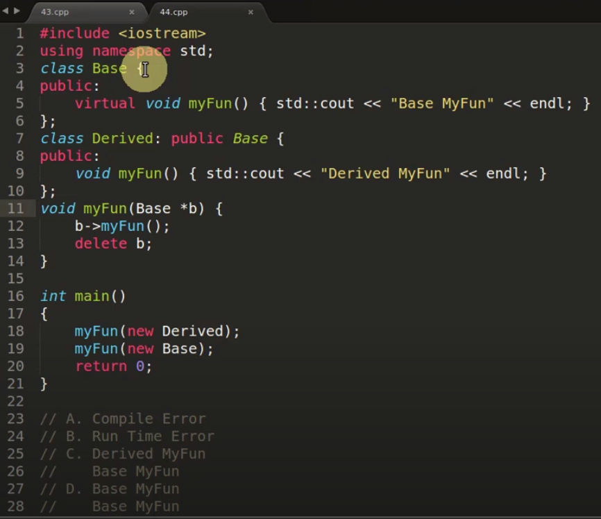
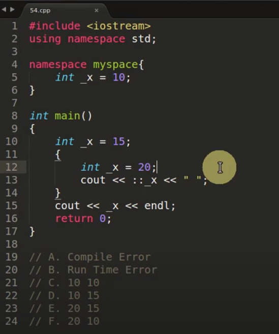
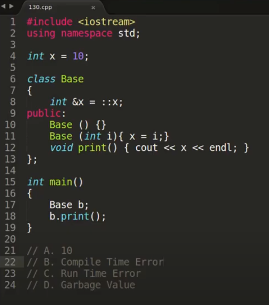

[C++ Interview Questions And Réponses For Freshers](https://www.youtube.com/playlist?list=PLk6CEY9XxSIDxoAaWfdNSX-QckVXMWMMZ)

[C++ Interview Questions And Réponses](https://www.youtube.com/playlist?list=PLk6CEY9XxSIDy8qVHZV-Nf-r9f2BkRZ6p)

[C++ MCQ Questions And Réponses](https://www.youtube.com/playlist?list=PLk6CEY9XxSIAr1ig2XzKJ1XS23Pn7SVnK)

# Comment la compilation fonctionne en interne en C & C++?

* Question:

  Comment la compilation fonctionne en interne en C & C++?

* Réponse:

  2 schémas ci-dessous:

~~~~
----------------------------------------Diagram 1----------------------------------------

[Source Code] -> Compiler -> [Object Code]  -*
											 |
[Source Code] -> Compiler -> [Object Code]  -*-> Linker -> [Executable] -> Loader
											 |								 |
[Source Code] -> Compiler -> [Object Code]  -*								 |
											 |								 |
							 [Libiary File] -*								 ↓
								 						  [Running Executable in Memory]

-----------------------------------------------------------------------------------------
~~~~

~~~~
----------------------------------------Diagram 2----------------------------------------

										Editor or IDE (write wource code)
											|
											|	(.cpp, .h) Source Code, header files
											↓
										Preprocessor
											|
											|	(*.i) Included Files, Replaces Symbols
											↓
										Compiler
											|
											|	(*.s) Assembly Code
											↓
										Assemmbler
											|
											|	(*.o) Object Code
											↓
	Static Libraries (.lib, .a)-------->  Linker
											|
											|	(*.exe)
											↓
	Dynamic Libraries (.dll, .so)------>  Loader
											|
											|
											↓
									Operating System

-----------------------------------------------------------------------------------------
~~~~

Pré-prossesing par pré-processeur

Compilation par compilateur

Assemblage par assembleur

Edition de liens par linker

# Fonction membre const en C++

* Question:

   Qu'est-ce qu'une fonction membre const en C++?

* Réponse:

   La fonction membre const est utilisée pour restreindre (éviter) la modification des données membres à l'intérieur de la fonction.
   
   ~~~~c++
   #include <iostream>
   
   using namespace std;
   
   class Base {
       int x;
       //mutable int x; // it can be changed in const member function
   public:
       Base() {}
       Base(int x) : x(x) {}
   
       void setX(int a) { x = a; }
       int getX() const {
           // 'x' cannot be modified because it is being accessed through a const object
           //x = 20;
   
           return x;
       }
   };
   
   int main()
   {
       Base b;
       b.setX(10);
       cout << b.getX() << endl; // 10
       
       return 0;
   }
   ~~~~

# Comportement de mot-clé const avec surcharge de fonctions en C++

* Question:

   Expliquer le comportement ds mot-clé const avec la surcharge de fonctions en C++

* Réponse:

   1. C++ permet de surcharger les fonctions membres sur la base de const et non-const.
   2. Les paramètres const permettent de surcharger les fonctions membres et les fonctions normales, mais cela devrait être une référence / un pointeur.
   
   ~~~~c++
   #include <iostream>
   
   using namespace std;
   
   class Test {
       int x;
   public:
       Test(int x = 0) : x(x) {}
   
       // OK
       void print() { cout << "non const" << endl; }
       void print() const { cout << "const" << endl; }
   
       // error: redeclared
       //void print(int val) { cout << val << endl; }
       //void print(const int val) { cout << val << endl; }
   
       // OK
       void print(int& val) { cout << val << endl; }
       void print(const int& val) { cout << val << endl; }
   
       // OK
       void print(int* val) { cout << *val << endl; }
       void print(const int* val) { cout << *val << endl; }
   };
   
   int main()
   {
       Test t1;
       const Test t2;
       t1.print(); // non const
       t2.print(); // const
   
       Test t3;
       int k = 10;
       const int i = 20;
   
       t3.print(k);
       t3.print(i);
   
       t3.print(&k);
       t3.print(&i);
       
       return 0;
   }
   ~~~~

# Rembourrage & emballage de structure dans C & C++

* Question:

  Qu'est-ce que le rembourrage et l'emballage de structure en C et C++?

* Réponse:

   C'est un moyen d'accélérer l'optimisation du processeur.

   Lorsque nous créons une structure et des classes en C et C++, sa taille est augmentée d'une certaine manière, ce qui est bon pour un traitement optimisé.

# Rembourrage de structure 2ème Partie

# Champs de bits en C et C++

* Question:

  Qu'est-ce que les champs de bits en C & C++?

* Réponse:

  1. Il est utilisé pour réduire la taille de "class / struct" si nous le pouvons.

     ~~~~c++
     struct Date
     {
     	unsigned int d : 5;
     	unsigned int m : 4;
     	unsigned int y;
     };
     
     int main()
     {
     	Date d;
     	d.d = 8;
     	d.m = 8;
     	d.y = 2020;
     
     	cout << d.d << "/" << d.m << "/" << d.y << endl;
     	cout << sizeof(Date) << endl; // 8
     
     	return 0;
     }
     ~~~~

  2. L'alignement forcé est possible en utilisant des champs de bits sans nom de taille 0.

     ~~~~c++
     struct Node1
     {
     	unsigned int a : 6;
     	unsigned int b : 9;
     };
     
     // with forced alignment
     struct Node2
     {
     	unsigned int a : 6;
     	unsigned int : 0;
     	unsigned int b : 9;
     };
     
     int main()
     {
     	cout << sizeof(Node1) << endl; // 4
     	cout << sizeof(Node2) << endl; // 8
     
     	return 0;
     }
     ~~~~

  3. Prendre des pointeurs vers des membres de champ de bits n'est pas autorisé car ils peuvent ne pas commencer à une limite d'octet.

     ~~~~c++
     struct Node
     {
     	unsigned int a : 5;
     	unsigned int b : 5;
     	unsigned int c;
     };
     
     int main()
     {
     	Node t;
     
     	// cout << &t.a << endl; // Not allowed
     	// cout << &t.b << endl; // Not allowed
     	cout << &t.c << endl; // Allowed, because c is not bit field member
     
     	return 0;
     }
     ~~~~

  4. L'affectation d'une valeur hors plage à un membre de champ de bits est définie par l'implémentation

     ~~~~c++
     struct Node
     {
     	unsigned int a : 2;
     	unsigned int b : 2;
     	unsigned int c : 2;
     };
     
     int main()
     {
     	Node n;
     	n.a = 5;
     	cout << n.a << endl; // not a good practice
     
     	return 0;
     }
     ~~~~

  5. Nous pouvons avoir des membres statiques dans une structure / classe en C++, mais les champs de bits ne peuvent pas être statiques

     ~~~~c++
     struct Node
     {
     	// static unsigned int a : 5; // error
     	unsigned int b : 2;
     	unsigned int c : 2;
     };
     ~~~~

  6. Le tableau de champs de bits n'est pas autorisé

     ~~~~c++
     struct Node
     {
     	// unsigned int x[10] : 2; // error
     	unsigned int a : 2;
     };
     ~~~~

  Remarque:

  1. Les champs de bits proviennent du langage C, il n'y a aucune différence en C++
  2. Il est utilisé pour réduire la taille de "class / struct" si nous le pouvons.
  3. Cette fonctionnalité est excellente dans les systèmes embarqués car la mémoire est insuffisante
  4. Rembourrage structurel en C / C++
  5. Uniquement pour les types intégraux: bool, char, signed char, unsigned char, char16_t, char32_t, wchar_t, short, int, long, long long, unsigned short, insigned int, unsigned long, unsigned long long

# Comment calculer la taille de la structure et de la classe en C & C++

* Question:

  Comment calculer la taille de la structure et de la classe en C & C++

* Réponse:

  Exemple:

  ~~~~c++
  #include <iostream>
  
  using namespace std;
  
  struct Node1 {
      char a;
      int b;
      char c;
  };
  
  struct Node2 {
      Node1 n;
      int i;
  };
  
  struct Node3 {
      char a;
      char b;
      short c;
      int d;
      double e;
  };
  
  
  int main()
  {
      cout << sizeof(Node1) << endl; // 12
      cout << sizeof(Node2) << endl; // 16
      cout << sizeof(Node3) << endl; // 16
  
      return 0;
  }
  ~~~~

# Union en C++

* Question:

  Qu'est-ce que l'union en C++?

* Réponse:

  1. Tout comme les structures et les classes, une union est un type de données défini par l'utilisateur.
  2. En union, tous les membres partagent le plus grand même emplacement mémoire.
  3. Ceci est utilisé pour obtenir le polymorphisme en C.

  

  Utilisation possible?

  1. Lorsque nous n'avons besoin que d'une seule valeur parmi tant d'autres, nous l'utilisons. (Exemple: classe Square)
  2. Obtenir les données réelles dans certaines parties. (Exemple: int value, char bytes[4])

  

  Example 1:

  ~~~~c++
  #include <iostream>
  
  using namespace std;
  
  union Square {
      int width;
      int height;
  };
  
  int getArea(int width, int height) {
      return width * height;
  }
  
  int main()
  {
      Square sqr;
      sqr.width = 10;
  
      cout << getArea(sqr.width, sqr.height) << endl; // 100
      
      return 0;
  }
  ~~~~

  Example 2:

  ~~~~c++
  #include <iostream>
  
  using namespace std;
  
  union MyUnion {
      char bytes[4];
      unsigned int value;
  };
   
  int main()
  {
      MyUnion un;
      un.value = 0;
      un.value = 2;
      //un.value = 257;
  
      cout << (int)un.bytes[0] << endl; // 2
      cout << (int)un.bytes[1] << endl; // 0
      cout << (int)un.bytes[2] << endl; // 0
      cout << (int)un.bytes[3] << endl; // 0
      
      return 0;
  }
  ~~~~

# Comment delete[] sait combien il faut désallouer en C++?

* Question:

   Comment delete[] sait combien d'objets supprimer?

* Réponse:

   1. Surallocation (Over Allocation)
   2. Tableau associatif (Associative Array)
   
   
   
   Nous allons stocker cette SIZE quelque part pendant que nous construisons ce tableau, de sorte que lorsque nous appelons delete[] nous pouvons l'obtenir à partir de cet endroit et nous ne désallouerons que cette quantité de mémoire ...
   
   1. Surallocation (Over Allocation):
   
      Il s'agit de surallouer le tableau d'origine avec un peu de mémoire supplémentaire et d'y mettre cette SIZE, donc lors de la désallocation, nous pouvons simplement prendre la valeur SIZE de cet endroit dans le tableau et désallouer cette quantité de mémoire uniquement ...
   
      ~~~~c++
      #include <iostream>
      
      using namespace std;
      
      #define WORDSIZE 4
      
      const int n = 10;
      
      class Base {
      public:
          int bar;
      };
      
      int main()
      {
          Base* bp = new Base[n];
          //char* tmp = (char*) operator new);
          //Base* p = (Base*)(tmp + WORDSIZE);
          //*(size_t*)tmp = n;
          //for (int i = 0; i < n; ++i)
          //    new(p + i) Base();
      
          delete[] bp;
          //size_t n = *(size_t*)((char*)p - WORDSIZE);
          //while (n-- != 0)
          //    (p + n)->~Base();
          //operator deletep - WORDSIZE);
          
          return 0;
      }
      ~~~~
   
   2. Tableau associatif (Associative Array):
   
      Il s'agit de maintenir un tableau séparé avec une paire de pointeur et valeur, dans ce cas [*p, SIZE], donc lors de la désallocation, nous pouvons simplement rechercher dans ce tableau le pointeur et désallouer uniquement cette quantité de mémoire ...
   
      ~~~~c++
      #include <iostream>
      #include <map>
      
      using namespace std;
      
      const int n = 10;
      
      class Base {
      public:
          int bar;
      };
      
      int main()
      {
          Base* bp = new Base[n];
          //map<Base*, int> associationArray;
          //Base* bp = (Base*) operator new);
          //size_t i;
          //for (int i = 0; i < n; ++i)
          //    new(bp + i) Base();
          //associationArray.insert(make_pair(bp, n));
      
          delete[] bp;
          //auto it = associationArray.find(bp);
          //while ((it->second)-- != 0)
          //    (bp + n)->~Base();
          //operator delete[] (bp);
          
          return 0;
      }
      ~~~~

# Différence entre référence et pointeur en C++

* Question:

   Quelle est la différence entre Reference et Pointer en C++?

* Réponse:

   1. Adresse mémoire

      La référence a la même adresse que celle à laquelle elle se réfère, le pointeur contient l'adresse vers laquelle il pointe, le pointeur a sa propre adresse.

      ~~~~c++
   #include <iostream>
      
   using namespace std;
      
   int main()
      {
       int i = 10;
      
       int& ref = i;	// reference
          int* p = &i;	// pointer
   
          cout << &ref << endl;	// 003AFE20
          cout << &i << endl;		// 003AFE20
          cout << &p << endl;	// 003AFE08
          
          return 0;
      }
      ~~~~
   
   2. La réaffectation n'est pas possible avec référence
   
      ~~~~c++
      #include <iostream>
      
      using namespace std;
      
      int main()
      {
          int i = 10;
      
          int& ref = i;   // reference
          int* p = &i;    // pointer
          
          int val = 20;
          ref = val;
          cout << i << endl;
      
          p = &val;
          *p = 30;
          cout << val << endl;
      
          return 0;
      }
      ~~~~
   
   3. Valeur NULL
   
      La valeur nulle ne peut pas être utilisée pour initialiser la référence.
   
      La référence doit être initialisée (liée) lors de la création.
   
      ~~~~c++
      #include <iostream>
      
      using namespace std;
      
      int main()
      {
          int i = 10;
          int *p = nullptr;   // OK
          p = &i;             // OK
      
          //int& ref;           // error
          //int& ref = NULL;    // error
          //ref = i;            // error
      
          return 0;
      }
      ~~~~
   
      
   
   4. Opérations arithmétiques
   
      ++ et - n'est pas autorisé pour référence.
   
      ~~~~c++
      #include <iostream>
      
      using namespace std;
      
      int main()
      {
          int i = 10;
          int *p = nullptr;
          p = &i;
          p++;
          cout << *p << endl; // garbage
      
          int& ref = i;
          ref++;
          cout << ref << endl; // 11
      
          return 0;
      }
      ~~~~
   
   5. Indirection
   
      ~~~~c++
      #include <iostream>
      
      using namespace std;
      
      int main()
      {
          int i = 10;
          int *p = nullptr;
          p = &i;
          int** p2 = &p;
          int*** p3 = &p2;
      
          int& ref = i;
          int& ref2 = ref;
          cout << ref << endl;    // 10
          cout << ref2 << endl;   // 10
      
          return 0;
      }
      ~~~~

# Quand utiliser la référence sur le pointeur et vice versa dans C++?

* Question:

  Quand devrions-nous utiliser la référence plutôt que le pointeur et vice versa?

* Réponse:

  * Référence: 

    utiliser la référence dans le paramètre de fonction et le type de retour

    1. Passez un gros objet

    2. Pour éviter le tranchage d'objet

       ~~~~c++
       #include <iostream>
       
       using namespace std;
       
       class Base {
       	int x;
       public:
       	virtual void print() { cout << "Base" << endl; }
       };
       
       class Derived: public Base {
       	int x;
       public:
       	void print() { cout << "Derived" << endl; }
       };
       
       void func(Base& b) {
       	b.print();
       }
       
       int main()
       {
       	Derived d;
       	func(d); // Derived
       
       	return 0;
       }
       ~~~~

    3. Pour modifier la variable locale de la fonction d'appel

       ~~~~c++
       #include <iostream>
       
       using namespace std;
       
       void change(int& x) {
       	x = 10;
       }
       
       int main()
       {
       	int x = 5;
       	change(x);
       	cout << x << endl;
       
       	return 0;
       }
       ~~~~

    4. Pour obtenir un polymorphisme d'exécution dans une fonction (liaison dynamique)

       Même exemple que le point 2

    5. Le paramètre de constructeur de copie doit être une référence

  * Pointeur: 

    utilisez le pointeur dans les algorithmes et la structure de données comme la liste chaînée (linked list), l'arbre (tree), le graphique (graph), etc.

    1. Parfois, nous mettons NULL / nullptr dans nœud
    2. Parfois, nous changeons le pointeur pour pointer un autre nœud

# Pourquoi préférer passer par référence ou pointeur plutôt que passer par valeur?

* Question:

  Pourquoi préférer passer par référence ou pointeur plutôt que passer par valeur?

* Réponse:

  Passer par valeur copiera les données et cela prend du temps s'il s'agit d'un gros objet.

# Pointeur de fonction en C/C++

* Question:
   1. Qu'est-ce que le pointeur de fonction et comment le créer?
   2. Appel d'une fonction à l'aide d'un pointeur de fonction.
   3. Comment passer un pointeur de fonction comme argument?
   4. Comment retourner un pointeur de fonction?
   5. Comment utiliser un tableau de pointeurs de fonction?
   6. Où utiliser le pointeur de fonction?
* Réponse
   1. Qu'est-ce que le pointeur de fonction et comment le créer?
   
      La variable de pointeur normal stocke l'adresse d'une autre variable, le pointeur de fonction stocke l'adresse d'une fonction
   
      Comment créer ?
   
      ~~~~c
      int add(int a, int b) {
      	return a + b;
      }
      
      int main() {
          int (*fun)(int, int) = add;
      	// or
          // int (*fun)(int, int) = &add;
          
          return 0;
      }
      ~~~~
   
   2. Appel d'une fonction à l'aide d'un pointeur de fonction.
   
      ~~~~c
      int add(int a, int b) {
      	return a + b;
      }
      
      int main() {
          int (*fun)(int, int) = add;
      	// or
          // int (*fun)(int, int) = &add;
          
          int c = fun(1, 2);
      	// or
      	// int c = (*fun)(1, 2);
          
          return 0;
      }
      ~~~~
   
   3. Comment passer un pointeur de fonction comme argument?
   
      ~~~~c
      int add(int a, int b) {
      	return a + b;
      }
      
      int func(int (*someFun)(int, int)) {
      	int c = someFun(1, 2);
      	return c;
      }
      
      int main() {
          int c = func(add);
          
          return 0;
      }
      ~~~~
   
   4. Comment retourner un pointeur de fonction?
   
      ~~~~c
      int add(int a, int b) {
      	return a + b;
      }
      
      int sub(int a, int b) {
      	return a - b;
      }
      
      typedef int(*mathFun)(int, int);
      mathFun fun(int type) {
      	if(type == 1)
      		return add;
      	if(type == 2)
      		return sub;
      }
      
      //int (*fun(int type))(int, int) {
      //}
      
      int main() {
          int (*someFun)(int, int);
          someFun = fun(1);
          int c = someFun(1, 2);
          
          return 0;
      }
      ~~~~
   
   5. Comment utiliser un tableau de pointeurs de fonction?
   
      ~~~~c
      int add(int a, int b) {
      	return a + b;
      }
      
      int sub(int a, int b) {
      	return a - b;
      }
      
      typedef int(*mathFun)(int, int);
      
      int main() {
          mathFun arr[2] = {add, sub};
          // int (*arr[2])(int, int) = {add, sub};
          int c = arr[0](1, 2);
          int d = arr[1](1, 2);
          
          return 0;
      }
      ~~~~
   
   6. Où utiliser le pointeur de fonction?
   
      Passer l'adresse de la fonction à une autre fonction

# Comment vector fonctionne en interne en C++?

* Question:

  Comment vector fonctionne en interne en C++?

* Réponse:

  Lorsque size > capacity, un nouveau vector est créé avec une capacité double, et tous les éléments du vector précédent sont copiés dans le nouveau vector, puis le vector précédent est détruit.

  ~~~~c++
  #include <iostream>
  #include <vector>
  
  //using namespace std;
  
  int main()
  {
  	std::vector<int> vec;
  	//vec.reserve(32);
      
  	std::cout << "size\tcapacity" << std::endl;
      std::cout << vec.size() << "\t" << vec.capacity() << std::endl;
  	for (int i = 0; i < 32; ++i) {
  		vec.push_back(i);
  		std::cout << vec.size() << "\t" << vec.capacity() << std::endl;
  	}
  
  	//size	capacity
      //	0	0
  	//	1	1
  	//	2	2
  	//	3	4
  	//	4	4
  	//	5	8
  	//	6	8
  	//	7	8
  	//	8	8
  	//	9	16
  	//	10	16
  	//	11	16
  	//	12	16
  	//	13	16
  	//	14	16
  	//	15	16
  	//	16	16
  	//	17	32
  	//	18	32
  	//	19	32
  	//	20	32
  	//	21	32
  	//	22	32
  	//	23	32
  	//	24	32
  	//	25	32
  	//	26	32
  	//	27	32
  	//	28	32
  	//	29	32
  	//	30	32
  	//	31	32
  	//	32	32
  
  	return 0;
  }
  ~~~~

# Fonction amie & classe amie en C++

* Question:

  Expliquer la fonction amie et la classe amie en C++

* Réponse:

  1. Le mot-clé "friend" est utilisé pour faire de certaines [fonctions OU classes] des amis de votre classe.
  2. La fonction amie OU la classe amie peut accéder aux fonctions de membre OU aux membre privées / publiques / protégées d'une autre classe.
  3. La fonction ne peut pas devenir ami d'une autre fonction.
  4. La classe ne peut pas devenir amie de la fonction.
  5. L'amitié n'est pas réciproque. Si une classe A est amie de classe B, alors classe B ne devient pas automatiquement ami de classe A.
  6. L'amitié n'est pas héritée.

  

  Fonction amie:

  ~~~~c++
  #include <iostream>
  
  using namespace std;
  
  class Base {
  private:
  //protected:
      int x;
  public:
      Base() {}
      Base(int x) : x(x) {}
  
      friend void setX(Base&, int);
      friend int getX(Base&);
  };
  
  void setX(Base& obj, int a) {
      obj.x = a;
  }
  
  int getX(Base& obj) {
      return obj.x;
  }
  
  int main()
  {
      Base obj(10);
      cout << getX(obj) << endl; // 10
      setX(obj, 20);
      cout << getX(obj) << endl; // 20
      
      return 0;
  }
  ~~~~

  Class amie:

  ~~~~c++
  #include <iostream>
  
  using namespace std;
  
  class Base {
  private:
  //protected:
      int x;
  public:
      Base() {}
      Base(int x) : x(x) {}
  
      friend class GetSet;
  };
  
  class GetSet {
  public:
      void setX(Base& obj, int a) {
          obj.x = a;
      }
  
      int getX(Base& obj) {
          return obj.x;
      }
  };
  
  int main()
  {
      Base obj(10);
      GetSet gs;
  
      cout << gs.getX(obj) << endl; // 10
      gs.setX(obj, 20);
      cout << gs.getX(obj) << endl; // 20
      
      return 0;
  }
  ~~~~

# Comment rendre une fonction membre d'une classe en tant qu'ami d'une autre classe en C++

* Question:

  Comment rendre une fonction membre d'une classe en tant qu'ami d'une autre classe en C++?

* Réponse:

  ~~~~c++
  #include <iostream>
  
  using namespace std;
  
  class Base1; // forward declaration
  
  class Base2 {
      int y;
  public:
      Base2(int y = 0) : y(y) {}
      void printBase1(Base1& obj);
  };
  
  class Base1 {
      int x;
  public:
      Base1(int x = 0): x(x) {}
  
      friend void Base2::printBase1(Base1&);
  };
  
  void Base2::printBase1(Base1& obj) {
      cout << "Base1 x = " << obj.x << endl;
  }
  
  
  int main()
  {
      Base1 b1(10);
      Base2 b2(20);
  
      b2.printBase1(b1);
  
      return 0;
  }
  ~~~~

  

# Utilisation actuelle de la fonction ami et de la classe amie en C++

* Question:

  Quelle est l'utilisation de la fonction amie et de la classe amie en C++?

* Réponse:

  1. Objectif du test
  2. Intermédiaire parmi plusieurs classes

  Remarque:

  Il n'enfreint pas la règle d'encapsulation. C'est le propriétaire de la classe qui définit certaines fonctions ou classes comme des amis.

# Comment écrire votre propre fonction atoi en C & C++?

* Question:

   Comment écrire votre propre fonction atoi en C et C++?

   atoi: ASCII à Integer

* Réponse:

   ~~~~c++
   #include <iostream>
   
   using namespace std;
   
   int my_atoi(const char* str) {
   	int res = 0;	// initialize result
   	int sign = 1;	// initialize sign as positive
   	int i = 0;		// initialize index of first digit
   
   	// is number is nagative, then update sign
   	if (str[0] == '-') {
   		sign = -1;
   		i++;
   	}
   
   	for (; str[i] != '\0'; ++i) {
   		res = res * 10 + str[i] - '0';
   	}
   
   	return sign * res;
   }
   
   int main()
   {
   	char str[] = "-1234";
   	//const char *str = "-1234";
   
   	int result = my_atoi(str);
   	cout << result << endl;
   
       return 0;
   }
   ~~~~

# Différence entre Enum simple et classe Enum en C++

* Question:

   Quelle est la différence entre plain enum et enum class en C++?

* Réponse:

   * Énumération simple (énumération sans portée):

     Les noms des énumérateurs dans une énumération sans portée sont placés dans la même portée que l'énumération elle-même.

     Les énumérations sans portée sont converti implicitement en int.

   * Class Enum (énumération de portée) - doit utiliser l'opérateur de portée

     Les noms des énumérateurs dans une énumération de portée suivent les règles de portée normales et sont inaccessibles en dehors de la portée de l'énumération.

     Les énumérations de portée ne sont pas implicitement converties en int.
   
   ~~~~c++
   #include <iostream>
   
   using namespace std;
   
   enum Color1 { red, green, blue };
   Color1 c1 = red;
   
   // error: redefinition
   //int green = 2;
   
   // error: redefinition
   //enum Color3 { red, green, blue, black };
   
   void func(int i) {
   	cout << i << endl;
   }
   
   
   enum class Color2 { red, green, blue };
   Color2 c2 = Color2::red;
   
   
   int main()
   {
   	switch (c1) {
   	case red:
   		cout << "c1: red" << endl;
   		break;
   	case green:
   		cout << "c1: green" << endl;
   		break;
   	case blue:
   		cout << "c1: blue" << endl;
   		break;
   	default:
   		cout << "c1: Others" << endl;
   		break;
   	}
   
   	func(c1); // c1 is converted to int
   	
   
   	switch (c2) {
   	case Color2::red:
   		cout << "c2: red" << endl;
   		break;
   	case Color2::green:
   		cout << "c2: green" << endl;
   		break;
   	case Color2::blue:
   		cout << "c2: blue" << endl;
   		break;
   	default:
   		cout << "c2: Others" << endl;
   		break;
   	}
   
       return 0;
   }
   ~~~~

# Quel est le meilleur endroit pour utiliser Enum en C++?

* Question:

  Quel est le meilleur endroit pour utiliser enum en C++?

* Réponse:

  Utilisez enum lorsque vous avez affaire à un ensemble limité de valeurs

  Exemple: votre fonction peut prendre une valeur d'un ensemble de valeurs.

  ~~~~c++
  #include <iostream>
  
  using namespace std;
  
  enum class Color
  {
  	red, green, blue
  };
  void func(Color c) {
  	switch (c)
  	{
  	case Color::red:
  		cout << "red" << endl;
  		break;
  	case Color::green:
  		cout << "green" << endl;
  		break;
  	case Color::blue:
  		cout << "blue" << endl;
  		break;
  	default:
  		cout << "default" << endl;
  		break;
  	}
  }
  
  int main()
  {
  	Color c = Color::red;
  	func(c);
  
  	return 0;
  }
  ~~~~

# Big Endian et Little Endian

* Question: 

* Réponse:

  Big Endian et Little Endian est un moyen de lire la mémoire, dans l'un d'eux, nous lisons du début à la fin et un autre lit de la fin au début.

  ~~~~
  0x12345678
  					  Address
  				Low ----------- High
  Big Endian: 		12 34 56 78
  Little Endian: 		78 56 34 12 
  ~~~~

  Vérification:

  ~~~~c++
  unsigned int i = 1; // 00000001
  char *c = (char*)&i;
  if(*c) {
  	printf("Little Endian\n"); 
  }
  else {
  	printf("Big Endian\n");
  }
  ~~~~

  ~~~~
  0x00000001
  					  Address
  				Low ----------- High
  Big Endian: 		00 00 00 01
  Little Endian: 		01 00 00 00 
  ~~~~

# Quand utiliser la surcharge d'opérateurs en C++?

* Question:

   Quand utiliser la surcharge des opérateurs?

* Réponse:

   À utiliser quand cela a du sens.
   
   ~~~~c++
   #include <iostream>
   
   using namespace std;
   
   class Point {
   	int x, y;
   public:
   	Point(): x(0), y(0) {}
   	Point(int x, int y) : x(x), y(y) {}
   
   	Point operator+(const Point& another) {
   		Point p;
   		p.x = x + another.x;
   		p.y = y + another.y;
   		return p;
   	}
   
   	friend ostream& operator<<(ostream& out, Point p);
   };
   
   ostream& operator<<(ostream& out, Point p) {
   	out << p.x << " " << p.y;
   	return out;
   }
   
   
   int main()
   {
   	Point p1(1, 2), p2(3, 4);
   	Point p3 = p1 + p2;
   
   	cout << p3 << endl;
   
       return 0;
   }
   ~~~~

# void and void* en C&C++

* Question: 

  Qu'est-ce que void et void* en C&C++?

* Réponse:
   * void:
     1. void est utilisé pour ne rien désigner
     2. si une fonction ne retourne rien, nous utilisons le type void pour indiquer
     3. si une fonction ne prend aucun paramètre, nous utilisons void pour indiquer
     4. nous ne pouvons pas créer de variable void
     5. sizeof void est 1 dans les compleurs gcc, mais dans les autres, il n'est pas valide de vérifier sizeof void
     
   * void*
     1. void* est un pointeur universel
     2. nous pouvons convertir n'importe quel pointeur de type de données en void * (sauf pointeur de fonction, const ou volatile)
     3. void* ne peut pas être déréférencé
     
     ~~~~c++
     #include <iostream>
     
     using namespace std;
     
     void func() {}
     
     int main()
     {
     	int* p = new int(10);
     	void* v = static_cast<void*>(p);
     	cout << *p << endl;
     	//cout << *v << endl; // error
     	cout << *(static_cast<int*>(v)) << endl; // OK
     
     
     	void* v2 = static_cast<void*>(func);
     
     
     	const int* p2 = new int(20);
     	// 'static_cast': cannot convert from 'const int *' to 'void *'
     	//void* v3 = static_cast<void*>(p2); // error
     
     
     	volatile int* p3 = new int(30);
     	// 'static_cast': cannot convert from 'volatile int *' to 'void *'
     	//void* v4 = static_cast<void*>(p3); // error
     
         return 0;
     }
     ~~~~
     
     
     
     Cas d'utilisation:
     
     1. malloc et calloc renvoient void* afin que nous puissions typer (static_cast) vers le type de données souhaité
     
        ~~~~c++
        #include <iostream>
        
        using namespace std;
        
        int main()
        {
        	int* p1 = (int*)malloc(sizeof(int));
        	int* p2 = static_cast<int*>(malloc(sizeof(int)));
        
            return 0;
        }
        ~~~~
     
     2. void* est utilisé pour créer des fonctions génériques en C (fonction de comparaison utilisée dans la fonction qsort en C)

# static_cast

* Question:

   Qu'est-ce que static_cast en C++ et où utiliser static_cast?

* Réponse:

   1. Il effectue des conversions implicites entre les types.

      * Question: 

        Pourquoi utiliser static_cast quand une conversion implicite est impliquée?

      * Réponse:

        Parce que le cast C-Style est difficile à trouver dans le code, mais vous pouvez rechercher facilement le mot-clé static_cast (facilite la révision du code et la recherche est facile).

      Erreur détectée au moment de la compilation, pas à l'exécution

      Exemple: comme float to int
   
      ~~~~c++
      #include <iostream>
      
      using namespace std;
      
      int main()
      {
      	float f = 3.5;
      	int a = 0;
      
      	a = f;
      	a = static_cast<int>(f); // easy to search
      
          return 0;
      }
      ~~~~
   
   2. Using static_cast when conversion between types is provided through conversion operator or conversion constructor.
   
      ~~~~c++
      #include <iostream>
      #include <string>
      
   using namespace std;
      
   class Int {
      	int x;
   public:
      	Int(int x) : x(x) {
      		cout << "conversion constructor" << endl;
      	}
      	operator string () {
      		cout << "conversion operator" << endl;
      		return to_string(x);
   	}
      };
   
      int main() {
      	Int obj(3); // conversion constructor
      
      	string str1 = obj; // conversion operator
      	obj = 20; // conversion constructor
      
      	string str2 = static_cast<string>(obj); // conversion operator
      	obj = static_cast<Int>(30); // conversion constructor
      
      	return 0;
      }
      ~~~~

   3. static_cast est plus restrictif que C-Style

      Exemple: char * to int * est autorisé (dangereux) en C-Style mais pas avec static_cast
   
      ~~~~c++
      #include <iostream>
      
      using namespace std;
      
      int main() {
      	char c;				// 1 byte
      	int* p = (int*)&c;	// 4 bytes
      	*p = 5;				// pass at compile-time but FAIL at runtime
      	//int* ip = static_cast<int*>(&c); // FAIL at compile-time
      	// 'static_cast': cannot convert from 'char *' to 'int *'
      
      	return 0;
      }
      ~~~~
   
4. static_cast évite le cast d'un objet de classe dérivé qui utilise l'héritage privé en pointeur d'objet de classe de base
   
   ~~~~c++
      #include <iostream>
      
      using namespace std;
      
      class Base {};
      class Derived : private Base {}; // private
      
      int main() {
      	Derived d1;
      	Base* bp1 = (Base*)&d1;					// Allowed at compile-time
      	//Base* bp2 = static_cast<Base*>(&d1); 	// Not allowed at compile-time
      	// 'static_cast': conversion from 'Derived *' to 'Base *' exists, but is inaccessible
      
      	return 0;
      }
      ~~~~
   
   5. À utiliser pour toutes les conversions ascendantes, mais ne jamais utiliser pour les conversions descendantes confuses car aucune vérification d'exécution (runtime checking) n'est effectuée pour les conversions static_cast
   
      ~~~~c++
      #include <iostream>
      
      using namespace std;
      
      class Base {};
      class Derived1 : public Base {};
      class Derived2 : public Base {};
      
      int main() {
      	Derived1 d1;
      	Derived2 d2;
      
      	Base* bp1 = static_cast<Base*>(&d1); // up-casts
      	Base* bp2 = static_cast<Base*>(&d2); // up-casts
      
      	Derived1* d1p = static_cast<Derived1*>(bp2); // compile successfully, but should avoid
      	Derived2* d2p = static_cast<Derived2*>(bp1); // compile successfully, but should avoid
      
      	return 0;
      }
      ~~~~
   
   6. static_cast doit être préféré lors de la conversion vers void * ou depuis void *
   
      ~~~~c++
      #include <iostream>
      
      using namespace std;
      
      int main() {
      	int i = 10;
      
      	void* v = static_cast<void*>(&i);
      	int* ip = static_cast<int*>(v);
      
      	cout << *ip << endl;
      
      	return 0;
      }
      ~~~~

# const_cast

* Question:

   Qu'est-ce que const_cast en C++ et où utiliser const_cast?

* Réponse:

   L'expression const_cast <T>(v) peut être utilisée pour changer les qualificatifs const ou volatile des pointeurs ou des références.

   Où T doit être un type pointeur, référence ou pointeur vers membre.
   
   
   
   1. Lorsque l'objet / variable référencé réel n'est pas const
   
      ~~~~c++
      #include <iostream>
      
      using namespace std;
      
      int main() {
      	const int a1 = 10;
      	const int* b1 = &a1;
      
      	int* d1 = const_cast<int*>(b1); // remove the constantness
      	*d1 = 15; // compile sucessfully, but invalid and undefined behavior
      	cout << a1 << endl;		// 10
      	cout << *b1 << endl;	// 15
      	cout << *d1 << endl;	// 15, compiler optimization
      
      
      	int a2 = 20;
      	const int* b2 = &a2;
      	int* d2 = const_cast<int*>(b2);
      	*d2 = 30; // valid code
      	cout << a2 << endl;		// 30
      	cout << *b2 << endl;	// 30
      	cout << *d2 << endl;	// 30
      
      	return 0;
      }
      ~~~~
   
   2. Quand nous avons besoin d'appeler une bibliothèque tierce où elle prend la variable / objet comme non-const mais ne change pas cela
   
      ~~~~c++
      #include <iostream>
      
      using namespace std;
      
      void third_party_library(int* x) {
      	int k = 10;
      	cout << k + *(x); // not chaning x
      }
      
      int main() {
      	const int x = 20;
      	const int* px = &x;
      	third_party_library(const_cast<int*>(px));
      
      	return 0;
      }
      ~~~~
   
   
   
   NE JAMAIS UTILISER CELA !!!
   
   1. N'utilisez const_cast que lorsque vous en avez besoin.
   2. Utilisez const_cast uniquement lorsque l'objet / la variable référencé actuel n'est pas const.
   3. À utiliser lorsque nous avons affaire à une bibliothèque tierce et que certaines API veulent des données sous forme non const mais nous les avons dans const. (En fait, nous ne pouvons rien faire dans ce cas, mais assurez-vous que l'API ne change pas la valeur de notre variable)

# reinterpret_cast

* Question:

  Qu'est-ce que reinterpret_cast en C++ et où utiliser reinterpret_cast?

* Réponse:

  1. Il peut effectuer des conversions dangereuses car il peut convertir n'importe quel pointeur vers n'importe quel autre pointeur

     ~~~~c++
     #include <iostream>
     
     using namespace std;
     
     class Mango
     {
     public:
     	void eatMango() { cout << "eating Mango" << endl; }
     };
     
     class Banana
     {
     public:
     	void eatBanana() { cout << "eating Banana" << endl; }
     };
     
     
     int main()
     {
     	Banana* b = new Banana();
     	Mango* m = new Mango();
     
     	Banana* new_banana = reinterpret_cast<Banana*>(m);
     	new_banana->eatBanana(); // Banana::eatBanana(new_banana);
   
     	return 0;
   }
     ~~~~
  
  2. Il est utilisé lorsque vous souhaitez travailler avec des bits
  
     ~~~~c++
     #include <iostream>
     
     using namespace std;
     
     struct myStruct {
     	int x;
     	int y;
     	char c;
     	bool b;
     };
     
     int main()
     {
     	myStruct s;
     	s.x = 5;
     	s.y = 10;
     	s.c = 'a';
     	s.b = true;
     
     	int* p = reinterpret_cast<int*>(&s);
     	cout << *p << endl; // 5
     
     	p++; // increment by 4 bytes
     	cout << *p << endl; // 10
     
     	p++;
     	char* c = reinterpret_cast<char*>(p);
     	cout << *c << endl; // a
     
     	cout << *(reinterpret_cast<bool*>(++c)) << endl; // 1
     
     	return 0;
     }
     ~~~~
  
  
  
  REMARQUES:
  
  1. reinterpret_cast peut effectuer des conversions dangereuses car il peut transtyper n'importe quel pointeur vers n'importe quel autre pointeur.
  2. reinterpret_cast est utilisé lorsque vous souhaitez travailler avec des bits.
  3. le résultat d'un reinterpret_cast ne peut pas être utilisé en toute sécurité pour autre chose que sa conversion à son type d'origine.
  4. nous devons être très prudents lors de l'utilisation de ce cast.
  5. si nous utilisons ce type de cast, il devient un produit non portable parce qu'il travaille avec des bits.

# dynamic_cast

* Question:

   Qu'est-ce que dynamic_cast en C++ et où utiliser dynamic_cast?

* Réponse:

   dynamic_cast est utilisé au moment de l'exécution pour trouver le down-cast correct.
   
   ~~~~c++
   #include <iostream>
   #include <exception>
   
   using namespace std;
   
   class Base
   {
   public:
   	virtual void print() { cout << "Base" << endl; }
   };
   
   class Derived1 : public Base
   {
   public:
   	void print() { cout << "Derived1" << endl; }
   };
   
   class Derived2 : public Base
   {
   public:
   	void print() { cout << "Derived2" << endl; }
   };
   
   
   int main()
   {
   	Derived1 d1;
   
   	Base* bp = dynamic_cast<Base*>(&d1);
   
   	Derived2* dp2 = dynamic_cast<Derived2*>(bp); 
   	// this down-cast will fail, return nullptr
   	if (dp2 == nullptr)
   		cout << "NULL" << endl;
   	else
   		cout << "NOT NULL" << endl;
   
   
   	try {
   		//Derived1 &r1 = dynamic_cast<Derived1&>(d1);
   		Derived2& r2 = dynamic_cast<Derived2&>(d1);
   	}
   	catch (exception& e) {
   		cout << e.what() << endl; // Bad dynamic_cast!
   	}
   
   	return 0;
   }
   ~~~~
   
   
   
   REMARQUE1:
   
   Syntaxe: dynamic_cast <new_type> (expression)
   
   1. Besoin d'au moins une fonction virtuelle dans la classe de base.
   2. Si le cast réussit, dynamic_cast renvoie une valeur de type new_type.
   3. Si le cast échoue et que new_type est un type pointeur, il renvoie un pointeur nul de ce type.
   4. Si la conversion échoue et que new_type est un type de référence, il lève une exception qui correspond à un gestionnaire de type std::bad_cast.
   
   
   
   REMARQUE2:
   
   1. il ne fonctionne que sur la classe de base polymorphe (au moins une fonction virtuelle dans la classe de base) car il utilise ces informations pour décider de la mauvaise conversion descendante.
   2. il est utilisé pour l'up-cast (D vers B) et le down-cast (B vers D), mais il est principalement utilisé pour le down-cast correct.
   3. l'utilisation de cette cast a une surcharge d'exécution, car elle vérifie les types d'objet au moment de l'exécution à l'aide de RTTI (Run Time Type Information, Informations de Type de Temps d'Exécution).
   4. si nous sommes sûrs que nous ne lancerons jamais un mauvais objet, nous devons toujours éviter cette conversion et utiliser static_cast.

# Comment retourner un tableau à partir d'une fonction en C et C++?

* Question:

   Comment retourner un tableau à partir d'une fonction en C et C++?

* Réponse:

   1. Utilisation d'un mot-clé statique
   2. Utilisation d'un tableau dynamique
   
   Exemple:
   
   1. mot-clé statique
   
      ~~~~c++
      #include <iostream>
      
      using namespace std;
      
      int* fun() {
      	static int arr[3] = { 1, 2, 3 };
      	//int arr[3] = { 1, 2, 3 }; // not work
      
      	return arr;
      }
      
      
      int main()
      {
      	int* arr = fun();
      	cout << arr[0] << endl;
      	cout << arr[1] << endl;
      	cout << arr[2] << endl;
      
      	return 0;
      }
      ~~~~
   
   2. tableau dynamique
   
      ~~~~c++
      #include <iostream>
      
      using namespace std;
      
      int* fun() {
      	int* arr = new int[3];
      	arr[0] = 1;
      	arr[1] = 2;
      	arr[2] = 3;
      	return arr;
      }
      
      
      int main()
      {
      	int* arr = fun();
      	cout << arr[0] << endl;
      	cout << arr[1] << endl;
      	cout << arr[2] << endl;
      
      	return 0;
      }
      ~~~~

# Comment retourner un tableau 2D à partir d'une fonction en C et C++

* Question:

   Comment retourner un deux-dimensionnel tableaux à partir de la fonction en c et C++?

* Réponse:

   1. Utilisation d'un tableau dynamique
   2. Utilisation d'un mot-clé statique
   3. Utilisation de la technique struct

   Exemple:

   1. tableau dynamique
   
      ~~~~c++
      #include <iostream>
      
      using namespace std;
      
      const int N = 3;
      
      void print_array(int** arr) {
      	for (int i = 0; i < N; ++i) {
      		for (int j = 0; j < N; ++j) {
      			cout << arr[i][j];
      		}
      		cout << endl;
      	}
      }
      
      int** get_array() {
      	int** arr = new int* [N];
      	for (int i = 0; i < N; ++i) {
      		arr[i] = new int[N];
      		for (int j = 0; j < N; ++j) {
      			arr[i][j] = i + j;
      		}
      	}
      	return arr;
      }
      
      int main()
      {
      	int** arr;
      	arr = get_array();
      	print_array(arr);
          
      	return 0;
      }
      ~~~~
   
   2. mot-clé statique
   
      ~~~~c++
      #include <iostream>
      
      using namespace std;
      
      const int N = 3;
      
      void print_array(int arr[][N]) {
      	for (int i = 0; i < N; ++i) {
      		for (int j = 0; j < N; ++j) {
      			cout << arr[i][j];
      		}
      		cout << endl;
      	}
      }
      
      int (*(get_array)())[N] {
      	static int arr[N][N] = {
      		{0, 1, 2},
      		{3, 4, 5},
      		{6, 7, 8}
      	};
      
      	return arr;
      }
      
      /*typedef (*double_pointer)[N];
      double_pointer get_array() {
      	// ...
      }*/
      
      int main()
      {
      	int (*arr)[N]; // a pointer which holds N number of arrays
      	arr = get_array();
      	print_array(arr);
          
      	return 0;
      }
      ~~~~
   
   3. technique struct
   
      ~~~~c++
      #include <iostream>
      
      using namespace std;
      
      const int N = 3;
      
      struct ArrStruct {
      	int arr[N][N];
      };
      
      void print_array(ArrStruct var) {
      	for (int i = 0; i < N; ++i) {
      		for (int j = 0; j < N; ++j) {
      			cout << var.arr[i][j];
      		}
      		cout << endl;
      	}
      }
      
      ArrStruct get_array() {
      	ArrStruct var;
      	for (int i = 0; i < N; ++i) {
      		for (int j = 0; j < N; ++j) {
      			var.arr[i][j] = i + j;
      		}
      	}
      
      	return var;
      }
      
      int main()
      {
      	ArrStruct arr;
      	arr = get_array();
      	print_array(arr);
      
      	return 0;
      }
      ~~~~

# Comment appeler une fonction avant main en C++?

* Question:

   Comment appeler une fonction avant fonction main en C++?

* Réponse:

   Avec l'utilisation d'une variable globale ou d'un membre de données statique de la classe

   1. variable globale
   
      ~~~~c++
      #include <iostream>
      
      using namespace std;
      
      void func() { cout << "inside func" << endl; }
      
      class Base
      {
      public:
      	Base() { func(); }
      };
      
      Base b; // global variable
      
      int main()
      {
      	cout << "inside main" << endl;
      	return 0;
      }
      ~~~~
   
   2. membre de données statiques de la classe
   
      ~~~~c++
      #include <iostream>
      
      using namespace std;
      
      int func() { cout << "inside Base" << endl; return 0; }
      
      class Base
      {
      public:
      	static int static_var;
      };
      
      int Base::static_var = func();
      
      int main()
      {
      	cout << "inside main" << endl;
   	return 0;
      }
      ~~~~
      
      

# Quels sont tous ces endroits où la liste d'initialiseurs est obligatoire en C++?

* Question:

  Quels sont tous ces endroits où la liste d'initialiseurs est indispensable en C++?

* Réponse:

  1. initialiser un membre de données const non statique de la classe

     ~~~~c++
     #include <iostream>
     
     using namespace std;
     
     class Base
     {
     	const int _x;
     public:
     	Base() : _x(0) {}
     	Base(int x) : _x(x) {}
     	void print() { cout << _x << endl; }
     };
     
     int main()
     {
     	Base b1;
     	b1.print();
     	Base b2(10);
   	b2.print();
     	Base b3(30);
   	b3.print();
     
     	return 0;
     }
     ~~~~
  
  2. initialiser la variable de référence
  
     ~~~~c++
     #include <iostream>
     
     using namespace std;
     
     class Base
     {
     	int& _x;
     public:
     	Base(int x) : _x(x) {}
     	void print() { cout << _x << endl; }
   };
     
   int main()
     {
     	Base b1(10);
     	b1.print();
     	Base b2(20);
     	b2.print();
     
     	return 0;
     }
     ~~~~
  
  3. vous ne pouvez pas initialiser un membre de données de classe dans une autre classe si cette classe n'a pas de constructeur par défaut
  
     ~~~~c++
     #include <iostream>
     
     using namespace std;
     
     class One
     {
     	int _x;
     public:
     	// there is no default constructor
     	One(int x) : _x(x) {}
   };
     
   class Two
     {
     	One a;
     public:
     	Two(One x) : a(x) {}
     };
     
     int main()
     {
     	One one(10);
     	Two two(one);
     
     	return 0;
     }
     ~~~~
  
  4. vous ne pouvez pas initialiser votre membre de données de classe de base à partir d'une classe dérivée sans liste d'initialiseurs 
  
     ~~~~c++
     #include <iostream>
     
     using namespace std;
   
     class Base
   {
     	int _x;
     public:
     	Base(int x) : _x(x) {}
     };
     
     class Derived : public Base
     {
     	int _y;
     public:
     	Derived(int x, int y) : Base(x), _y(y) {}
     };
     
     int main()
     {
   	Derived d(1, 2);
     
   	return 0;
     }
     ~~~~
  
  5. lorsque vous avez votre variable temporaire exactement similaire au membre de données
  
     ~~~~c++
     #include <iostream>
     
     using namespace std;
     
     class Base
     {
     	int _x;
     public:
     	Base(int _x) : _x(_x) {}
     };
     
     int main()
     {
     	Base b(1);
     
     	return 0;
     }
     ~~~~
  
  6. chaque fois que vous utilisez la liste d'initialiseurs pour initialiser les données, vous optimisez un peu votre code
  
     ~~~~c++
     #include <iostream>
     
     using namespace std;
     
     class Base
     {
     	int _x;
     public:
     	Base() { cout << "Base default constructor" << endl; }
     	Base(int x) {
     		_x = x;
     		cout << "Base parameter constructor" << endl;
     	}
     	Base(const Base& obj) {
     		this->_x = obj._x;
     		cout << "Base copy constructor" << endl;
     	}
     	Base& operator=(const Base& obj) {
     		this->_x = obj._x;
     		cout << "Base assignment constructor" << endl;
     		return *this;
     	}
     };
     
     class MyClass
     {
     	Base _b;
     public:
     	MyClass() { cout << "MyClass default constructor" << endl; }
     	MyClass(Base b) : _b(b) { // optimization
     		cout << "MyClass parameter constructor" << endl;
     	}
     };
     
     int main()
     {
     	Base b(10);
     	MyClass mc(b);
     
     	//Base parameter constructor
     	//Base copy constructor
     	//Base copy constructor
     	//MyClass parameter constructor
     
     	return 0;
     }
     ~~~~

# Pourquoi retourner une référence est-il parfois mauvais en C++?

* Question:

   Pourquoi retourner la référence est parfois mauvais?

* Réponses:

   Si vous retourner une référence à une variable locale
   
   ~~~~c++
   #include <iostream>
   
   using namespace std;
   
   int& func() {
       int i = 10;
       return i;
   }
   
   int main() {
       int& a = func();
       cout << a << endl; // segmentation fault (core dumped)
       return 0;
   }
   ~~~~
   
   

# Quel est l'ordre d'évaluation des paramètres de fonction en C++?

* Question: 

  Quel est l'ordre d'évaluation des paramètres de fonction en C++?

* Réponse: 

  ordre non-définie

  ~~~~c++
  #include <iostream>
  
  using namespace std;
  
  bool build() {
  	cout << "build here now you can use" << endl;
  	return true;
  }
  
  bool use() {
  	cout << "use what is already built" << endl;
  	return true;
  }
  
  void func1(int a) {
  	cout << a << endl;
  }
  
  void func2(int a, int b) {
  	cout << a + b << endl;
  }
  
  
  int main()
  {
  	func1(build() + use());
  	//build here now you can use
  	//use what is already built
  	//2
  
  	cout << "*********************************" << endl;
  
  	func2(build(), use()); // order undefined, depends on compiler
  	//use what is already built
  	//build here now you can use
  	//2
  
  	return 0;
  }
  ~~~~

# Comment empêcher quelqu'un de prendre l'adresse de votre objet en C++?

1. Question:

   Comment empêcher quelqu'un de prendre l'adresse de votre objet?

* Réponse:

  1. Surcharge ET opérateur (&) et gardez-le privé
  2. Supprimer ET opérateur (&) de votre classe

  ~~~~c++
  class Base {
  	int x;
  public:
  	Base() {}
  	Base(int x) : x(x) {}
  
  	Base* operator&() {
  		return this;
  	}
  };
  
  //1. Overload & operator and keep it private
  class Base {
  	int x;
  public:
  	Base() {}
  	Base(int x) : x(x) {}
  
  private:
  	Base* operator&() {
  		return this;
  	}
  };
  
  //2. Delete & operator from your class
  class Base {
  	int x;
  public:
  	Base() {}
  	Base(int x) : x(x) {}
  
  	Base* operator&() = delete;
  };
  ~~~~

# Comment empêcher quelqu'un de copier vos objets?

* Question:

  Comment empêcher quelqu'un de copier vos objets?

* Réponse:

   1. Gardez le constructeur de copie et l'opérateur d'affectation comme privés dans votre classe
   
      ~~~~c++
      #include <iostream>
      
      using namespace std;
      
      class Base
      {
      	int _x;
      public:
      	Base() {}
      	Base(int x) : _x(x) {}
      
      private:
      	Base(const Base& obj) : _x(obj._x) {}
      	Base& operator=(const Base& rhs) { _x = rhs._x; return *this; }
      };
      
      int main()
      {
      	Base b1(10);
      	Base b2(20);
      
      	//b1 = b2; // error
      	return 0;
      }
      ~~~~
   
   2. Hériter de la classe factice avec le constructeur de copie privé et l'opérateur d'affectation privé
   
      ~~~~c++
      #include <iostream>
      
      using namespace std;
      
      class StopCopy
      {
      public:
      	StopCopy() {}
      
      private:
      	StopCopy(const StopCopy& obj) {}
      	StopCopy& operator=(const StopCopy& rhs) {}
      
      };
      
      class Base : public StopCopy
      {
      	int _x;
      public:
      	Base() : _x(0) {}
      	Base(int x) : _x(x) {}
      };
      
      int main()
      {
      	Base b1(10);
      	//Base b2 = b1; // error
      
      	return 0;
      }
      ~~~~
   
   3. Supprimer le constructeur de copie et l'opérateur d'affectation de votre classe
   
      ~~~~c++
      #include <iostream>
      
      using namespace std;
      
      class Base
      {
      	int _x;
      public:
      	Base() {}
      	Base(int x) : _x(x) {}
      	Base(const Base& obj) = delete;
      	Base& operator=(const Base& rhs) = delete;
      };
      
      int main()
      {
      	Base b1(10);
   	//Base b2 = b1; // error
      
      	return 0;
      }
      ~~~~
      
   
   Remarque:
   
   Singleton Design Pattern: avoir une seule instance de cette classe

# Comment la variable statique se comporte dans la classe template et la fonction template?

* Question:

   Comment la variable statique se comporte dans la classe template et la fonction template?

* Réponse:

   1. fonction template
   
      ~~~~c++
      #include <iostream>
      
      using namespace std;
      
      template<typename T>
      void print(const T x) {
      	static int var = 10;
      	cout << ++var << endl;
      }
      
      int main()
      {
      	print(1);	// 11
      	print('x');	// 11
      	print(1.5);	// 11
      	// There are 3 instanciations of print template
      
      	print(2);	// 12
      	print(3);	// 13
      
      	return 0;
      }
      ~~~~
   
   2. classe template
   
      ~~~~c++
      #include <iostream>
      
      using namespace std;
      
      int func() {
      	return 1, 2, 3; // 1, 2, 3 is one expression, same as (1, 2, 3)
      }
      int main()
      {
      	int v1, v2;
      
      	v1 = 1, 2, 3;
      	4, 5, 6;
      	v2 = (1, 2, 3);
      	// comma operator starts from left to right
      
      	cout << v1 << endl; // 1
      	cout << v2 << endl; // 3
      	cout << func() << endl; // 3
      
      	return 0;
      }
      ~~~~
      

# Pourquoi les fonctions template ne sont-elles définies qu'à l'intérieur des fichiers d'en-tête?

* Question:

  Pourquoi les fonctions template ne sont définies qu'à l'intérieur des fichiers d'en-tête?

* Réponse:

  Les templates (modèles) doivent être utilisés dans les en-têtes car le compilateur doit instancier différentes versions du code, en fonction des paramètres donnés / déduits pour les paramètres de modèle.

  

  Trois solutions:

  1. Nous pouvons définir des fonctions templates dans des fichiers d'en-tête.

  2. Ou nous pouvons ajouter "#include" xxx.cpp "à l'intérieur des fichiers d'en-tête afin que nous puissions séparer la déclaration et la définition.

  3. Là où votre template (modèle) est défini (dans les fichiers cpp), vous instanciez explicitement le type que vous recherchez à l'avenir.

     ~~~~c++
     /*
     ...
     definition
     ...
     */
     
     template class Foo<int>;
     template class Foo<float>;
     ~~~~

# Comment fonctionne l'opérateur virgule?

* Question:

   Comment fonctionne l'opérateur virgule?

* Réponse:

   L'opérateur virgule commence de gauche à droite
   
   ~~~~c++
   int func() {
   	return 1, 2, 3; // 1, 2, 3 is one expression, same as (1, 2, 3)
   }
   int main()
   {
   	int v1, v2;
   
   	v1 = 1, 2, 3;
   	4, 5, 6;
   	v2 = (1, 2, 3);
   	// comma operator starts from left to right
   
   	cout << v1 << endl; // 1
   	cout << v2 << endl; // 3
   	cout << func() << endl; // 3
   
   	return 0;
   }
   ~~~~

# Qu'est-ce que la délégation du constructeur en C++?

* Question:

   Qu'est-ce que la délégation du constructeur en C++?

* Réponse:

   Réutilisation d'un constructeur déjà écrit. Un constructeur utilisera un autre constructeur afin que nous n'ayons pas de code commun dans deux constructeurs différents.
   
   ~~~~c++
   #include <iostream>
   
   using namespace std;
   
   class Base
   {
   	int _x, _y;
   public:
   	Base() : Base(0, 0) {}
   	Base(int a) : Base(a, 0) {}
   	Base(int a, int b) : _x(a), _y(b) {}
   	void print() { cout << _x << " " << _y << endl; }
   };
   
   int main()
   {
   	Base b1;
   	Base b2(10);
   	Base b3(10, 20);
   
   	b1.print(); // 0 0 
   	b2.print(); // 10 0
   	b3.print(); // 10 20
   
   	return 0;
   }
   ~~~~

# Ballonnement (gonflement) du code en C++

* Question:

   Qu'est-ce que le ballonnement (gonflement) du code en C++?

* Réponse:

   Le ballonnement (gonflement) du code est la production de code qui est perçu comme inutilement long, lent ou autrement gaspillant des ressources.

   Le code inutile peut être supprimé et nous obtiendrons des résultats identiques ou même plus rapides après l'avoir supprimé.
   
   ~~~~c++
   #include <iostream>
   
   using namespace std;
   
   int main()
   {
       string str("hello");
       cout << str << endl; // unnecessary, use cout << "hello" << endl;
   
       string www("www");
       string google("google");
       string com("com");
       string address = www + "." + google + "." + com;
       cout << address << endl; // unnecessary, use cout << "www.google.com" << endl;
   
       return 0;
   }
   ~~~~
   
   Remarque:
   
   La fonction inline de la classe peut également provoquer des ballonnements (gonflements) du code

# Quelle est la valeur de retour de printf et scanf en C / C++?

* Question:

  Quelle est la valeur de retour de printf et scanf en C / C++?

* Réponse:

   1. printf retourne le nombre de caractères imprimés avec succès et
   2. scanf retourne le nombre d'éléments lus avec succès depuis la console.
   
   ~~~~c++
   #include <iostream>
   #include <cstdio>
   
   using namespace std;
   
   int main()
   {
   	char array[100];
   	int val;
   
   	int printf_out = printf("%s", "hi there\n");
   	int scanf_out = scanf("%s %d", array, &val);
   
   	cout << printf_out << endl; // 9
   	cout << scanf_out << endl; // 2
   
   	return 0;
   }
   ~~~~

# Problème de diamant en C++

* Question:

   Quel est le problème de diamant en C++?

* Réponse:

   Lorsque nous avons une classe parent commune et que deux classes enfants sont héritées dans une classe.
   
   
   
   ~~~~c++
   #include <iostream>
   
   using namespace std;
   
   class A
   {
   public:
   	int _a;
   };
   
   class B : public A
   {
   public:
   	int _b;
   };
   
   class C : public A
   {
   public:
   	int _c;
   };
   
   class D : public B, public C
   {
   public:
   	int _d;
   };
   
   //	  A
   //	 / \
   //	 B C
   //   \ /
   //	  D
   
   // A object memory layout
   // _a
   
   // B object memory layout
   // _a
   // _b
   
   // C object memory layout
   // _a
   // _c
   
   // D object memory layout
   // _a
   // _b
   // _a
   // _c
   // _d
   
   int main()
   {
   	D d;
   	//d._a = 10; // error
   
   	return 0;
   }
   ~~~~
   
   Solution: utiliser l'héritage virtuel
   
   ~~~~c++
   class B: virtual public A
   {
   public:
   	int _b;
   };
   
   class C : virtual public A
   {
   public:
   	int _c;
   };
   ~~~~

# Liaison statique et liaison dynamique en C++

- Question:

  Qu'est-ce que la liaison statique et liaison dynamique en C++?

* Réponse: 

   Il s'agit du mécanisme d'appel de fonction déterminé au moment de la compilation ou de l'exécution.

   Si l'appel de fonction est connu au moment de la compilation  ====> liaison statique
   
   si l'appel de fonction est connu au moment de l'exécution        ====> liaison dynamique
   
   ~~~~c++
   #include <iostream>
   
   using namespace std;
   
   class Base
   {
   public:
   	int _b_var;
   	virtual void func() { cout << "Base func" << endl; }
   	// virtual keyword is a MUST for dynamic binding
   };
   
   class Derived : public Base
   {
   public:
   	int _d_var;
   	void func() { cout << "Derived func" << endl; }
   };
   
   void my_func(Base* obj) {
   	obj->func();
   }
   
   int main()
   {
   	my_func(new Base); // Base func
   	my_func(new Derived); // Derived func
   
   	return 0;
   }
   ~~~~

# Comment affecter un objet pour int?

* Question:

   Comment affecter n'importe quel types d'objet à des de données primitifs (int, float, ...)?

* Réponse:

   Vous devez définir l'opérateur int() pour permettre la conversion de classe en int.
   
   ~~~~c++
   #include <iostream>
   
   using namespace std;
   
   class Base
   {
   	int var;
   public:
   	Base() {}
   	Base(int var) : var(var) {}
   	operator int() const { // no need to write return type
   		cout << "operator int" << endl;
   		return var;
   	}
   };
   
   int main()
   {
   	Base b(100);
   	int tmp = b; // operator int
   	cout << tmp << endl; // 100
   
   	return 0;
   }
   ~~~~

# Différence entre la boucle range for et la boucle for_each en C++?

* Question:

   Quelle est la différence entre la boucle range for et la boucle for_each en C++?

   <<range-based for statement ---- l’instruction basée sur une plage for>>

* Réponse:

   ~~~~c++
   #include <iostream>
   #include <vector>
   #include <algorithm>
   
   using namespace std;
   
   void print(int val) { cout << val << " "; }
   
   int main()
   {
   	vector<int> vec;
   	int arr[5];
   
   	for (int i = 0; i < 5; ++i) {
   		vec.push_back(i);
   		arr[i] = i;
   	}
   
   	for (int i : vec) // we cannot define the range here
   		cout << i << " ";
   	cout << endl;
   	cout << "********************" << endl;
   
   	// we can use lambda function in for_each
   	for_each(vec.begin(), vec.end(),  { // we can define the range here
   		cout << i << " ";
   		});
   	cout << endl;
   	cout << "********************" << endl;
   
   	for_each(vec.begin(), vec.end(), print);
   	cout << endl;
   	cout << "********************" << endl;
   
   	for (int i : arr)
   		cout << i << " ";
   	cout << endl;
   	cout << "********************" << endl;
   
   	for_each(begin(arr), end(arr), print);
   	cout << endl;
   
   	return 0;
   }
   ~~~~

# Décoration de nom (la signature) en C++

* Question:

   Qu'est-ce que décoration de nom (la signature) en C++?

* Réponse:

   Le compilateur C++ modifie le nom des fonctions ou des fonctions membres de la classe.

  

* Question:

   Comment C++ parvient-il à surcharger les fonctions?

* Réponse:

   Décoration de nom (la signature)

Remarque:

La décoration de nom est effectuée par le compilateur C++ et chaque compilateur C++ doit suivre ceci

# extern "C" en C++

* Question:

   Quand utiliser extern "C" en C++?

* Réponse:

   Lorsque vous écrivez code C++ et y incluez du code C.
   
   ~~~~c++
   extern "C" {
   #include "cfile.h"
   }
   ~~~~

# Mot-clé auto en C++ 11

* Question:

   Qu'est-ce que le mot-clé auto en C++?

* Réponse:

   Il est utilisé pour la déduction de type au moment de la compilation.
   
   ~~~~c++
   #include <iostream>
   
   using namespace std;
   
   class Base {};
   
   int main()
   {
   	auto x = 20;
   	auto y = 20.5;
   	auto z = Base();
   
   	cout << typeid(x).name() << endl; // int
   	cout << typeid(y).name() << endl; // double
   	cout << typeid(z).name() << endl; // class Base
   
   	return 0;
   }
   ~~~~
   
   

RAII: Resource Acquisition Is Initialization, l'Acquisition de Ressources est une Initialisation

# Functeur (objet de fonction) en C++

* Question:

   Qu'est-ce que le foncteur (objet de fonction) en C++?

* Réponse:

   C'est un objet mais traité comme une fonction (fonctionne comme une fonction), et il est obtenu en surchargeant "operator()" dans une classe.
   
   ~~~~c++
   #include <iostream>
   
   using namespace std;
   
   class Mul
   {
   	int _val;
   public:
   	Mul() {}
   	Mul(int val) : _val(val) {}
   	int operator()(int val) {
   		return val * _val;
   	}
   };
   
   int main()
   {
   	Mul mul1(10); // it saves the state
   	cout << mul1(2) << endl; // 20
   	cout << mul1(3) << endl; // 30
   
   	return 0;
   }
   ~~~~

# Pourquoi devons-nous retourner la référence dans l'opérateur d'affectation de copie?

* Question:

   Pourquoi devons-nous retourner la référence dans l'opérateur d'affectation de copie?

* Réponse:

   Pour prendre en charge l'affectation de chaînage, mais il y a un point ...
   
   ~~~~c++
   #include <iostream>
   
   using namespace std;
   
   class Base {
   	int val;
   public:
   	Base() {}
   	Base(int val) : val(val) {}
   	Base& operator=(const Base& rhs) {
   		val = rhs.val;
   		return *this;
   	}
   
   	void print() {
   		cout << val << endl;
   	}
   };
   
   int main()
   {
   	Base b1(10);
   	Base b2, b3, b4;
   
   	(b2 = b3) = b4 = b1;
   
   	b1.print(); // 10
   	b2.print(); // 10
   	b3.print(); // garbage value
   	b4.print(); // 10
   
   	return 0;
   }
   ~~~~
   
   Exemple d'affectation de chaînage: a1 = a2 = a3 = a4;

# decltype en C++11

* Question:

   Quelle est l'utilisation de decltype en C++?

* Réponse:

   Il vérifie le type d'expression au moment de la compilation.
   
   ~~~~c++
   #include <iostream>
   
   using namespace std;
   
   template<typename T1, typename T2>
   auto add(T1 a, T2 b) -> decltype(a + b) {
   	return a + b;
   }
   
   int main()
   {
   	cout << add(1, 1.8) << endl; // 2.8
   	cout << add(1.8, 1) << endl; // 2.8
   
   	return 0;
   }
   ~~~~

# Deux façons de retourner plusieurs valeurs à partir d'une fonction en C++

Deux façons de retourner plusieurs valeurs à partir d'une fonction en C++:

1. Utilisez struct / class et remplissez-y les valeurs

   ~~~~c++
   #include <iostream>
   
   using namespace std;
   
   struct Values {
   	int x;
   	char y;
   	string z;
   };
   
   Values func(bool flg) {
   	if (flg)
   		return Values{ 1, 'x', "Hello" };
   	else
   		return Values{ 2, 'y', "World" };
   }
   
   int main()
   {
   	Values v;
   
   	v = func(true);
   	cout << v.x << " " << v.y << " " << v.z << endl;
   	v = func(false);
   	cout << v.x << " " << v.y << " " << v.z << endl;
   
   	return 0;
   }
   ~~~~

2. Utiliser un tuple en C++11

   ~~~~c++
   #include <iostream>
   #include <tuple>
   
   using namespace std;
   
   tuple<int, char, string> func(bool flg) {
   	if (flg)
   		return make_tuple(1, 'x', "Hello");
   	else
   		return make_tuple(2, 'y', "World");
   }
   
   int main()
   {
   	int num;
   	char code;
   	string str;
   
   	tie(num, code, str) = func(true);
   	cout << num << " " << code << " " << str << endl;
   	tie(num, code, str) = func(false);
   	cout << num << " " << code << " " << str << endl;
   
   	auto v = func(true);
   	num = std::get<0>(v);
   	code = std::get<1>(v);
   	str = std::get<2>(v);
   	cout << num << " " << code << " " << str << endl;
   
   	return 0;
   }
   ~~~~

# Qu'est-ce que RVO et NRVO | Elision de la copie en C++?

* Question:

   Qu'est-ce que RVO et NRVO en C++?

* Réponse:

   Il signifie Return Value Optimization et Named Return Value Optimization.

   C'est une fonctionnalité du compilateur qui permet l'auto-optimisation et donne le pouvoir au compilateur de décider et d'apporter quelques modifications au code afin qu'il soit plus optimisé.
   
   ~~~~c++
   #include <iostream>
   
   using namespace std;
   
   class Base {
   public:
   	Base() { cout << "Default constructor" << endl; }
   	Base(const Base&) { cout << "Copy constructor" << endl; }
   };
   
   Base func() {
   	return Base();
   }
   
   //Base func() {
   //	Base b; // Named Return Value Optimization
   //	return b;
   //}
   
   int main()
   {
   	// remove -fno-elide-constructors, 
   	// it avoids unnecessary calls to the constructor
   	Base b = func(); // Only "Default constructor" is called
   
   	return 0;
   }
   ~~~~
   
   Elision de la copy:
   
   Dans la programmation informatique C++, élision de la copie fait référence à une technique d'optimisation du compilateur qui élimine la copie inutile d'objets.

# Mot-clé override en C++

* Question:

   Qu'est-ce que le mot-clé override en C++?

* Réponse:

   1. Le test devient facile avec ceci ... (maintenance facile)
   2. La vérification du temps de compilation peut être effectuée ... (l'erreur future pourrait être réduite)
   
   ~~~~c++
   #include <iostream>
   
   using namespace std;
   
   class Base {
   	int b_var;
   public:
   	virtual void func() { cout << "Base func" << endl; }
   };
   
   class Derived : public Base {
   	int d_var;
   public:
   	void func() override { cout << "Derived func" << endl; }
   };
   
   int main()
   {
   	Base* b = new Derived(); // Derived func
   	b->func();
   
   	return 0;
   }
   ~~~~
   
   
   
   Polymorphisme en C++: la classe dérivée remplace la fonction virtuelle de la classe de base.
   
   Remarque: compilez avec "-std = c++11"

# Quels sont les inconvénients de l'utilisation de vector en C++?

* Question:

   Quels sont les inconvénients du vecteur en C++?

* Réponse:

   1. Il suralloue de la mémoire, ce qui peut parfois être très mauvais en termes de performances.
   2. Chaque fois que la capacité du vector augmente, il copie tous les éléments du vector précédent vers le vector vecteur.
   
   
   
   Stratégie:
   
   Lorsque size > capicity, cela crée un nouveau vector et la capacité est doublée, puis il copie tous les éléments du vector précédent vers le nouveau vector et le vector précédent est supprimé.

# Pourquoi le vector a-t-il été introduit en C++?

* Question:

   Pourquoi le vector a été introduit en C++?

* Réponse:

   Cela donne l'avantage d'utiliser un tableau (array) et une liste chaînée (linked list).

   * tableau  (array): accès basé sur l'index à l'élément, accès le plus rapide à l'élément
   * liste chaînée (linked list): créer de manière dynamique

# Comment vérifier que deux objets appartiennent à la même classe en C++?

* Question:

   Comment vérifier que deux objets appartiennent à la même classe en C++?

* Réponse:

   En utilisant typeid.
   
   ~~~~c++
   #include <iostream>
   
   using namespace std;
   
   class A {};
   class B {};
   
   int main()
   {
   	A a1, a2;
   	B b1, b2;
   
   	if (typeid(a1) == typeid(a2))
   		cout << "Equal" << endl;
   	else
   		cout << "Not Equal" << endl;
   
   	if (typeid(a1) == typeid(b1))
   		cout << "Equal" << endl;
   	else
   		cout << "Not Equal" << endl;
   
   	return 0;
   }
   ~~~~

# Comment empêcher quelqu'un d'hériter de votre classe en C++?

* Question:

   Comment empêcher quelqu'un d'hériter de votre classe?

* Réponse:

   Utilisez le mot-clé final, n'utilisez aucun autre ajustement pour y parvenir, utilisez simplement le mot-clé final.
   
   ~~~~c++
   class Base final
   {
   	int b_var;
   public:
   	Base() {}
   	Base(int var) : b_var(var) {}
   };
   ~~~~

# Comment rendre une classe non héritable sans utiliser le mot-clé final en C++?

* Question:

  Comment rendre une classe non héritable sans utiliser le mot-clé final en C++?

* Réponse:

  Nous avons besoin d'une classe qui fera de notre classe une classe finale, appelons cette classe classe Final

  1. Définissez le constructeur par défaut de la classe Final comme privé.
  2. Hériter de la classe Final comme virtuelle dans notre classe que nous voulons rendre non héritable.
  3. Faites de notre classe un ami dans la classe Final. (afin que seule notre classe puisse appeler le constructeur de la classe Final, pas la classe dérivée)

  ~~~~c++
  #include <iostream>
  
  using namespace std;
  
  class Final {
  private:
      Final() {}
      friend class Base;
  };
  
  class Base : virtual public Final {
      Base() {}
  };
  
  class Derived : public Base {
      Derived() {}
  };
  
  int main()
  {
      Derived d;
      // error
      // inherited virtual base class 'Final' has private default constructor
  
      return 0;
  }
  ~~~~

# constructeur explicite en C++

* Question:

   Qu'est-ce qu'un constructeur explicite en C++? à quoi sert le mot-clé explicite en C++?

* Réponse:

   Cela évite les appels implicites au constructeur. Il est utilisé pour éviter certaines fonctionnalités intégrées du langage, qui créent parfois de la confusion.
   
   ~~~~c++
   #include <iostream>
   
   using namespace std;
   
   class Base
   {
   	int b_var;
   public:
   	Base() {}
   	explicit Base(int var) : b_var(var) {}
   	void print() { cout << b_var << endl; }
   };
   
   void func(Base b) {
   	b.print();
   }
   
   int main()
   {
   	Base obj1(10);	// Normal call to constructor
   	// Base obj2 = 20;	// Implicit call to constructor, not allowed
   
   	func(obj1);	// Normal call to constructor
   	// func(30);	// Implicit call to constructor, not allowed
   
   	return 0;
   }
   ~~~~

# Découpage d'objets en C++

* Question:

   Qu'est-ce que le découpage d'objets en C++?

* Réponse:

   Le découpage d'objets se produit lorsqu'un objet de classe dérivé est affecté à un objet de classe de base, des attributs supplémentaires d'un objet de classe dérivé sont découpés pour former l'objet de classe de base.
   
   ~~~~c++
   #include <iostream>
   
   using namespace std;
   
   class Base {
   	int b_var;
   public:
   	Base() { cout << "Base Constructor" << endl; }
   	virtual ~Base() { cout << "~Base Destructor" << endl; }
   };
   
   class Derived : public Base {
   	int d_var;
   public:
   	Derived() { cout << "Derived Constructor" << endl; }
   	~Derived() { cout << "~Derived Destructor" << endl; }
   };
   
   
   int main()
   {
   	Derived d;
   	Base b = d;
   
   	//Base Constructor
   	//Derived Constructor
   	//~Base Destructor
   	//~Derived Destructor
   	//~Base Destructor
   
   	//Derived
   	//int d_var;
   	//int b_var;
   
   	//Base
   	//int b_var;
   
   	return 0;
   }
   ~~~~
   
   

# Destructeur virtuel en C++

* Question:

   Pourquoi avons-nous besoin d'un destructeur virtuel?

* Réponse:

   Pour être simple, destructeur virtuel consiste à détruire les ressources dans un ordre approprié, lorsque vous supprimez un pointeur de classe de base pointant vers un objet de classe dérivé.
   
   ~~~~c++
   #include <iostream>
   
   using namespace std;
   
   class Base {
   	int b_var;
   public:
   	Base() { cout << "Base Constructor" << endl; }
   	virtual ~Base() { cout << "~Base Destructor" << endl; }
   };
   
   class Derived : public Base {
   	int d_var;
   public:
   	Derived() { cout << "Derived Constructor" << endl; }
   	~Derived() { cout << "~Derived Destructor" << endl; }
   };
   
   
   int main()
   {
   	Base* bp = new Derived();
   	delete bp;
   
   	//Base Constructor
   	//Derived Constructor
   	//~Derived Destructor
   	//~Base Destructor
   
   	return 0;
   }
   ~~~~

# placement new en C++

* Question:

   Qu'est-ce que le placement new en C++?

* Réponse:

   Avec cela, vous pouvez créer un pool (une piscine) de mémoire et gérer la mémoire par vous-même.
   
   ~~~~c++
   #include <iostream>
   
   using namespace std;
   
   class Base
   {
   	int b_var;
   public:
   	Base() { cout << "Constructor" << endl; }
   	~Base() { cout << "Destructor" << endl; }
   };
   
   int main()
   {
   	// Normal case:
   	cout << "Normal case: " << endl;
   	// user mode to kernal mode
   	// kernal searchs the available space and return it
   	// and construct object in that space
   	Base* obj = new Base();
   	delete obj;
   	cout << endl;
   
   	// placement new case:
   	cout << "placement new case: " << endl;
   	// request 10 times of Base size memory what you need
   	// memory pool
   	char* memory = new char[10 * sizeof(Base)]; // 40 bytes
   
   	// construct objects in the memory pool
   	Base* obj1 = new (&memory[0]) Base();
   	Base* obj2 = new (&memory[4]) Base();
   	Base* obj3 = new (&memory[8]) Base();
   
   	obj1->~Base();
   	obj2->~Base();
   	obj3->~Base();
   
   	delete[] memory;
   
   	return 0;
   }
   ~~~~

# Est-il possible d'appeler explicitement constructeur et destructeur?

* Question:

   Est-il possible d'appeler constructeur et destructeur par vous-même?

* Réponse:

   Une seule raison pour laquelle vous devez appeler destructeur par vous-même est l'utilisation du placement new.
   
   ~~~~c++
   #include <iostream>
   
   using namespace std;
   
   class Base
   {
   	int b_var;
   public:
   	Base() { cout << "Constructor" << endl; }
   	~Base() { cout << "Destructor" << endl; }
   };
   
   int main()
   {
   	//Base(); // call explicitly constructor, it is a temperary object, and it calls destructor at the same time
   	//Constructor
   	//Destructor
   
   	//Base().~Base(); // call explicitly destructor, dangerous code
   	//Constructor
   	//Destructor
   	//Destructor
   
   	return 0;
   }
   ~~~~

# Quelle est la différence entre struct et class en C++?

* Question:

   Quelle est la différence entre struct et class en C++?

* Réponse:

   1. Le membre de la structure est public par défaut et le membre de la classe est privé par défaut.
   2. Par défaut, une classe dérivée définie avec le mot-clé class a un héritage privé; une classe dérivée
      défini avec struct a un héritage public.

# Pourquoi la taille de la classe OU de la structure vide est-elle 1 en C++?

* Question:

   Pourquoi la taille d'une classe ou d'une structure vide n'est pas zéro en C++?

* Réponse:

   Le compilateur C++ s'assure que deux objets sont différents l'un de l'autre.

# Pourquoi malloc est plus rapide que calloc?

* Question:

   Pourquoi malloc est plus rapide que calloc?

* Réponse:

   malloc retourne la mémoire telle qu'elle provient du système d'exploitation, mais calloc récupère la mémoire du noyau ou du système d'exploitation (OS) et l'initialise avec zéro. Cette initialisation prend du temps.
   
   ~~~~c++
   #include <iostream>
   
   using namespace std;
   
   int main()
   {
   	int* int_ptr1 = (int*)malloc(5 * sizeof(int));
   	memset(int_ptr1, 0, sizeof(int_ptr1)); // use calloc instead of these 2 lines
   
   	int* int_ptr2 = (int*)calloc(5, sizeof(int));
   
   	free(int_ptr1);
   	free(int_ptr2);
   
   	return 0;
   }
   ~~~~

# Pourquoi doit définir le membre de données statiques de classe dans le fichier cpp?

* Question:

   Pourquoi définissons-nous les membres statiques de la classe dans le fichier cpp, pas dans le fichier d'en-tête?

* Réponse:

   Sinon, cela créera une erreur de définition multiple au moment de la compilation.

# Pourquoi le constructeur de copie prendre l'argument comme référence?

* Question:

   Pourquoi le constructeur de copie prendre l'argument comme référence?

* Réponse:

   Pour évitez de faire une boucle récursive infinie à l'intérieur.

# Pourquoi l'utilisation de namespace std est-elle mauvaise à utiliser?

* Question:

   Pourquoi "using namespace std;" est considéré comme mauvais pour nous?

* Réponse:

   Il peut avoir plusieurs définitions de la même chose à partir d'une autre bibliothèque et std.

# Comment surcharger l'opérateur pré et post-incrément en C++?

* Question:

   Comment surcharger l'opérateur pré et post incrémentation en C++?

* Réponse:

   ~~~~c++
   #include <iostream>
   
   using namespace std;
   
   class Int
   {
   	int elem;
   public:
   	Int() {}
   	Int(int val) : elem(val) {}
   	void print() { cout << elem << endl; }
   
   	Int& operator++() { // pre-increment
   		elem++;
   		return *this;
   	}
   
   	Int operator++(int dummy) { // post-increment
   		Int tmp = *this;
   		++(*this); //use pre-increment
   		return tmp;
   	}
   };
   
   int main()
   {
   	Int i(100);
   	i.print(); // 100
   	(++i).print();	// 101
   	(i++).print();	// 101
   	i.print();		// 102
   
   	return 0;
   }
   ~~~~

# Comment imprimer Bingo N fois sans boucle et récursion en C++?

* Question:

   Comment imprimer quelque chose N fois sans utiliser boucle ou récursion ?

* Réponse:

   En utilisant le constructeur et le tableau.
   
   ~~~~c++
   #include <iostream>
   
   using namespace std;
   
   class Base
   {
   public:
   	Base() { cout << "Bingo!" << endl; }
   };
   
   int main()
   {
   	Base b[10];
   
   	return 0;
   }
   ~~~~

# Comment définir, effacer, basculer, vérifier, modifier un seul bit de variable int en C C++?

* Question:

   Comment définir, effacer, basculer, vérifier, modifier un seul bit en C / C++?

* Réponse:

   ~~~~c++
   #include <iostream>
   
   using namespace std;
   
   int main()
   {
   	int number = 3; // 0011
   
   	// set one bit, use bitwise OR operator
   	int bit_pos = 2;
   	number |= (1 << bit_pos); // 1 << bit_pos, 0100
   	cout << number << endl; // 7, 0111
   
   	// unset one bit, use bitwise AND operator
   	bit_pos = 1;
   	number &= ~(1 << bit_pos); // 1 << bit_pos, 0010, ~(1 << bit_pos), 1101
   	cout << number << endl; // 5, 0101
   
   	// toggle one bit, use bitwise XOR operator
   	bit_pos = 0;
   	number ^= (1 << bit_pos); // 1 << bit_pos, 0001
   	cout << number << endl; // 4, 0100
   
   	// check a bit
   	bit_pos = 2;
   	int bit = (number >> bit_pos) & 1;
   	cout << bit << endl; // 1
   
   	// change nth bit to bit_val (0 or 1);
   	int n = 1;
   	int bit_val = 1;
   	number = number & ~(1 << n) | (bit_val << n);
   	cout << number << endl; // 6, 0110
   
   	return 0;
   }
   ~~~~

# Doit surveiller les connaissances pour les programmeurs C et C++

Vérifiez tout cas d'optimisation que le code fonctionnera rapidement / lentement en visualisant le code d'assemblage.

website: https://godbolt.org

# Quel est le plus rapide pré ou post incrémentation avec la preuve en C et C++?

* Question:

   Quel est le pré-incrémentation ou post-incrémentation le plus rapide?

* Réponse:

   La post-incrémentation est un peu plus lente car elle ne met pas à jour la valeur à ce moment-là, mais la met à jour plus tard.

# Méthode optimisée pour compter le bit défini dans la variable int en C et C++

* Question:

   Quelle est la bonne façon de compter le nombre de bits définis en C / C++?

* Réponse:

   ~~~~c++
   #include <iostream>
   
   using namespace std;
   
   
   int main()
   {
   	int number = 7; // 0111
   	int count = 0;
   
   	// simple way
   	while (number) {
   		count = count + (number & 1);
   		number >>= 1;
   	}
   	cout << count << endl;
   
   	// Brian Kernighan's way
   	//for (count = 0; number; ++count) {
   	//	number &= number - 1;
   	//}
   	//cout << count << endl;
   
   	return 0;
   }
   ~~~~

# Classe et objet en C++

* Question:

   Qu'entendez-vous par classe et objet en C++?

* Réponse:

   La classe est un type de données défini par l'utilisateur et l'objet est une instance de classe.

# Pourquoi la destruction se produit dans l'ordre inverse de la construction par héritage?

* Question:

  Pourquoi la destruction se produit dans l'ordre inverse de la construction par héritage?

* Réponse:

  2 raisons possibles:

  1. stack (pile)

     ~~~~
     |         |
     | Derived |
     |  Base   |
     |_________|
     ~~~~

  2. si vous détruisez l'objet de classe de base d'abord avant l'objet de classe dérivée, alors l'objet de classe dérivée aura un état incohérent

  ~~~~c++
  #include <iostream>
  
  using namespace std;
  
  class Base {
  public:
      Base() { cout << "Base" << endl; }
      ~Base() { cout << "~Base" << endl; }
  };
  
  class Derived : public Base {
  public:
      Derived() { cout << "Derived" << endl; }
      ~Derived() { cout << "~Derived" << endl; }
  };
  
  int main()
  {
      Derived d;
  
      //Base
      //Derived
      //~Derived
      //~Base
  
      return 0;
  }
  ~~~~

  

# Copie superficielle (shallow copy) et copie profonde (deep copy) en C++

* Question:

   Quelle est la différence entre la copie superficielle (shallow copy) et la copie profonde (deep copy)? ou quand vous devez vous fier au constructeur de copie ou au constructeur d'affectation de copie généré par le compilateur et quand vous devez créer votre propre constructeur de copie ou constructeur d'affectation de copie?

* Réponse:

   Ce concept intervient lorsque nous traitons des pointeurs en classe en tant que membres de données. Ainsi, lorsque nous copions un objet dans un autre objet, les deux objets pointent réellement vers la même adresse mémoire, pour éviter cela, nous utilisons la copie profonde. Et pour obtenir une copie profonde, nous devons écrire un constructeur de copie dans lequel nous créerons une mémoire séparée pour le nouvel objet créé.
   
   Une classe a un pointeur en tant que membre de données, et lorsque nous copions un objet de cette classe dans un autre objet, nous devons utiliser la copie profonde.
   
   ~~~~c++
   #include <iostream>
   
   using namespace std;
   
   class Base
   {
   	int* _ptr;
   	int _val;
   public:
   	Base() : _ptr(new int(0)), _val(0) {}
   	Base(const Base& rhs) { // copy constructor, deep copy
   		_ptr = new int;
   		*_ptr = *rhs._ptr;
   		_val = rhs._val;
   	}
   
   	void set_ptr(int ptr) { *_ptr = ptr; }
   	void set_val(int val) { _val = val; }
   	int get_ptr() { return *_ptr; }
   	int get_val() { return _val; }
   };
   
   int main()
   {
   	Base b1;
   	b1.set_ptr(10);
   	b1.set_val(20);
   
   	{ // inneer scope
   		Base b2 = b1;
   		b2.set_ptr(50);
   
   		cout << "b2 ptr: " << b2.get_ptr() << endl; // 50
   		cout << "b2 val: " << b2.get_val() << endl; // 20
   	} // out of scope, b2 is destroyed
   
   	cout << "b1 ptr: " << b1.get_ptr() << endl; // 10
   	cout << "b1 val: " << b1.get_val() << endl; // 20
   
   	return 0;
   }
   ~~~~
   
   

# gdb et comment déboguer du code C et C++?

Commandes: next, step, continue, break, breakpoints, frame, info, run. 

~~~~
g++ -g app.cpp

gdb a.out
~~~~

# Pointeur pendouillant (dangling pointer) en C

* Question:

   Qu'est-ce que le pointeur pendouillant (dangling pointer) en C?

* Réponse:

   Le pointeur pendouillant (dangling pointer) se produit lorsque nous pointons vers un emplacement mémoire dans une variable de pointeur mais que nous l'avons déjà libéré auparavant.
   
   ~~~~c++
   #include <iostream>
   
   using namespace std;
   
   void func(int* ptr) {
   	cout << *ptr << endl;
   	delete ptr;
   }
   
   int main()
   {
   	int* p1 = new int(10);
   	int* p2 = p1; // p1 and p2 point to the same memory location
   	func(p2);
   
   	cout << *p1 << endl; // undefined behavior, the memory which points p1 has been already freed
   
   	return 0;
   }
   ~~~~

# Référence pendouillante (dangling reference) en C++

* Question:

  Qu'est-ce que la référence pendouillante (dangling reference) en C++?

* Réponse:

  La référence pendouillante (dangling reference) se produit lorsque nous faisons référence à un objet ou à une variable où il est déjà désalloué. Cette situation est similaire à un pointeur pendouillant (dangling pointer).

  ~~~~c++
  #include <iostream>
  
  using namespace std;
  
  int& func() {
      int i = 10; // local variable
      return i;
  }
  
  int main()
  {
      int& i = func();
      cout << i << endl; // dangling reference
  
      return 0;
  }
  ~~~~

  

# Qu'est-ce qu'une erreur de segmentation et comment la trouver en C & C++?

* Question:

   Qu'est-ce qu'une faute de segmentation?

* Réponse:

   Une erreur de segmentation se produit en raison d'une violation d'accès à la mémoire.

   1. dépassement de pile (stack overflow)
   2. violation d'écriture
   3. violation de lecture
   4. et bien d'autres mais tous sont liés à une erreur de mémoire.

* Question:

   Comment déboguer l'erreur de segmentation?

* Réponse:

   Après "Segmentation default (core dumped)", un fichier core est créé. Et utilisez gdb pour déboguer ce fichier core.

~~~~
g++ -g app.cpp

gdb a.out core
~~~~

# Comment le pointeur this atteint la fonction membre en C++?

1. Question:

   Qu'est-ce que le pointeur this en C++?

* Réponse:

   1. Passé comme argument caché aux fonctions membres non statiques.
   2. C'est un pointeur const qui contient l'adresse de l'objet courant [TYPE * const this]
   3. Si la fonction membre est const, alors ce pointeur devient [const TYPE * const this]
   
   ~~~~C++
   #include <iostream>
   
   using namespace std;
   
   class Base {
   	int _a;
   public:
   	void set_val(int a) { _a = a; }
   	// void set_val(Base* const this, int a) { this->_a = a; }
   	int get_val() const { return _a; }
   	// int get_val(const Base* const this) const { return this->_a; }
   };
   
   int main()
   {
   	Base b;
   	b.set_val(10);
   	// b.set_val(&b, 10);
   	cout << b.get_val() << endl;
   	// cout << b.get_val(&b) << endl;
   
   	return 0;
   }
   ~~~~

# Qu'est-ce que l'opérateur de flèche (-->) en C & C++?

* Question: 

  Qu'est-ce que l'opérateur de flèche (-->) en C & C++?

* Réponse:

  ~~~~c++
  #include <iostream>
  
  using namespace std;
  
  int main()
  {
      int i = 10;
      while (i --> 0) {
          cout << "i = " << i << endl;
      }
  
      return 0;
  }
  ~~~~

# Conversion de n'importe quel type de données en string en C++

* Question: 

  Comment convertir n'importe quel type de données en string en C++?

* Réponse: 

  Utiliser stringstream

  ~~~~c++
  #include <iostream>
  #include <sstream>
  
  using namespace std;
  
  template<typename T>
  string any_to_s(T any) {
      stringstream s;
      s << any;
      return s.str();
  }
  
  int main()
  {
      int i = 100;
      float f = 155.55;
      const char* str = "Hello";
  
      string s1 = any_to_s(i);
      string s2 = any_to_s(f);
      string s3 = any_to_s(str);
  
      const char* p = s1.c_str();
  
      cout << s1 << endl; // 100
      cout << s2 << endl; // 155.55
      cout << s3 << endl; // Hello
      cout << p << endl; // 100
      
      return 0;
  }
  ~~~~

# Qu'est-ce que l'encapsulation de données en C++?

* Question:

  Qu'est-ce que l'encapsulation de données en C++?

* Réponse:

  1. L'encapsulation est un concept de programmation orienté objet qui parle de la liaison entre les données et les fonctions qui manipulent ces données.
  2. class est un exemple d'encapsulation. Si nous avons créé une classe et avons des données membres et des fonctions membres, c'est un exemple d'encapsulation.

  ~~~~c++
  #include <iostream>
  
  using namespace std;
  
  class Base {
      int x;
  public:
      void setX(int a) { x = a; }
      int getX() { return x; }
  };
  
  int main()
  {
      Base b;
      b.setX(10);
      cout << b.getX() << endl; // 10
      
      return 0;
  }
  ~~~~

# Abstraction en C++

* Question:

  Qu'est-ce qu'une abstruction en C++?

* Réponse:

  C'est un concept de programmation orienté objet qui ne parle de montrer que les choses nécessaires. Ce qui signifie ne donne l'API qu'aux utilisateurs de la classe. Ne leur montrez pas les implémentations de l'API.

  

  Remarque:

  L'abstruction des données et le masquage des données ne sont pas le même concept.

# Masquage des données en C++

* Question:

  Qu'est-ce que le masquage des données en C++?

* Réponse:

  Le masquage des données concerne les membres de données dans les classes, nous gardons les membres de données comme privés (généralement) et cela est considéré comme un masquage de données.

  Il s'agit d'un concept de programmation orienté objet qui cache les données à l'utilisateur afin d'éviter des modifications accidentelles.

  Il ne s'agit pas de piratage ou d'autre chose, il s'agit de l'exactitude des données et de la prévention des manipulations accidentelles.

  Exemple: augmentation du volume du lecteur audio.

  ~~~~c++
  #include <iostream>
  
  using namespace std;
  
  class AbcPlayer {
      int volume;
  public:
      AbcPlayer() : volume(0) {}
      void setVolume(int v) {
          if(v >=0 && v <= 100)
              volume = v;
          else
              cout << "invalid volume, failed" << endl;
      }
  
      int getVolume() const { return volume; }
  };
  
  int main()
  {
      AbcPlayer abc;
      abc.setVolume(50);
      cout << abc.getVolume() << endl; // 50
  
      abc.setVolume(-30);
      cout << abc.getVolume() << endl; // 50
      
      return 0;
  }
  ~~~~

# Masquage de Fonction en C++

* Question:

   Qu'est-ce que le masquage de fonction en C++?

* Réponse:

   Lorsque vous avez le même nom de fonction dans votre classe dérivée, toutes les fonctions qui ont le même nom dans la classe de base seront masquées dans votre classe dérivée.
   
   ~~~~c++
   #include <iostream>
   
   using namespace std;
   
   class Base {
   public:
   	void func(int i) {
   		cout << "Base func" << endl;
   	}
   };
   
   class Derived : public Base {
   public:
   	void func(char c) { // void func(int i) of base class is hidden
   		cout << "Derived func" << endl;
   	}
   };
   
   int main()
   {
   	Derived d;
   	d.func(1);		// Derived func
   	d.func('a');	// Derived func
   
   	d.Base::func(1); // Base func
   	// call explicitly, or add "using Base::func;" in derived class
   
   	return 0;
   }
   ~~~~

# Surcharge et redéfinition de fonctions en C++

* Question:

  Expliquer la surcharge et la redéfinition de fonctions en C++

* Réponse: 

  * Surcharge de fonction:

    Nous utilisons la surcharge de fonction lorsqu'il y a une situation où deux ou plusieurs noms de fonction doivent être égaux mais que leurs fonctionnalités doivent être différentes

    Technologie: décoration de noms

    ~~~~c++
    #include <iostream>
    
    using namespace std;
    
    void print(int i) {
        cout << "int: " << i << endl; // 0
    }
    
    void print(double d) {
        cout << "double: " << d << endl; // 0
    }
    
    //void print(char c) {
    //    cout << "char: " << c << endl; // 0
    //}
    
    void print(int a, int b) {
        cout << "2 int: " << a << " " << b << endl; // 0
    }
     
    int main()
    {
        print(5);
        print(5.5);
        print('a');
        print(1, 2);
        
        return 0;
    }
    ~~~~

  * Redéfinition de fonction:

    La redéfiniton de fonction est nécessaire lorsque nous effectuons l'héritage et qu'il y a une fonction dans la classe de base qui est héritée dans la classe dérivée, mais nous voulons fournir notre propre définition pour cette fonction dans la classe dérivée, en bref, nous ne voulons pas prendre cette fonction particulière à partir de la classe de base, donc dans ce cas, nous écrivons une nouvelle définition pour cette fonction dans notre classe dérivée avec le même nom que dans la classe de base et cela s'appelle la redéfiniton de fonction

    ~~~~c++
    #include <iostream>
    
    using namespace std;
    
    class Base {
    public:
        void print() { cout << "Base class" << endl; }
    };
    
    class Derived : public Base {
    public:
        void print() { cout << "Derived class" << endl; }
    };
    
    
    class Person {
    public:
        void printName() { cout << "Person" << endl; }
        //virtual void printName() { cout << "Person" << endl; }
    };
    
    class Man : public Person {
    public:
        void printName() { cout << "Man" << endl; }
        //void printName() override { cout << "Man" << endl; }
    };
    
    class Woman : public Person {
    public:
        void printName() { cout << "Woman" << endl; }
        //void printName() override { cout << "Woman" << endl; }
    };
    
    
    int main()
    {
        Base b;
        Derived d;
        b.print();
        d.print();
    
        Person p;
        Man m;
        Woman w;
        p.printName();
        m.printName();
        w.printName();
    
        Person* p1 = new Man();
        p1->printName(); //  Person
        // static binding, printName() is not a virtual function
    
        return 0;
    }
    ~~~~

# Comment appeler la fonction de classe de base à partir d'un objet dérivé en C++?

* Question:

  Comment appeler la fonction de classe de base à partir d'un objet dérivé en C++?

* Réponse:

  Utiliser l'opérateur de portée OU le type cast (static_cast)

  ~~~~c++
  #include <iostream>
  
  using namespace std;
  
  class Base {
  public:
      void print() { cout << "Base class" << endl; }
  };
  
  class Derived : public Base {
  public:
      void print() { cout << "Derived class" << endl; }
  };
  
  
  int main()
  {
      Derived d;
      d.print();
      d.Base::print(); // Base class
  
      Base b = static_cast<Base>(d);
      b.print(); // Base class
  
      Base* p = static_cast<Base*>(&d); //up-cast
      p->print(); // Base class
  
      Derived* d1 = static_cast<Derived*>(p); // down-cast
      d1->print(); // Derived class
  
      return 0;
  }
  ~~~~

# Chaînage de fonctions en C++

* Question:

  Qu'est-ce que le chaînage de fonctions en C++?

* Réponse:

  Cela donne une bonne puissance d'analyse de code

  ~~~~c++
  #include <iostream>
  
  using namespace std;
  
  class Base {
      int _a, _b;
  public:
      Base& set_a(int a) { _a = a; return *this; }
      Base& set_b(int b) { _b = b; return *this; }
      void print() { cout << "a = " << _a << ", b = " << _b << endl; }
  };
  
  
  int main()
  {
      Base b;
      b.set_a(5).set_b(9).print();
  
      return 0;
  }
  ~~~~

# Pointeur Intelligent en C++

* Question:

   Qu'est-ce que le pointeur intelligent?

* Réponse:

   1. Le pointeur intelligent est une classe qui enveloppe un pointeur brut, pour gérer la vie du pointeur.
   2. Le travail le plus fondamental du pointeur intelligent est d'éliminer les risques de fuite de mémoire.
   3. Il s'assure que l'objet est supprimé s'il n'est plus référencé.
   
   ~~~~c++
   class MyInt {
   public:
   	explicit MyInt(int* p = nullptr) { data = p; }
   	~MyInt() { delete data; }
   	int& operator*() { return *data; }
   
   private:
   	int* data;
   };
   
   int main()
   {
   	int* p = new int(10);
   	MyInt my_int = MyInt(p); // use MyInt class to free the allocated memory
   	cout << *my_int << endl;
   
   	return 0;
   }
   ~~~~
   
   
   
   Remarque:
   
   1. unique_ptr:
   
       unique_ptr n'autorise qu'un seul propriétaire du pointeur sous-jacent.
   
   2. shared_ptr:
   
       shared_ptr autorise plusieurs propriétaires du même pointeur (le nombre de références est conservé).
   
   3. weak_ptr:
   
       C'est un type spécial de shared_ptr qui ne compte pas la référence.

# unique_ptr

* Question:

   Qu'est-ce que unique_ptr en C++?

* Réponse:

   unique_ptr est un pointeur intelligent qui n'autorise qu'un seul propriétaire du pointeur sous-jacent.

   1. unique_ptr est un modèle de classe.
   2. unique_ptr est l'un des pointeurs intelligents fournis par C++11 pour éviter les fuites de mémoire.
   3. unique_ptr y enveloppe un pointeur brut et désalloue le pointeur brut lorsque l'objet unique_ptr est hors de portée.
   4. similaire aux pointeurs normales, nous pouvons utiliser -> et * sur l'objet de unique_ptr, car ils sont surchargés dans la classe unique_ptr.
   5. Lorsqu'une exception survient, il désalloue également la mémoire, donc aucune fuite de mémoire.
   6. Non seulement objet, nous pouvons créer un tableau d'objets de unique_ptr.
   
   ~~~~c++
   #include <iostream>
   
   using namespace std;
   
   class Foo {
   public:
   	explicit Foo(int x) : x(x) {}
   	//~Foo() { cout << "Foo Destructor" << endl; }
   	int get_x() { return x; }
   
   private:
   	int x;
   };
   
   int main()
   {
   	//Foo* f = new Foo(10);
   	//cout << f->get_x() << endl;
   	// forgot to delete f;
   
   	// use smart pointer
   	//std::unique_ptr<Foo> p(new Foo(10));
   	//cout << p->get_x() << endl;
   
   	unique_ptr<Foo> p1(new Foo(20));
   	unique_ptr<Foo> p2 = make_unique<Foo>(30); // should use make_unique, exception safety
   	cout << p1->get_x() << endl;	//	20
   	cout << (*p2).get_x() << endl;	// 30
   
   	//p1 = p2; // FAIL, you cannot copy a unique pointer
   	unique_ptr<Foo> p3 = std::move(p1); // PASS, moving ownership is allowed
   
   	Foo* p = p3.get(); // get the managed object
   
   	Foo* p4 = p3.release(); // release the ownership of the managed object and return that managed object
   
   	p2.reset(p4); // change the managed object of p2
   	cout << p2->get_x() << endl; // 20
   
   	return 0;
   }
   ~~~~

# shared_ptr

* Question:

   Qu'est-ce que shared_ptr en C++?

* Réponse:

   shared_ptr est un pointeur intelligent qui peut partager la propriété d'un objet (objet managé).

   1. Plusieurs shared_ptr peuvent pointer vers le même objet (objet managé).
   2. Il conserve un nombre de références pour maintenir combien shared_ptr pointent vers le même objet, et une fois que le dernier shared_ptr est hors de portée, l'objet managé est supprimé.
   3. shared_ptr est thread-safe et non thread-safe. [Qu'est-ce que c'est??]
      * le bloc de contrôle est thread-safe
      * l'objet managé n'est pas
   4. Shared_ptr détruit un objet géré de trois manières.
      * Si le dernier shared_ptr est hors de portée.
      * Si vous initialisez shared_ptr avec un autre shared_ptr.
      * Si vous réinitialisez (reset) shared_ptr.
   5. Le nombre de références ne fonctionne pas lorsque nous utilisons une référence ou un pointeur de shared_ptr.
   
   ~~~~c++
   #include <iostream>
   
   using namespace std;
   
   class Foo {
   public:
   	explicit Foo(int x) : x(x) {}
   	~Foo() { cout << "Foo Destructor" << endl; }
   	int get_x() { return x; }
   
   private:
   	int x;
   };
   
   int main()
   {
   	//Foo* f = new Foo(10);
   	//cout << f->get_x() << endl;
   	// forgot to delete f;
   
   	std::shared_ptr<Foo> sp(new Foo(20));
   	cout << sp->get_x() << endl; // 20
   	cout << sp.use_count() << endl; // 1
   
   	std::shared_ptr<Foo> sp1 = sp;
   	// if we use &sp1 = sp or *sp1 = &sp, the reference count does not change
   	cout << sp.use_count() << endl; // 2
   	cout << sp1.use_count() << endl; // 2
   
   	return 0;
   }
   ~~~~
   
   Test de thread:
   
   ~~~~c++
   #include <iostream>
   #include <thread>
   
   using namespace std;
   
   class Foo {
   public:
   	explicit Foo(int x) : x(x) {}
   	~Foo() { cout << "Foo Destructor" << endl; }
   	int get_x() { return x; }
   
   private:
   	int x;
   };
   
   void func(std::shared_ptr<Foo> sp) {
   	cout << "func: " << sp.use_count() << endl;
   }
   
   int main()
   {
   	std::shared_ptr<Foo> sp(new Foo(10));
   	thread t1(func, sp), t2(func, sp), t3(func, sp);
   	cout << "main: " << sp.use_count() << endl;
   	t1.join();
   	t2.join();
   	t3.join();
   
   	return 0;
   }
   ~~~~

# weak_ptr

* Question:

   Qu'est-ce que weak_ptr en C++?

* Réponse:

   C'est un type spécial de shared_ptr qui ne compte pas la référence.

   Si nous disons que unique_ptr est pour la propriété unique et shared_ptr est pour la propriété partagée, alors weak_ptr est pour le pointeur intelligent de non-propriété.

   1. Il fait référence à un objet managé par shared_ptr.
   2. Un weak_ptr est créé en tant que copie de shared_ptr.
   3. Nous devons convertir weak_ptr en shared_ptr afin d'utiliser l'objet managé.
   4. Il est utilisé pour supprimer la dépendance cyclique entre shared_ptr.
   
   ~~~~c++
   #include <iostream>
   
   using namespace std;
   
   int main()
   {
   	auto shared_ptr = std::make_shared<int>(10);
   	std::weak_ptr<int> weak_ptr(shared_ptr); // weak_ptr refers to an object managed by shared_ptr
   
   	std::cout << "weak_ptr.use_count(): " << weak_ptr.use_count() << std::endl; // 1
   	std::cout << "shared_ptr.use_count(): " << shared_ptr.use_count() << std::endl; // 1
   	std::cout << "weak_ptr.expired(): " << weak_ptr.expired() << std::endl; // false 0
   
   	if (std::shared_ptr<int> shared_ptr1 = weak_ptr.lock()) {
   		std::cout << "*shared_ptr1: " << *shared_ptr1 << std::endl;
   		std::cout << "shared_ptr1.use_count(): " << shared_ptr1.use_count() << std::endl;
   	}
   	else {
   		std::cout << "Don't get the resource!" << std::endl;
   	}
   
   	weak_ptr.reset();
   	if (std::shared_ptr<int> shared_ptr1 = weak_ptr.lock()) {
   		std::cout << "*shared_ptr1: " << *shared_ptr1 << std::endl;
   		std::cout << "shared_ptr1.use_count(): " << shared_ptr1.use_count() << std::endl;
   	}
   	else {
   		std::cout << "Don't get the resource!" << std::endl;
   	}
   
   	return 0;
   }
   ~~~~
   
   Test de dépendance cyclique:
   
   ~~~~c++
   #include <iostream>
   
   using namespace std;
   
   struct Son;
   struct Daughter;
   
   struct Mother
   {
   	~Mother() {
   		std::cout << "Mother gone" << std::endl;
   	}
   
   	void set_son(const std::shared_ptr<Son> s) {
   		my_son = s;
   	}
   
   	void set_daughter(const std::shared_ptr<Daughter> d) {
   		my_daughter = d;
   	}
   
   	std::weak_ptr<Son> my_son; // remove cyclic dependency
   	std::weak_ptr<Daughter> my_daughter; // remove cyclic dependency
   };
   
   struct Son
   {
   	Son(std::shared_ptr<Mother> m) : my_mother(m) {}
   	~Son() {
   		std::cout << "Son gone" << std::endl;
   	}
   	std::shared_ptr<const Mother> my_mother;
   };
   
   struct Daughter
   {
   	Daughter(std::shared_ptr<Mother> m) : my_mother(m) {}
   	~Daughter() {
   		std::cout << "Daughter gone" << std::endl;
   	}
   	std::shared_ptr<const Mother> my_mother;
   };
   
   int main()
   {
   	std::shared_ptr<Mother> mother = std::shared_ptr<Mother>(new Mother);
   	std::shared_ptr<Son> son = std::shared_ptr<Son>(new Son(mother));
   	std::shared_ptr<Daughter> danghter = std::shared_ptr<Daughter>(new Daughter(mother));
   
   	mother->set_son(son);
   	mother->set_daughter(danghter);
   
   	return 0;
   }
   ~~~~

# C++ MCQ #1

Réponse: C

# C++ MCQ #2

Réponse: D

# C++ MCQ #3

Réponse: D

Le constructeur par défaut et le constructeur de paramètre sont privés.

# C++ MCQ #4

Réponse: D *

erreur: appel surchargé 'Base () is ambiguous' à "Base b2;" - (error: call of overloaded 'Base() is ambiguous' at "Base b2;")

2 constructeurs par défaut.

# C++ MCQ #5

Réponse: D *

erreur: Base::Base (int) ne peut pas être surchargé. (error: Base::Base(int) cannot be overloaded.)

# C++ MCQ #6

Réponse: A

Délégation de constructeur

# C++ MCQ #7

Réponse: A

# C++ MCQ #8

Réponse: C

int& x est une lvalue, mais 10 est une constante comme rvalue.

# C++ MCQ #9

Réponse:  B

int&& x est une référence rvalue.

# C++ MCQ #10

Réponse: B

# C++ MCQ #11

Réponse: B *

Le paramètre est la référence. Si vous supprimez &, le résultat sera 20.

# C++ MCQ #12

Réponse: A

# C++ MCQ #13

Réponse: C

Le constructeur de copie doit utiliser la référence comme paramètre.

# C++ MCQ #14

Réponse:  C *, Compile Error

La surcharge de << et >> doit être déclarée comme fonction amie.

# C++ MCQ #15

Réponse: 10

# C++ MCQ #16

Réponse: D *

Nous devrions utiliser la liste d'initialiseurs `Base (x)` pour initialiser _x de la classe de base.

# C++ MCQ #17

Réponse: D *

erreur: aucune fonction correspondante pour l'appel à Child :: Child (). - (error: no matching function for call to Child::Child(). )

Besoin d'ajouter un constructeur par défaut pour les classes de Base et Child.

Remarque: Si vous avez d'autres constructeurs (ex: constructeur de paramètres), vous devez également avoir un constructeur par défaut.

# C++ MCQ #18

Réponse: A

# C++ MCQ #19

Réponse: D

Le membre de données statique doit être initialisé.

# C++ MCQ #20

Réponse: D *

erreur: aucune fonction correspondante pour l'appel à Child :: Child (). - (error: no matching function for call to Child::Child(). )

Besoin d'ajouter un constructeur par défaut pour les classes de Base et Child.

Remarque: Si vous avez d'autres constructeurs (ex: constructeur de paramètres), vous devez également avoir un constructeur par défaut.

# C++ MCQ #21

Réponse: A

The size of empty class / struct is 1 in C++.

# C++ MCQ #22

Réponse: B

Si la classe de base a "char c;", le résultat sera 1 et 8 (Rembourrage de struct - struct padding)

# C++ MCQ #23

Réponse: A

# C++ MCQ #24

Réponse: A

Si vous créez un objet temporaire, le constructeur et le destructeur sont appelés en même temps.

# C++ MCQ #25

Réponse: B

# C++ MCQ #26

Réponse: A

# C++ MCQ #27

Réponse: D

La fonction amie a uniquement accès à la classe dérivée et au membre public et protégé de la classe de base, pas au membre privé de la classe de base. Nous pourrions utiliser le mot-clé protected pour accéder à int b dans la fonction amie.

# C++ MCQ #28

Réponse: D

Vous ne pouvez pas initialiser un membre const à l'intérieur du constructeur. Vous pouvez utiliser la liste d'initialisateur.

# C++ MCQ #29

Réponse: B

# C++ MCQ #30

Réponse: D

Vous ne pouvez pas initialiser un membre de référence à l'intérieur du constructeur. Vous pouvez utiliser la liste d'initialisateur.

# C++ MCQ #31

Réponse: B

# C++ MCQ #32

Réponse: D *

Class Bingo n'a pas accès au membre privé de la classe Base.

# C++ MCQ #33

Réponse: A *

La liste d'initialiseur appelle le constructeur Base.

# C++ MCQ #34

Réponse: Valeur indéfinie

Conflict à "x = x".

# C++ MCQ #35

Réponse: A

# C++ MCQ #36

Réponse: A

Identique à l'initialisation dans une structure de style C

# C++ MCQ #37

Réponse: D

"x" est un membre de données privées. Cette liste d'initialiseurs est uniquement autorisée à initialiser le membre de données publiques.

# C++ MCQ #38

Réponse: A

Identique à Base a = {10};

# C++ MCQ #39

Réponse: B

Un seul "Constructor called". malloc n'appelle pas le constructeur.

# C++ MCQ #40

Réponse: B

Les variables globales sont toujours construites avant la fonction principale.

# C++ MCQ #41

Réponse: D

Le constructeur de paramètres est déclaré comme explicite. La conversion implicite de int vers Base n'est pas autorisée.

# C++ MCQ #42

Réponse: A *

Le constructeur par défaut est manquant.

# C++ MCQ #43

Réponse: D

Il n'y a pas de comportement polymorphe (liaison dynamique) ici.

# C++ MCQ #44

Réponse: C

Liaison dynamique.

# C++ MCQ #45

Réponse: C

# C++ MCQ #46

Réponse: B *

Segmentation fault (core dumped). Récursion infinie à Base b(x, y).

# C++ MCQ #47

Réponse: C

# C++ MCQ #48

Réponse: C

# C++ MCQ #49

Réponse: A

Les membres de données const ne sont pas initialisés.

# C++ MCQ #50

Réponse: A

Les membres de données statiques ne sont pas définis, seulement déclarés.

# C++ MCQ #51

Réponse: C *

Ordre d'initialisation: _x, _y

# C++ MCQ #52

Réponse: D

# C++ MCQ #53

Réponse: B *

Segmentation fault (core dumped). Récursion à Base b dans le constructeur par défaut

# C++ MCQ #54

Réponse: E

# C++ MCQ #55

Réponse: A *

":: _ x" n'a pas été déclaré à la ligne 13, alternative suggérée: "myspace :: __ x"

# C++ MCQ #56

Réponse: A *

La définition de "namespace" n'est pas autorisée ici à la ligne 8, vous ne pouvez pas avoir un espace de noms dans la portée locale, il doit dans la portée globale.

# C++ MCQ #57

Réponse: D *

# C++ MCQ #58

Réponse: A

erreur: int BaseNumber :: _ x est privé dans ce contexte. - (error: int BaseNumber::_x is private within this context.)

# C++ MCQ #59

Réponse: C

# C++ MCQ #60

Réponse: C *

Le constructeur par défaut public peut appeler le constructeur de paramètre privé. Vous pouvez toujours appeler une méthode privée à partir d'une méthode publique.

Remarque: `Base b1 (10);` n'est pas autorisé.

# C++ MCQ #61

Réponse: A *

Erreur de syntaxe à la ligne 14.

# C++ MCQ #62

Réponse: A *

# C++ MCQ #63

Réponse: C *

Cela fonctionne même s'il n'y a pas de définition de MyClass.

# C++ MCQ #64

Réponse: A *

erreur: attendue ';' après la définition de la classe. - (error: expected ';' after class definition.)

# C++ MCQ #65

Réponse: C

le destructeur virtuel est autorisé.

# C++ MCQ #66

Réponse: A *

les constructeurs ne peuvent pas être déclarés comme "virtuels".

# C++ MCQ #67

Réponse: C

# C++ MCQ #68

Réponse: A *

erreur: impossible d'appeler la fonction membre '`void Base :: simpleFun ()` sans objet. - (error: cannot call member function '`void Base::simpleFun()` without object.)

# C++ MCQ #69

Réponse: A

# C++ MCQ #70

Réponse: D *

Il n'y a pas de liaison dynamique.

# C++ MCQ #71

Réponse: C

Liaison dynamique

# C++ MCQ #72

Réponse: B

# C++ MCQ #73

Réponse: B *

eof: end of file - (fin de fichier).

# C++ MCQ #74

Réponse: B *

erreur: passer à l'étiquette de cas, initialisation croisée de `int x`. - (error: jump to case lable, cross initialization of `int x`. )

Vous pouvez ajouter «{}» dans `case 1:`.

# C++ MCQ #75

Réponse: A *

# C++ MCQ #76

Réponse: E

# C++ MCQ #77

Réponse: C *

Hors de la portée de fonction fun, la variable locale sera détruite.

# C++ MCQ #78

Réponse: 

~~~~
Base1's constructor called
Base2's constructor called
Derived's constructor called
Derived's destructor called
Base2's destructor called
Base1's destructor called
~~~~

# C++ MCQ #79

Réponse: *

~~~~
i = 10
i = 20
~~~~

Remarque:

* constructeur de conversion: 1 seul paramètre
* opérateur de conversion: pas de type de retour, utilisé pour initialiser un objet d'une classe à un objet d'un autre objet.

# C++ MCQ #80

Réponse: 80

sizeof(A) = 40, sizeof(B) = 40, sizeof(C) = 40

# C++ MCQ #81

Réponse: E *

40 + 4 (vptr) + 4 (vptr) = 48

sizeof(A) = 40, sizeof(B) = 44, sizeof(C) = 44

# C++ MCQ #82

Réponse: Il compilera.

Cela fonctionne même si la définition de la fonction amie n'existe pas.

# C++ MCQ #83

Réponse: F *

40 + 4 (vptr) + 40 = 84

sizeof(A) = 40, sizeof(B) = 44, sizeof(C) = 40

# C++ MCQ #84

Réponse: E

# C++ MCQ #85

Réponse: A *

# C++ MCQ #86

Réponse: A *

# C++ MCQ #87

Réponse: E

Si `Base * t1, t2;`, le constructeur de `t2` sera appelé.

# C++ MCQ #88

Réponse: A *

Après `a.changeX (). ChangeY ()`, l'opération suivante fonctionne sur un objet temporaire, pas sur `a`.

# C++ MCQ #88

Réponse: *

~~~~
Default
Copy
Copy
//copy
~~~~

Remarque: Return Value Optimization

# C++ MCQ #89

Réponse: B

La fonction const ne peut pas modifier le membre de données.

# C++ MCQ #90

Réponse: A

x est mutable et peut être modifié.

# C++ MCQ #91

Réponse: B *

Un objet const ne peut pas appeler une fonction non const. Vous pouvez utiliser `int getValue () const { return _x; } `.

# C++ MCQ #92

Réponse: B *

erreur: l'appel de `myFun (Base &)` surchargé est ambigu. - (Call of overloaded `myFun(Base&)`is ambiguous.)

# C++ MCQ #93

Réponse: B *

Erreur à la ligne 19, «x» est un membre privé de «Base». Vous pouvez faire de la classe Test un ami de la classe de base.

# C++ MCQ #93

Réponse: A *

A: 4

B: 4 + 4 (vptr) = 8

# C++ MCQ #94

Réponse: B *

erreur: `int A :: x` est un membre statique, il ne peut être initialisé qu'à sa définition. - (`int A::x` is a static member, it can only be initialized at its definition.)

erreur: `this` n'est pas disponible pour les fonctions membres statiques. - ()`this`is unavailable for static member functions.)

# C++ MCQ #95

Réponse: B *

erreur: impossible de déclarer la variable `b` comme étant de type abstrait` B`. - (error: cannot declare variable `b` to be of abstract type `B`. )

Vous ne pouvez pas créer un objet d'une classe abstraite.

# C++ MCQ #96

Réponse: A

Vous ne pouvez pas créer un objet d'une classe abstraite, mais vous créez un pointeur d'une classe abstraite.

# C++ MCQ #97

Réponse: E *

# C++ MCQ #98

Réponse: B *

La classe intérieure n'a que des membres privés.

# C++ MCQ #99

Réponse: A *

Le membre de données et le paramètre constructeur sont tous deux des références.

# C++ MCQ #100

Réponse: A *

`Base b2 ();` est une déclaration de fonction ici. C'est différent de `Base b2;`

# C++ MCQ #101

Réponse: B *

La fonction membre statique ne peut pas accéder au membre de données non statique. const est utilisé pour la fonction membre non statique.

# C++ MCQ #102

Réponse: A *

`new GirlFriend ()` créera un objet temporaire. Le constructeur et le destructeur se produisent sur la même ligne.

# C++ MCQ #103

Réponse: D *

Le nom de variable et le nom de classe peuvent être égaux.

# C++ MCQ #104

Réponse: B *

Il est dangereux de définir un nom de classe comme "main". Nous pourrions l'écrire comme `class main m(10);`, ce mot-clé de classe indique au compilateur que ce "main" est le nom de la classe, pas le nom de la fonction.

# C++ MCQ #105

Réponse: F *

`sizeof (str)` est la taille d'un pointeur qui est 4 (machine 32 bits) ou 8 (machine 64 bits).

# C++ MCQ #106

Réponse: 

12, 12, 4, 3

# C++ MCQ #107

# C++ MCQ #108

Réponse: E *

# C++ MCQ #109

Réponse: B *

erreur: `la classe X X::X` est inaccessible avec ce contexte. - (error: `class X X::X` is inacessible with this context.)

«X» n'est pas une base accessible de «Z».

Nous pourrions utiliser `class Y: protected X {}`.

# C++ MCQ #110

Réponse: B *

erreur: `int Base :: x` est privé dans ce contexte. - (error: `int Base::x` is private within this context.)

erreur: la classe Derived n'a aucun champ nommé «x». - (error: class Derived does not have any field named `x `.)

# C++ MCQ #111

Réponse: B

# C++ MCQ #112

Réponse: D *

la classe Q a un membre de tableau de taille 2.

# C++ MCQ #113

Réponse: D *

L'auto-affectation est vérifiée.

# C++ MCQ #114

Réponse: E

# C++ MCQ #115

Réponse: B *

erreur: lvalue requise comme opérande gauche de l'affectation. - (error: lvalue required as left operand of assignment.)

# C++ MCQ #116

# C++ MCQ #117

# C++ MCQ #118

Réponse: B *

erreur: la classe Base n'a aucun membre nommé `getX`. - (error: class Base has no member named `getX`.)

# C++ MCQ #119

Réponse: B *

erreur: `Test :: ~ Test ()` est privé dans ce contexte. - (error: `Test::~Test()` is private within this context.)

# C++ MCQ #120

# C++ MCQ #121

Réponse: *

~~~~c++
constructor called 1
constructor called 2
constructor called 3
constructor called 4
constructor called 5
constructor called 6
constructor called 7
constructor called 8
constructor called 9
constructor called 10
destructor called 10
destructor called 9
destructor called 8
destructor called 7
destructor called 6
destructor called 5
destructor called 4
destructor called 3
destructor called 2
destructor called 1
~~~~

# C++ MCQ #122

# C++ MCQ #123

Réponse: B

L'objet const ne peut appeler que les fonctions membres const.

# C++ MCQ #124

Réponse: A *

`++y` n'est pas exécuté car` ++x` n'est pas 0.

# C++ MCQ #125

# C++ MCQ #126

# C++ MCQ #127

# C++ MCQ #128

Réponse: B *

Il n'y a pas de définition des données statiques membres de classB.

Ajoutez `ClassA ClassB::a (10);`.

# C++ MCQ #129

Réponse: *

~~~~
New Fun Called
Constructor called
Destructor called
Delete Fun Called
~~~~

# C++ MCQ #130

Réponse: A

# C++ MCQ #131

# C++ MCQ #132

# C++ MCQ #133

# C++ MCQ #134

# C++ MCQ #135

Réponse:  *

~~~~
P's constructor
P's constructor
P's Assignment Operator
Q's constructor
~~~~

# C++ MCQ #136

Réponse: *

~~~~
P's constructor
P's Cope constructor
Q's constructor
~~~~

# C++ MCQ #137

# C++ MCQ #138

# C++ MCQ #139

# C++ MCQ #140

Réponse: A *

Nous pourrions utiliser l'opérateur de portée pour accéder au membre de données.

# C++ MCQ #141

# C++ MCQ #142

# C++ MCQ #143

# C++ MCQ #144

Réponse: B *

Nous devons ajouter un constructeur par défaut.

`Print a [2];` appellera le constructeur par défaut.

`Print a [2] = {1, 2};` appellera le constructeur de paramètres.

# C++ MCQ #145

# C++ MCQ #146

# C++ MCQ #147

# C++ MCQ #148

# C++ MCQ #149

# C++ MCQ #150

# C++ MCQ #151

Réponse: A *

Nous pourrions faire fonction "main" comme ami, mais ce n'est pas une bonne pratique.

# C++ MCQ #152

# C++ MCQ #153

# C++ MCQ #154

# C++ MCQ #155

# C++ MCQ #156

# C++ MCQ #157

# C++ MCQ #158

# C++ MCQ #159

# C++ MCQ #160

# C++ MCQ #

# C++ MCQ #

# C++ MCQ #

# C++ MCQ #

# C++ MCQ #

# C++ MCQ #

