[C++ Interview Questions And Answers For Freshers](https://www.youtube.com/playlist?list=PLk6CEY9XxSIDxoAaWfdNSX-QckVXMWMMZ)

[C++ Interview Questions And Answers](https://www.youtube.com/playlist?list=PLk6CEY9XxSIDy8qVHZV-Nf-r9f2BkRZ6p)

[C++ MCQ Questions And Answers](https://www.youtube.com/playlist?list=PLk6CEY9XxSIAr1ig2XzKJ1XS23Pn7SVnK)

# How Compilation Works Internally In C & C++?

* Question: 

  How compilation works internally in C & C++?

* Answer:

  2 Diagrams below:

  

~~~~
----------------------------------------Diagram 1----------------------------------------

[Source Code] -> Compiler -> [Object Code]  -*
											 |
[Source Code] -> Compiler -> [Object Code]  -*-> Linker -> [Executable] -> Loader
											 |								 |
[Source Code] -> Compiler -> [Object Code]  -*								 |
											 |								 |
							 [Libiary File] -*								 ↓
								 						  [Running Executable in Memory]

-----------------------------------------------------------------------------------------
~~~~

~~~~
----------------------------------------Diagram 2----------------------------------------

										Editor or IDE (write wource code)
											|
											|	(.cpp, .h) Source Code, header files
											↓
										Preprocessor
											|
											|	(*.i) Included Files, Replaces Symbols
											↓
										Compiler
											|
											|	(*.s) Assembly Code
											↓
										Assemmbler
											|
											|	(*.o) Object Code
											↓
	Static Libraries (.lib, .a)-------->  Linker
											|
											|	(*.exe)
											↓
	Dynamic Libraries (.dll, .so)------>  Loader
											|
											|
											↓
									Operating System

-----------------------------------------------------------------------------------------
~~~~

# Const Member Function In C++

* Question:

  What is const member function in C++?

* Answer: 

  const member function is used to restrict modification of data members inside function.

  ~~~~c++
  #include <iostream>
  
  using namespace std;
  
  class Base {
      int x;
      //mutable int x; // it can be changed in const member function
  public:
      Base() {}
      Base(int x) : x(x) {}
  
      void setX(int a) { x = a; }
      int getX() const {
          // 'x' cannot be modified because it is being accessed through a const object
          //x = 20;
  
          return x;
      }
  };
  
  int main()
  {
      Base b;
      b.setX(10);
      cout << b.getX() << endl; // 10
      
      return 0;
  }
  ~~~~

# Const Keyword Behaviour With Function Overloading In C++

* Question:

  Explain const keyword behavior with function overloading in C++

* Answer:

  1. C++ allows to overload member functions on the basis of const and non-const.
  2. const parameters allows to overload member functions and normal function but it should be reference/pointer.

  ~~~~c++
  #include <iostream>
  
  using namespace std;
  
  class Test {
      int x;
  public:
      Test(int x = 0) : x(x) {}
  
      // OK
      void print() { cout << "non const" << endl; }
      void print() const { cout << "const" << endl; }
  
      // error: redeclared
      //void print(int val) { cout << val << endl; }
      //void print(const int val) { cout << val << endl; }
  
      // OK
      void print(int& val) { cout << val << endl; }
      void print(const int& val) { cout << val << endl; }
  
      // OK
      void print(int* val) { cout << *val << endl; }
      void print(const int* val) { cout << *val << endl; }
  };
  
  int main()
  {
      Test t1;
      const Test t2;
      t1.print(); // non const
      t2.print(); // const
  
      Test t3;
      int k = 10;
      const int i = 20;
  
      t3.print(k);
      t3.print(i);
  
      t3.print(&k);
      t3.print(&i);
      
      return 0;
  }
  ~~~~

  

# Structure Padding & Packing In C & C++

* Question: 

  What is Structure Padding and Packing in C and C++?

* Answer: 

  It is a way to speed up CPU optimization. 

  When we create structure and classes in C and C++, its size is increased in some way which is good for optimised processing.

# Structure Padding In C & C++ Part 2

# Bit Fields In C & C++

* Question:

  What is bit field in C & C++? 

* Answer:

  1. It is used to reduce the size of "class/struct" if we can.

     ~~~~c++
     struct Date
     {
     	unsigned int d : 5;
     	unsigned int m : 4;
     	unsigned int y;
     };
     
     int main()
     {
     	Date d;
     	d.d = 8;
     	d.m = 8;
     	d.y = 2020;
     
     	cout << d.d << "/" << d.m << "/" << d.y << endl;
     	cout << sizeof(Date) << endl; // 8
     
     	return 0;
     }
     ~~~~

  2. Force alignment is possible using unnamed bit fields of size 0.

     ~~~~c++
     struct Node1
     {
     	unsigned int a : 6;
     	unsigned int b : 9;
     };
     
     // with forced alignment
     struct Node2
     {
     	unsigned int a : 6;
     	unsigned int : 0;
     	unsigned int b : 9;
     };
     
     int main()
     {
     	cout << sizeof(Node1) << endl; // 4
     	cout << sizeof(Node2) << endl; // 8
     
     	return 0;
     }
     ~~~~

  3. Taking pointers to bit field members are not allowed as they may not start at a byte boundary.

     ~~~~c++
     struct Node
     {
     	unsigned int a : 5;
     	unsigned int b : 5;
     	unsigned int c;
     };
     
     int main()
     {
     	Node t;
     
     	// cout << &t.a << endl; // Not allowed
     	// cout << &t.b << endl; // Not allowed
     	cout << &t.c << endl; // Allowed, because c is not bit field member
     
     	return 0;
     }
     ~~~~

  4. Assigning an out-of-range value to a bit field member is implementation defined

     ~~~~c++
     struct Node
     {
     	unsigned int a : 2;
     	unsigned int b : 2;
     	unsigned int c : 2;
     };
     
     int main()
     {
     	Node n;
     	n.a = 5;
     	cout << n.a << endl; // not a good practice
     
     	return 0;
     }
     ~~~~

  5. We can have static members in a structure/class in C++, but bit fields cannot be static

     ~~~~c++
     struct Node
     {
     	// static unsigned int a : 5; // error
     	unsigned int b : 2;
     	unsigned int c : 2;
     };
     ~~~~

  6. Array of bit fields is not allowed

     ~~~~c++
     struct Node
     {
     	// unsigned int x[10] : 2; // error
     	unsigned int a : 2;
     };
     ~~~~

  Note:

  1. Bit fields are from C language, there is no difference in C++
  2. It is used to reduce the size of "class/struct" if we can.
  3. This feature is great in embedded systems because there is scarcity of memory
  4. Structural Padding in C/C++
  5. Only for integral types: bool, char, signed char, unsigned char, char16_t, char32_t, wchar_t, short, int, long, long long, unsigned short, insigned int, unsigned long, unsigned long long

# How To Calculate Size Of Structure And Class in C & C++

* Question:

  How to calculate size of structure and class in C & C++?

* Answer:

  Example:

  ~~~~c++
  #include <iostream>
  
  using namespace std;
  
  struct Node1 {
      char a;
      int b;
      char c;
  };
  
  struct Node2 {
      Node1 n;
      int i;
  };
  
  struct Node3 {
      char a;
      char b;
      short c;
      int d;
      double e;
  };
  
  
  int main()
  {
      cout << sizeof(Node1) << endl; // 12
      cout << sizeof(Node2) << endl; // 16
      cout << sizeof(Node3) << endl; // 16
  
      return 0;
  }
  ~~~~

# Union In C++

* Question:

  What is union in C++?

* Answer:

  1. Just like structures and classes a union is a user defined data type.
  2. In union, all members share the biggest same memory location.
  3. This is used to achieve polymorphism in C.

  

  Possible Usage?

  1. When we need only one value out of many that time we will use it. (Example: Square Class)
  2. Get the actual data in parts. (Example: int value, char bytes[4])

  

  Example 1:

  ~~~~c++
  #include <iostream>
  
  using namespace std;
  
  union Square {
      int width;
      int height;
  };
  
  int getArea(int width, int height) {
      return width * height;
  }
  
  int main()
  {
      Square sqr;
      sqr.width = 10;
  
      cout << getArea(sqr.width, sqr.height) << endl; // 100
      
      return 0;
  }
  ~~~~

  Example 2:

  ~~~~c++
  #include <iostream>
  
  using namespace std;
  
  union MyUnion {
      char bytes[4];
      unsigned int value;
  };
   
  int main()
  {
      MyUnion un;
      un.value = 0;
      un.value = 2;
      //un.value = 257;
  
      cout << (int)un.bytes[0] << endl; // 2
      cout << (int)un.bytes[1] << endl; // 0
      cout << (int)un.bytes[2] << endl; // 0
      cout << (int)un.bytes[3] << endl; // 0
      
      return 0;
  }
  ~~~~

# How delete[] Knows How Much To Deallocate In C++?

* Question: 

  How delete[] knows how many objects to delete?

* Answer: 

  1. Over Allocation
  2. Associative Array
  
  
  
  We will store that SIZE somewhere while we are constructing that array, so that when we are calling delete[] we can get it from that place and we will deallocate that much memory only...
  
  1. Over Allocation:
  
     is about over-allocating the original array with some extra memory and put this SIZE there, so when deallocating we can just simply take SIZE value from that place in array and deallocate that much memory only...
  
     ~~~~c++
     #include <iostream>
     
     using namespace std;
     
     #define WORDSIZE 4
     
     const int n = 10;
     
     class Base {
     public:
         int bar;
     };
     
     int main()
     {
         Base* bp = new Base[n];
         //char* tmp = (char*) operator new);
         //Base* p = (Base*)(tmp + WORDSIZE);
         //*(size_t*)tmp = n;
         //for (int i = 0; i < n; ++i)
         //    new(p + i) Base();
     
         delete[] bp;
         //size_t n = *(size_t*)((char*)p - WORDSIZE);
         //while (n-- != 0)
         //    (p + n)->~Base();
         //operator deletep - WORDSIZE);
         
         return 0;
     }
     ~~~~
  
  2. Associative Array:
  
     is about maintaining a seprate array with a pair of pointer and value, in this case [*p, SIZE], so when deallocating we can just simply search in this array for the pointer and deallocate that much memory only...
  
     ~~~~c++
     #include <iostream>
     #include <map>
     
     using namespace std;
     
     #define WORDSIZE 4
     
     const int n = 10;
     
     class Base {
     public:
         int bar;
     };
     
     int main()
     {
         Base* bp = new Base[n];
         //map<Base*, int> associationArray;
         //Base* bp = (Base*) operator new);
         //size_t i;
         //for (int i = 0; i < n; ++i)
         //    new(bp + i) Base();
         //associationArray.insert(make_pair(bp, n));
     
         delete[] bp;
         //auto it = associationArray.find(bp);
         //while ((it->second)-- != 0)
         //    (bp + n)->~Base();
         //operator delete[] (bp);
         
         return 0;
     }
     ~~~~

# Difference Between Reference And Pointer In C++

* Question: 

  What is the difference between Reference and Pointer in C++?

* Answer:

  1. Memory address

     Reference has the same address as which it refers, Pointer contains the address of which it points, the pointer has its proper address.

     ~~~~c++
   #include <iostream>
     
   using namespace std;
     
   int main()
     {
       int i = 10;
     
       int& ref = i;	// reference
         int* p = &i;	// pointer
   
         cout << &ref << endl;	// 003AFE20
         cout << &i << endl;		// 003AFE20
         cout << &p << endl;	// 003AFE08
         
         return 0;
     }
     ~~~~
  
  2. Reassignment is not possible with reference
  
     ~~~~c++
     #include <iostream>
     
     using namespace std;
     
     int main()
     {
         int i = 10;
     
         int& ref = i;   // reference
         int* p = &i;    // pointer
         
         int val = 20;
         ref = val;
         cout << i << endl;
     
         p = &val;
         *p = 30;
         cout << val << endl;
     
         return 0;
     }
     ~~~~
  
  3. NULL value
  
     Null value cannot used to intialize reference.
  
     Reference must be initialized (binded) when creation.
  
     ~~~~c++
     #include <iostream>
     
     using namespace std;
     
     int main()
     {
         int i = 10;
         int *p = nullptr;   // OK
         p = &i;             // OK
     
         //int& ref;           // error
         //int& ref = NULL;    // error
         //ref = i;            // error
     
         return 0;
     }
     ~~~~
  
  4. Arithmetic operations
  
     ++ and -- is not allowed for reference.
  
     ~~~~c++
     #include <iostream>
     
     using namespace std;
     
     int main()
     {
         int i = 10;
         int *p = nullptr;
         p = &i;
         p++;
         cout << *p << endl; // garbage
     
         int& ref = i;
         ref++;
         cout << ref << endl; // 11
     
         return 0;
     }
     ~~~~
  
  5. Indirection
  
     ~~~~c++
     #include <iostream>
     
     using namespace std;
     
     int main()
     {
         int i = 10;
         int *p = nullptr;
         p = &i;
         int** p2 = &p;
         int*** p3 = &p2;
     
         int& ref = i;
         int& ref2 = ref;
         cout << ref << endl;    // 10
         cout << ref2 << endl;   // 10
     
         return 0;
     }
     ~~~~

# When To Use Reference Over Pointer and Vice Versa In C++?

* Question:

  When should we use reference rather than pointer and vice versa?

* Answer:

  * Reference: 

    Use reference in function parameter and return type

    1. Pass big object

    2. To avoid object slicing

       ~~~~c++
       #include <iostream>
       
       using namespace std;
       
       class Base {
       	int x;
       public:
       	virtual void print() { cout << "Base" << endl; }
       };
       
       class Derived: public Base {
       	int x;
       public:
       	void print() { cout << "Derived" << endl; }
       };
       
       void func(Base& b) {
       	b.print();
       }
       
       int main()
       {
       	Derived d;
       	func(d); // Derived
       
       	return 0;
       }
       ~~~~

    3. To modify local variable of call function

       ~~~~c++
       #include <iostream>
       
       using namespace std;
       
       void change(int& x) {
       	x = 10;
       }
       
       int main()
       {
       	int x = 5;
       	change(x);
       	cout << x << endl;
       
       	return 0;
       }
       ~~~~

    4. To achieve runtime polymorphism in a function (Dynamic Binding)

       Same example as point 2

    5. Copy constructor parameter should be reference

  * Pointer: 

    Use pointer in algorithms and data structure like linked list, tree, graph, etc...

    1. Sometime we put NULL/nullptr in node
    2. Sometime we change pointer to point another node

# Why Prefer Pass By Reference Or Pointer Over Pass By Value?

* Question: 

  Why prefer pass by reference or pointer over pass by value?

* Answer: 

  Pass by value will copy the data and it takes time if it is a big object.

# Function Pointer In C/C++

* Question:

  1. What Is Function Pointer And How To Create it?
  2. Calling a Function Using a Function Pointer.
  3. How to Pass a Function Pointer as an Argument?
  4. How to Return a Function Pointer?
  5. How to Use Array of Function Pointers?
  6. Where To Use Function Pointer? 

* Answer

  1. What Is Function Pointer And How To Create it?

     Normal pointer variable stores the address of other variable, function pointer stores address of a function

     How to create ?

     ~~~~c
     int add(int a, int b) {
     	return a + b;
     }
     
     int main() {
         int (*fun)(int, int) = add;
     	// or
         // int (*fun)(int, int) = &add;
         
         return 0;
     }
     ~~~~

  2. Calling a Function Using a Function Pointer.

     ~~~~c
     int add(int a, int b) {
     	return a + b;
     }
     
     int main() {
         int (*fun)(int, int) = add;
     	// or
         // int (*fun)(int, int) = &add;
         
         int c = fun(1, 2);
     	// or
     	// int c = (*fun)(1, 2);
         
         return 0;
     }
     ~~~~

  3. How to Pass a Function Pointer as an Argument?

     ~~~~c
     int add(int a, int b) {
     	return a + b;
     }
     
     int func(int (*someFun)(int, int)) {
     	int c = someFun(1, 2);
     	return c;
     }
     
     int main() {
         int c = func(add);
         
         return 0;
     }
     ~~~~

  4. How to Return a Function Pointer?

     ~~~~c
     int add(int a, int b) {
     	return a + b;
     }
     
     int sub(int a, int b) {
     	return a - b;
     }
     
     typedef int(*mathFun)(int, int);
     mathFun fun(int type) {
     	if(type == 1)
     		return add;
     	if(type == 2)
     		return sub;
     }
     
     //int (*fun(int type))(int, int) {
     //}
     
     int main() {
         int (*someFun)(int, int);
         someFun = fun(1);
         int c = someFun(1, 2);
         
         return 0;
     }
     ~~~~

  5. How to Use Array of Function Pointers?

     ~~~~c
     int add(int a, int b) {
     	return a + b;
     }
     
     int sub(int a, int b) {
     	return a - b;
     }
     
     typedef int(*mathFun)(int, int);
     
     int main() {
         mathFun arr[2] = {add, sub};
         // int (*arr[2])(int, int) = {add, sub};
         int c = arr[0](1, 2);
         int d = arr[1](1, 2);
         
         return 0;
     }
     ~~~~

  6. Where To Use Function Pointer? 

     Pass the function's address to another function

# How vector Works Internally In C++?

* Question:

  How vector works internally in C++?

* Answer:

  When size > capacity, a new vector is created with double capacity, and all elements in previous vector are copied into the new vector, then the previous vector is destroyed.

  ~~~~c++
  #include <iostream>
  #include <vector>
  
  //using namespace std;
  
  int main()
  {
  	std::vector<int> vec;
  	//vec.reserve(32);
      
  	std::cout << "size\tcapacity" << std::endl;
      std::cout << vec.size() << "\t" << vec.capacity() << std::endl;
  	for (int i = 0; i < 32; ++i) {
  		vec.push_back(i);
  		std::cout << vec.size() << "\t" << vec.capacity() << std::endl;
  	}
  
  	//size	capacity
      //	0	0
  	//	1	1
  	//	2	2
  	//	3	4
  	//	4	4
  	//	5	8
  	//	6	8
  	//	7	8
  	//	8	8
  	//	9	16
  	//	10	16
  	//	11	16
  	//	12	16
  	//	13	16
  	//	14	16
  	//	15	16
  	//	16	16
  	//	17	32
  	//	18	32
  	//	19	32
  	//	20	32
  	//	21	32
  	//	22	32
  	//	23	32
  	//	24	32
  	//	25	32
  	//	26	32
  	//	27	32
  	//	28	32
  	//	29	32
  	//	30	32
  	//	31	32
  	//	32	32
  
  	return 0;
  }
  ~~~~

# Friend Function & Friend Class In C++

* Question:

  Explain friend function and friend class in C++

* Answer:

  1. Keyword "friend" is used to make some [function OR class] as friend of your class.
  2. Friend function OR friend class can access private/public/protected Data Member OR Member Functions of another class.
  3. Function can not become friend of another function.
  4. Class can not become friend of function.
  5. Friendship is not mutual. If a class A is friend of B, then B doesn’t become friend of A automatically.
  6. Friendship is not inherited.

  

  Friend function:

  ~~~~c++
  #include <iostream>
  
  using namespace std;
  
  class Base {
  private:
  //protected:
      int x;
  public:
      Base() {}
      Base(int x) : x(x) {}
  
      friend void setX(Base&, int);
      friend int getX(Base&);
  };
  
  void setX(Base& obj, int a) {
      obj.x = a;
  }
  
  int getX(Base& obj) {
      return obj.x;
  }
  
  int main()
  {
      Base obj(10);
      cout << getX(obj) << endl; // 10
      setX(obj, 20);
      cout << getX(obj) << endl; // 20
      
      return 0;
  }
  ~~~~

  Friend class:

  ~~~~c++
  #include <iostream>
  
  using namespace std;
  
  class Base {
  private:
  //protected:
      int x;
  public:
      Base() {}
      Base(int x) : x(x) {}
  
      friend class GetSet;
  };
  
  class GetSet {
  public:
      void setX(Base& obj, int a) {
          obj.x = a;
      }
  
      int getX(Base& obj) {
          return obj.x;
      }
  };
  
  int main()
  {
      Base obj(10);
      GetSet gs;
  
      cout << gs.getX(obj) << endl; // 10
      gs.setX(obj, 20);
      cout << gs.getX(obj) << endl; // 20
      
      return 0;
  }
  ~~~~

# How To Make Member Function Of One Class As Friend Of Another Class In C++

* Question:

  How to make member function of one class as friend of another class in C++?

* Answer:

  ~~~~c++
  #include <iostream>
  
  using namespace std;
  
  class Base1; // forward declaration
  
  class Base2 {
      int y;
  public:
      Base2(int y = 0) : y(y) {}
      void printBase1(Base1& obj);
  };
  
  class Base1 {
      int x;
  public:
      Base1(int x = 0): x(x) {}
  
      friend void Base2::printBase1(Base1&);
  };
  
  void Base2::printBase1(Base1& obj) {
      cout << "Base1 x = " << obj.x << endl;
  }
  
  
  int main()
  {
      Base1 b1(10);
      Base2 b2(20);
  
      b2.printBase1(b1);
  
      return 0;
  }
  ~~~~

  

# Actual Use Of friend Function And Class In C++

* Question:

  What is the usage of friend Function And Class In C++?

* Answer:

  1. Testing purpose
  2. Intermediator among several classes

  Note:

  It does not break the encapsulation rule. It is the class owner who defines some functions or classes as friends.

# How To Write Your Own atoi Function In C & C++?

* Question: 

  How to write your own atoi function in C and C++?

  atoi: ASCII to Integer

* Answer:

  ~~~~c++
  #include <iostream>
  
  using namespace std;
  
  int my_atoi(const char* str) {
  	int res = 0;	// initialize result
  	int sign = 1;	// initialize sign as positive
  	int i = 0;		// initialize index of first digit
  
  	// is number is nagative, then update sign
  	if (str[0] == '-') {
  		sign = -1;
  		i++;
  	}
  
  	for (; str[i] != '\0'; ++i) {
  		res = res * 10 + str[i] - '0';
  	}
  
  	return sign * res;
  }
  
  int main()
  {
  	char str[] = "-1234";
  	//const char *str = "-1234";
  
  	int result = my_atoi(str);
  	cout << result << endl;
  
      return 0;
  }
  ~~~~

# Difference Between Plain Enum And Enum Class In C++

* Question:

  What is the difference between plain enum and enum class in C++?

* Answer:

  * Plain Enum (unscoped enumeration):

    The enumerator names in an unscoped enumeration are placed into the same scope as the enumeration itself.

    Unscoped enumerations are implicitly converted to int.

  * Class Enum (scoped enumeration) - must use the scope operator

    The names of the enumerators in a scoped enumeration follow normal scoping rules and are inaccessible outside the scope of the enumeration.

    Scoped enumerations are not implicitly converted to int.
  
  ~~~~c++
  #include <iostream>
  
  using namespace std;
  
  enum Color1 { red, green, blue };
  Color1 c1 = red;
  
  // error: redefinition
  //int green = 2;
  
  // error: redefinition
  //enum Color3 { red, green, blue, black };
  
  void func(int i) {
  	cout << i << endl;
  }
  
  
  enum class Color2 { red, green, blue };
  Color2 c2 = Color2::red;
  
  
  int main()
  {
  	switch (c1) {
  	case red:
  		cout << "c1: red" << endl;
  		break;
  	case green:
  		cout << "c1: green" << endl;
  		break;
  	case blue:
  		cout << "c1: blue" << endl;
  		break;
  	default:
  		cout << "c1: Others" << endl;
  		break;
  	}
  
  	func(c1); // c1 is converted to int
  	
  
  	switch (c2) {
  	case Color2::red:
  		cout << "c2: red" << endl;
  		break;
  	case Color2::green:
  		cout << "c2: green" << endl;
  		break;
  	case Color2::blue:
  		cout << "c2: blue" << endl;
  		break;
  	default:
  		cout << "c2: Others" << endl;
  		break;
  	}
  
      return 0;
  }
  ~~~~

# What Is The Best Place To Use Enum In C++?

* Question: 

  What Is the best place to use enum In C++?

* Answer: 

  Use enum when you are dealing with some limited set of values

  Example: Your function can take one value out of set of values.

  ~~~~c++
  #include <iostream>
  
  using namespace std;
  
  enum class Color
  {
  	red, green, blue
  };
  void func(Color c) {
  	switch (c)
  	{
  	case Color::red:
  		cout << "red" << endl;
  		break;
  	case Color::green:
  		cout << "green" << endl;
  		break;
  	case Color::blue:
  		cout << "blue" << endl;
  		break;
  	default:
  		cout << "default" << endl;
  		break;
  	}
  }
  
  int main()
  {
  	Color c = Color::red;
  	func(c);
  
  	return 0;
  }
  ~~~~

# Big Endian and Little Endian

* Question:

* Answer:

  Big Endian and Little Endian is a way to read memory, in one of them we read from beginning to end and another reads from end to beginning.

  ~~~~
  0x12345678
  					  Address
  				Low ----------- High
  Big Endian: 		12 34 56 78
  Little Endian: 		78 56 34 12 
  ~~~~

  Check:

  ~~~~c++
  unsigned int i = 1; // 00000001
  char *c = (char*)&i;
  if(*c) {
  	printf("Little Endian\n");
  }
  else {
  	printf("Big Endian\n");
  }
  ~~~~

  ~~~~
  0x00000001
  					  Address
  				Low ----------- High
  Big Endian: 		00 00 00 01
  Little Endian: 		01 00 00 00 
  ~~~~

# When To Use Operator Overloading In C++?

* Question: 

  When to use operator overloading?

* Answer: 

  Use when it makes sense.
  
  ~~~~c++
  #include <iostream>
  
  using namespace std;
  
  class Point {
  	int x, y;
  public:
  	Point(): x(0), y(0) {}
  	Point(int x, int y) : x(x), y(y) {}
  
  	Point operator+(const Point& another) {
  		Point p;
  		p.x = x + another.x;
  		p.y = y + another.y;
  		return p;
  	}
  
  	friend ostream& operator<<(ostream& out, Point p);
  };
  
  ostream& operator<<(ostream& out, Point p) {
  	out << p.x << " " << p.y;
  	return out;
  }
  
  
  int main()
  {
  	Point p1(1, 2), p2(3, 4);
  	Point p3 = p1 + p2;
  
  	cout << p3 << endl;
  
      return 0;
  }
  ~~~~

# void and void* in C&C++

* Question: 

  What is void and void* in C&C++?

* Answer:
  * void:
    1. void is used to denote nothing
    2. if some function is not returning anything then we use void type to denote that
    3. if some function doesn't take any parameter then we use void to denote that
    4. we cannot create void variable
    5. sizeof void is 1 in gcc compliers but in other it is not valid to check sizeof void
    
  * void*
    1. void* is a universal pointer
    2. we can convert any data type pointer to void* (except function pointer, const or volatile)
    3. void* cannot be dereferenced
    
    ~~~~c++
    #include <iostream>
    
    using namespace std;
    
    void func() {}
    
    int main()
    {
    	int* p = new int(10);
    	void* v = static_cast<void*>(p);
    	cout << *p << endl;
    	//cout << *v << endl; // error
    	cout << *(static_cast<int*>(v)) << endl; // OK
    
    
    	void* v2 = static_cast<void*>(func);
    
    
    	const int* p2 = new int(20);
    	// 'static_cast': cannot convert from 'const int *' to 'void *'
    	//void* v3 = static_cast<void*>(p2); // error
    
    
    	volatile int* p3 = new int(30);
    	// 'static_cast': cannot convert from 'volatile int *' to 'void *'
    	//void* v4 = static_cast<void*>(p3); // error
    
        return 0;
    }
    ~~~~
    
    
    
    Use cases:
    
    1. malloc and calloc return void* so that we can typecast (static_cast) to our desired data type
    
       ~~~~c++
       #include <iostream>
       
       using namespace std;
       
       int main()
       {
       	int* p1 = (int*)malloc(sizeof(int));
       	int* p2 = static_cast<int*>(malloc(sizeof(int)));
       
           return 0;
       }
       ~~~~
    
    2. void* is used to create gegeric functions in C (compare function used in qsort function in C)

# static_cast

* Question: 

  What is static_cast in C++ and where to use static_cast?

* Answer:

  1. It performs implicit conversions between types.

     * Question: 

       Why to use static_cast when implicit conversion is involved?

     * Answer: 

       Because C-Style cast is hard to find in code, but you can search easily  static_cast keyword (make code review easier and find is easy).

     Error found at compile time, not run time

     Example: such as float to int
  
     ~~~~c++
     #include <iostream>
     
     using namespace std;
     
     int main()
     {
     	float f = 3.5;
     	int a = 0;
     
     	a = f;
     	a = static_cast<int>(f); // easy to search
     
         return 0;
     }
     ~~~~
  
  2. Using static_cast when conversion between types is provided through conversion operator or conversion constructor.
  
     ~~~~c++
     #include <iostream>
     #include <string>
     
   using namespace std;
     
   class Int {
     	int x;
   public:
     	Int(int x) : x(x) {
     		cout << "conversion constructor" << endl;
     	}
     	operator string () {
     		cout << "conversion operator" << endl;
     		return to_string(x);
   	}
     };
   
     int main() {
     	Int obj(3); // conversion constructor
     
     	string str1 = obj; // conversion operator
     	obj = 20; // conversion constructor
     
     	string str2 = static_cast<string>(obj); // conversion operator
     	obj = static_cast<Int>(30); // conversion constructor
     
     	return 0;
     }
     ~~~~

  3. static_cast is more restrictive than C-Style

     Example: char* to int* is allowed (dangerous) in C-Style but not with static_cast
  
     ~~~~c++
     #include <iostream>
     
     using namespace std;
     
     int main() {
     	char c;				// 1 byte
     	int* p = (int*)&c;	// 4 bytes
     	*p = 5;				// pass at compile-time but FAIL at runtime
     	//int* ip = static_cast<int*>(&c); // FAIL at compile-time
     	// 'static_cast': cannot convert from 'char *' to 'int *'
     
     	return 0;
     }
     ~~~~
  
4. static_cast avoids cast from derived class object that uses private inheritance to base class object pointer
  
   ~~~~c++
     #include <iostream>
     
     using namespace std;
     
     class Base {};
     class Derived : private Base {}; // private
     
     int main() {
     	Derived d1;
   	Base* bp1 = (Base*)&d1;					// Allowed at compile-time
     	//Base* bp2 = static_cast<Base*>(&d1); 	// Not allowed at compile-time
     	// 'static_cast': conversion from 'Derived *' to 'Base *' exists, but is inaccessible
     
     	return 0;
     }
     ~~~~
  
  5. Use for all up-casts, but never use for confused down-casts because there are no runtime checks performed for static_cast conversions
  
     ~~~~c++
     #include <iostream>
     
     using namespace std;
     
     class Base {};
     class Derived1 : public Base {};
     class Derived2 : public Base {};
     
     int main() {
     	Derived1 d1;
     	Derived2 d2;
     
     	Base* bp1 = static_cast<Base*>(&d1); // up-casts
     	Base* bp2 = static_cast<Base*>(&d2); // up-casts
     
     	Derived1* d1p = static_cast<Derived1*>(bp2); // compile successfully, but should avoid
     	Derived2* d2p = static_cast<Derived2*>(bp1); // compile successfully, but should avoid
     
     	return 0;
     }
     ~~~~
  
  6. static_cast should be preferred when converting to void* or from void*
  
     ~~~~c++
     #include <iostream>
     
     using namespace std;
     
     int main() {
     	int i = 10;
     
     	void* v = static_cast<void*>(&i);
  	int* ip = static_cast<int*>(v);
     
     	cout << *ip << endl;
     
     	return 0;
     }
     ~~~~
     
     

# const_cast

* Question: 

  What is const_cast in C++ and where to use const_cast?

* Answer:

  The expression const_cast<T>(v) can be used to change the const or volatile qualifiers of pointers or references.

  Where T must be a pointer, reference, or pointer-to-member type.

  

  1. When the actual referred object/variable is not const

     ~~~~c++
     #include <iostream>
     
     using namespace std;
     
     int main() {
     	const int a1 = 10;
     	const int* b1 = &a1;
     
     	int* d1 = const_cast<int*>(b1); // remove the constantness
     	*d1 = 15; // compile sucessfully, but invalid and undefined behavior
     	cout << a1 << endl;		// 10
     	cout << *b1 << endl;	// 15
   	cout << *d1 << endl;	// 15, compiler optimization
     
   
     	int a2 = 20;
     	const int* b2 = &a2;
     	int* d2 = const_cast<int*>(b2);
     	*d2 = 30; // valid code
     	cout << a2 << endl;		// 30
     	cout << *b2 << endl;	// 30
     	cout << *d2 << endl;	// 30
     
     	return 0;
     }
     ~~~~
  
  2. When we need to call some 3'rd party library where it is taking variable/object as non-const but not changing that
  
     ~~~~c++
     #include <iostream>
     
     using namespace std;
     
     void third_party_library(int* x) {
     	int k = 10;
     	cout << k + *(x); // not chaning x
     }
     
     int main() {
     	const int x = 20;
     	const int* px = &x;
     	third_party_library(const_cast<int*>(px));
     
     	return 0;
     }
     ~~~~
  
  
  
  NEVER USE THIS!!!
  
  1. Use const_cast only when you have to.
  2. Use const_cast only when the actual refereed object/variable is not const.
  3. Use when we are dealing with 3'rd party library and some API want data in non-const form but we have it in const. (Actually we can not do anything in that case, but make sure that API is not changing our variable value)

# reinterpret_cast

* Question: 

  What is reinterpret_cast in C++ and where to use reinterpret_cast?

* Answer:

  1. It can perform dangerous conversions because it can typecast any pointer to any other pointer

     ~~~~c++
     #include <iostream>
     
     using namespace std;
     
     class Mango
     {
     public:
     	void eatMango() { cout << "eating Mango" << endl; }
     };
     
     class Banana
     {
     public:
     	void eatBanana() { cout << "eating Banana" << endl; }
     };
     
     
     int main()
     {
     	Banana* b = new Banana();
     	Mango* m = new Mango();
     
     	Banana* new_banana = reinterpret_cast<Banana*>(m);
     	new_banana->eatBanana(); // Banana::eatBanana(new_banana);
   
     	return 0;
   }
     ~~~~
  
  2. It is used when you want to work with bits
  
     ~~~~c++
     #include <iostream>
     
     using namespace std;
     
     struct myStruct {
     	int x;
     	int y;
     	char c;
     	bool b;
     };
     
     int main()
     {
     	myStruct s;
     	s.x = 5;
     	s.y = 10;
     	s.c = 'a';
     	s.b = true;
     
     	int* p = reinterpret_cast<int*>(&s);
     	cout << *p << endl; // 5
     
     	p++; // increment by 4 bytes
     	cout << *p << endl; // 10
     
     	p++;
     	char* c = reinterpret_cast<char*>(p);
     	cout << *c << endl; // a
     
     	cout << *(reinterpret_cast<bool*>(++c)) << endl; // 1
     
     	return 0;
     }
     ~~~~
     
     NOTES:
     
     1. reinterpret_cast can perform dangerous conversions because it can typecast any pointer to any other pointer.
     2. reinterpret_cast is used when you want to work with bits.
     3. the result of a reinterpret_cast cannot safely be used for anything other than being cast back to its original type.
     4. we should be very careful when using this cast.
     5. if we use this type of cast then it becomes non-portable product.

# dynamic_cast

* Question: 

  What is dynamic_cast in C++ and where to use dynamic_cast?

* Answer:

  dynamic_cast is used at runtime to find out correct down-cast.

  ~~~~c++
  #include <iostream>
  #include <exception>
  
  using namespace std;
  
  class Base
  {
  public:
  	virtual void print() { cout << "Base" << endl; }
  };
  
  class Derived1 : public Base
  {
  public:
  	void print() { cout << "Derived1" << endl; }
  };
  
  class Derived2 : public Base
  {
  public:
  	void print() { cout << "Derived2" << endl; }
  };
  
  
  int main()
  {
  	Derived1 d1;
  
  	Base* bp = dynamic_cast<Base*>(&d1);
  
  	Derived2* dp2 = dynamic_cast<Derived2*>(bp); 
  	// this down-cast will fail, return nullptr
  	if (dp2 == nullptr)
  		cout << "NULL" << endl;
  	else
  		cout << "NOT NULL" << endl;
  
  
  	try {
  		//Derived1 &r1 = dynamic_cast<Derived1&>(d1);
  		Derived2& r2 = dynamic_cast<Derived2&>(d1);
  	}
  	catch (exception& e) {
  		cout << e.what() << endl; // Bad dynamic_cast!
  	}
  
  	return 0;
  }
  ~~~~
  
  NOTE1:
  
  Syntax: dynamic_cast<new_type>(expression)
  
  1. Need at least one virtual function in base class.
  2. If the cast is successful, dynamic_cast returns a value of type new_type. 
  3. If the cast fails and new_type is a pointer type, it returns a null pointer of that type.
  4. If the cast fails and new_type is a reference type, it throws an exception that matches a handler of type std::bad_cast.
  
  
  
  NOTE2:
  
  1. work only on polymorphic base class (at least one virtual function in base class) because it uses this information to decide about wrong down-cast.
  2. it is used for up-cast (D to B) and down-cast (B to D), but it is mainly used for correct down-cast.
  3. using this cast has runtime overhead, because it checks object types at run time using RTTI (Run Time Type Information).
  4. if we are sure that we will never cast to wrong object then we should always avoid this cast and use static_cast.

# How To Return An Array From Function In C And C++?

* Question: 

  How to return an array from a function in C and C++?

* Answer: 

  1. Using static keyword
  2. Using dynamic array

  Example:

  1. static keyword

     ~~~~c++
     #include <iostream>
     
     using namespace std;
     
     int* fun() {
     	static int arr[3] = { 1, 2, 3 };
     	//int arr[3] = { 1, 2, 3 }; // not work
     
     	return arr;
     }
     
     
     int main()
     {
     	int* arr = fun();
     	cout << arr[0] << endl;
     	cout << arr[1] << endl;
     	cout << arr[2] << endl;
     
   	return 0;
     }
   ~~~~
  
  2. dynamic array
  
     ~~~~c++
     #include <iostream>
     
     using namespace std;
     
     int* fun() {
     	int* arr = new int[3];
     	arr[0] = 1;
     	arr[1] = 2;
     	arr[2] = 3;
     	return arr;
     }
     
     
     int main()
     {
     	int* arr = fun();
     	cout << arr[0] << endl;
     	cout << arr[1] << endl;
     	cout << arr[2] << endl;
     
     	return 0;
     }
     ~~~~

# How To Return 2D Array From Function In C & C++

* Question: 

  How to return a two-dimensional array from function in c and c++?

* Answer:

  1. Using dynamic array
  2. Using static keyword
  3. Using struct technique

  Example:

  1. dynamic array

     ~~~~c++
     #include <iostream>
     
     using namespace std;
     
     const int N = 3;
     
     void print_array(int** arr) {
     	for (int i = 0; i < N; ++i) {
     		for (int j = 0; j < N; ++j) {
     			cout << arr[i][j];
     		}
     		cout << endl;
     	}
     }
     
     int** get_array() {
     	int** arr = new int* [N];
     	for (int i = 0; i < N; ++i) {
     		arr[i] = new int[N];
     		for (int j = 0; j < N; ++j) {
     			arr[i][j] = i + j;
     		}
     	}
     	return arr;
     }
     
     int main()
     {
     	int** arr;
     	arr = get_array();
     	print_array(arr);
       
     	return 0;
   }
     ~~~~
  
  2. static keyword
  
     ~~~~c++
     #include <iostream>
     
     using namespace std;
     
     const int N = 3;
     
     void print_array(int arr[][N]) {
     	for (int i = 0; i < N; ++i) {
     		for (int j = 0; j < N; ++j) {
     			cout << arr[i][j];
     		}
     		cout << endl;
     	}
     }
     
     int (*(get_array)())[N] {
     	static int arr[N][N] = {
     		{0, 1, 2},
     		{3, 4, 5},
     		{6, 7, 8}
     	};
     
     	return arr;
     }
     
     /*typedef (*double_pointer)[N];
     double_pointer get_array() {
     	// ...
     }*/
     
   int main()
     {
   	int (*arr)[N]; // a pointer which holds N number of arrays
     	arr = get_array();
     	print_array(arr);
         
     	return 0;
     }
     ~~~~
  
  3. struct technique
  
     ~~~~c++
     #include <iostream>
     
     using namespace std;
     
     const int N = 3;
     
     struct ArrStruct {
     	int arr[N][N];
     };
     
     void print_array(ArrStruct var) {
     	for (int i = 0; i < N; ++i) {
     		for (int j = 0; j < N; ++j) {
     			cout << var.arr[i][j];
     		}
     		cout << endl;
     	}
     }
     
     ArrStruct get_array() {
     	ArrStruct var;
     	for (int i = 0; i < N; ++i) {
     		for (int j = 0; j < N; ++j) {
     			var.arr[i][j] = i + j;
     		}
     	}
     
     	return var;
     }
     
     int main()
     {
     	ArrStruct arr;
     	arr = get_array();
     	print_array(arr);
     
     	return 0;
     }
     ~~~~

# How To Call Some Function Before main In C++?

* Question: 

  How to call some function before main function In C++?

* Answer: 

  With use of global variable or static data member of class

  1. global variable

     ~~~~c++
     #include <iostream>
     
     using namespace std;
     
     void func() { cout << "inside func" << endl; }
     
     class Base
     {
     public:
     	Base() { func(); }
     };
     
     Base b; // global variable
     
     int main()
     {
     	cout << "inside main" << endl;
   	return 0;
     }
   ~~~~
  
  2. static data member of class
  
     ~~~~c++
     #include <iostream>
     
     using namespace std;
     
     int func() { cout << "inside Base" << endl; return 0; }
     
     class Base
     {
     public:
     	static int static_var;
     };
     
     int Base::static_var = func();
     
     int main()
     {
     	cout << "inside main" << endl;
     	return 0;
     }
     ~~~~

# What Are All Those Places Where Initializer List Is Must In C++?

* Question:

  What are all those places where initializer list is must in C++?

* Answer:

  1. initialize a non static const data member of class

     ~~~~c++
     #include <iostream>
     
     using namespace std;
     
     class Base
     {
     	const int _x;
     public:
     	Base() : _x(0) {}
     	Base(int x) : _x(x) {}
     	void print() { cout << _x << endl; }
     };
     
     int main()
     {
     	Base b1;
     	b1.print();
     	Base b2(10);
     	b2.print();
   	Base b3(30);
     	b3.print();
   
     	return 0;
     }
     ~~~~
  
  2. initialize reference variable
  
     ~~~~c++
     #include <iostream>
     
     using namespace std;
     
     class Base
     {
     	int& _x;
     public:
     	Base(int x) : _x(x) {}
     	void print() { cout << _x << endl; }
     };
   
     int main()
   {
     	Base b1(10);
     	b1.print();
     	Base b2(20);
     	b2.print();
     
     	return 0;
     }
     ~~~~
  
  3. you cannot initialize one class data member inside another class if this class is not having default constructor
  
     ~~~~c++
     #include <iostream>
     
     using namespace std;
     
     class One
     {
     	int _x;
     public:
     	// there is no default constructor
     	One(int x) : _x(x) {}
     };
     
   class Two
     {
   	One a;
     public:
     	Two(One x) : a(x) {}
     };
     
     int main()
     {
     	One one(10);
     	Two two(one);
     
     	return 0;
     }
     ~~~~
  
  4. you cannot initialize your base class data member from derived class without initializer list
  
     ~~~~c++
     #include <iostream>
     
     using namespace std;
     
     class Base
     {
   	int _x;
     public:
   	Base(int x) : _x(x) {}
     };
     
     class Derived : public Base
     {
     	int _y;
     public:
     	Derived(int x, int y) : Base(x), _y(y) {}
     };
     
     int main()
     {
     	Derived d(1, 2);
     
     	return 0;
     }
   ~~~~
  
5. when you have your temporary variable exact similar to the data member
  
     ~~~~c++
     #include <iostream>
     
     using namespace std;
     
     class Base
     {
     	int _x;
     public:
     	Base(int _x) : _x(_x) {}
     };
     
     int main()
     {
     	Base b(1);
     
     	return 0;
     }
     ~~~~
  
  6. whenever you use initializer list to initialize data, you optimize your code a little bit
  
     ~~~~c++
     #include <iostream>
     
     using namespace std;
     
     class Base
     {
     	int _x;
     public:
     	Base() { cout << "Base default constructor" << endl; }
     	Base(int x) {
     		_x = x;
     		cout << "Base parameter constructor" << endl;
     	}
     	Base(const Base& obj) {
   		this->_x = obj._x;
     		cout << "Base copy constructor" << endl;
     	}
     	Base& operator=(const Base& obj) {
     		this->_x = obj._x;
     		cout << "Base assignment constructor" << endl;
     		return *this;
     	}
     };
     
     class MyClass
     {
     	Base _b;
     public:
     	MyClass() { cout << "MyClass default constructor" << endl; }
     	MyClass(Base b) : _b(b) { // optimization
     		cout << "MyClass parameter constructor" << endl;
     	}
     };
     
     int main()
     {
     	Base b(10);
  	MyClass mc(b);
     
     	//Base parameter constructor
     	//Base copy constructor
     	//Base copy constructor
     	//MyClass parameter constructor
     
     	return 0;
     }
     ~~~~
     
     

# Why Returning Reference Is Bad Sometimes In C++?

* Question:

  Why returning reference is bad sometimes?

* Answers:

  If you are returning a reference to a local variable

  ~~~~c++
  #include <iostream>
  
  using namespace std;
  
  int& func() {
      int i = 10;
      return i;
  }
  
  int main() {
      int& a = func();
      cout << a << endl; // segmentation fault (core dumped)
      return 0;
  }
  ~~~~

# What Is The Order Of Function Parameter Evaluation In C++?

* Question: 

  What is the order of function parameter eveluation in C++?

* Answer:

  Order undefined

  ~~~~c++
  #include <iostream>
  
  using namespace std;
  
  bool build() {
  	cout << "build here now you can use" << endl;
  	return true;
  }
  
  bool use() {
  	cout << "use what is already built" << endl;
  	return true;
  }
  
  void func1(int a) {
  	cout << a << endl;
  }
  
  void func2(int a, int b) {
  	cout << a + b << endl;
  }
  
  
  int main()
  {
  	func1(build() + use());
  	//build here now you can use
  	//use what is already built
  	//2
  
  	cout << "*********************************" << endl;
  
  	func2(build(), use()); // order undefined, depends on compiler
  	//use what is already built
  	//build here now you can use
  	//2
  
  	return 0;
  }
  ~~~~

# How To Stop Someone From Taking Addess Of Your Object In C++?

* Question: 

  How to stop someone from taking address of your object?

* Answer: 

  1. Overload & operator and keep it private
  2. Delete & operator from your class

  ~~~~c++
  class Base {
  	int x;
  public:
  	Base() {}
  	Base(int x) : x(x) {}
  
  	Base* operator&() {
  		return this;
  	}
  };
  
  //1. Overload & operator and keep it private
  class Base {
  	int x;
  public:
  	Base() {}
  	Base(int x) : x(x) {}
  
  private:
  	Base* operator&() {
  		return this;
  	}
  };
  
  //2. Delete & operator from your class
  class Base {
  	int x;
  public:
  	Base() {}
  	Base(int x) : x(x) {}
  
  	Base* operator&() = delete;
  };
  ~~~~

# How To Stop Someone From Copying Your Objects?

* Question: 

  How to stop someone from copying your objects?

* Answer:

  1. Keep copy constructor and assignment operator as private in your class

     ~~~~c++
     #include <iostream>
     
     using namespace std;
     
     class Base
     {
     	int _x;
     public:
     	Base() {}
     	Base(int x) : _x(x) {}
     
     private:
     	Base(const Base& obj) : _x(obj._x) {}
     	Base& operator=(const Base& rhs) { _x = rhs._x; return *this; }
     };
     
     int main()
     {
     	Base b1(10);
     	Base b2(20);
     
   	//b1 = b2; // error
     	return 0;
   }
     ~~~~
  
  2. Inherit dummy class with private copy constructor and assignment operator
  
     ~~~~c++
     #include <iostream>
     
     using namespace std;
     
     class StopCopy
     {
     public:
     	StopCopy() {}
     
     private:
     	StopCopy(const StopCopy& obj) {}
     	StopCopy& operator=(const StopCopy& rhs) {}
     
     };
     
     class Base : public StopCopy
     {
     	int _x;
     public:
     	Base() : _x(0) {}
     	Base(int x) : _x(x) {}
     };
   
     int main()
   {
     	Base b1(10);
     	//Base b2 = b1; // error
     
     	return 0;
     }
     ~~~~
  
  3. Delete copy constructor and assignment operator from your class
  
     ~~~~c++
     #include <iostream>
     
     using namespace std;
     
     class Base
     {
     	int _x;
     public:
     	Base() {}
     	Base(int x) : _x(x) {}
     	Base(const Base& obj) = delete;
     	Base& operator=(const Base& rhs) = delete;
     };
     
     int main()
     {
     	Base b1(10);
     	//Base b2 = b1; // error
     
     	return 0;
     }
     ~~~~
  
  Note:
  
  Singleton Design Pattern: have only one instance of that class

# How Static Variable Behaves In Class Template  And Function Template?

* Question: 

  How static variable behaves in class template and function template?

* Answer:

  1. function template

     ~~~~c++
     #include <iostream>
     
     using namespace std;
     
     template<typename T>
     void print(const T x) {
     	static int var = 10;
     	cout << ++var << endl;
     }
     
     int main()
     {
     	print(1);	// 11
     	print('x');	// 11
     	print(1.5);	// 11
     	// There are 3 instanciations of print template
     
     	print(2);	// 12
     	print(3);	// 13
   
     	return 0;
   }
     ~~~~
  
  2. class template
  
     ~~~~c++
     #include <iostream>
     
     using namespace std;
     
     template<typename T>
     class Print
     {
     public:
     	static T var;
     	void print_var() { cout << ++var << endl; }
     
     private:
     	int x;
     };
     
     template<typename T>
     T Print<T>::var = 0;
     
     int main()
     {
     	Print<int> p1;
     	p1.print_var(); // 1
     
     	Print<float> p2;
     	p2.print_var(); // 1
     
     	//There are 2 instanciations of Print template
     
     	Print<int> p3;
     	p3.print_var(); // 2
     
     	return 0;
     }
     ~~~~

# Why Template Functions Only Defined Inside Header Files?

* Question: 

  Why template functions are only defined inside header files?

* Answer: 

  Templates must be used in headers because the compiler needs to instantiate different versions of the code, depending on the parameters given/deduced for template parameters.

  

  Three solutions:

  1. We can define template functions inside header files.

  2. Or we can add "#include "xxx.cpp" inside header files so that we can seperate declaration and definition.

  3. Whereve your template is defined (in the cpp files), you instantiate explicitly the type you are looking for in te future.

     ~~~~c++
     /*
     ...
     definition
     ...
     */
     
     template class Foo<int>;
     template class Foo<float>;
     ~~~~

# How Comma Operator Works?

* Question:

  How comma operator works?

* Answer:

  Comma operator starts from left to right

  ~~~~c++
  #include <iostream>
  
  using namespace std;
  
  int func() {
  	return 1, 2, 3; // 1, 2, 3 is one expression, same as (1, 2, 3)
  }
  int main()
  {
  	int v1, v2;
  
  	v1 = 1, 2, 3;
  	4, 5, 6;
  	v2 = (1, 2, 3);
  	// comma operator starts from left to right
  
  	cout << v1 << endl; // 1
  	cout << v2 << endl; // 3
  	cout << func() << endl; // 3
  
  	return 0;
  }
  ~~~~

# What Is Constructor Delegation In C++?

* Question:

  What is constructor delegation in C++?

* Answer:

  Reusing already written constructor. One constructor will use another constructor so that we don't have common code in two different constructor. 

  ~~~~c++
  #include <iostream>
  
  using namespace std;
  
  class Base
  {
  	int _x, _y;
  public:
  	Base() : Base(0, 0) {}
  	Base(int a) : Base(a, 0) {}
  	Base(int a, int b) : _x(a), _y(b) {}
  	void print() { cout << _x << " " << _y << endl; }
  };
  
  int main()
  {
  	Base b1;
  	Base b2(10);
  	Base b3(10, 20);
  
  	b1.print(); // 0 0 
  	b2.print(); // 10 0
  	b3.print(); // 10 20
  
  	return 0;
  }
  ~~~~

# Code Bloating In C++

* Question:

  What is code bloating in C++?

* Answer:

  Code bloating is the production of code that is perceived as unnecessarily long, slow or otherwise wasteful of resources.

  Unnecessary code can be removed, and we will get the same or even faster results after removing it.

  ~~~~c++
  #include <iostream>
  
  using namespace std;
  
  int main()
  {
      string str("hello");
      cout << str << endl; // unnecessary, use cout << "hello" << endl;
  
      string www("www");
      string google("google");
      string com("com");
      string address = www + "." + google + "." + com;
      cout << address << endl; // unnecessary, use cout << "www.google.com" << endl;
  
      return 0;
  }
  ~~~~
  
  Node:
  
  inline function of class may also cause code bloating

# What Is Return Value Of printf And scanf In C/C++?

* Question: 

  What is return value of printf and scanf in C/C++?

* Answer:

  1. printf returns the number of characters printed successfully and
  2. scanf returns the number of elements read successfully from console.

  ~~~~c++
  #include <iostream>
  #include <cstdio>
  
  using namespace std;
  
  int main()
  {
  	char array[100];
  	int val;
  
  	int printf_out = printf("%s", "hi there\n");
  	int scanf_out = scanf("%s %d", array, &val);
  
  	cout << printf_out << endl; // 9
  	cout << scanf_out << endl; // 2
  
  	return 0;
  }
  ~~~~

# Diamond Problem In C++

* Question: 

  What is diamond problem in C++?

* Answer:

  When we have a common parent class and two child classes are inherited into one class.

  
  
  ~~~~c++
  #include <iostream>
  
  using namespace std;
  
  class A
  {
  public:
  	int _a;
  };
  
  class B : public A
  {
  public:
  	int _b;
  };
  
  class C : public A
  {
  public:
  	int _c;
  };
  
  class D : public B, public C
  {
  public:
  	int _d;
  };
  
  //	  A
  //	 / \
  //	 B C
  //   \ /
  //	  D
  
  // A object memory layout
  // _a
  
  // B object memory layout
  // _a
  // _b
  
  // C object memory layout
  // _a
  // _c
  
  // D object memory layout
  // _a
  // _b
  // _a
  // _c
  // _d
  
  int main()
{
  	D d;
	//d._a = 10; // error
  
  	return 0;
  }
  ~~~~
  
  Solution: use virtual inheritance
  
  ~~~~c++
  class B: virtual public A
  {
  public:
  	int _b;
  };
  
  class C : virtual public A
  {
  public:
  	int _c;
  };
  ~~~~

# Static Binding And Dynamic Binding In C++

* Question: 

  What is static Binding and dynamic binding in C++?

* Answer: 

  This is function call mechanism determind at compile time or run time.

  If function calling is known at compile time ====> static binding

  if function calling is known at run time          ====> dynamic binding

  ~~~~c++
  #include <iostream>
  
  using namespace std;
  
  class Base
  {
  public:
  	int _b_var;
  	virtual void func() { cout << "Base func" << endl; }
  	// virtual keyword is a MUST for dynamic binding
  };
  
  class Derived : public Base
  {
  public:
  	int _d_var;
  	void func() { cout << "Derived func" << endl; }
  };
  
  void my_func(Base* obj) {
  	obj->func();
  }
  
  int main()
  {
  	my_func(new Base); // Base func
  	my_func(new Derived); // Derived func
  
  	return 0;
  }
  ~~~~

# How To Assign Object To int?

* Question: 

  How to assign any object to primitive data types (int, float, ...)?

* Answer: 

  You need to define operator int() to allow the conversion from class to int.

  ~~~~c++
  #include <iostream>
  
  using namespace std;
  
  class Base
  {
  	int var;
  public:
  	Base() {}
  	Base(int var) : var(var) {}
  	operator int() const { // no need to write return type
  		cout << "operator int" << endl;
  		return var;
  	}
  };
  
  int main()
  {
  	Base b(100);
  	int tmp = b; // operator int
  	cout << tmp << endl; // 100
  
  	return 0;
  }
  ~~~~

# Difference Between range for Loop & for_each Loop In C++?

* Question: 

  What is the difference between range based for loop and for_each loop in C++?

* Answer:

  ~~~~c++
  #include <iostream>
  #include <vector>
  #include <algorithm>
  
  using namespace std;
  
  void print(int val) { cout << val << " "; }
  
  int main()
  {
  	vector<int> vec;
  	int arr[5];
  
  	for (int i = 0; i < 5; ++i) {
  		vec.push_back(i);
  		arr[i] = i;
  	}
  
  	for (int i : vec) // we cannot define the range here
  		cout << i << " ";
  	cout << endl;
  	cout << "********************" << endl;
  
  	// we can use lambda function in for_each
  	for_each(vec.begin(), vec.end(),  { // we can define the range here
  		cout << i << " ";
  		});
  	cout << endl;
  	cout << "********************" << endl;
  
  	for_each(vec.begin(), vec.end(), print);
  	cout << endl;
  	cout << "********************" << endl;
  
  	for (int i : arr)
  		cout << i << " ";
  	cout << endl;
  	cout << "********************" << endl;
  
	for_each(begin(arr), end(arr), print);
  	cout << endl;
  
  	return 0;
  }
  ~~~~
  
  

# Name Mangling In C++

* Question: 

  What is name mangling in C++?

* Answer:

  C++ compiler changes the name of the functions or member functions of class.

  

* Question: 

  How C++ achieve function overloading?

* Answer: 

  Name mangling

Note:

Name mangling is done by C++ compiler and every C++ compiler has to follow this

# extern "C" In C++

* Question: 

  When to use extern "C" in C++?

* Answer: 

  When you are writing C++ code and including C code in that.
  
  ~~~~c++
  extern "C" {
  #include "cfile.h"
  }
  ~~~~

# auto Keyword In C++11

* Question: 

  What is auto keyword in C++?

* Answer: 

  It is used for type deduction at compile time.
  
  ~~~~c++
  #include <iostream>
  
  using namespace std;
  
  class Base {};
  
  int main()
  {
  	auto x = 20;
  	auto y = 20.5;
  	auto z = Base();
  
  	cout << typeid(x).name() << endl; // int
  	cout << typeid(y).name() << endl; // double
  	cout << typeid(z).name() << endl; // class Base
  
  	return 0;
  }
  ~~~~
  
  

RAII: Resource Acquisition Is Initialization

# Functor (Function Object) In C++

* Question: 

  What is functor (Function Object) in C++?

* Answer: 

  It is an object but treated as function (works as function), and it is achieved by overloading "operator()" in some class.

  ~~~~c++
  #include <iostream>
  
  using namespace std;
  
  class Mul
  {
  	int _val;
  public:
  	Mul() {}
  	Mul(int val) : _val(val) {}
  	int operator()(int val) {
  		return val * _val;
  	}
  };
  
  int main()
  {
  	Mul mul1(10); // it saves the state
  	cout << mul1(2) << endl; // 20
  	cout << mul1(3) << endl; // 30
  
  	return 0;
  }
  ~~~~

# Why We Must Return Reference In Copy Assignment Operator?

* Question: 

  Why we must return reference in copy assignment operator?

* Answer: 

  To support chaining assignment, but there is a point...
  
  ~~~~c++
  #include <iostream>
  
  using namespace std;
  
  class Base {
  	int val;
  public:
  	Base() {}
  	Base(int val) : val(val) {}
  	Base& operator=(const Base& rhs) {
  		val = rhs.val;
  		return *this;
  	}
  
  	void print() {
  		cout << val << endl;
  	}
  };
  
  int main()
  {
  	Base b1(10);
  	Base b2, b3, b4;
  
  	(b2 = b3) = b4 = b1;
  
  	b1.print(); // 10
  	b2.print(); // 10
  	b3.print(); // garbage value
  	b4.print(); // 10
  
  	return 0;
  }
  ~~~~
  
  Chaining assignment example: a1 = a2 = a3 = a4;

# decltype In C++11

* Question: 

  What is one of the use of decltype in C++?

* Answer: 

  It checks the type of expression at compile time.

  ~~~~c++
  #include <iostream>
  
  using namespace std;
  
  template<typename T1, typename T2>
  auto add(T1 a, T2 b) -> decltype(a + b) {
  	return a + b;
  }
  
  int main()
  {
  	cout << add(1, 1.8) << endl; // 2.8
  	cout << add(1.8, 1) << endl; // 2.8
  
  	return 0;
  }
  ~~~~

# Two Ways To Return Multiple Values From a Function In C++

Two ways to return multiple values from a function in C++:

1. Use struct / class and fill the values in it

   ~~~~c++
   #include <iostream>
   
   using namespace std;
   
   struct Values {
   	int x;
   	char y;
   	string z;
   };
   
   Values func(bool flg) {
   	if (flg)
   		return Values{ 1, 'x', "Hello" };
   	else
   		return Values{ 2, 'y', "World" };
   }
   
   int main()
   {
   	Values v;
   
   	v = func(true);
   	cout << v.x << " " << v.y << " " << v.z << endl;
   	v = func(false);
   	cout << v.x << " " << v.y << " " << v.z << endl;
   
   	return 0;
   }
   ~~~~

2. Use tuple in C++11

   ~~~~c++
   #include <iostream>
   #include <tuple>
   
   using namespace std;
   
   tuple<int, char, string> func(bool flg) {
   	if (flg)
   		return make_tuple(1, 'x', "Hello");
   	else
   		return make_tuple(2, 'y', "World");
   }
   
   int main()
   {
   	int num;
   	char code;
   	string str;
   
   	tie(num, code, str) = func(true);
   	cout << num << " " << code << " " << str << endl;
   	tie(num, code, str) = func(false);
   	cout << num << " " << code << " " << str << endl;
   
   	auto v = func(true);
   	num = std::get<0>(v);
   	code = std::get<1>(v);
   	str = std::get<2>(v);
   	cout << num << " " << code << " " << str << endl;
   
   	return 0;
   }
   ~~~~

# What Is RVO And NRVO | Copy Elision In C++?

* Question: 

  What is RVO and NRVO in C++?

* Answer: 

  It stands for Return Value Optimization et Named Return Value Optimization.

  It is a compiler feature which allows self optimization and gives power to compiler to decide and do some modification to the code so that it would be more optimized.

  ~~~~c++
  #include <iostream>
  
  using namespace std;
  
  class Base {
  public:
  	Base() { cout << "Default constructor" << endl; }
  	Base(const Base&) { cout << "Copy constructor" << endl; }
  };
  
  Base func() {
  	return Base();
  }
  
  //Base func() {
  //	Base b; // Named Return Value Optimization
  //	return b;
  //}
  
  int main()
  {
  	// remove -fno-elide-constructors, 
  	// it avoids unnecessary calls to the constructor
  	Base b = func(); // Only "Default constructor" is called
  
  	return 0;
  }
  ~~~~
  
  Copy elision:
  
  In C++ computer programming, copy elision refers to a compiler optimization technique that eliminates unnecessary copying of objects. 

# override Keyword In C++

* Question: 

  What is override keyword in C++?

* Answer: 

  1. Testing becomes easy with this...(easy maintenance)
  2. Compile time check can be performed...(future error could be reduced)
  
  ~~~~c++
  #include <iostream>
  
  using namespace std;
  
  class Base {
  	int b_var;
  public:
  	virtual void func() { cout << "Base func" << endl; }
  };
  
  class Derived : public Base {
  	int d_var;
  public:
  	void func() override { cout << "Derived func" << endl; }
  };
  
  int main()
  {
  	Base* b = new Derived(); // Derived func
  	b->func();
  
  	return 0;
  }
  ~~~~
  
  
  
  Polymorphism in C++: Derived class overrides the virtual function of the base class.
  
  Note: compile with "-std=c++11"

# What Are The Drawbacks Of Using Vector In C++?

* Question: 

  What are the drawbacks of vector in C++?

* Answer:

  1. It over allocates memory, which some time could be very bad in terms of performance.
  2. Whenever capacity of vector increases it copy all elements from previous vector to new vector.
  
  
  
  Strategy:
  
  When size > capicity, it creates a new vector and the capacity gets doubled, then it copy all elements from previous vector to new vector and the previous vector is deleted.

# Why vector Was Introduced In C++?

* Question: 

  Why vector was introduced in C++?

* Answer: 

  It gives advantage of using array and linked list.

  * Array: index based access to element, fastest access to element
  * Linked list: create dynamiclly

# How To Check Two Objects Belongs To Same Class In C++?

* Question: 

  How to check two objects belong to the same class in C++?

* Answer: 

  By using typeid.

  ~~~~c++
  #include <iostream>
  
  using namespace std;
  
  class A {};
  class B {};
  
  int main()
  {
  	A a1, a2;
  	B b1, b2;
  
  	if (typeid(a1) == typeid(a2))
  		cout << "Equal" << endl;
  	else
  		cout << "Not Equal" << endl;
  
  	if (typeid(a1) == typeid(b1))
  		cout << "Equal" << endl;
  	else
  		cout << "Not Equal" << endl;
  
  	return 0;
  }
  ~~~~

# How To Stop Someone To Inherit From Your Class In C++?

* Question: 

  How to stop someone inheriting from your class?

* Answer: 

  Use final keyword, don't use any other tweak to achieve that, just use final keyword.

  ~~~~c++
  class Base final
  {
  	int b_var;
  public:
  	Base() {}
  	Base(int var) : b_var(var) {}
  };
  ~~~~

# How To Make A Class Non Inheritable Without Using final Keyword In C++

* Question:

  How to make a class non inheritable without using final keyword in C++?

* Answer:

  We need one class which will make our class as final class, let's call that class Final class

  1. Make default constructor of Final class as private.
  2. Inherit Final class as virtual in our class which we want to make non-inheritable.
  3. Make our class as friend inside Final class. (so that only our class can call the constructor of Final class, not the derived class)

  ~~~~c++
  #include <iostream>
  
  using namespace std;
  
  class Final {
  private:
      Final() {}
      friend class Base;
  };
  
  class Base : virtual public Final {
      Base() {}
  };
  
  class Derived : public Base {
      Derived() {}
  };
  
  int main()
  {
      Derived d;
      // error
      // inherited virtual base class 'Final' has private default constructor
  
      return 0;
  }
  ~~~~

# explicit constructor In C++

* Question: 

  What is explicit contructor in C++? what is the use of explicit keyword in C++?

* Answer: 

  It avoids implicit call to the constructor. It is used to avoid some inbuilt feature of language, which sometimes create confusion.

  ~~~~c++
  #include <iostream>
  
  using namespace std;
  
  class Base
  {
  	int b_var;
  public:
  	Base() {}
  	explicit Base(int var) : b_var(var) {}
  	void print() { cout << b_var << endl; }
  };
  
  void func(Base b) {
  	b.print();
  }
  
  int main()
  {
  	Base obj1(10);	// Normal call to constructor
  	// Base obj2 = 20;	// Implicit call to constructor, not allowed
  
  	func(obj1);	// Normal call to constructor
  	// func(30);	// Implicit call to constructor, not allowed
  
  	return 0;
  }
  ~~~~

# Object Slicing In C++

* Question: 

  What is object slicing in C++?

* Answer: 

  Object slicing occurs when a derived class object is assigned to a base class object, additional attributes of a derived class object are sliced to form the base class object.
  
  ~~~~c++
  #include <iostream>
  
  using namespace std;
  
  class Base {
  	int b_var;
  public:
  	Base() { cout << "Base Constructor" << endl; }
  	virtual ~Base() { cout << "~Base Destructor" << endl; }
  };
  
  class Derived : public Base {
  	int d_var;
  public:
  	Derived() { cout << "Derived Constructor" << endl; }
  	~Derived() { cout << "~Derived Destructor" << endl; }
  };
  
  
  int main()
  {
  	Derived d;
  	Base b = d;
  
  	//Base Constructor
  	//Derived Constructor
  	//~Base Destructor
  	//~Derived Destructor
  	//~Base Destructor
  
  	//Derived
  	//int d_var;
  	//int b_var;
  
  	//Base
  	//int b_var;
  
  	return 0;
  }
  ~~~~
  
  

# Virtual Destructor In C++

* Question: 

  Why we need virtual destructor?

* Answer: 

  To be simple, Virtual destructor is to destruct the resources in a proper order, when you delete a base class pointer pointing to derived class object.
  
  ~~~~c++
  #include <iostream>
  
  using namespace std;
  
  class Base {
  	int b_var;
  public:
  	Base() { cout << "Base Constructor" << endl; }
  	virtual ~Base() { cout << "~Base Destructor" << endl; }
  };
  
  class Derived : public Base {
  	int d_var;
  public:
  	Derived() { cout << "Derived Constructor" << endl; }
  	~Derived() { cout << "~Derived Destructor" << endl; }
  };
  
  
  int main()
  {
  	Base* bp = new Derived();
  	delete bp;
  
  	//Base Constructor
  	//Derived Constructor
  	//~Derived Destructor
  	//~Base Destructor
  
  	return 0;
  }
  ~~~~

# placement new In C++

* Question: 

  What is placement new in C++?

* Answer:

  With this you can crate memory pool and manage memory by yourself.

  ~~~~c++
  #include <iostream>
  
  using namespace std;
  
  class Base
  {
  	int b_var;
  public:
  	Base() { cout << "Constructor" << endl; }
  	~Base() { cout << "Destructor" << endl; }
  };
  
  int main()
  {
  	// Normal case:
  	cout << "Normal case: " << endl;
  	// user mode to kernal mode
  	// kernal searchs the available space and return it
  	// and construct object in that space
  	Base* obj = new Base();
  	delete obj;
  	cout << endl;
  
  	// placement new case:
  	cout << "placement new case: " << endl;
  	// request 10 times of Base size memory what you need
  	// memory pool
  	char* memory = new char[10 * sizeof(Base)]; // 40 bytes
  
  	// construct objects in the memory pool
  	Base* obj1 = new (&memory[0]) Base();
  	Base* obj2 = new (&memory[4]) Base();
  	Base* obj3 = new (&memory[8]) Base();
  
  	obj1->~Base();
  	obj2->~Base();
  	obj3->~Base();
  
  	delete[] memory;
  
  	return 0;
  }
  ~~~~

# Is It Possible To Call constructor And destructor Explicitly?

* Question: 

  Is it possible to call constructor and destructor by yourself?

* Answer: 

  Only one reason where you need to call destructor by yourself is using of placement new.

  ~~~~c++
  #include <iostream>
  
  using namespace std;
  
  class Base
  {
  	int b_var;
  public:
  	Base() { cout << "Constructor" << endl; }
  	~Base() { cout << "Destructor" << endl; }
  };
  
  int main()
  {
  	//Base(); // call explicitly constructor, it is a temperary object, and it calls destructor at the same time
  	//Constructor
  	//Destructor
  
  	//Base().~Base(); // call explicitly destructor, dangerous code
  	//Constructor
  	//Destructor
  	//Destructor
  
  	return 0;
  }
  ~~~~

# What Is The Difference Between struct And class In C++?

* Question: 

  What is the difference between struct and class in C++?

* Answer:

  1. Member of struct is public by default, and member of class is private by default.
  2. By default, a derived class defined with the class keyword has private inheritance; a derived class
     defined with struct has public inheritance.

# Why Size Of Empty class OR struct Is 1 In C++?

* Question: 

  Why the size of an empty class or struct is not zero in C++?

* Answer: 

  C++ compiler makes sure that two objects are different from each other.

# Why malloc Is Faster Than calloc?

* Question: 

  Why malloc is faster than calloc?

* Answer:

  malloc returns memory as it gets from OS, but calloc gets memory from kernel or OS and initializes it with zero. That initialization takes time.

  ~~~~c++
  #include <iostream>
  
  using namespace std;
  
  int main()
  {
  	int* int_ptr1 = (int*)malloc(5 * sizeof(int));
  	memset(int_ptr1, 0, sizeof(int_ptr1)); // use calloc instead of these 2 lines
  
  	int* int_ptr2 = (int*)calloc(5, sizeof(int));
  
  	free(int_ptr1);
  	free(int_ptr2);
  
  	return 0;
  }
  ~~~~

# Why Must Define Static Data Member of Class In Cpp File?

* Question: 

  Why we mush define static data member of class in cpp file, not in header file?

* Answer: 

  If not, it will create multiple definition error at compile time.

# Why Copy Constructor Take Argument As Reference?

* Question: 

  Why copy constructor take argument as reference?

* Answer:

  Avoid to make a infinite recursive loop inside.

# Why Using Namespace Std Is Bad To Use?

* Question: 

  Why "using namespace std;" is considered bad to us?

* Answer: 

  It may have multiple definition of the same thing from other library and std.

# How To Overload pre and post Increment operator In C++?

* Question: 

  How to overload pre and post increment operator in C++?

* Answer:

  ~~~~c++
  #include <iostream>
  
  using namespace std;
  
  class Int
  {
  	int elem;
  public:
  	Int() {}
  	Int(int val) : elem(val) {}
  	void print() { cout << elem << endl; }
  
  	Int& operator++() { // pre-increment
  		elem++;
  		return *this;
  	}
  
  	Int operator++(int dummy) { // post-increment
  		Int tmp = *this;
  		++(*this); //use pre-increment
  		return tmp;
  	}
  };
  
  int main()
  {
  	Int i(100);
  	i.print(); // 100
  	(++i).print();	// 101
  	(i++).print();	// 101
  	i.print();		// 102
  
  	return 0;
  }
  ~~~~

# How To Print Bingo N Times Without loop & recursion In C++?

* Question: 

  How to print something N number times without using loop or recursion?

* Answer: 

  By using constructor and array.

  ~~~~c++
  #include <iostream>
  
  using namespace std;
  
  class Base
  {
  public:
  	Base() { cout << "Bingo!" << endl; }
  };
  
  int main()
  {
  	Base b[10];
  
  	return 0;
  }
  ~~~~

# How To Set, Clear, Toggle, Check, Change One Single Bit Of int Variable In C&C++?

* Question: 

  How to set, clear, toggle, check, change a single bit in C/C++?

* Answer:

  ~~~~c++
  #include <iostream>
  
  using namespace std;
  
  int main()
  {
  	int number = 3; // 0011
  
  	// set one bit, use bitwise OR operator
  	int bit_pos = 2;
  	number |= (1 << bit_pos); // 1 << bit_pos, 0100
  	cout << number << endl; // 7, 0111
  
  	// unset one bit, use bitwise AND operator
  	bit_pos = 1;
  	number &= ~(1 << bit_pos); // 1 << bit_pos, 0010, ~(1 << bit_pos), 1101
  	cout << number << endl; // 5, 0101
  
  	// toggle one bit, use bitwise XOR operator
  	bit_pos = 0;
  	number ^= (1 << bit_pos); // 1 << bit_pos, 0001
  	cout << number << endl; // 4, 0100
  
  	// check a bit
  	bit_pos = 2;
  	int bit = (number >> bit_pos) & 1;
  	cout << bit << endl; // 1
  
  	// change nth bit to bit_val (0 or 1);
  	int n = 1;
  	int bit_val = 1;
  	number = number & ~(1 << n) | (bit_val << n);
  	cout << number << endl; // 6, 0110
  
  	return 0;
  }
  ~~~~

# Must Watch For Knowledge For C & C++ Programmer

Check any optimization case that which code will work fast / slow by visualizing the assembly code.

website: https://godbolt.org

# Which Is Faster pre OR post Increment With Proof In C & C++?

* Question: 

  Which is faster pre-increment or post-increment ?

* Answer: 

  Post-increment is little slower because it doesn't update value at that moment, but update it later.

# Optimized Way To Count Set Bit In int Variable In C & C++

* Question: 

  What is the good way to count number of set bit in C/C++?

* Answer: 

  ~~~~c++
  #include <iostream>
  
  using namespace std;
  
  
  int main()
  {
  	int number = 7; // 0111
  	int count = 0;
  
  	// simple way
  	while (number) {
  		count = count + (number & 1);
  		number >>= 1;
  	}
  	cout << count << endl;
  
  	// Brian Kernighan's way
  	//for (count = 0; number; ++count) {
  	//	number &= number - 1;
  	//}
  	//cout << count << endl;
  
  	return 0;
  }
  ~~~~

# Class And Object In C++

* Question: 

  What do you mean by class and object in C++?

* Answer: 

  Class is user defined data type and object is an instance of class.

# Why Destruction Happens In Reverse Order Of Construction In Inheritance?

* Question:

  Why destruction happens in reverse order of construction in inheritance?

* Answer:

  2 possible reasons:

  1. stack

     ~~~~
     
     |         |
     | Derived |
     |  Base   |
     |_________|
     ~~~~

  2. if you destruct Base class object first before Derived class object, then Derived class object will be inconsistent state

  ~~~~c++
  #include <iostream>
  
  using namespace std;
  
  class Base {
  public:
      Base() { cout << "Base" << endl; }
      ~Base() { cout << "~Base" << endl; }
  };
  
  class Derived : public Base {
  public:
      Derived() { cout << "Derived" << endl; }
      ~Derived() { cout << "~Derived" << endl; }
  };
  
  int main()
  {
      Derived d;
  
      //Base
      //Derived
      //~Derived
      //~Base
  
      return 0;
  }
  ~~~~

  

# Shallow Copy And Deep Copy In C++

* Question: 

  What is difference between shallow copy and deep copy? or when you should rely on compiler generated copy constructor or copy assignment constructor and when you should create your own copy constructor or copy assignment constructor?

* Answer: 

  This concept comes when we deal with pointers in class as data members. So when we copy one object to another object hence both objects actually point to the same memory address, to avoid this we use deep copy.  And to achieve deep copy we have to write copy constructor where we will create separate memory for newly created object.

  A class has a pointer as data member, and when we copy an object of this class to another object, we need to use deep copy.
  
  ~~~~c++
  #include <iostream>
  
  using namespace std;
  
  class Base
  {
  	int* _ptr;
  	int _val;
  public:
  	Base() : _ptr(new int(0)), _val(0) {}
  	Base(const Base& rhs) { // copy constructor, deep copy
  		_ptr = new int;
  		*_ptr = *rhs._ptr;
  		_val = rhs._val;
  	}
  
  	void set_ptr(int ptr) { *_ptr = ptr; }
  	void set_val(int val) { _val = val; }
  	int get_ptr() { return *_ptr; }
  	int get_val() { return _val; }
  };
  
  int main()
  {
  	Base b1;
  	b1.set_ptr(10);
  	b1.set_val(20);
  
  	{ // inneer scope
  		Base b2 = b1;
  		b2.set_ptr(50);
  
  		cout << "b2 ptr: " << b2.get_ptr() << endl; // 50
  		cout << "b2 val: " << b2.get_val() << endl; // 20
  	} // out of scope, b2 is destroyed
  
  	cout << "b1 ptr: " << b1.get_ptr() << endl; // 10
  	cout << "b1 val: " << b1.get_val() << endl; // 20
  
  	return 0;
  }
  ~~~~

# gdb And How To Debug C And C++ Code?

Commands: next, step, continue, break, breakpoints, frame, info, run. 

~~~~
g++ -g app.cpp

gdb a.out
~~~~

# Dangling Pointer In C

* Question: 

  What is dangling pointer in C?

* Answer: 

  Dangling pointer happens when we point to some memory location in some pointer variable but we have already freed it before.

  ~~~~c++
  #include <iostream>
  
  using namespace std;
  
  void func(int* ptr) {
  	cout << *ptr << endl;
  	delete ptr;
  }
  
  int main()
  {
  	int* p1 = new int(10);
  	int* p2 = p1; // p1 and p2 point to the same memory location
  	func(p2);
  
  	cout << *p1 << endl; // undefined behavior, the memory which points p1 has been already freed
  
  	return 0;
  }
  ~~~~

# Dangling Reference In C++

* Question:

  What is dangling reference in C++?

* Answer:

  Dangling reference happens when we are referring to an object or variable where it is de-allocated. This situation is similar to dangling pointer.

  ~~~~c++
  #include <iostream>
  
  using namespace std;
  
  int& func() {
      int i = 10; // local variable
      return i;
  }
  
  int main()
  {
      int& i = func();
      cout << i << endl; // dangling reference
  
      return 0;
  }
  ~~~~

  

# What Is Segmentation Fault & How To Find That In C & C++?

* Question: 

  What is segmentation fault?

* Answer: 

  Segmentation fault occurs because of memory access violation.

  1. stack overflow
  2. writing violation
  3. reading violation
  4. and many more but all are related to memory error.

* Question: 

  How to debug segmentation fault?

* Answer: 

  After "Segmentation default (core dumped)", a core file is created. And use gdb to debug this core file.

~~~~
g++ -g app.cpp

gdb a.out core
~~~~

# How this pointer Reaches To Member Function In C++?

* Question: 

  What is this pointer in C++?

* Answer:

  1. Passed as hidden argument to non static member functions.
  2. It is a const pointer which holds the address of current object [TYPE* const this]
  3. If member function is const, then this pointer becomes [const TYPE* const this]

  ~~~~c++
  #include <iostream>
  
  using namespace std;
  
  class Base {
  	int _a;
  public:
  	void set_val(int a) { _a = a; }
  	// void set_val(Base* const this, int a) { this->_a = a; }
  	int get_val() const { return _a; }
  	// int get_val(const Base* const this) const { return this->_a; }
  };
  
  int main()
  {
  	Base b;
  	b.set_val(10);
  	// b.set_val(&b, 10);
  	cout << b.get_val() << endl;
  	// cout << b.get_val(&b) << endl;
  
  	return 0;
  }
  ~~~~

# What Is Arrow Operator (-->) In C & C++?

* Question: 

  What Is Arrow Operator In C & C++?

* Answer:

  ~~~~c++
  #include <iostream>
  
  using namespace std;
  
  int main()
  {
      int i = 10;
      while (i --> 0) {
          cout << "i = " << i << endl;
      }
  
      return 0;
  }
  ~~~~

# Any Data Type To String Conversion In C++

* Question: 

  How to convert any data type to string in C++?

* Answer: 

  Use stringstream

  ~~~~c++
  #include <iostream>
  #include <sstream>
  
  using namespace std;
  
  template<typename T>
  string any_to_s(T any) {
      stringstream s;
      s << any;
      return s.str();
  }
  
  int main()
  {
      int i = 100;
      float f = 155.55;
      const char* str = "Hello";
  
      string s1 = any_to_s(i);
      string s2 = any_to_s(f);
      string s3 = any_to_s(str);
  
      const char* p = s1.c_str();
  
      cout << s1 << endl; // 100
      cout << s2 << endl; // 155.55
      cout << s3 << endl; // Hello
      cout << p << endl; // 100
      
      return 0;
  }
  ~~~~

# What Is Data Encapsulation In C++?

* Question:

  What is encapsulation is C++?

* Answer:

  1. Encapsulation is an object oriented programming concept which talks about binding together the data and the functions that manipulates those data.
  2. class is an example of encapsulation. If we have created some class and have data member and member function then it is an example of encapsulation.

  ~~~~c++
  #include <iostream>
  
  using namespace std;
  
  class Base {
      int x;
  public:
      void setX(int a) { x = a; }
      int getX() { return x; }
  };
  
  int main()
  {
      Base b;
      b.setX(10);
      cout << b.getX() << endl; // 10
      
      return 0;
  }
  ~~~~

# Abstraction In C++

* Question: 

  What is abstruction in C++?

* Answer: 

  It is an object oriented programming concept that talks about show only necessary things. Meaning give only API to the users of the class. Don't show them the implementations of API.

  

  Note:

  Data abstruction and data hiding are not the same concept.

# Data Hiding In C++

* Question:

  What is data hiding in C++?

* Answer:

  Data hiding is about data member in classes, we keep data members as private (generally) and this is considered as data hiding. 

  It is an object oriented programming concept that hide data from user so that accidental changes can be avoided.

  It is not about hacking or something else, it is about correctness of the data and preventing accidental manipulation.

  Example: Audio player volume increase.

  ~~~~c++
  #include <iostream>
  
  using namespace std;
  
  class AbcPlayer {
      int volume;
  public:
      AbcPlayer() : volume(0) {}
      void setVolume(int v) {
          if(v >=0 && v <= 100)
              volume = v;
          else
              cout << "invalid volume, failed" << endl;
      }
  
      int getVolume() const { return volume; }
  };
  
  int main()
  {
      AbcPlayer abc;
      abc.setVolume(50);
      cout << abc.getVolume() << endl; // 50
  
      abc.setVolume(-30);
      cout << abc.getVolume() << endl; // 50
      
      return 0;
  }
  ~~~~

# Function Hiding In C++

* Question: 

  What is function hiding in C++?

* Answer: 

  When you have the same function name inside you derived class, then all the functions which have the same name in base class will be hidden in your derived class.

  ~~~~c++
  #include <iostream>
  
  using namespace std;
  
  class Base {
  public:
  	void func(int i) {
  		cout << "Base func" << endl;
  	}
  };
  
  class Derived : public Base {
  public:
  	void func(char c) { // void func(int i) of base class is hidden
  		cout << "Derived func" << endl;
  	}
  };
  
  int main()
  {
  	Derived d;
  	d.func(1);		// Derived func
  	d.func('a');	// Derived func
  
  	d.Base::func(1); // Base func
  	// call explicitly, or add "using Base::func;" in derived class
  
  	return 0;
  }
  ~~~~

# Function Overloading And Overriding in C++

* Question:

  Explain function overloading and overriding in C++

* Answer: 

  * Function overloading:

    We use function overloading when there is a situation that two or more function name should be equal but their functionality should be different

    Technology: name mangling

    ~~~~c++
    #include <iostream>
    
    using namespace std;
    
    void print(int i) {
        cout << "int: " << i << endl; // 0
    }
    
    void print(double d) {
        cout << "double: " << d << endl; // 0
    }
    
    //void print(char c) {
    //    cout << "char: " << c << endl; // 0
    //}
    
    void print(int a, int b) {
        cout << "2 int: " << a << " " << b << endl; // 0
    }
     
    int main()
    {
        print(5);
        print(5.5);
        print('a');
        print(1, 2);
        
        return 0;
    }
    ~~~~

  * Function overriding:

    Function overriding is needed when we perform inheritance and there is a function in Base class which is inherited into Derived class, but we want to provide our own definition for that function in Derived class, in short we don't want to take that particular function from Base class so in that case we write new definition for that function in our Derived class with the same name as it is in Base class and this is called function overriding

    ~~~~c++
    #include <iostream>
    
    using namespace std;
    
    class Base {
    public:
        void print() { cout << "Base class" << endl; }
    };
    
    class Derived : public Base {
    public:
        void print() { cout << "Derived class" << endl; }
    };
    
    
    class Person {
    public:
        void printName() { cout << "Person" << endl; }
        //virtual void printName() { cout << "Person" << endl; }
    };
    
    class Man : public Person {
    public:
        void printName() { cout << "Man" << endl; }
        //void printName() override { cout << "Man" << endl; }
    };
    
    class Woman : public Person {
    public:
        void printName() { cout << "Woman" << endl; }
        //void printName() override { cout << "Woman" << endl; }
    };
    
    
    int main()
    {
        Base b;
        Derived d;
        b.print();
        d.print();
    
        Person p;
        Man m;
        Woman w;
        p.printName();
        m.printName();
        w.printName();
    
        Person* p1 = new Man();
        p1->printName(); //  Person
        // static binding, printName() is not a virtual function
    
        return 0;
    }
    ~~~~

# How To Call Base Class Function From Derived Object In C++?

* Question:

  How to call Base class function from Derived class object in C++?

* Answer:

  Use scope operator OR type cast (static_cast)

  ~~~~c++
  #include <iostream>
  
  using namespace std;
  
  class Base {
  public:
      void print() { cout << "Base class" << endl; }
  };
  
  class Derived : public Base {
  public:
      void print() { cout << "Derived class" << endl; }
  };
  
  
  int main()
  {
      Derived d;
      d.print();
      d.Base::print(); // Base class
  
      Base b = static_cast<Base>(d);
      b.print(); // Base class
  
      Base* p = static_cast<Base*>(&d); //up-cast
      p->print(); // Base class
  
      Derived* d1 = static_cast<Derived*>(p); // down-cast
      d1->print(); // Derived class
  
      return 0;
  }
  ~~~~

# Function Chaining In C++

* Question:

  What is function chaining in C++?

* Answer:

  It gives a good code analysis power

  ~~~~c++
  #include <iostream>
  
  using namespace std;
  
  class Base {
      int _a, _b;
  public:
      Base& set_a(int a) { _a = a; return *this; }
      Base& set_b(int b) { _b = b; return *this; }
      void print() { cout << "a = " << _a << ", b = " << _b << endl; }
  };
  
  
  int main()
  {
      Base b;
      b.set_a(5).set_b(9).print();
  
      return 0;
  }
  ~~~~

# Smart Pointer in C++

* Question: 

  What is smart pointer?

* Answer:

  1. Smart pointer is a class which wraps a raw pointer, to manage the life of the pointer.
  2. The most fundamental job of smart pointer is to remove the chances of memory leak.
  3. It makes sure that the object is deleted if it is not referred any more.

  ~~~~c++
  class MyInt {
  public:
  	explicit MyInt(int* p = nullptr) { data = p; }
  	~MyInt() { delete data; }
  	int& operator*() { return *data; }
  
  private:
  	int* data;
  };
  
  int main()
  {
  	int* p = new int(10);
  	MyInt my_int = MyInt(p); // use MyInt class to free the allocated memory
  	cout << *my_int << endl;
  
  	return 0;
  }
  ~~~~

  

  Note:

  1. unique_ptr:

     unique_ptr allows only one owner of the underlying pointer.

  2. shared_ptr:

     shared_ptr allows multiple owners of the same pointer (reference count is maintained).

  3. weak_ptr:

     It is a special type of shared_ptr which doesn't count the reference.

# unique_ptr

* Question: 

  What is unique_ptr in C++?

* Answer:

  unique_ptr is a smart pointer which allows only one owner of the underlying pointer.

  1. unique_ptr is a class template. 
  2. unique_ptr is one of the smart pointer provided by C++11 to prevent memory leaks. 
  3. unique_ptr wraps a raw pointer in it, and de-allocates the raw pointer when unique_ptr object goes out of scope. 
  4. similar to actual pointers we can use -> and * on the object of unique_ptr,  because it is overloaded in unique_ptr class. 
  5. When exception comes then also it will de-allocate the memory hence no memory leak. 
  6. Not only object we can create array of objects of unique_ptr.

  ~~~~c++
  #include <iostream>
  
  using namespace std;
  
  class Foo {
  public:
  	explicit Foo(int x) : x(x) {}
  	//~Foo() { cout << "Foo Destructor" << endl; }
  	int get_x() { return x; }
  
  private:
  	int x;
  };
  
  int main()
  {
  	//Foo* f = new Foo(10);
  	//cout << f->get_x() << endl;
  	// forgot to delete f;
  
  	// use smart pointer
  	//std::unique_ptr<Foo> p(new Foo(10));
  	//cout << p->get_x() << endl;
  
  	unique_ptr<Foo> p1(new Foo(20));
  	unique_ptr<Foo> p2 = make_unique<Foo>(30); // should use make_unique, exception safety
  	cout << p1->get_x() << endl;	//	20
  	cout << (*p2).get_x() << endl;	// 30
  
  	//p1 = p2; // FAIL, you cannot copy a unique pointer
  	unique_ptr<Foo> p3 = std::move(p1); // PASS, moving ownership is allowed
  
  	Foo* p = p3.get(); // get the managed object
  
  	Foo* p4 = p3.release(); // release the ownership of the managed object and return that managed object
  
  	p2.reset(p4); // change the managed object of p2
  	cout << p2->get_x() << endl; // 20

  	return 0;
  }
  ~~~~
  
  

# shared_ptr

* Question: 

  What is shared_ptr in C++?

* Answer:

  shared_ptr is a smart pointer which can share the ownership of object (managed object).

  1. Several shared_ptr can point to the same object (managed object).
  2. It keeps a reference count to maintain how many shared_ptr are pointing to the same object, and once last shared_ptr goes out of scope then the managed object gets deleted.
  3. shared_ptr is threads safe and not thread safe. [what is this??]
     * control block is thread safe
     * managed object is not
  4. There are three ways shared_ptr will destroyed managed object.
     * If the last shared_ptr goes out of scope.
     * If you initialize shared_ptr with some other shared_ptr.
     * If you reset shared_ptr.
  5. Reference count doesn't work when we use reference or pointer of shared_ptr.

  ~~~~c++
  #include <iostream>
  
  using namespace std;
  
  class Foo {
  public:
  	explicit Foo(int x) : x(x) {}
  	~Foo() { cout << "Foo Destructor" << endl; }
  	int get_x() { return x; }
  
  private:
  	int x;
  };
  
  int main()
  {
  	//Foo* f = new Foo(10);
  	//cout << f->get_x() << endl;
  	// forgot to delete f;
  
  	std::shared_ptr<Foo> sp(new Foo(20));
  	cout << sp->get_x() << endl; // 20
  	cout << sp.use_count() << endl; // 1
  
  	std::shared_ptr<Foo> sp1 = sp;
  	// if we use &sp1 = sp or *sp1 = &sp, the reference count does not change
  	cout << sp.use_count() << endl; // 2
  	cout << sp1.use_count() << endl; // 2

  	return 0;
}
  ~~~~
  
  Therad test:
  
  ~~~~c++
  #include <iostream>
  #include <thread>
  
  using namespace std;
  
  class Foo {
  public:
  	explicit Foo(int x) : x(x) {}
  	~Foo() { cout << "Foo Destructor" << endl; }
  	int get_x() { return x; }
  
  private:
  	int x;
  };
  
  void func(std::shared_ptr<Foo> sp) {
  	cout << "func: " << sp.use_count() << endl;
  }
  
  int main()
  {
  	std::shared_ptr<Foo> sp(new Foo(10));
  	thread t1(func, sp), t2(func, sp), t3(func, sp);
  	cout << "main: " << sp.use_count() << endl;
  	t1.join();
  	t2.join();
  	t3.join();
  
  	return 0;
  }
  ~~~~

# weak_ptr

* Question: 

  What is weak_ptr in C++?

* Answer:

  It is a special type of shared_ptr which doesn't count the reference.

  If we say unique_ptr is for unique ownership and shared_ptr is for shared ownership then weak_ptr is for non-ownership smart pointer.

  1. It actually refers to an object which is managed by shared_ptr.
  2. A weak_ptr is created as a copy of shared_ptr.
  3. We have to convert weak_ptr to shared_ptr in order to use the managed object.
  4. It is used to remove cyclic dependency between shared_ptr.

  ~~~~c++
  #include <iostream>
  
  using namespace std;
  
  int main()
  {
  	auto shared_ptr = std::make_shared<int>(10);
  	std::weak_ptr<int> weak_ptr(shared_ptr); // weak_ptr refers to an object managed by shared_ptr
  
  	std::cout << "weak_ptr.use_count(): " << weak_ptr.use_count() << std::endl; // 1
  	std::cout << "shared_ptr.use_count(): " << shared_ptr.use_count() << std::endl; // 1
  	std::cout << "weak_ptr.expired(): " << weak_ptr.expired() << std::endl; // false 0
  
  	if (std::shared_ptr<int> shared_ptr1 = weak_ptr.lock()) {
  		std::cout << "*shared_ptr1: " << *shared_ptr1 << std::endl;
  		std::cout << "shared_ptr1.use_count(): " << shared_ptr1.use_count() << std::endl;
  	}
  	else {
  		std::cout << "Don't get the resource!" << std::endl;
  	}
  
  	weak_ptr.reset();
  	if (std::shared_ptr<int> shared_ptr1 = weak_ptr.lock()) {
  		std::cout << "*shared_ptr1: " << *shared_ptr1 << std::endl;
  		std::cout << "shared_ptr1.use_count(): " << shared_ptr1.use_count() << std::endl;
  	}
  	else {
  		std::cout << "Don't get the resource!" << std::endl;
  	}

  	return 0;
}
  ~~~~
  
  Cyclic dependency test:
  
  ~~~~c++
  #include <iostream>
  
  using namespace std;
  
  struct Son;
  struct Daughter;
  
  struct Mother
  {
  	~Mother() {
  		std::cout << "Mother gone" << std::endl;
  	}
  
  	void set_son(const std::shared_ptr<Son> s) {
  		my_son = s;
  	}
  
  	void set_daughter(const std::shared_ptr<Daughter> d) {
  		my_daughter = d;
  	}
  
  	std::weak_ptr<Son> my_son; // remove cyclic dependency
  	std::weak_ptr<Daughter> my_daughter; // remove cyclic dependency
  };
  
  struct Son
  {
  	Son(std::shared_ptr<Mother> m) : my_mother(m) {}
  	~Son() {
  		std::cout << "Son gone" << std::endl;
  	}
  	std::shared_ptr<const Mother> my_mother;
  };
  
  struct Daughter
  {
  	Daughter(std::shared_ptr<Mother> m) : my_mother(m) {}
  	~Daughter() {
  		std::cout << "Daughter gone" << std::endl;
  	}
  	std::shared_ptr<const Mother> my_mother;
  };
  
  int main()
  {
  	std::shared_ptr<Mother> mother = std::shared_ptr<Mother>(new Mother);
  	std::shared_ptr<Son> son = std::shared_ptr<Son>(new Son(mother));
  	std::shared_ptr<Daughter> danghter = std::shared_ptr<Daughter>(new Daughter(mother));
  
  	mother->set_son(son);
  	mother->set_daughter(danghter);
  
  	return 0;
  }
  ~~~~

# C++ MCQ #1

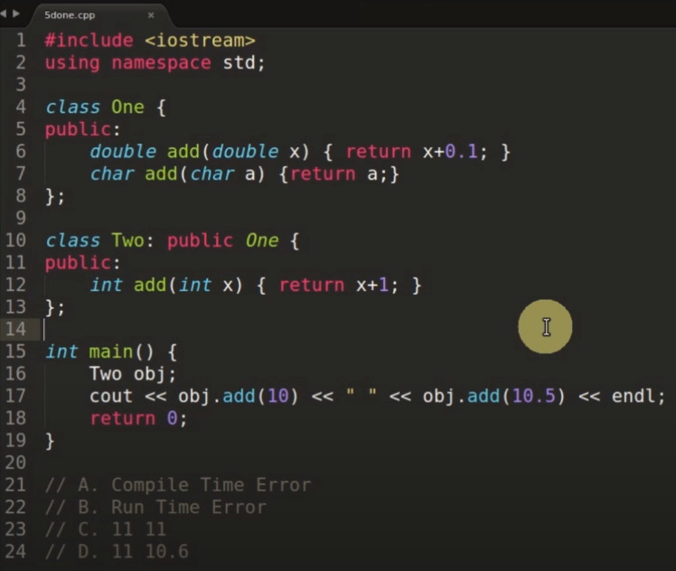

Answer: C

# C++ MCQ #2

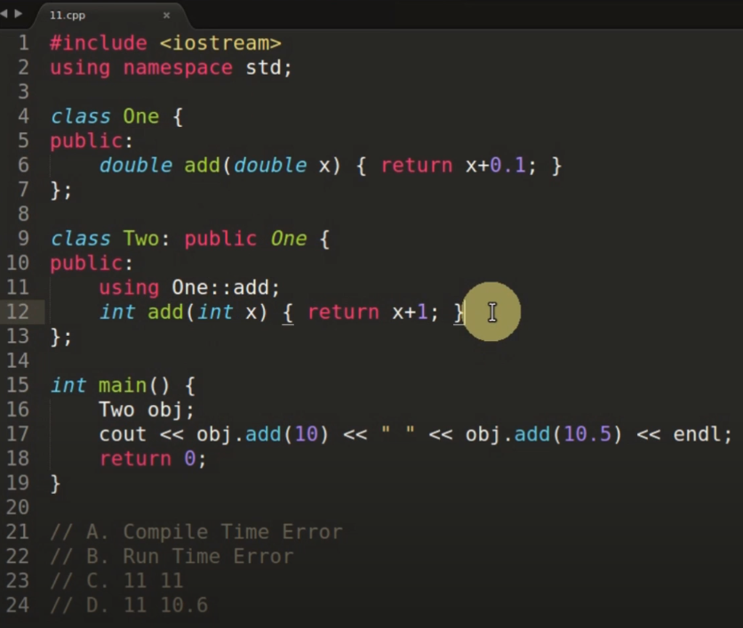

Answer: D

# C++ MCQ #3

Answer: D

Default constructor and parameter constructor are private.

# C++ MCQ #4

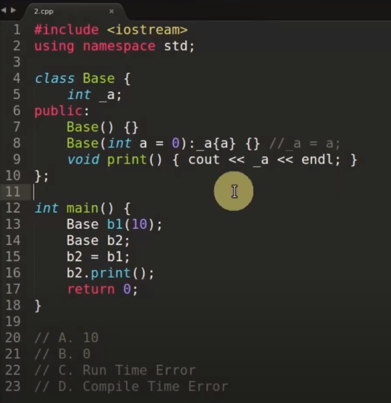

Answer: D *

error: call of overloaded 'Base() is ambiguous' at "Base b2;"

2 default constructors.

# C++ MCQ #5

Answer: D *

Base::Base(int) cannot be overloaded.

# C++ MCQ #6

Answer: A

Constructor Delegation

# C++ MCQ #7

Answer: A

# C++ MCQ #8

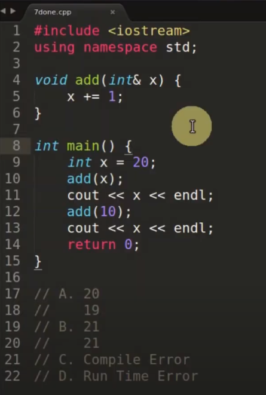

Answer: C

int& x is a lvalue, but 10 is a constant as rvalue.

# C++ MCQ #9

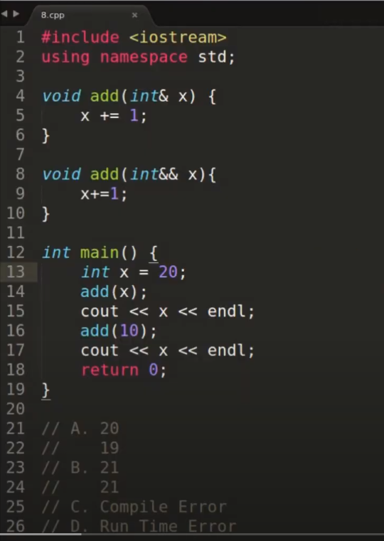

Answer:  B

int&& x is a rvalue reference.

# C++ MCQ #10

Answer: B

# C++ MCQ #11

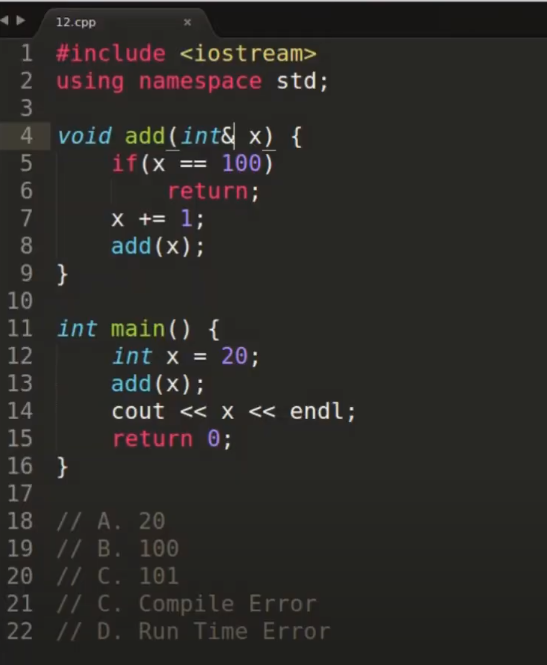

Answer: B *

The parameter is reference. If you remove &, the result will be 20.

# C++ MCQ #12

Answer: A

# C++ MCQ #13

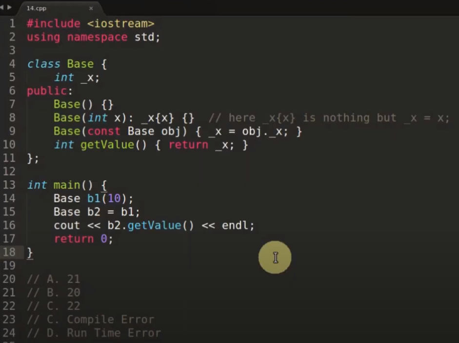

Answer: C

Copy constructor must use reference as parameter.

# C++ MCQ #14

Answer:  C, Compile Error

Overloading of << and >> must declared as friend function.

# C++ MCQ #15

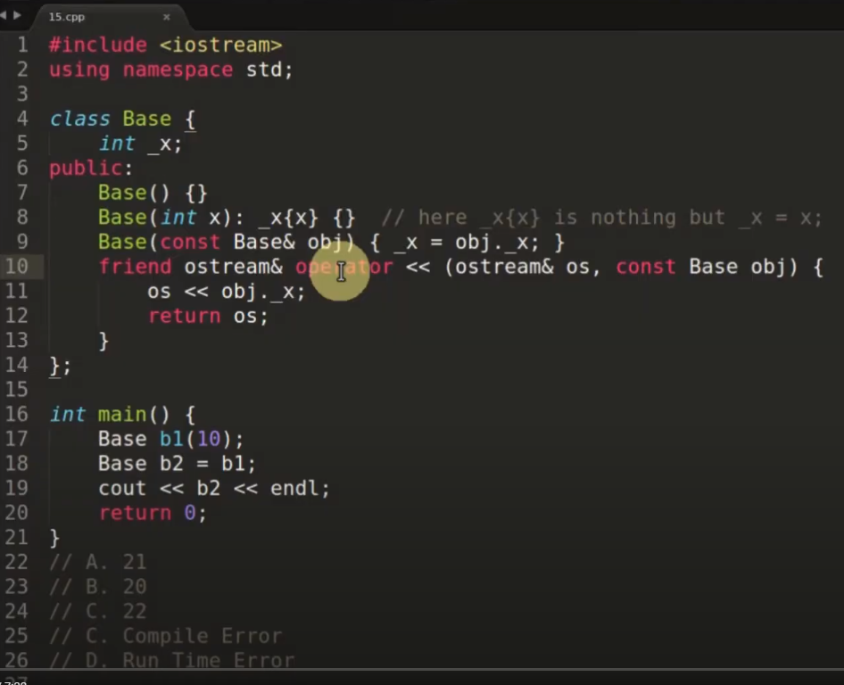

Answer: 10

# C++ MCQ #16

Answer: D

We should use initializer list `Base(x)` to initialize _x of base class.

# C++ MCQ #17

Answer: D *

error: no matching function for call to Child::Child(). 

Need to add default constructor for Base and Child class.

Note: If you have any other constructors (ex: parameter constructor), then you should also have default constructor.

# C++ MCQ #18

Answer: A

# C++ MCQ #19

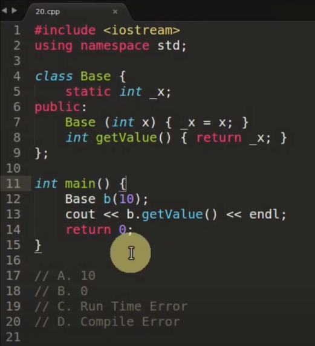

Answer: D

static data member must be initialized.

# C++ MCQ #20

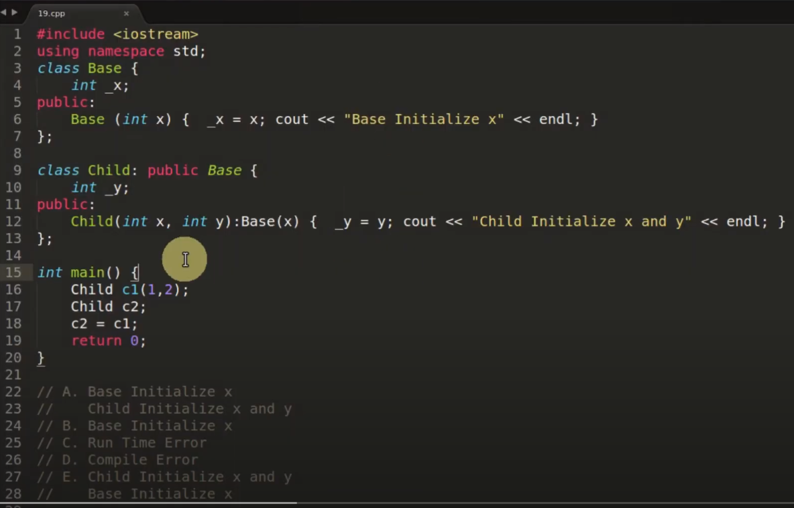

Answer: D *

error: no matching function for call to Child::Child(). 

Need to add default constructor for Base and Child class.

Note: If you have any other constructors (ex: parameter constructor), then you should also have default constructor.

# C++ MCQ #21

Answer: A

The size of empty class / struct is 1 in C++.

# C++ MCQ #22

Answer: B

If Base class has "char c;", the result will be 1 and 8 (struct padding)

# C++ MCQ #23

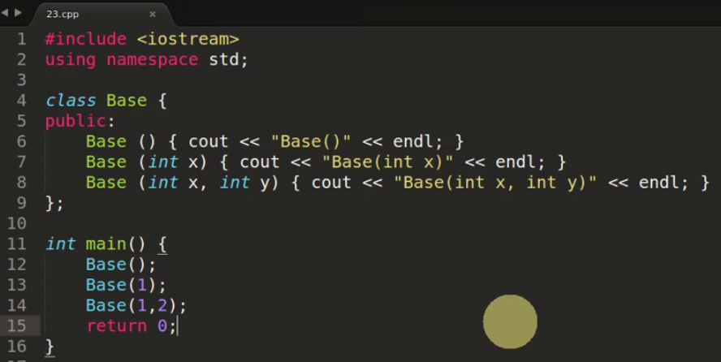

Answer: A

# C++ MCQ #24

Answer: A

If you create a temporary object, the constructor and destructor are called at same time.

# C++ MCQ #25

Answer: B

# C++ MCQ #26

Answer: A

# C++ MCQ #27

Answer: D

friend function has only access of Derived class and public and protected member of Base class, not private member of Base class. We could use protected keyword to access int b in the friend function.

# C++ MCQ #28

Answer: D

You cannot initialize a const member inside the constructor. You could use the initializer list.

# C++ MCQ #29

Answer: B

# C++ MCQ #30

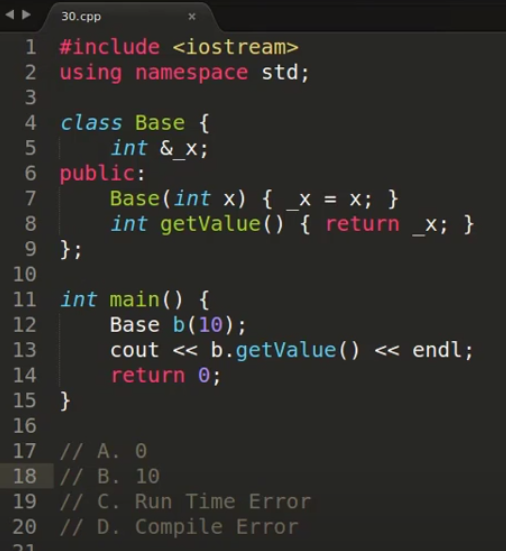

Answer: D

You cannot initialize a reference member inside the constructor. You could use the initializer list.

# C++ MCQ #31

Answer: B

# C++ MCQ #32

Answer: D

Class Bingo has no access of the private member of class Base.

# C++ MCQ #33

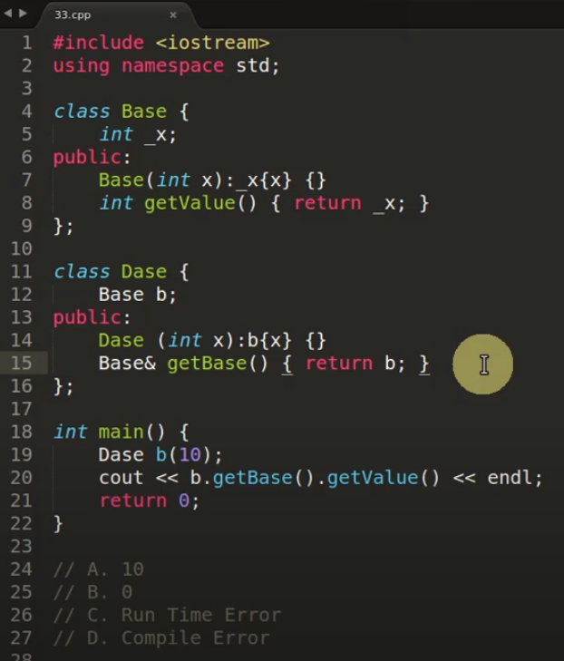

Answer: A

The initializer list call the Base constructor.

# C++ MCQ #34

Answer: Undefined value

Conflict at "x = x".

# C++ MCQ #35

Answer: A

# C++ MCQ #36

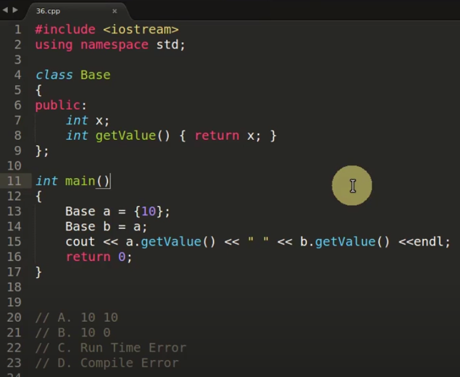

Answer: A

Same as initialization in C style struct

# C++ MCQ #37

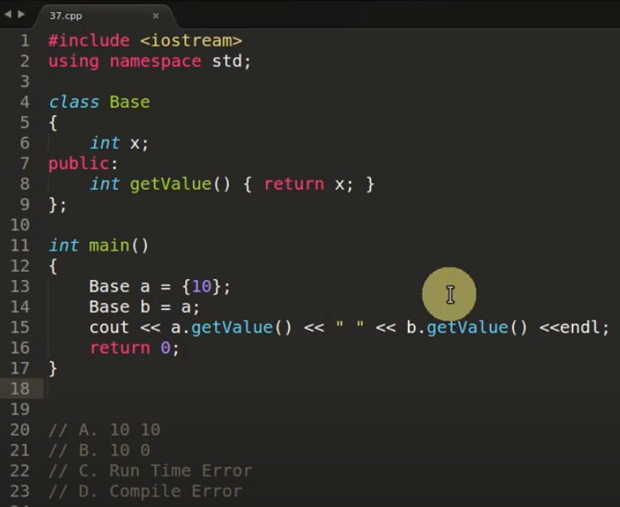

Answer: D

"x" is a private data member. This initializer list is only allowed to initialize public data member.

# C++ MCQ #38

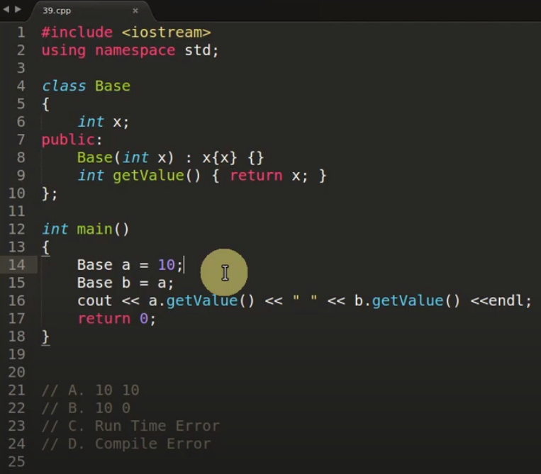

Answer: A

Same as Base a = {10};

# C++ MCQ #39

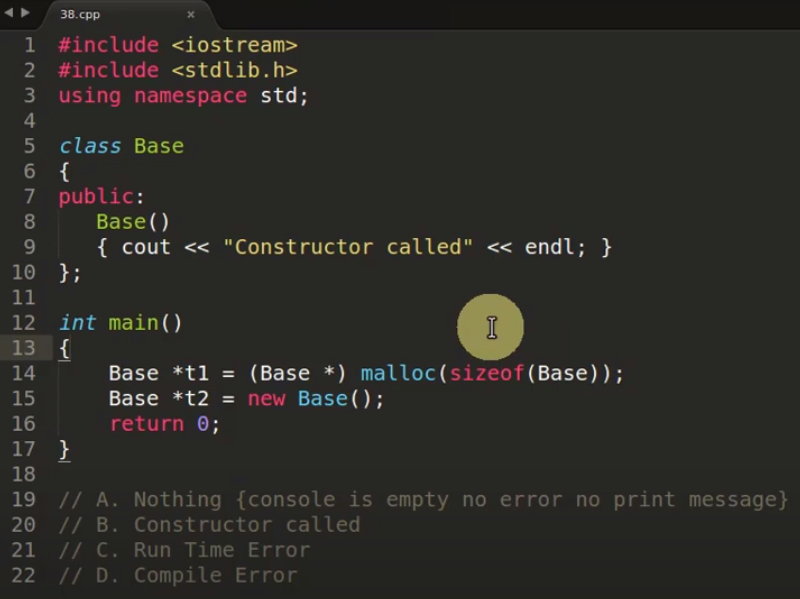

Answer: B

Only one "Constructor called". malloc doesn't call the constructor.

# C++ MCQ #40

Answer: B

Global variables are always constructed before main function.

# C++ MCQ #41

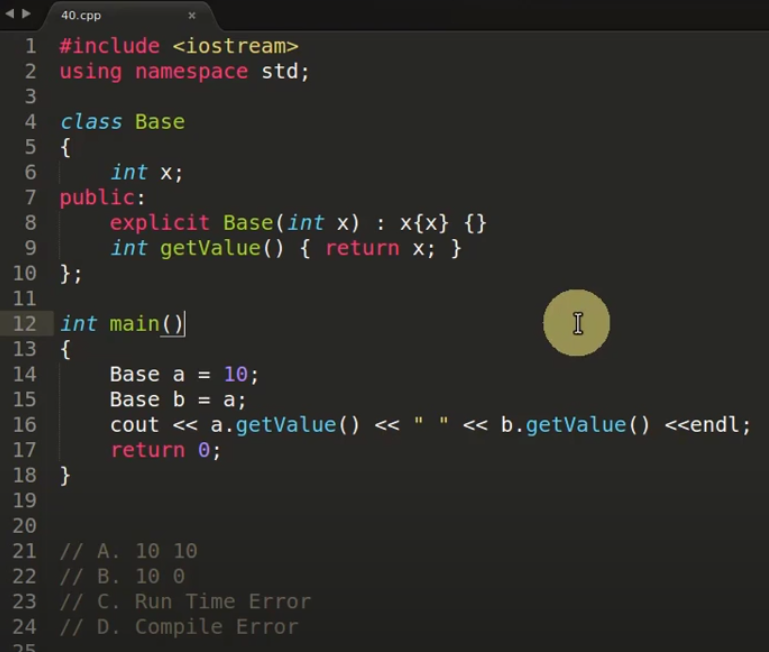

Answer: D

Parameter constructor is declared as explicit. Implicit conversion from int to Base is not allowed.

# C++ MCQ #42

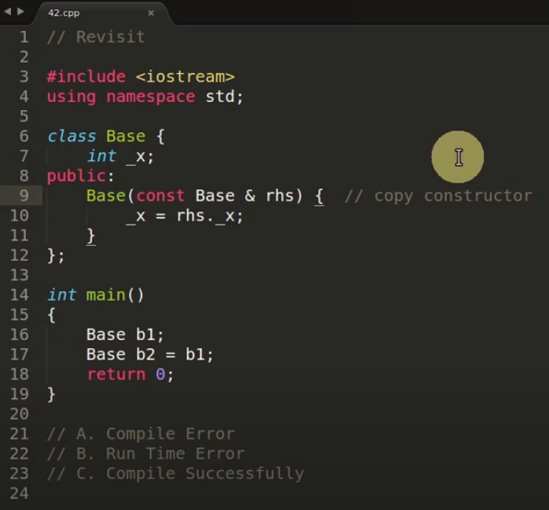

Answer: A *

Default constructor is missing.

# C++ MCQ #43

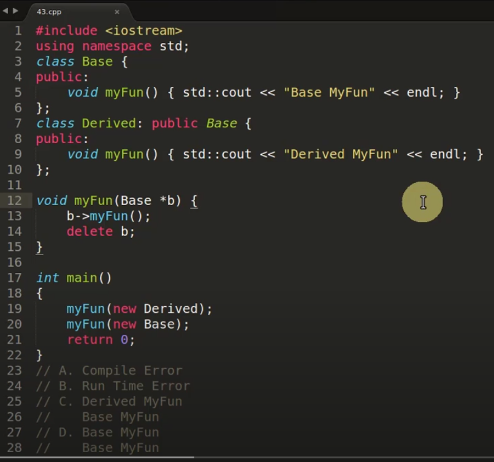

Answer: D

There is no polymorphic behavior (dynamic binding) here.

# C++ MCQ #44

Answer: C

Dynamic binding.

# C++ MCQ #45

Answer: C

# C++ MCQ #46

Answer: B *

Segmentation fault (core dumped). Recursion at Base b(x, y).

# C++ MCQ #47

Answer: C

# C++ MCQ #48

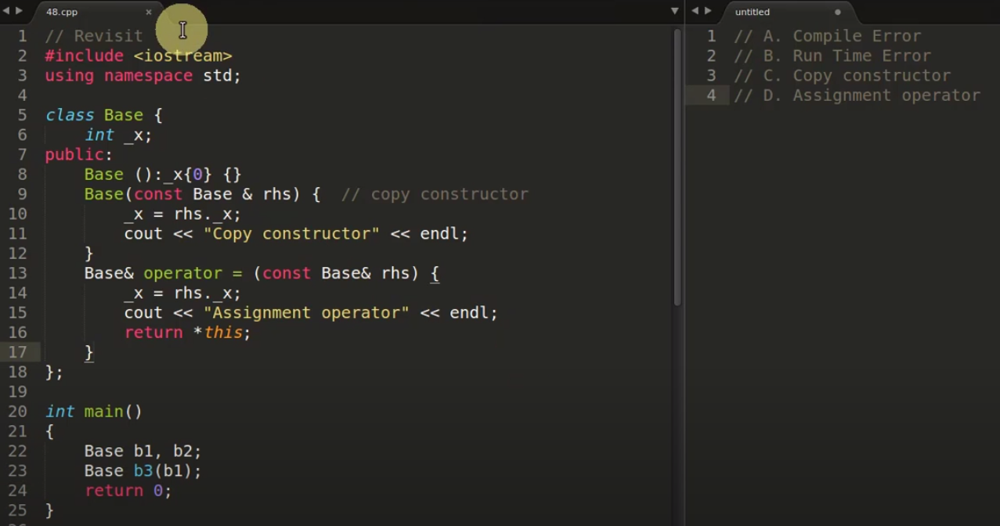

Answer: C

# C++ MCQ #49

Answer: A

const data members are not initialized.

# C++ MCQ #50

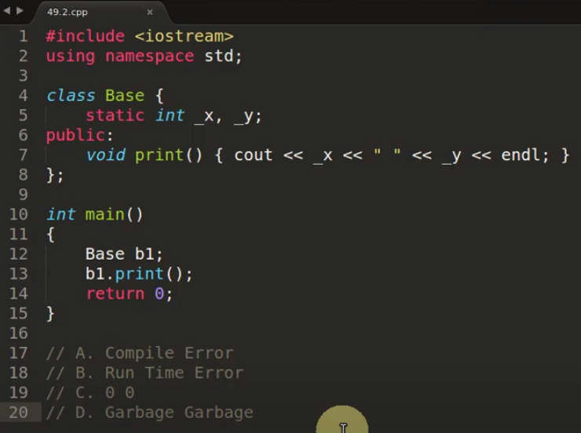

Answer: A

static data members are not defined, only declared.

# C++ MCQ #51

Answer: C

Initialization order: _x, _y

# C++ MCQ #52

Answer: D

# C++ MCQ #53

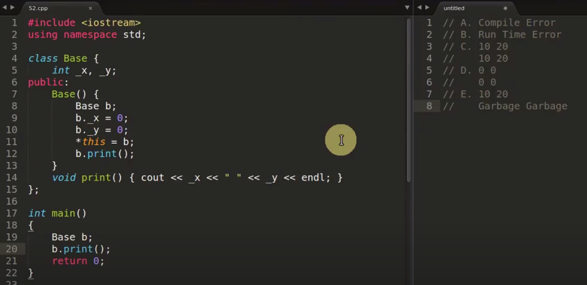

Answer: B *

Segmentation fault (core dumped). Recursion at Base b in default constructor.

# C++ MCQ #54

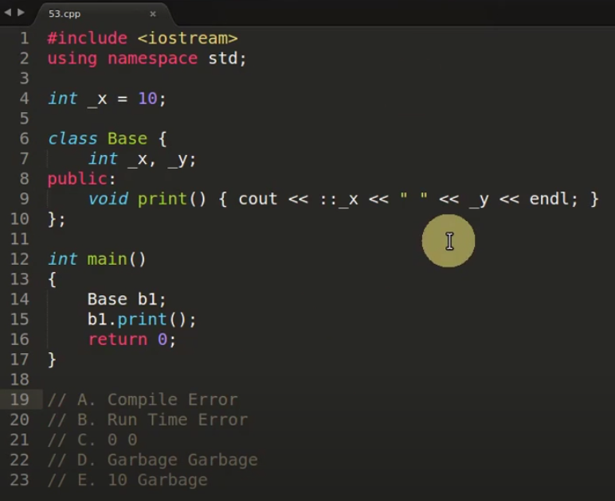

Answer: E

# C++ MCQ #55

Answer: A *

"::_x" has not been declared at line 13, suggested alternative: "myspace::__x"

# C++ MCQ #56

Answer: A *

"namespace" definition is not allowed here at line 8, you cannot have a namespace in local scope, it must in global scope.

# C++ MCQ #57

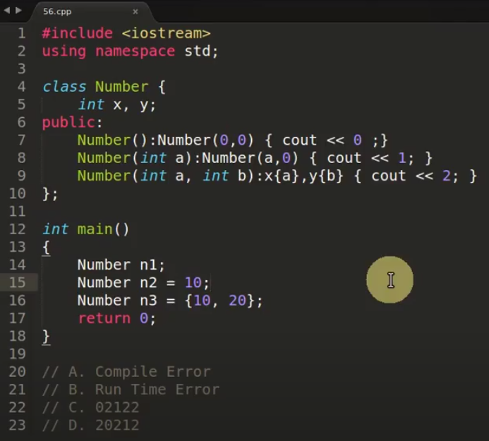

Answer: D *

# C++ MCQ #58

Answer: A

error: int BaseNumber::_x is private within this context.

# C++ MCQ #59

Answer: C

# C++ MCQ #60

Answer: C *

The public default constructor can call the private parameter constructor. You can always call private method from public method.

Note: `Base b1(10);` is not allowed.

# C++ MCQ #61

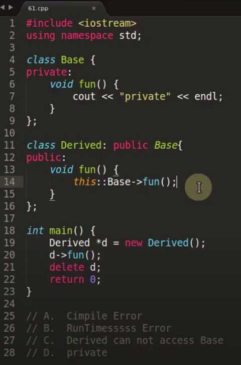

Answer: A *

Syntax error at line 14.

# C++ MCQ #62

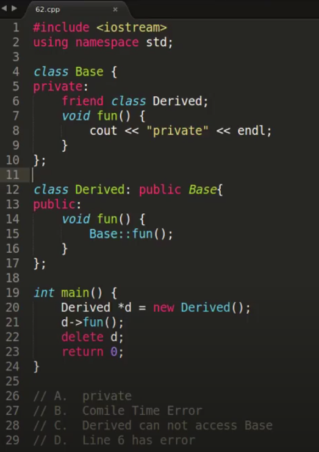

Answer: A *

# C++ MCQ #63

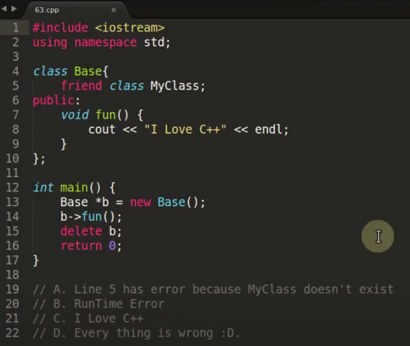

Answer: C *

It works even though there is not definition of MyClass.

# C++ MCQ #64

Answer: A *

error: expected ';' after class definition.

# C++ MCQ #65

Answer: C

virtual destructor is allowed.

# C++ MCQ #66

Answer: A *

constructors cannot be declared as "virtual".

# C++ MCQ #67

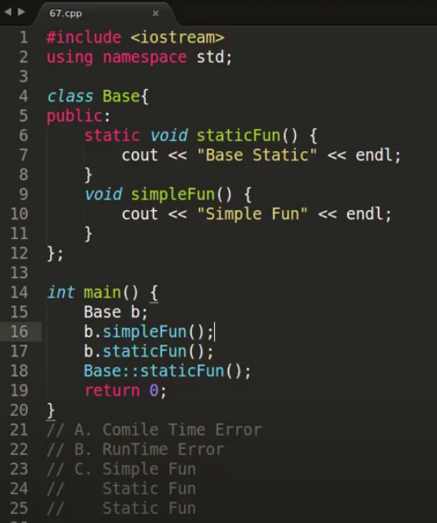

Answer: C

# C++ MCQ #68

Answer: A *

error: cannot call member function '`void Base::simpleFun()` without object.

# C++ MCQ #69

Answer: A

# C++ MCQ #70

Answer: D *

There is no dynamic binding.

# C++ MCQ #71

Answer: C

Dynamic binding

# C++ MCQ #72

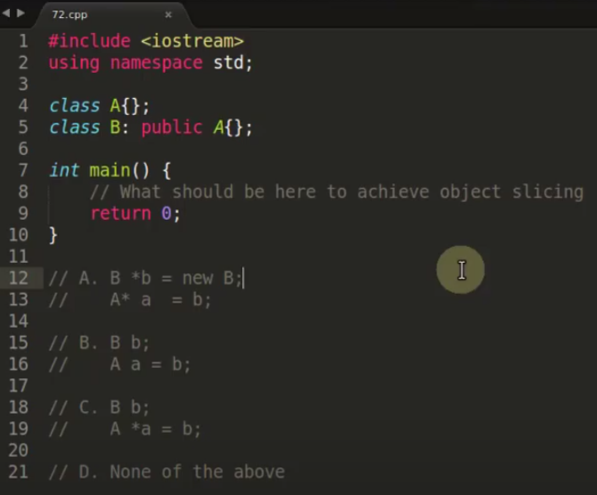

Answer: B

# C++ MCQ #73

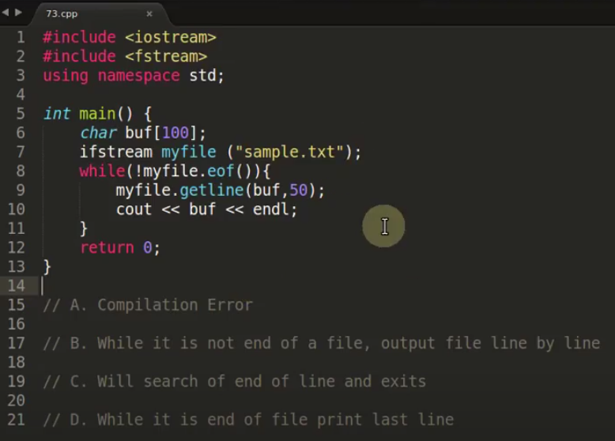

Answer: B *

eof: end of file.

# C++ MCQ #74

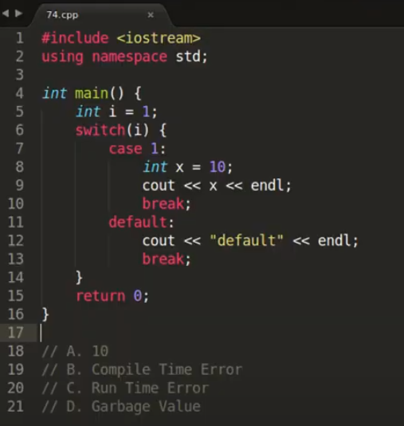

Answer: B *

error: jump to case label, cross initialization of `int x`. 

You could add `{}` in `case 1:`.

# C++ MCQ #75

Answer: A *

# C++ MCQ #76

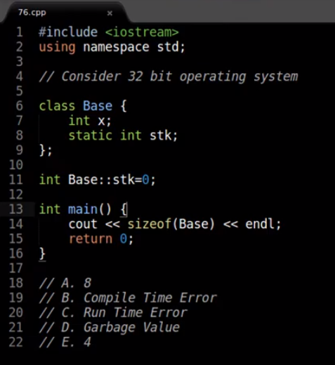

Answer: E

# C++ MCQ #77

Answer: C *

Out of the fun scope, the local variable will be destroyed.

# C++ MCQ #78

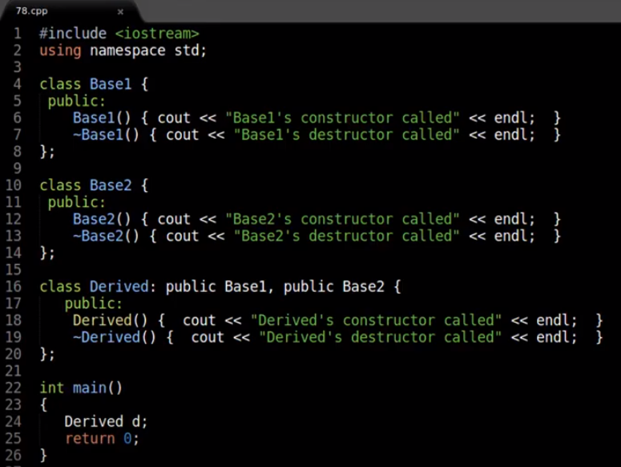

Answer: 

~~~~
Base1's constructor called
Base2's constructor called
Derived's constructor called
Derived's destructor called
Base2's destructor called
Base1's destructor called
~~~~

# C++ MCQ #79

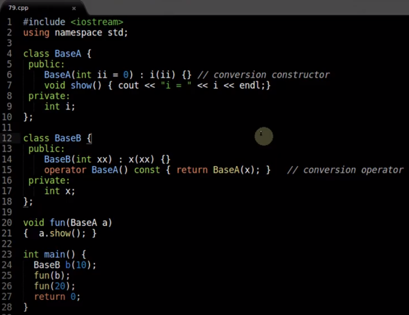

Answer: *

~~~~
i = 10
i = 20
~~~~

Note:

* conversion constructor: only 1 parameter
* conversion operator: no return type, used to initialize one object of a class to one object of another object.

# C++ MCQ #80

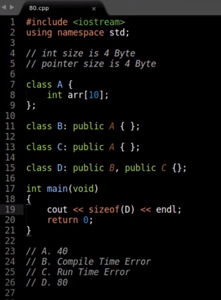

Answer: 80

sizeof(A) = 40, sizeof(B) = 40, sizeof(C) = 40

# C++ MCQ #81

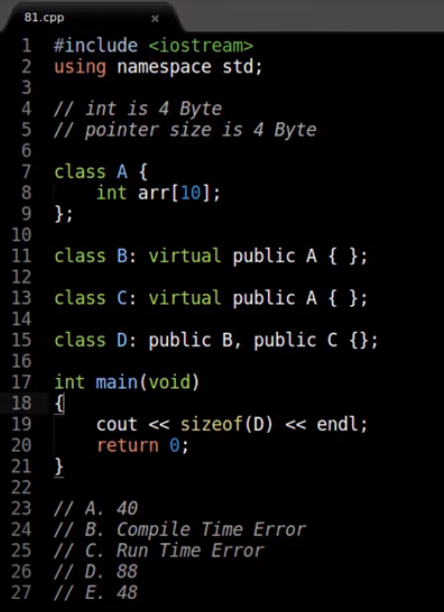

Answer: E *

40 + 4 (vptr) + 4 (vptr) = 48

sizeof(A) = 40, sizeof(B) = 44, sizeof(C) = 44

# C++ MCQ #82

Answer: It will compile.

It works even though the definition of friend function doesn't exist.

# C++ MCQ #83

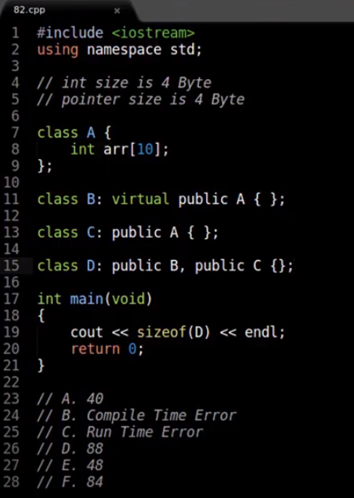

Answer: F *

40 + 4 (vptr) + 40 = 84

sizeof(A) = 40, sizeof(B) = 44, sizeof(C) = 40

# C++ MCQ #84

Answer: E

# C++ MCQ #85

Answer: A *

# C++ MCQ #86

Answer: A *

# C++ MCQ #87

Answer: E

If `Base* t1, t2;`, the constructor of `t2`will be called.

# C++ MCQ #88

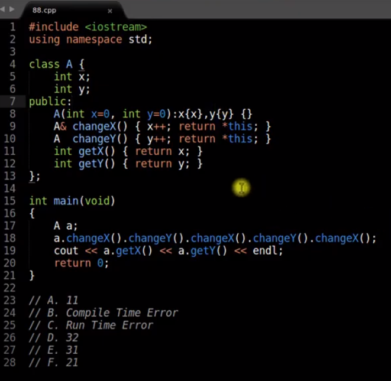

Answer: A *

After `a.changeX().changeY()`, the following operation works on a temporary object, not `a`.

# C++ MCQ #88

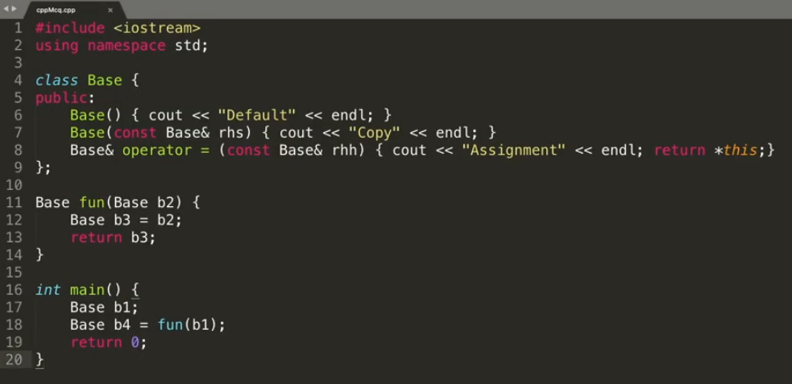

Answer: *

~~~~
Default
Copy
Copy
//copy
~~~~

Note: Return Value Optimization

# C++ MCQ #89

Answer: B

The const function is not able to change the data member.

# C++ MCQ #90

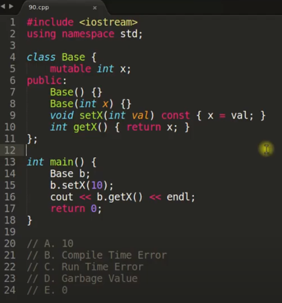

Answer: A

x is mutable which can be changed.

# C++ MCQ #91

Answer: B *

A const object cannot call a non const function. You could use `int getValue() const { return _x; }`.

# C++ MCQ #92

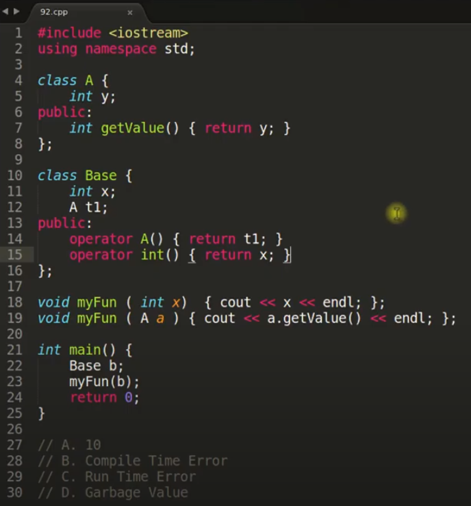

Answer: B *

error: call of overloaded `myFun(Base&)`is ambiguous.

# C++ MCQ #93

Answer: B *

Error at line 19, `x` is a private member of `Base`. You could make Test class as friend of Base class.

# C++ MCQ #93

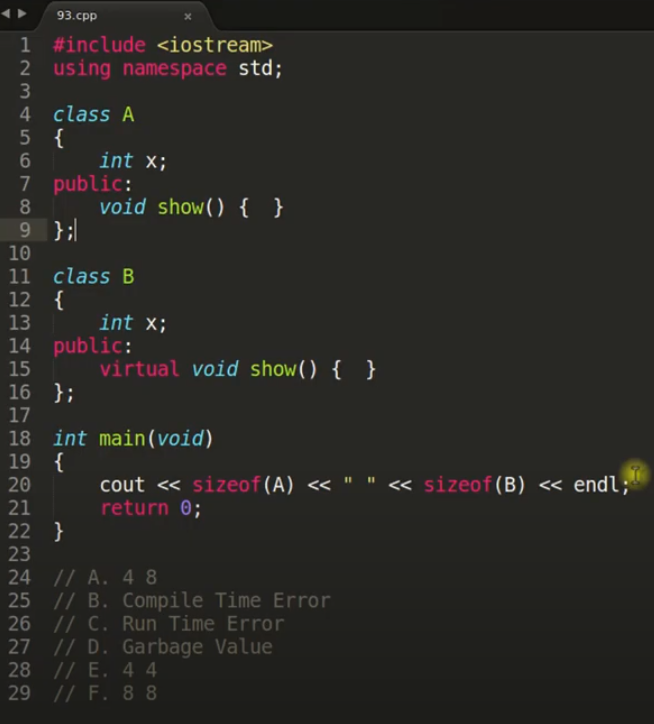

Answer: A *

A: 4

B: 4 + 4 (vptr) = 8

# C++ MCQ #94

Answer: B *

error: `int A::x` is a static member, it can only be initialized at its definition.

error: `this`is unavailable for static member functions.

# C++ MCQ #95

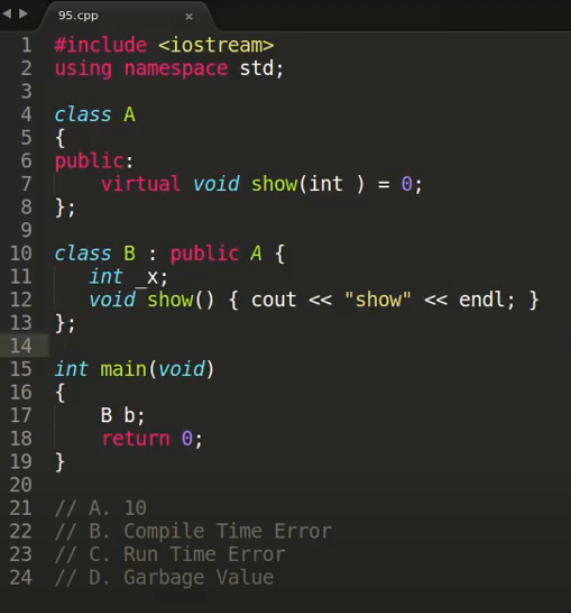

Answer: B *

error: cannot declare variable `b` to be of abstract type `B`. 

You cannot create a object of an abstract class.

# C++ MCQ #96

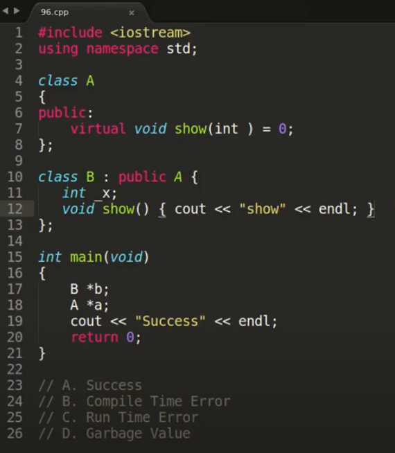

Answer: A

You cannot create a object of an abstract class, but you create a pointer of an abstract class.

# C++ MCQ #97

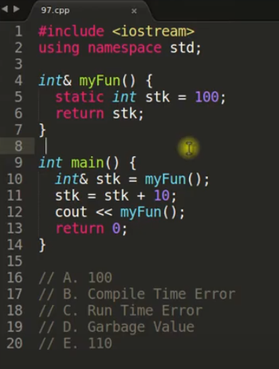

Answer: E *

# C++ MCQ #98

Answer: B *

Inner class has only private members.

# C++ MCQ #99

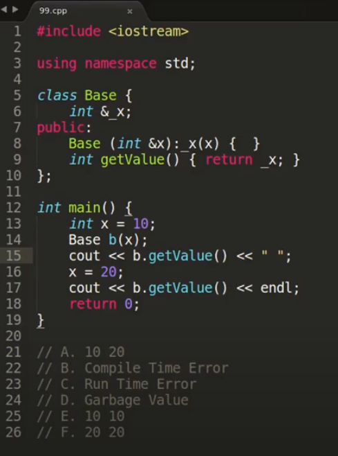

Answer: A *

The data member and constructor parameter are both reference.

# C++ MCQ #100

Answer: A *

`Base b2();`is a function declaration here. It is different from `Base b2;`

# C++ MCQ #101

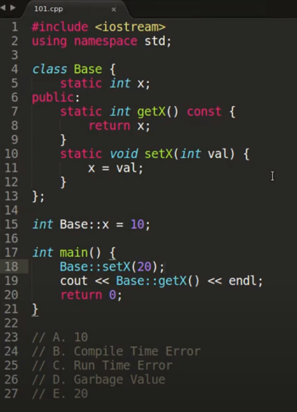

Answer: B *

static member function cannot access to non static data member. const is used for non static member function.

# C++ MCQ #102

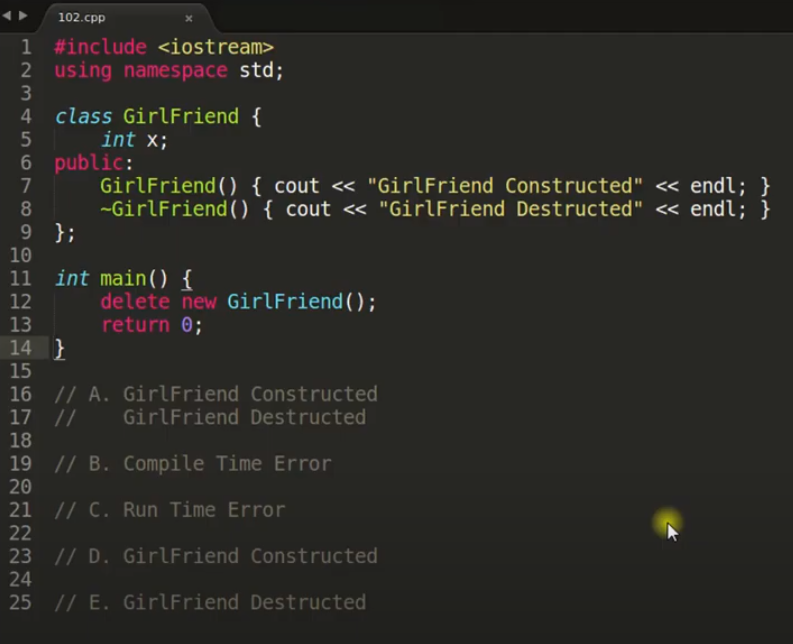

Answer: A *

`new FirlFriend()` will create a temporary object. Constructor and destructor happen at same line.

# C++ MCQ #103

Answer: D *

Variable name and class name can be equal.

# C++ MCQ #104

Answer: B *

It is dangerous to define a class name as "main". We could write it like `class main m(10);`, this class keyword tells to the compiler that this "main" is class name, not function name.

# C++ MCQ #105

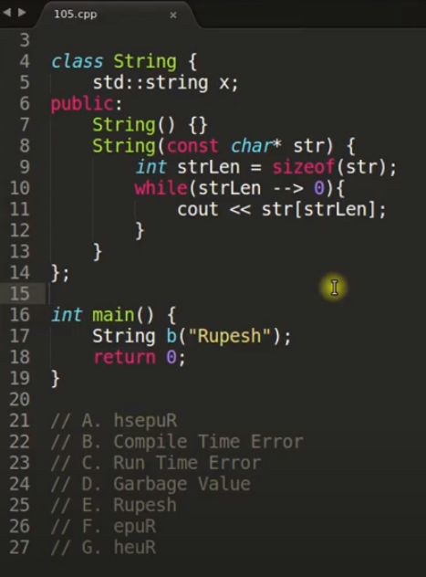

Answer: F *

`sizeof(str)` is the sizeof a pointer which is 4 (32-bit machine) or 8 (64-bit machine).

# C++ MCQ #106

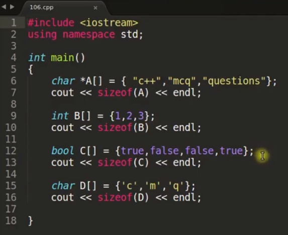

Answer: 

12, 12, 4, 3

# C++ MCQ #107

# C++ MCQ #108

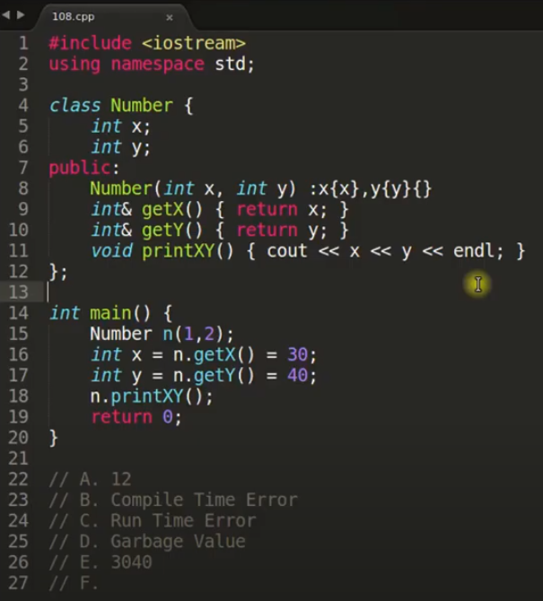

Answer: E *

# C++ MCQ #109

Answer: B *

error: `class X X::X` is inacessible with this context.

`X` is not an accessible base of `Z`.

We could use `class Y : protected X {}`.

# C++ MCQ #110

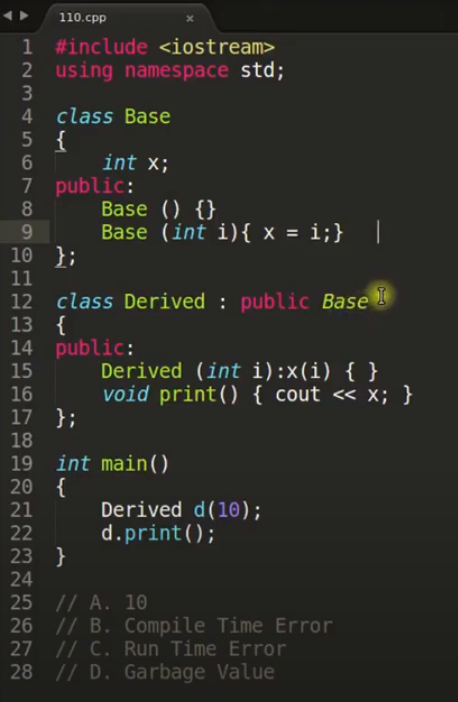

Answer: B *

`int Base::x` is private within this context.

class Derived does not have any field named `x `.

# C++ MCQ #111

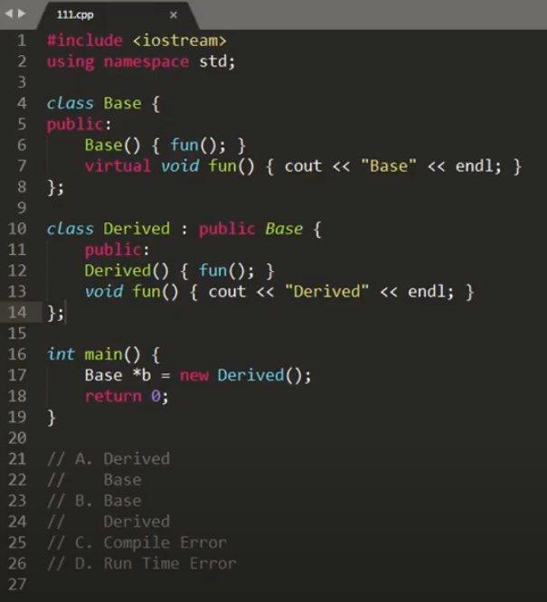

Answer: B

# C++ MCQ #112

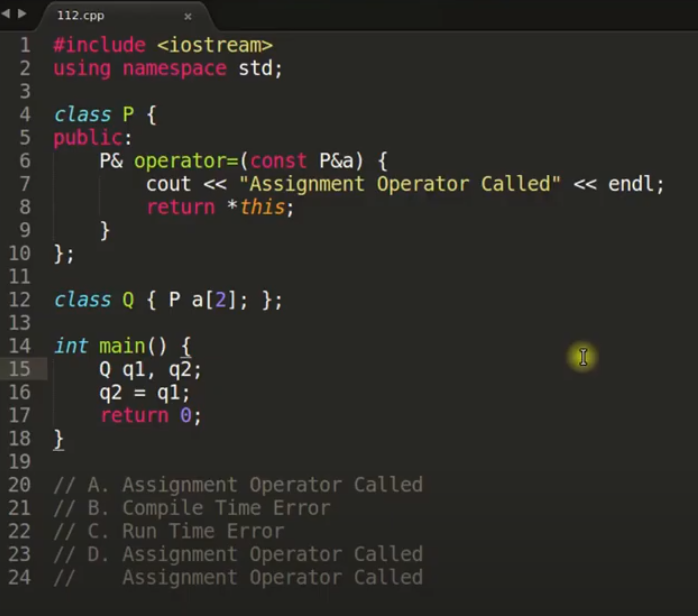

Answer: D *

class Q has a array member of size 2.

# C++ MCQ #113

Answer: D *

Self-assignment is checked.

# C++ MCQ #114

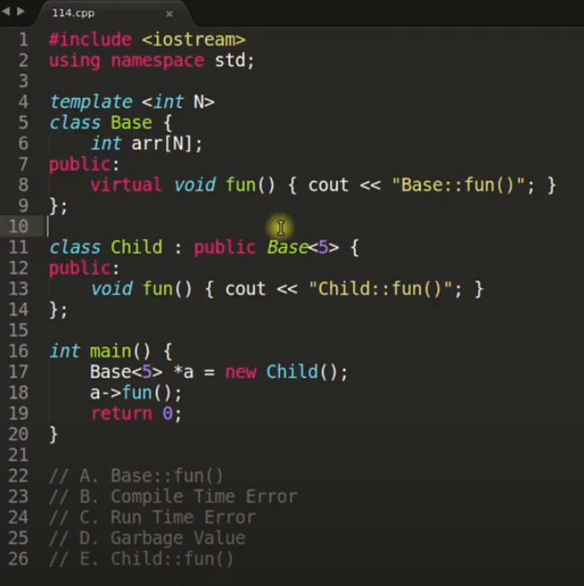

Answer: E

# C++ MCQ #115

Answer: B *

error: lvalue required as left operand of assignment.

# C++ MCQ #116

# C++ MCQ #117

# C++ MCQ #118

Answer: B *

error: class Base has no member named `getX`.

# C++ MCQ #119

Answer: B *

error: `Test::~Test()` is private within this context.

# C++ MCQ #120

# C++ MCQ #121

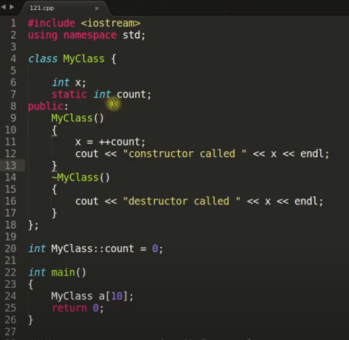

Answer: *

~~~~
constructor called 1
constructor called 2
constructor called 3
constructor called 4
constructor called 5
constructor called 6
constructor called 7
constructor called 8
constructor called 9
constructor called 10
destructor called 10
destructor called 9
destructor called 8
destructor called 7
destructor called 6
destructor called 5
destructor called 4
destructor called 3
destructor called 2
destructor called 1
~~~~

# C++ MCQ #122

# C++ MCQ #123

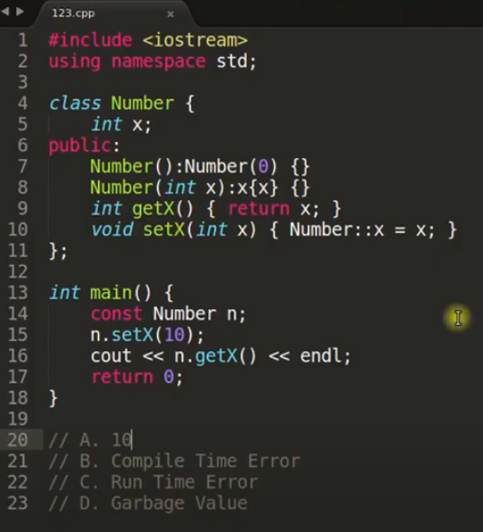

Answer: B

const object can only call the const member functions.

# C++ MCQ #124

Answer: A *

`++y` is not executed because `++x` is not 0.

# C++ MCQ #125

# C++ MCQ #126

# C++ MCQ #127

# C++ MCQ #128

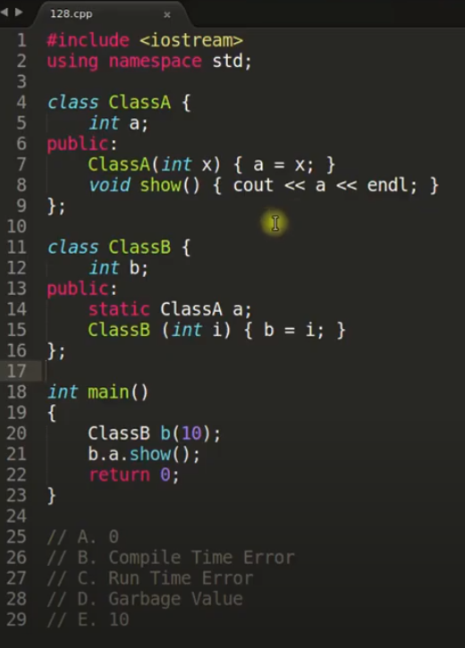

Answer: B *

There is no definition of static data member of classB.

Add `ClassA ClassB::a(10);`.

# C++ MCQ #129

Answer: *

~~~~
New Fun Called
Constructor called
Destructor called
Delete Fun Called
~~~~

# C++ MCQ #130

Answer: A

# C++ MCQ #131

# C++ MCQ #132

# C++ MCQ #133

# C++ MCQ #134

# C++ MCQ #135

Answer:  *

~~~~
P's constructor
P's constructor
P's Assignment Operator
Q's constructor
~~~~

# C++ MCQ #136

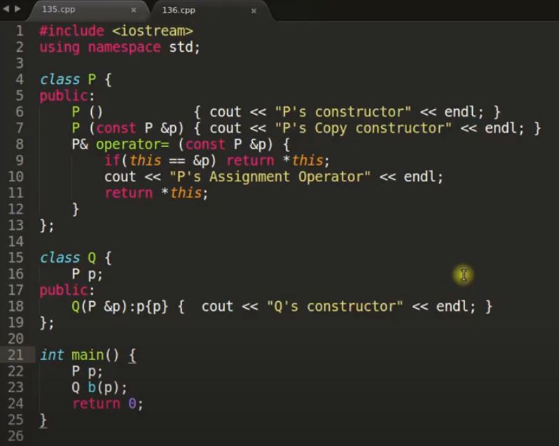

Answer: *

~~~~
P's constructor
P's Cope constructor
Q's constructor
~~~~

# C++ MCQ #137

# C++ MCQ #138

# C++ MCQ #139

# C++ MCQ #140

Answer: A *

We could use the scope operator to access the data member.

# C++ MCQ #141

# C++ MCQ #142

# C++ MCQ #143

# C++ MCQ #144

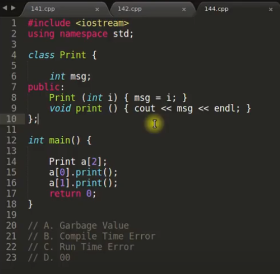

Answer: B *

We need to add default constructor.

`Print a[2];` will call the default constructor.

`Print a[2] = {1, 2};` will call the parameter constructor.

# C++ MCQ #145

# C++ MCQ #146

# C++ MCQ #147

# C++ MCQ #148

# C++ MCQ #149

# C++ MCQ #150

# C++ MCQ #151

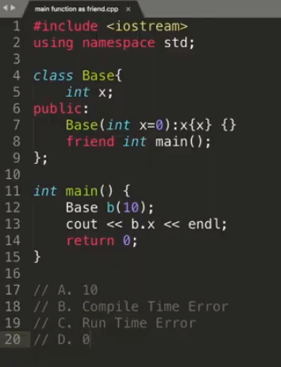

Answer: A *

We could make "main" function as friend, but it is not a good practice.

# C++ MCQ #152

# C++ MCQ #153

# C++ MCQ #154

# C++ MCQ #155

# C++ MCQ #156

# C++ MCQ #157

# C++ MCQ #158

# C++ MCQ #159

# C++ MCQ #160

# C++ MCQ #

# C++ MCQ #

# C++ MCQ #

# C++ MCQ #

# C++ MCQ #

# C++ MCQ #

