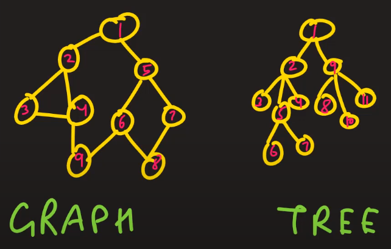

[Data Structure Introduction](https://www.youtube.com/playlist?list=PLk6CEY9XxSIBG2Gv6-d1WE3Uxqx94o5B2)

# Data Structure Introduction

* Question:

  What is Data Structure?

* Answer:

  Data Structure is an art of storing the data (structuring data)

  * Primitive Data Types:
    * int
    * float
    * char
    * bool
    * pointer
  * Non Primitive Data Types:
    * Linear:
      * Array
      * Linked List
      * Stack
      * Queue
    * Non Linear:
      * Tree
      * Graph

# Linked List Introduction And Usage

* Question:

  What is linked list? and how to use it?

* Answer:

  1. This is a sequential data structure and is used to store data

  2. Linked list is specia data structure in which data elements are linked to one another

  3. The pictorial look of a linked list is:

     

  

  Linked list types:

  1. Singly Linked List 
  2. Doubly Linked List 
  3. Circular Linked List 
  4. Doubly Circular Linked List
  5. XOR Linked List

  

  Operation:

  * INsertion
  * Deletion
  * Traversing
  * Update

  

  Pro:

  1. Linked list is dynamic data structure, it can grow and shrink at run time
  2. It is used to efficiently utilize memory
  3. Insertion and Deletion is very easy at any position

  

  Cons

  1. More memory is required if linked list is too big
  2. Accessing elements is time consuming because traverse takes time

  

  Example:

  ~~~~c++
  struct LinkedList
  {
  	int data;
  	LinkedList* next;
  };
  
  void printLinkedList(LinkedList* root) {
  	while (root) {
  		cout << root->data << "->";
  		root = root->next;
  	}
  	cout << "finished";
  }
  
  int main()
  {
  	LinkedList* root, * second, * third;
  
  	root = new LinkedList;	// dynammic memory allocation
  	second = new LinkedList;
  	third = new LinkedList;
  
  	root->data = 10;
  	root->next = second;
  
  	second->data = 20;
  	second->next = third;
  
  	third->data = 30;
  	third->next = nullptr;
  
  	printLinkedList(root);
  
  	return 0;
  }
  ~~~~

  

  Use of Linked List:

  1. Implementation of stacks and queues
  2. Graph & Tree uses adjacency list representation which uses Linked Lis to store adjacent vertices
  3. Dynamic amemory allocation (OS uses Linked Lis to keep the track)
  4. OS uses Linked Lis to loop through all process
  5. Next and Previous functionality can be implemented using Linked Lis
  6. Many more...

# XOR Linked List

* Question:

  What is XOR Linked List? and how to use it?

* Answer:

  1. This is singly linked list but acts like doubly linked list
  2. We can go forward and reverse in XOR Linked List
  3. It is memory efficient doubly linked list
  4. Instead of storing address of next node, it stores XOR of previous and next address

  ~~~~
  General Linked List:
  	A	->	B	->	C	->	D	->	NULL
  	
  XOR Linked List
  Data	   A		   B		   C		   D
  Next	0 xor B		A xor C		B xor D		C xor 0
  ~~~~

  

  ~~~~
  prev = (address of next) ^ (curr->npx)
  
  next = (address of previous) ^ (curr->npx)
  ~~~~

  

  Pros:

  1. It takes less memory than doubly linked list but acts like doubly linked list

  

  Cons:

  1. Debugging becomes hard because we don't store actual address
  2. Code complexity
  3. Garbage Collection is difficult because no proper address is stored

# Circular Linked List

* Question:

  What is Circular Linked List? and how to use it?

* Answer:

  1. Ciecular Linked List is modified version of Singly Linked List
  2. In Circular Linked List, last node points to first node

  

  Insertion:

  1. Insertion in an empty list
  2. Insertion at the begining of the list
  3. Insertion at the end of the list
  4. Insertion between the nodes

  

  Advantages:

  1. CPU scheculing
  2. Queue can be implemented using one pointer (last node). Because next node of the last node is always the first node, so we don't have to implement first pointer at all
  3. Applications where you don't want to reset once you reach to last node

  

  Example:

  ~~~~c++
  struct CircularLinkedList
  {
  	int data;
  	CircularLinkedList* next;
  };
  
  CircularLinkedList* addToEmpty(CircularLinkedList* last, int data) {
  	if (last != nullptr) return last;
  
  	CircularLinkedList* temp = new CircularLinkedList;
  
  	temp->data = data;
  	last = temp;
  
  	last->next = last;
  
  	return last;
  }
  
  CircularLinkedList* addToEnd(CircularLinkedList* last, int data) {
  	if (last == nullptr)
  		return addToEmpty(last, data);
  
  	CircularLinkedList* temp = new CircularLinkedList;
  
  	temp->data = data;
  	temp->next = last->next;
  	last->next = temp;
  	last = temp;
  
  	return last;
  }
  
  void traverse(CircularLinkedList* first) {
  	CircularLinkedList* temp = first;
  	if (first == nullptr) return;
  
  	do {
  		cout << temp->data << " ";
  		temp = temp->next;
  	} while (temp != first);
  
  }
  
  int main()
  {
  	CircularLinkedList* last = nullptr;
  
  	last = addToEmpty(last, 10);
  	last = addToEnd(last, 20);
  	last = addToEnd(last, 30);
  
  	traverse(last->next);
  
  	return 0;
  }
  ~~~~

# Circular Doubly Linked List | Data Structure

* Question:

  What is Circular Doubly Linked List? and how to use it?

* Answer:

  It is combination of Circular Linked List and Doubly Linked List. 

  

  ADVANTAGE: 

  1. List can be traversed from both the directions i.e. from head to tail or from tail to head. 
  2. Jumping from head to tail or from tail to head is done in constant time O(1). 
  3. Circular Doubly Linked Lists are used for implementation of advanced data structures like Fibonacci Heap. 

  

  DISADVANTAGE: 

  1. It takes extra memory in each node to accommodate previous pointer. 
  2. Lots of pointers involved while implementing or doing operations on a list.

  

  Example:

  ~~~~c++
  struct CircularDoublyLinkedList
  {
  	int data;
  	CircularDoublyLinkedList* next;
  	CircularDoublyLinkedList* prev;
  };
  ~~~~

# Tree Introduction

* Question:

  What is Tree Data Structure?

* Answer:

  1. Tree is a hierarchical data structure which stores the information in the form of hierarchy.
  2. Tree is a non-linear data structure compared to array, linked list, stack and queue.
  3. Tree represents the nodes connected by edges.
  4. Tree is one of the most powerful and advanced data structures.

  

  Tree Terminologies:

  * Root
  * Parent Node
  * Child Node
  * Siblings
  * Path
  * Height of Node: the longest path from the current node to the root node
  * Height of Tree: the longest path from bottom or the leaf node to the root node
  * Depth of Node: the longest path from the current node to bottom or the leaf node
  * Depth of Tree: the longest path from the root node to bottom or the leaf node 
  * Degree of Node: the number of its children
  * Edge: connection between two nodes

  

  Types of Tree:

  * Binary Tree
  * Binary Search Tree
  * AVL Tree
  * Red-Black Tree
  * Splay Tree
  * N-ary Tree
  * Tri Structure, 
  * Suffix Tree
  * Huffman Tree
  * Heap Structure
  * B Tree
  * B+ Tree
  * R Tree
  * Counted-B Tree
  * K-D Tree
  * Decision Tree
  * Markel Tree
  * Fenwick Tree
  * Range Tree

  

  Advantages of Tree Data Structure:

  1. Tree reflects structural relationships in the data.
  2. It is used to represent hierarchies.
  3. It provides an efficient insertion and searching operations.
  4. Trees are flexible. It allows to move subtrees around with minimum effort.

# Binary Tree

* Question:

  What is Binary Tree? and how to use it?

* Answer:

  1. A tree whose nodes can have at most two children is called binary tree.
  2. As there can only be two children of a node we call them left and right child.

  

  Types of Binary Tree:

  1. Full Binary Tree / Strictly Binary Tree

     Every node must have two children, except the leaf nodes.

     

  2. Incomplete Binary Tree / Almost Complete Binary Tree

     Every node must have two children's in all levels except last and second last level, and should be filled from left to right.

     

  3. Complete Binary Tree / Perfect Binary Tree

     Every node must have two children's in all the levels , except the leaf nodes, Each level there should have 2^L nodes where L is level and starts from 0 (root)

     

  4. Left Shewed Binary Tree

     Every node should have only left children.

     

  5. Right Shewed Binary Tree

     Every node should have only right children.

     

  

  Example:

  ~~~~c++
  struct BinaryTree
  {
  	int data;
  	BinaryTree* left, * right;
  	BinaryTree(int data) : data(data), left(nullptr), right(nullptr) {}
  };
  
  
  void print_dfs(BinaryTree* root) {
  	if (root == NULL)
  		return;
  
  	cout << root->data << " ";
  	print_dfs(root->left);
  	print_dfs(root->right);
  }
  
  
  int main()
  {
  	// Nodes construction
  	BinaryTree* root = new BinaryTree(1);
  	BinaryTree* left = new BinaryTree(2);
  	BinaryTree* right = new BinaryTree(3);
  	BinaryTree* left_left = new BinaryTree(4);
  	BinaryTree* left_right = new BinaryTree(5);
  	BinaryTree* right_left = new BinaryTree(6);
  	BinaryTree* right_right = new BinaryTree(7);
  
  	// Connecting nodes
  	root->left = left;
  	root->right = right;
  	left->left = left_left;
  	left->right = left_right;
  	right->left = right_left;
  	right->right = right_right;
  
  	// Printing Binary Tree
  	print_dfs(root); // 1 2 4 5 3 6 7
  
  	// Deleting nodes
  	delete root;
  	delete left;
  	delete right;
  	delete left_left;
  	delete left_right;
  	delete right_left;
  	delete right_right;
  
  	return 0;
  }
  ~~~~

# Binary Tree Array Representation

* Question:

  What is Binary Tree Array Representation?

* Answer:

  In this video we will learn about Binary Tree Array Representation. Because we can use linked list also to implement Binary Tree.

  NOTES:
  1. Binary tree can be stored in array efficiently.

  2. if parent is p and 

     * Array starts from 0 to n-1 then

       left child = 2p + 1

       right child = 2p + 2

     * Array starts from 1 to n then

       left child = 2p

       right child = 2p + 1

     ~~~~c++
     char tree[10];
     
     void root(char key) {
     	if (tree[1] != '\0')
     		cout << "Tree already had root" << endl;
     	else
     		tree[1] = key;
     }
     
     void set_left(char key, int parent) {
     	if (tree[parent] == '\0')
     		cout << "Can't set child at " << parent * 2 + 1 << " , no parent found" << endl;
     	else
     		tree[parent * 2] = key;
     }
     
     void set_right(char key, int parent) {
     	if (tree[parent] == '\0')
     		cout << "Can't set child at " << parent * 2 + 2 << " , no parent found" << endl;
     	else
     		tree[parent * 2 + 1] = key;
     }
     
     void print_tree() {
     	for (int i = 0; i < 10; ++i)
     	{
     		if (tree[i] != '\0')
     			cout << tree[i] << " ";
     		else
     			cout << "- ";
     	}
     }
     
     
     int main()
     {
     	// Array starting from 0 to n - 1
     	root('A');
     	set_left('B', 1);
     	set_right('C', 1);
     	set_left('D', 2);
     	set_right('E', 2);
     	set_right('F', 3);
     
     	print_tree(); // - A B C D E - F - -
     
     	return 0;
     }
     ~~~~

# DFS - Depth First Search

* Question:

  What is DFS?

* Answer:

  1. Depth-first search (DFS) is an algorithm (or technique) for traversing a tree/graph.
  2. DFS uses stack OR we can use recursive approach.

  

  Applications of DFS:

  1. To find minimum spanning tree and all pair shortest path tree.
  2. Detecting cycle in a graph
  3. Path finding
  4. Topological sorting
  5. To test graph is bipartite
  6. Find strongly connected component of a graph
  7. Maze related problems (find the shortest path)

  

  Example:

  

  ~~~~c++
  vector<vector<int>> vec;
  vector<bool> visited;
  
  void dfs_recursion(int s) {
  	visited[s] = true;
  	cout << s << " ";
  	for (int i = 0; i < vec[s].size(); ++i) {
  		if (visited[vec[s][i]] == false) {
  			dfs_recursion(vec[s][i]);
  		}
  	}
  }
  void dfs(const vector<vector<int>>& vec, int s) {
  	std::stack<int> stk;
  	stk.push(s);
  	visited[s] = true;
  
  	while (!stk.empty()) {
  		int node = stk.top();
  		stk.pop();
  		cout << node << " ";
  
  		for (int i = 0; i < vec[node].size(); ++i) {
  			if (!visited[vec[node][i]]) {
  				stk.push(vec[node][i]);
  				visited[vec[node][i]] = true;
  			}
  		}
  	}
  }
  
  //1. Push start node in stack and mark it visited
  //2. While stack is not empty
  //3. Pop out a node from stack and push all non-visited adjecent node of poped node in stack and mark them visited
  //4. Go to step 2
  
  
  void initialize() {
  	for (int i = 0; i < visited.size(); ++i) {
  		visited[i] = false;
  	}
  }
  
  int main()
  {
  	int nodes, edges, x, y;
  	cin >> nodes;
  	cin >> edges;
  
  	vec.resize(nodes + 1);
  	visited.resize(nodes + 1);
  
  	for (int i = 0; i < edges; ++i) {
  		cin >> x >> y;
  		vec[x].push_back(y);
  		vec[y].push_back(x);
  	}
  
  	initialize();
  	dfs_recursion(1); // 1 2 4 5 6 3
  
  	cout << endl;
  
  	initialize();
  	dfs(vec, 1); // 1 4 6 3 5 2
  
  	return 0;
  }
  
  //6 7
  //1 2
  //1 4
  //4 5
  //2 4
  //2 3
  //3 6
  //4 6
  ~~~~

# BFS - Breadth First Search

* Question:

  What is BFS?

* Answer:

  1. BFS (Breadth First Search) is one of the tree/graph traversal algorithm.
  2. When we travere tree or graph then order in which vertices are visited is very important.
  3. BFS traversal algorithm traverse level wise.
  4. BFS uses queue data structure in order to achieve level order traversal.
  5. Graph has cycle so we have to keep the track of visited nodes and we should not visit them again.
  6. Inorder to keep track of visited nodes we keep array of boolean where we initialize every element of array as false, meaning non-visited, and as we visit some node we make this array element value true.

  

  Some usage:

  1. Shortest Path and Minimum Spanning Tree for unweighted graph
  2. Social Networking Websites
  3. Broadcasting in Network
  4. Finding all nodes within one connected component

  

  Example:

  

  ~~~~c++
  vector<vector<int>> vec;
  vector<bool> visited;
  
  void bfs(int node) {
  	queue<int> que;
  	que.push(node);
  	visited[node] = true;
  
  	while (!que.empty()) {
  		node = que.front();
  		que.pop();
  		cout << node << " ";
  
  		for (int i = 0; i < vec[node].size(); ++i) {
  			if (!visited[vec[node][i]]) {
  				que.push(vec[node][i]);
  				visited[vec[node][i]] = true;
  			}
  		}
  	}
  }
  
  //1. Push start node in queue and mark it visited
  //2. While queue is not empty
  //3. Pop out a node from queue and push all non-visited adjecent node of poped node in queue and mark them visited
  //4. Go to step 2
  
  
  void initialize() {
  	for (int i = 0; i < visited.size(); ++i) {
  		visited[i] = false;
  	}
  }
  
  int main()
  {
  	int nodes, x, y;
  	cin >> nodes;
  
  	vec.resize(nodes + 1);
  	visited.resize(nodes + 1);
  
  	for (int i = 0; i < nodes; ++i) {
  		cin >> x >> y;
  		vec[x].push_back(y);
  		vec[y].push_back(x);
  	}
  
  	initialize();
  	bfs(1); // 1 2 4 3 5 6
  
  	return 0;
  }
  
  //7
  //1 2
  //1 4
  //4 5
  //2 4
  //2 3
  //3 6
  //4 6
  ~~~~

# Tree And Graph Important Differences

* Question:

  What is the difference between Tree and Graph?

* Answer:

  | Tree                                              | Graph                                                      |
  | ------------------------------------------------- | ---------------------------------------------------------- |
  | Only one path exist between two vertices (Nodes)  | More than one path is allowed between two vertices         |
  | Root node is the starting node of the tree        | There is no root node concept (we can start from any node) |
  | Tree doesn't have loops                           | There can be loop in graph                                 |
  | Number of edges: n-1 (where n is number of nodes) | Number of edges are not defined                            |
  | Tree looks like Hierarchical                      | Graph looks like Network                                   |
  | All trees are graph                               | All graphs are not tree                                    |

  

# Store Graph And Tree In vector of vector

* Question:

  How to store Graph and Tree in vector of vectors?

* Answer:

  It's a good practice to use vector of vectors (adjacency list) to store Graph And Tree. For example, it could store: 

  1. Undirected Graph
  2. Undirected Weighted Graph
  3. Directed Graph
  4. Directed Weighted Graph 
  5. Tree

  

  ~~~~c++
  int main()
  {
  	int nodes, edges, x, y;
  	cin >> nodes;
  	cin >> edges;
  
  	vector<vector<int>> vec;
  	vec.resize(nodes + 1);
  
      // undirected Graph
  	for (int i = 0; i < nodes; ++i) {
  		cin >> x >> y;
  		vec[x].push_back(y);
  		vec[y].push_back(x);
  	}
      
      // directed Graph
  	//for (int i = 0; i < nodes; ++i) {
  	//	cin >> x >> y;
  	//	vec[x].push_back(y);
  	//}
  
  	//5 6
  	//1 2
  	//1 3
  	//2 3
  	//2 4
  	//3 4
  	//3 5
  
  	return 0;
  }
  ~~~~

  ~~~~c++
  int main()
  {
  	int nodes, edges, x, y, weight;
  	cin >> nodes;
  	cin >> edges;
  
  	vector<vector<pair<int, int>>> vec; // first: node, second: weight
  	vec.resize(nodes + 1);
  
      // undirected Weighted Graph
  	for (int i = 0; i < nodes; ++i) {
  		cin >> x >> y >> weight;
  		vec[x].push_back(make_pair(y, weight));
  		vec[y].push_back(make_pair(x, weight));
  	}
  
      // directed Weighted Graph
  	//for (int i = 0; i < nodes; ++i) {
  	//	cin >> x >> y >> weight;
  	//	vec[x].push_back(make_pair(y, weight));
  	//}
  
  	//5 6
  	//1 2 5
  	//1 3 2
  	//2 3 1
  	//2 4 3
  	//3 4 6
  	//3 5 8
  
  	return 0;
  }
  ~~~~

# N-Ary Tree

* Question:

  What is N-Ary Tree?

* Answer:

  The is the most simple form of tree.

  It is called N-Ary because a parent node can have N number of children.

  

  ~~~~c++
  vector<vector<int>> vec;
  
  void dfs(int val) {
  	cout << val << " ";
  	for (const int& node : vec[val]) {
  		dfs(node);
  	}
  }
  
  int main()
  {
  	int nodes, edges, x, y, weight;
  	cin >> nodes;
  	cin >> edges;
  
  	vec.resize(nodes + 1);
  
  	for (int i = 0; i < edges; ++i) {
  		cin >> x >> y;
  		vec[x].push_back(y);
  	}
  
  	dfs(1); // 1 2 4 5 6 7 3
  
  	//7 nodes, 6 edges
  	//7 6
  	//1 2
  	//1 3
  	//2 4
  	//2 5
  	//2 6
  	//2 7
  
  	return 0;
  }
  ~~~~

# Binary Search Tree

* Question:

  What is Binary Search Tree (BST)?

* Answer:

  1. In Binary Search Tree (BST), a node at max can have two children (Left, Right)
  2. Binary Search Tree (BST) is a binary tree data structure which has the following properties:
     * The left subtree of a node 'A' should contain all the nodes with lesser value than 'A'.
     * The right subtree of a node 'A' should contain all the nodes with higher value than 'A'.
     * The left and right subtree also must be a binary search tree.

  3. It is like having sorted data in tree.
  4. In-order to have sorted data in tree, tree should have above three properties.

  ~~~~
  5 2 3 1 9 7
  ~~~~

  

  ~~~~c++
  struct Node
  {
  	int data;
  	Node* left;
  	Node* right;
  	Node(int data) : data(data), left(nullptr), right(nullptr) {}
  };
  
  Node* insert(Node* head, int data) {
  	if (head == nullptr)
  		return new Node(data);
  
  	if (head->data > data) {
  		head->left = insert(head->left, data);
  	}
  	else {
  		head->right = insert(head->right, data);
  	}
  
  	return head;
  }
  
  void printInOrder(Node* head) {
  	if (head == nullptr)
  		return;
  
  	printInOrder(head->left);
  	cout << head->data << " ";
  	printInOrder(head->right);
  }
  
  int main()
  {
  	int nodes, val;
  	cin >> nodes;
  	cin >> val;
  
  	nodes--;
  	Node* head = insert(nullptr, val);
  
  	while (nodes--) {
  		cin >> val;
  		insert(head, val);
  	}
  
  	printInOrder(head); // 1 2 3 5 7 9
  
  	//6
  	//5
  	//2
  	//3
  	//1
  	//9
  	//7
  
  	return 0;
  }
  ~~~~

  

  Benefits:

  1. Instead of using sorted array if we use Binary Search Tree (BST) then complexity of Insert, Delete becomes log(n).
  2. As it maintains sorted elements you have all advantages of data being sorted.

  

  Complexity:

  1. Search, Insert, Delete Complexity: log2(n)
  2. Space Complexity: O(n)

