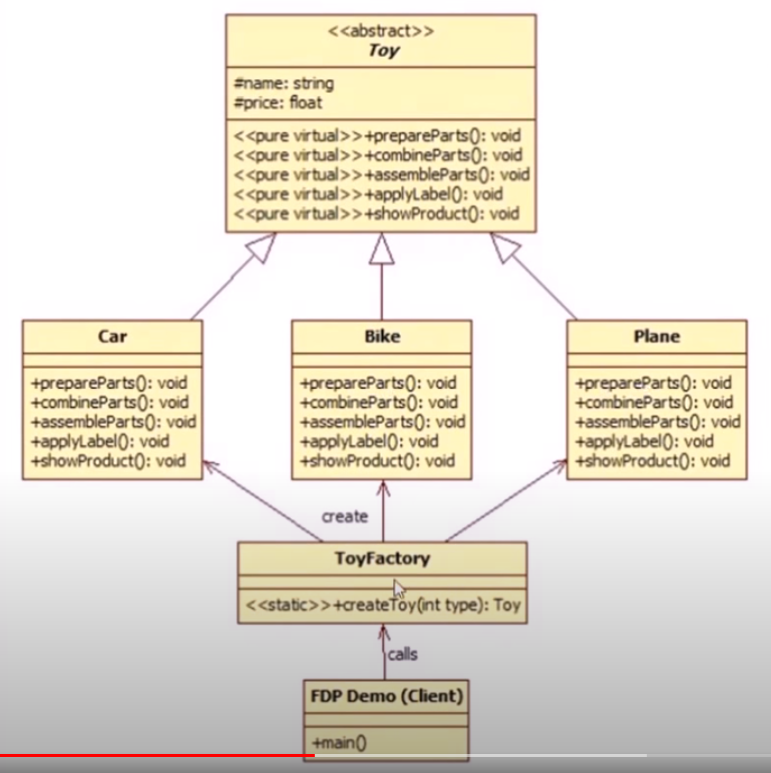
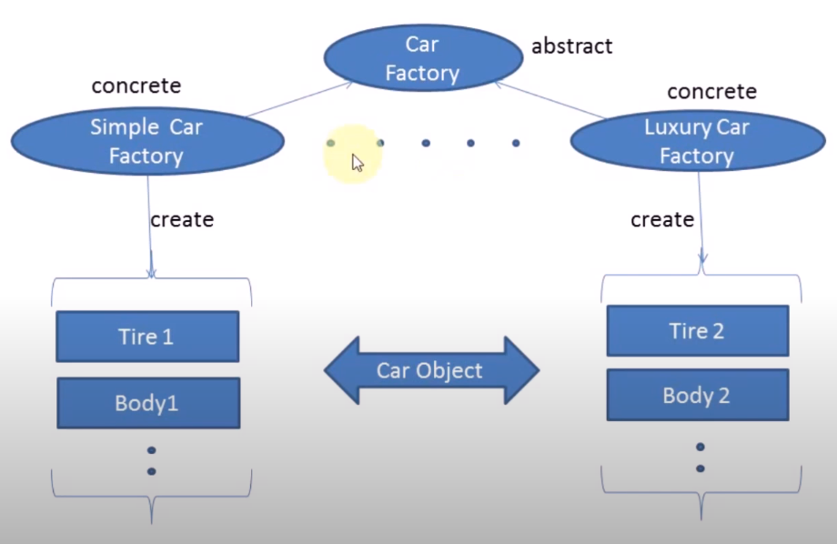
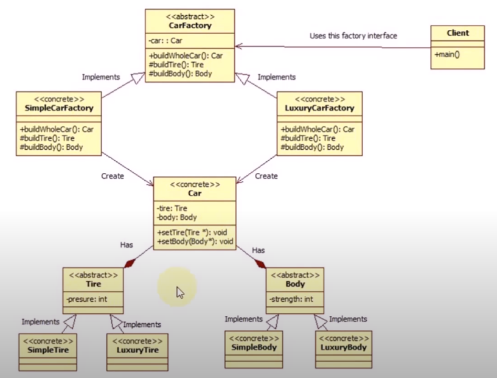
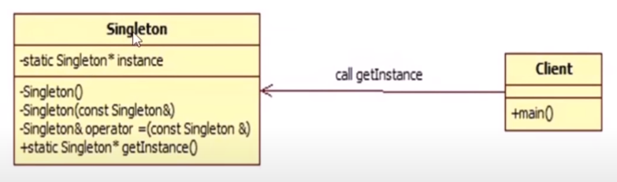
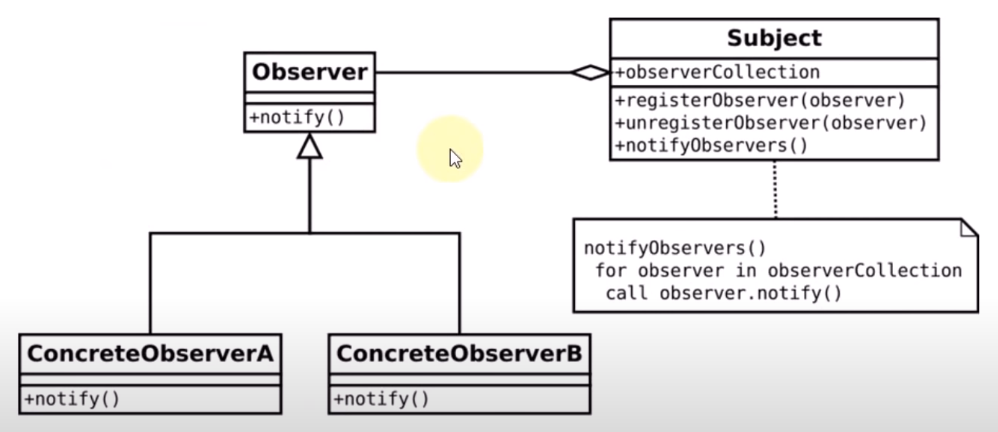
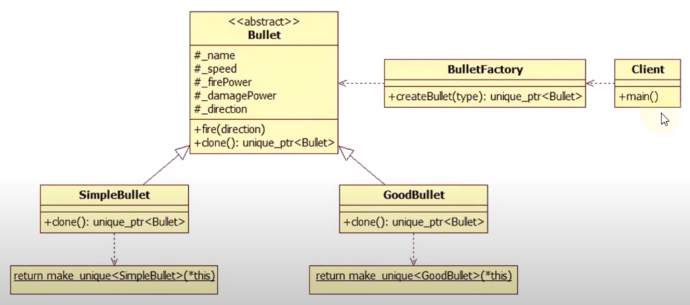
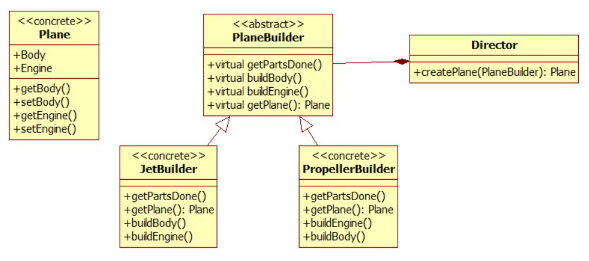

[Design Patterns in C++](https://www.youtube.com/playlist?list=PLk6CEY9XxSIDZhQURp6d8Sgp-A0yKKDKV)

# Design Pattern Introduction

* Question:

  What is Design Pattern?

* Answer:

  In software Iindustries, a design pattern is a general repeatable solution to a company occuring problem in software design.

  

  Types:

  * Creational Design Pattern
  * Behavioral Design Pattern
  * Structural Design Pattern

  

  1. THey give the developer a selection of tried and tested solutions to work with
  2. They are language neutral and so can be appliedto any language that supports object-orientation
  3. They have a proven track record as they are already widely used and thus reduce the technical rish to the project
  4. They are highly flexible and can be used in pratically any type of application or domain

# Factory Design Pattern

* Question:

  What is Factory Design Pattern? and how to implement it in C++?

* Answer:

  1. It creates object for you, rather you initiating object directly

  2. Factory Design Pattern is also known as "Virtual Constructor"

     (C++ doesn't support Virtual Constructor)

  

  How to implement Factory Design Pattern?

  Define an interface or an abstract class for creating an object but let the subclasses decide which class to initiate.

  

  Example:

  

  Object.cpp

  ~~~~c++
  #include <iostream>
  
  class Toy {
  protected:
  	std::string name;
  	float price;
  public:
  	virtual void prepareParts() = 0;
  	virtual void combineParts() = 0;
  	virtual void assembleParts() = 0;
  	virtual void applyLabel() = 0;
  	virtual void showProduct() = 0;
  };
  
  class Car : public Toy {
  	// make all constructor private or protected
  public:
  	virtual void prepareParts() { std::cout << "Preparing Car Parts" << std::endl; }
  	virtual void combineParts() { std::cout << "Combing Car Parts" << std::endl; }
  	virtual void assembleParts() { std::cout << "Assembling Car Parts" << std::endl; }
  	virtual void applyLabel() { std::cout << "Applying Car Label" << std::endl; name = "Car"; price = 10; }
  	virtual void showProduct() { std::cout << "Name: " << name << ", Price: " << price << std::endl; }
  };
  
  class Bike : public Toy {
  	// make all constructor private or protected
  public:
  	virtual void prepareParts() { std::cout << "Preparing Bike Parts" << std::endl; }
  	virtual void combineParts() { std::cout << "Combing Bike Parts" << std::endl; }
  	virtual void assembleParts() { std::cout << "Assembling Bike Parts" << std::endl; }
  	virtual void applyLabel() { std::cout << "Applying Bike Label" << std::endl; name = "Bike"; price = 20; }
  	virtual void showProduct() { std::cout << "Name: " << name << ", Price: " << price << std::endl; }
  };
  
  class Plane : public Toy {
  	// make all constructor private or protected
  public:
  	virtual void prepareParts() { std::cout << "Preparing Plane Parts" << std::endl; }
  	virtual void combineParts() { std::cout << "Combing Plane Parts" << std::endl; }
  	virtual void assembleParts() { std::cout << "Assembling Plane Parts" << std::endl; }
  	virtual void applyLabel() { std::cout << "Applying Plane Label" << std::endl; name = "Plane"; price = 30; }
  	virtual void showProduct() { std::cout << "Name: " << name << ", Price: " << price << std::endl; }
  };
  ~~~~

  ToyFactory.cpp

  ~~~~c++
  #include "Object.cpp"
  
  class ToyFactory {
  public:
  	static Toy* createToy(int type) {
  		Toy* toy = nullptr;
  
  		switch (type) {
  		case 1:
  			toy = new Car;
  			break;
  		case 2:
  			toy = new Bike;
  			break;
  		case 3:
  			toy = new Plane;
  			break;
  		default:
  			std::cout << "Invalid toy type, please re-enter type" << std::endl;
  			break;
  		}
  
  		toy->prepareParts();
  		toy->combineParts();
  		toy->assembleParts();
  		toy->applyLabel();
  
  		return toy;
  	}
  };
  ~~~~

  main.cpp

  ~~~~c++
  #include <iostream>
  #include "ToyFactory.cpp"
  
  //using namespace std;
  
  int main()
  {
  // Client code starts
  	int type;
  	while (1) {
  		std::cout << std::endl << "Enter type or zero for exit" << std::endl;
  		std::cin >> type;
  		if (!type)
  			break;
  		Toy* v = ToyFactory::createToy(type);
  		if (v) {
  			v->showProduct();
  			delete v;
  		}
  	}
  	std::cout << "Exit..." << std::endl;
  // Client code ends
  	return 0;
  }
  ~~~~

  

  Advantages:

  * Less code change if we change object creation process
  * We create object without exposing creation logic to the client
  * We get the benefits of Virtual Constructor

# Abstract Factory Design Pattern

* Question:

  What is Abstract Factory Design Pattern? and how to implement it in C++?

* Answer:

  Abstract Factory Design Pattern defines an abstract class for creating families of releated objects but without specifying their concrete sub-class.

  

  

  

  Why / WHen to use Abstract Factory Design Pattern?

  * You need system to be independent of how objects are created, composed and represented
  * Show interface, not implementation
  * System need to be configured with one of the multiple family of objects

  

  Example:

  

  Car.cpp

  ~~~~c++
  #include <iostream>
  
  class Tire {
  protected:
  	std::string name;
  	int presure;
  public:
  	Tire(std::string n, int presure) : name(n), presure(presure) {};
  	std::string getName() { return name; }
  	int getPresure() { return presure; }
  };
  
  class SimpleTire : public Tire {
  public:
  	SimpleTire() : Tire("SimpleTire", 75) {}
  };
  
  class LuxuryTire : public Tire {
  public:
  	LuxuryTire() : Tire("LuxuryTire", 100) {}
  };
  
  class Body {
  protected:
  	std::string name;
  	int strength;
  public:
  	Body(std::string n, int strength) : name(n), strength(strength) {}
  	std::string getName() { return name; }
  	int getStrength() { return strength; }
  };
  
  class SimpleBody : public Body {
  public:
  	SimpleBody() : Body("SimpleBody", 75) {}
  };
  
  class LuxuryBody : public Body {
  public:
  	LuxuryBody() : Body("LuxuryBody", 100) {}
  };
  
  
  class Car {
  protected:
  	std::string name;
  	Tire* tire;
  	Body* body;
  public:
  	Car(std::string n) : name(n) {}
  	void setTire(Tire* t) { tire = t; }
  	void setBody(Body* b) { body = b; }
  	void printDetails() {
  		std::cout << std::endl << "Car: " << name << std::endl;
  		std::cout << "Tire: " << tire->getName() << " Presure: " << tire->getPresure() << std::endl;
  		std::cout << "Body: " << body->getName() << " Strength: " << body->getStrength() << std::endl << std::endl;
  	}
  };
  ~~~~

  CarFactory.cpp

  ~~~~c++
  #include <iostream>
  #include "Car.cpp"
  
  class CarFactory {
  private:
  	Car* car;
  protected:
  	virtual Tire* buildTire() = 0;
  	virtual Body* buildBody() = 0;
  	// much more product's parts could come here
  public:
  	virtual Car* buildWholeCar() = 0;
  };
  
  class SimpleCarFactory : public CarFactory {
  	Tire* buildTire() {
  		return new SimpleTire();
  	}
  
  	Body* buildBody() {
  		return new SimpleBody();
  	}
  
  	Car* buildWholeCar() {
  		Car* car = new Car("SimpleCar");
  		car->setTire(buildTire());
  		car->setBody(buildBody());
  		return car;
  	}
  };
  
  class LuxuryCarFactory : public CarFactory {
  	Tire* buildTire() {
  		return new LuxuryTire();
  	}
  
  	Body* buildBody() {
  		return new LuxuryBody();
  	}
  
  	Car* buildWholeCar() {
  		Car* car = new Car("LuxuryCar");
  		car->setTire(buildTire());
  		car->setBody(buildBody());
  		return car;
  	}
  };
  ~~~~

  main.cpp

  ~~~~c++
  #include <iostream>
  #include "CarFactory.cpp"
  
  //using namespace std;
  
  #define SIMPLE_CAR 1
  //#define LUXURY_CAR 1
  
  int main()
  {
  #ifdef SIMPLE_CAR
  	CarFactory* factory = new SimpleCarFactory;
  #elif LUXURY_CAR
  	CarFactory* factory = new LuxuryCarFactory;
  #endif
  
  	Car* car = factory->buildWholeCar();
  	car->printDetails();
  
  	return 0;
  }
  ~~~~

# Singleton Design Pattern In C++

* Question:

  What is Singleton Design Pattern? and how to implement it in C++?

* Answer:

  Singleton Design Pattern defines a class that has only one instance and provides a global point of access to that instance

  

  Requirements:

  * One and only one instance
  * global access
  * No ownership
  * Lazy initialization

  

  Advantages:

  * Save memory

    Only one instance is required, so why to create so many

  * Signle access point

    Logger, database connection

  * Flexibility

    Change anytime you want to

  

  Usage:

  * Multithreaded

    Threadpool

  * Database application

    Logging

  * Condifuration settings

    Game setting, application setting, etc

  

  

  

  How to create Singleton Design Pattern?

  * static member
  * private constructor
  * static function

  

  Example:

  ~~~~c++
  #include <iostream>
  
  //using namespace std;
  
  class GameSetting {
  private:
  	static GameSetting* _instance;
  	int _brightness;
  	int _width;
  	int _height;
  	GameSetting() : _width(786), _height(1300), _brightness(75) {}
  	// all constructors should be private or public (if you want to allow inheritance)
  
  public:
  	static GameSetting* getInstace() {
  		if (_instance == NULL)
  			_instance = new GameSetting();
  		return _instance;
  	}
  	void setWidth(int width) { _width = width; }
  	void setHeight(int height) { _height = height; }
  	void setBrighness(int brightness) { _brightness = brightness; }
  
  	int getWidth() { return _width; }
  	int getHeight() { return _height; }
  	int getBrightness() { return _brightness; }
  	void displaySetting() {
  		std::cout << "brightness: " << _brightness << std::endl;
  		std::cout << "height: " << _height << std::endl;
  		std::cout << "width: " << _width << std::endl << std::endl;
  	}
  };
  
  GameSetting* GameSetting::_instance = NULL;
  
  void someFunction() {
  	GameSetting* setting = GameSetting::getInstace();
  	setting->displaySetting();
  }
  
  int main() {
  
  	GameSetting* setting = GameSetting::getInstace();
  	setting->displaySetting();
  
  	setting->setBrighness(100);
  	someFunction();
  
  	return 0;
  }
  ~~~~

# Observer Design Pattern

* Question:

  What is Observer Design Pattern? and how to implement it in C++?

* Answer:

  Observer Design Pattern defines a one-to-many dependency between objects so that when one onject changes state, all its dependents are notified and updated automatically.

  

  

  

  Example1:

  ~~~~c++
  #include <iostream>
  #include <vector>
  #include <algorithm>
  
  //using namespace std;
  
  // -1 0 1
  
  class Car {
  private:
      int position;
      int tmp;
  
      std::vector<class Observer*> observerList;
      std::vector<class Observer*> observerTmpList;
  
  public:
      int getPosition() {
          return position;
      }
      void setPosition(int newPosition) {
          position = newPosition;
          notify();
      }
      void setTmp(int newTmp) {
          tmp = newTmp;
          notifyTmp();
      }
      void attach(Observer* obs) {
          observerList.push_back(obs);
      }
      void detach(Observer* obs) {
          observerList.erase(std::remove(observerList.begin(), observerList.end(), obs), observerList.end());
      }
  
      void notify();
      void notifyTmp();
  };
  
  class Observer {
      Car* _car;
  public:
      Observer(Car* car) {
          _car = car;
          _car->attach(this);
      }
      virtual void update() = 0;
  protected:
      Car* getCar() {
          return _car;
      }
  };
  
  void Car::notify() {
      for (int i = 0; i < observerList.size(); ++i) {
          observerList[i]->update();
      }
  }
  
  void Car::notifyTmp() {
      for (int i = 0; i < observerTmpList.size(); ++i) {
          observerTmpList[i]->update();
      }
  }
  
  class LeftObserver : public Observer {
  public:
      LeftObserver(Car* car) : Observer(car) {}
      void update() {
          int pos = getCar()->getPosition();
          if (pos < 0) {
              std::cout << "left side" << std::endl;
          }
      }
  };
  
  class RightObserver : public Observer {
  public:
      RightObserver(Car* car) : Observer(car) {}
      void update() {
          int pos = getCar()->getPosition();
          if (pos > 0) {
              std::cout << "right side" << std::endl;
          }
      }
  };
  
  class MiddleObserver : public Observer {
  public:
      MiddleObserver(Car* car) : Observer(car) {}
      void update() {
          int pos = getCar()->getPosition();
          if (pos == 0) {
              std::cout << "running in middle" << std::endl;
          }
      }
  };
  
  // -1 0 1   available position
  
  // -1 driving left side
  // 0 driving in middle
  // 1 driving right side 
  
  int main() {
  
      Car* car = new Car();
  
      LeftObserver leftObserver(car);
      RightObserver rightObserver(car);
      MiddleObserver middleObserver(car);
  
      std::cout << "hit left right button to drive a car in your city!!! and press break to close" << std::endl;
  
      char pressedButton;
      bool breakLoop = false;
  
      while (breakLoop == false) {
          std::cin >> pressedButton;
  
          switch (pressedButton) {
          case 108: { // l -->  pressed for left side
              car->setPosition(-1);
              break;
          }
          case 99: { // c --> pressed for center
              car->setPosition(0);
              break;
          }
          case 114: { // r --> pressed for right side
              car->setPosition(1);
              break;
          }
          case 98: { // b --> pressed for break
              breakLoop = true;
              break;
          }
          default: {
              std::cout << "please drive carfully!!" << std::endl;
              break;
          }
          }
      }
      std::cout << "Byee..." << std::endl;
  
      return 0;
  }
  ~~~~

  

  Example2:

  ~~~~c++
  #include <iostream>
  #include <vector>
  #include <algorithm>
  
  using namespace std;
  
  class SpaceShip {
  	vector<class Observer*> observerList;
  	int _height;
  
  public:
  	void setHeight(int height) {
  		_height = height;
  		notify();
  	}
  	int getHeight() {
  		return _height;
  	}
  	void attach(Observer* obs) {
  		cout << "Attach Called!!" << endl;
  		observerList.push_back(obs);
  	}
  	void detach(Observer* obs) {
  		cout << "Detach Called!!" << endl;
  		observerList.erase(std::remove(observerList.begin(), observerList.end(), obs), observerList.end());
  	}
  	void notify();
  };
  
  class Observer {
  
  	SpaceShip* _ship;
  public:
  	SpaceShip* getShip() {
  		return _ship;
  	}
  
  	Observer(SpaceShip* ship) {
  		_ship = ship;
  		_ship->attach(this);
  	}
  	virtual void update() = 0;
  };
  
  void SpaceShip::notify() {
  	cout << "Notify Called!!" << endl;
  	for (int i = 0; i < observerList.size(); i++) {
  		observerList[i]->update();
  	}
  }
  
  class PresureObserver : public Observer {
  
  public:
  	PresureObserver(SpaceShip* ship) : Observer(ship) {}
  	void update() {
  		int height = getShip()->getHeight();
  		cout << "Presure Observer Checked!!" << endl;
  	}
  };
  
  class SpeedObserver : public Observer {
  
  public:
  	SpeedObserver(SpaceShip* ship) : Observer(ship) {}
  	void update() {
  		int height = getShip()->getHeight();
  		cout << "Speed Observer Checked!!" << endl;
  		if (height == 1000) {
  			getShip()->detach(this);
  			cout << "Speed Observer Detached!!" << endl;
  		}
  	}
  };
  
  class TemperatureObserver : public Observer {
  
  public:
  	TemperatureObserver(SpaceShip* ship) : Observer(ship) {}
  	void update() {
  		int height = getShip()->getHeight();
  		cout << "Temperature Observer Checked!!" << endl;
  	}
  };
  
  int main() {
  
  	int height;
  	cout << "Enter height of rocket OR press 0 to exit" << endl;
  	cin >> height;
  
  	SpaceShip* ship = new SpaceShip();
  
  	PresureObserver po(ship);
  	SpeedObserver so(ship);
  	TemperatureObserver to(ship);
  
  	while (height) {
  		ship->setHeight(height);
  		cin >> height;
  	}
  
  	cout << "Bye....";
  
  	return 0;
  }
  ~~~~

  

# Prototype Design Pattern

* Question:

  What is Prototype Design Pattern? and how to implement it in C++?

* Answer:

  Intent:

  * Creating an object is expensive operation than copy an object
  * All objects Initial State is common and takes time to build
  * Composition, creation and representation of objects should be decoupled from the system
  * Hide the complexity of creating new instance from yhe user
  * Which classes to create are specified at run time

  

  Example:

  

  ~~~~c++
  #include <iostream>
  #include <unordered_map>
  #include <string>
  #include <memory>
  
  using namespace std;
  
  /** Bullet is the base Prototype */
  class Bullet
  {
  protected:
  	string _bulletName;
  	float _speed;
  	float _firePower;
  	float _damagePower;
  	float _direction;
  
  public:
  	Bullet() {}
  	Bullet(string bulletName, float speed, float firePower, float damagePower)
  		: _bulletName(bulletName), _speed(speed), _firePower(firePower), _damagePower(damagePower)
  	{}
  	virtual ~Bullet() {}
  	virtual unique_ptr<Bullet> clone() = 0;
  	void fire(float direction)
  	{
  		_direction = direction;
  
  		cout << "Name        : " << _bulletName << endl
  			<< "Speed       : " << _speed << endl
  			<< "FirePower   : " << _firePower << endl
  			<< "DamagePower : " << _damagePower << endl
  			<< "Direction   : " << _direction << endl << endl;
  	}
  };
  
  /** SimpleBullet is a Concrete Prototype */
  class SimpleBullet : public Bullet
  {
  
  public:
  	SimpleBullet(string bulletName, float speed, float firePower, float damagePower) :
  		Bullet(bulletName, speed, firePower, damagePower)
  	{
  	}
  
  	unique_ptr<Bullet> clone() override
  	{
  		return make_unique<SimpleBullet>(*this);
  	}
  };
  
  /** GoodBullet is the Concrete Prototype */
  class GoodBullet : public Bullet
  {
  
  public:
  	GoodBullet(string bulletName, float speed, float firePower, float damagePower)
  		: Bullet(bulletName, speed, firePower, damagePower)
  	{
  	}
  
  	unique_ptr<Bullet> clone() override
  	{
  		return std::make_unique<GoodBullet>(*this);
  	}
  };
  
  
  /** Opaque Bullet type, avoids exposing concrete implementations */
  enum BulletType
  {
  	SIMPLE,
  	GOOD
  };
  
  /** BulletFactory is the client */
  class BulletFactory
  {
  private:
  	unordered_map<BulletType, unique_ptr<Bullet>, hash<int> > m_Bullets;
  
  public:
  	BulletFactory()
  	{
  		m_Bullets[SIMPLE] = make_unique<SimpleBullet>("Simple Bullet", 50, 75, 75);
  		m_Bullets[GOOD] = make_unique<GoodBullet>("Good Bullet", 75, 100, 100);
  	}
  
  	unique_ptr<Bullet> createBullet(BulletType BulletType)
  	{
  		return m_Bullets[BulletType]->clone();
  	}
  };
  
  int main()
  {
  	BulletFactory bulletFactory;
  
  	auto Bullet = bulletFactory.createBullet(SIMPLE);
  	Bullet->fire(90);
  
  	Bullet = bulletFactory.createBullet(GOOD);
  	Bullet->fire(100);
  
  	return 0;
  }
  ~~~~

  

  Downsides:

  * Copy!!! (shallow copy / deep copy)
  * Copying an object can be complicated
  * Circular references class cannot be cloned
  * Over use of this might affect the performance

# Builder Design Pattern

* Question:

  What is Builder Design Pattern? and how to implement it in C++?

* Answer:

  Why Builder Design Pattern?

  * we want to create an object with composing other complex objects
  * and we want to create those complex objects step by step (Director will handle that)

  

  Example:

  

  ~~~~c++
  #include <iostream>
  
  using namespace std;
  
  // Your end product 
  class Plane {
      string _plane;
      string _body;
      string _engine;
  public:
      Plane(string planeType) :_plane{ planeType } {}
      void setEngine(string type) { _engine = type; }
      void setBody(string body) { _body = body; }
      string getEngine() { return _engine; }
      string getBody() { return _body; }
  
      void show() {
          cout << "Plane Type: " << _plane << endl
              << "Body Type: " << _body << endl
              << "Engine Type: " << _engine << endl << endl;
      }
  };
  
  // PlaneBuilder Abstract Class
  // Means all builders should have at least these methods
  class PlaneBuilder {
  protected:
      Plane* _plane;
  public:
      virtual void getPartsDone() = 0;
      virtual void buildBody() = 0;
      virtual void buildEngine() = 0;
      //virtual ~PlaneBuilder(){}
      Plane* getPlane() { return _plane; }
  };
  
  // PlaneBuilder concrete class
  // knows only how to build Propeller Plane
  class PropellerBuilder : public PlaneBuilder {
  public:
      void getPartsDone() { _plane = new Plane("Propeller Plane"); }
      void buildEngine() { _plane->setEngine("Propeller Engine"); }
      void buildBody() { _plane->setBody("Propeller Body"); }
      //~PropellerBuilder(){delete _plane;}
  };
  
  // PlaneBuilder concrete class
  // Knows only how to build Jet Plane
  class JetBuilder : public PlaneBuilder {
  public:
      void getPartsDone() { _plane = new Plane("Jet Plane"); }
      void buildEngine() { _plane->setEngine("Jet Engine"); }
      void buildBody() { _plane->setBody("Jet Body"); }
      //~JetBuilder(){delete _plane;}
  };
  
  // Defines steps and tells to the builder that build in given order.
  class Director {
      PlaneBuilder* builder;
  public:
      Plane* createPlane(PlaneBuilder* builder) {
          builder->getPartsDone();
          builder->buildBody();
          builder->buildEngine();
          return builder->getPlane();
      }
  };
  
  int main() {
  
      Director dir;
      JetBuilder jb;
      PropellerBuilder pb;
  
      Plane* jet = dir.createPlane(&jb);
      Plane* pro = dir.createPlane(&pb);
  
      jet->show();
      pro->show();
  
      delete jet;
      delete pro;
  
      return 0;
  }
  ~~~~

