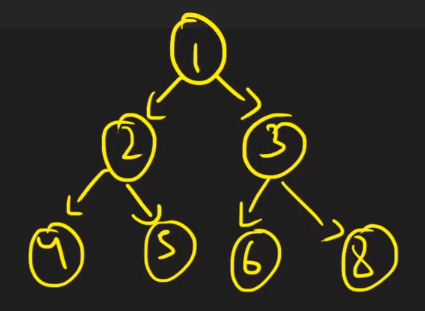

[STL IN C++](https://www.youtube.com/playlist?list=PLk6CEY9XxSIA-xo3HRYC3M0Aitzdut7AA)

# Introduction of STL In C++

* Question:

  What is STL in C++?

* Answer:

  STL: Standard Template Library

  It consists of three basic components:
  1. Container
  2. Iterator
  3. Algorithm

# std::array

* Question:

  What is std::array?

* Answer:

  Syntax:

  ~~~~
  std::array<T, N> array;
  ~~~~

  Notes:

  1. std::array is a container that encapsulates fixed size arrays.
  2. Array size is needed at compile time.
  3. Assign by value is actually by value.
  4. Access elements:
     1. at()
     2. []
     3. front()
     4. back()
     5. data() // gives access to the underlying array

  ~~~~c++
  #include <iostream>
  #include <array>
  
  //using namespace std;
  
  int main()
  {
  	// declare
  	std::array<int, 5> array1;
  	// assign using initializer list
  	array1 = { 1, 2, 3, 4, 5 };
  
  	// declare and initialization
  	std::array<int, 5> array2 = { 1, 2, 3, 4, 5 }; //initializer list
  	std::array<int, 5> array3 { 1, 2, 3, 4, 5 }; // uniform initialization
  
  	return 0;
  }
  ~~~~

# std::vector In C++

* Question:

  What is std::vector in C++?

* Answer:

  Syntax:

  ~~~~
  std::vectot<T> vec;
  ~~~~

  Notes:
  1. std::vector is a sequence container and also known as Dynamic Array or Array List.
  2. Its size can grow and shrink dynamically, and no need to provide size at compile time.
  3. Access elements:
     1. at()
     2. []
     3. front()
     4. back()
     5. data()
  4. Modifiy elements:
     1. insert()
     2. emplace()
     3. push_back()
     4. emplace_back()
     5. pop_back()
     6. resize()
     7. swap()
     8. erase()
     9. clear()

  ~~~~c++
  #include <iostream>
  #include <vector>
  
  //using namespace std;
  
  int main()
  {
  	std::vector<int> vec1;
  	std::vector<int> vec2(5, 20);
  	std::vector<int> vec3 = { 1, 2, 3, 4, 5 }; // initializer list
  	std::vector<int> vec4{ 1, 2, 3, 4, 5 }; // uniform initialization
  
  	// accessing elements
  	vec2[3] = 10;
  	vec2.at(3) = 0;
  
  	// ...
  
  	return 0;
  }
  ~~~~

# Optimized Way To Use std::vector In C++

* Question:

  Problem in std::vector? What is the best way to use std::vector in C++?

* Answer:

  When size > capacity, a new vector is created and there is a copy operation.

  ~~~~c++
  #include <iostream>
  #include <vector>
  
  //using namespace std;
  
  int main()
  {
  	std::vector<int> vec;
  	//vec.reserve(32);
      
  	std::cout << "size\tcapacity" << std::endl;
      std::cout << vec.size() << "\t" << vec.capacity() << std::endl;
  	for (int i = 0; i < 32; ++i) {
  		vec.push_back(i);
  		std::cout << vec.size() << "\t" << vec.capacity() << std::endl;
  	}
  
  	//size	capacity
      //	0	0
  	//	1	1
  	//	2	2
  	//	3	4
  	//	4	4
  	//	5	8
  	//	6	8
  	//	7	8
  	//	8	8
  	//	9	16
  	//	10	16
  	//	11	16
  	//	12	16
  	//	13	16
  	//	14	16
  	//	15	16
  	//	16	16
  	//	17	32
  	//	18	32
  	//	19	32
  	//	20	32
  	//	21	32
  	//	22	32
  	//	23	32
  	//	24	32
  	//	25	32
  	//	26	32
  	//	27	32
  	//	28	32
  	//	29	32
  	//	30	32
  	//	31	32
  	//	32	32
  
  	return 0;
  }
  ~~~~

# std::set In C++

* Question:

  What is std::set in C++?

* Answer:

  Syntax:

  ~~~~
  sts::set<T> setName;
  ~~~~

  1. std::set is an Associative Container that contains a sorted set of unique objects of type Key.
  2. It is usually implemented using Red-Black Tree.
  3. Insertion, Removal, Search have logarithmic complexity.
  4. If we want to store user defined data type in set then we will have to provide compare function so that set can store them in sorted order.
  5. We can pass the order of sorting while constructing set object.

  

  ~~~~c++
  #include <iostream>
  #include <set>
  #include <string>
  
  //using namespace std;
  
  class Person
  {
  public:
  	int age;
  	std::string name;
  
  	bool operator<(const Person& rhs) const {
  		return age < rhs.age;
  	}
  
  	bool operator>(const Person& rhs) const {
  		return age > rhs.age;
  	}
  };
  
  
  int main()
  {
  	std::set<int> set1 = { 1, 5, 2, 4, 3, 1, 2, 3, 4, 5 };
  	//std::set<int, std::greater<int>> set1 = { 1, 5, 2, 4, 3, 1, 2, 3, 4, 5 };
  	
  	for (const auto& elem : set1) {
  		std::cout << elem << " ";
  	} // 1 2 3 4 5
  	std::cout << std::endl;
  
  	std::set<Person> set2 = { {25, "John"}, {12, "Tom"}, {36, "Alice"}, {28, "Lee"} };
  	//std::set<Person, std::greater<Person>> set2 = { {25, "John"}, {12, "Tom"}, {36, "Alice"}, {28, "Lee"} };
  	
  	for (const auto& elem : set2) {
  		std::cout << "{" << elem.age << " " << elem.name << "} ";
  	} // {12 Tom} {25 John} {28 Lee} {36 Alice}
  	std::cout << std::endl;
  
  	return 0;
  }
  ~~~~

  

  BOTTOM LINE:
  It store unique elements and they are stored in sorted order (Ascending / Descending)

# Container Inside Container In C++

* Question:

  How to use container inside container in C++?

* Answer:

  

  ~~~~c++
  #include <iostream>
  #include <vector>
  
  //using namespace std;
  
  int main()
  {
  	std::vector<std::vector<int>> tree;
  	int edges, n1, n2;
  
  	std::cin >> edges;
  	tree.resize(edges);
  
  	for (int i = 0; i < edges; ++i) {
  		std::cin >> n1 >> n2;
  		tree[n1].push_back(n2);
  	}
  
  	for (const auto& elem1 : tree) {
  		for (const auto& elem2 : elem1) {
  			std::cout << elem2 << " ";
  		}
  		std::cout << std::endl;
  	}
  
  	//6
  	//1 2
  	//1 3
  	//2 4
  	//2 5
  	//3 6
  	//3 8
  
  	return 0;
  }
  ~~~~

# std::multiset In C++

* Question:

  What is std::multiset in C++?

* Answer:

  Syntax:

  ~~~~
  std::multiset<T> multisetName;
  ~~~~

  1. std::multiset is an Associative Container that contains a sorted set of duplicate objects of type Key.
  2. It is usually implemented using Red-Black Tree.
  3. Insertion, Removal, Search have logarithmic complexity.
  4. If we want to store user defined data type in multiset then we will have to provide compare function so that multiset can store them in sorted order.
  5. We can pass the order of sorting while constructing set object.

  

  ~~~~c++
  #include <iostream>
  #include <set>
  #include <string>
  
  //using namespace std;
  
  class Person
  {
  public:
  	int age;
  	std::string name;
  
  	bool operator<(const Person& rhs) const {
  		return age < rhs.age;
  	}
  
  	bool operator>(const Person& rhs) const {
  		return age > rhs.age;
  	}
  };
  
  int main()
  {
  	std::multiset<int> multiset1 = { 5, 2, 4, 3, 2, 5 };
  	//std::multiset<int, std::greater<int>> multiset1 = { 5, 2, 4, 3, 2, 5 };
  
  	for (const auto& elem1 : multiset1) {
  		std::cout << elem1 << " ";
  	} // 2 2 3 4 5 5
  	std::cout << std::endl;
  
  	std::multiset<Person> multiset2 = { {25, "John"}, {12, "Tom"}, {36, "Alice"}, {28, "Lee"} };
  	//std::set<Person, std::greater<Person>> set2 = { {25, "John"}, {12, "Tom"}, {36, "Alice"}, {28, "Lee"} };
  
  	for (const auto& elem : multiset2) {
  		std::cout << "{" << elem.age << " " << elem.name << "} ";
  	} // {12 Tom} {25 John} {28 Lee} {36 Alice}
  	std::cout << std::endl;
  
  	return 0;
  }
  ~~~~

  

  BOTTOM LINE:
  multiset is similar to set except it can have multiple elements with same value.

# std::map In C++

* Question:

  What is std::map in C++?

* Answer:

  Syntax:

  ~~~~
  std::map<T1, T2> mapName;
  // where T1 is key type and T2 is value type
  ~~~~

  

  1. std::map is associative container that store elements in key value combination where key should be unique, otherwise it overrides the previous value.
  2. It is implement using Self-Balance Binary Search Tree (AVL/Red Black Tree) .
  3. It store key value pair in sorted order on the basis of key (assending/decending).
  4. std::map is generally used in Dictionay type problems.

  

  ~~~~c++
  #include <iostream>
  #include <map>
  #include <string>
  #include <vector>
  
  //using namespace std;
  
  int main()
  {
  	std::map<std::string, int> map1;
  	//std::map<std::string, int, std::greater<std::string>> map1;
  
  	map1["John"] = 25;
  	map1["Tom"] = 12;
  	map1.insert(std::make_pair("Alice", 36));
  
  	// loop through map
  	for (auto& elem : map1) {
  		std::cout << "{" << elem.first << ": " << elem.second << "} ";
  	}
  	std::cout << std::endl;
  
  	// acces using [] operator
  	std::cout << map1["Tom"] << std::endl;
  
  
  	std::map<std::string, std::vector<int>> map2;
  	map2["Vec1"].push_back(10);
  	map2["Vec1"].push_back(20);
  	map2["Vec1"].push_back(30);
  	map2["Vec2"].push_back(100);
  	map2["Vec2"].push_back(200);
  	map2["Vec2"].push_back(300);
  	std::vector<int> vec3 = { 11 };
  	map2.insert(std::make_pair("Vec3", vec3));
  
  	// loop through map
  	for (auto& elem1 : map2) {
  		std::cout << elem1.first << ": ";
  		for (auto& elem2 : elem1.second) {
  			std::cout << elem2 << " ";
  		}
  		std::cout << std::endl;
  	}
  	std::cout << std::endl;
  
  	return 0;
  }
  ~~~~

# std::multimap In C++

* Question:

  What is std::multimap in C++?

* Answer:

  Syntax:

  ~~~~
  std::multimap<T1, T2> multimapName;
  // where T1 is key type and T2 is value type
  ~~~~

  

  1. Multimap is an associative container that contains a sorted list of key-value pairs, while permitting multiple entries with the same key.
  2. It store key value pair in sorted order on the basis of key (assending/decending).
  3. Data structure used in multimap is not defined by standard, but red-black tree is assumed by most of the people.
  4. Lookup: 
     * count
     * find
     * contains
     * equal_range
     * lower_bound
     * upper_bound
  5. We dont have at() and [] functions to get element like we had in std::map.

  

  ~~~~c++
  #include <iostream>
  #include <map>
  
  //using namespace std;
  
  int main()
  {
  	std::multimap<char, int> multimap1;
  	//std::multimap<char, int, std::greater<char>> multimap1;
  
  	multimap1.insert(std::pair<char, int>('a', 1));
  	multimap1.insert(std::make_pair('a', 2));
  	multimap1.insert(std::make_pair('a', 3));
  	multimap1.insert(std::make_pair('b', 4));
  	multimap1.insert(std::make_pair('b', 5));
  
  	// iterate over multimap
  	for (auto& elem : multimap1) {
  		std::cout << "{" << elem.first << ": " << elem.second << "} ";
  	} // {a: 1} {a: 2} {a: 3} {b: 4} {b: 5}
  	std::cout << std::endl;
  
  	// get all the pairs of given key
  	auto range = multimap1.equal_range('a');
  	for (auto it = range.first; it != range.second; ++it) {
  		std::cout << "{" << it->first << ": " << it->second << "} ";
  	} // {a: 1} {a: 2} {a: 3}
  	std::cout << std::endl;
  
  	std::cout << multimap1.count('a') << std::endl; // 3
  	//std::cout << multimap1.contains('a') << std::endl; // C++20
  
  	auto find_a = multimap1.find('a');
  	std::cout << "{" << find_a->first << ": " << find_a->second << "} " << std::endl; // {a: 1}
  
  	auto range2 = multimap1.lower_bound('a');
  	std::cout << "{" << range2->first << ": " << range2->second << "} " << std::endl; // {a: 1}
  
  	auto range3 = multimap1.upper_bound('a');
  	std::cout << "{" << range3->first << ": " << range3->second << "} " << std::endl; // {b: 4}
  
  	//?????
  	//auto range4 = multimap1.upper_bound('b');
  	//std::cout << "{" << range4->first << ": " << range4->second << "} " << std::endl; // 0
  
  	return 0;
  }
  ~~~~

# emplace In C++ STL

* Question:

  What is emplace function in STL C++?

* Answer:

  1. All the containers supports insert and emplace operation to store data. 
  2. Emplace is used to construct object in-place and avoids unnecessary copy of objects.
  3. Insert and Emplace is equal for premetive data types but when we deal with heavy objects we should use emplace if we can for efficiency.

  ~~~~c++
  #include <iostream>
  #include <set>
  
  //using namespace std;
  
  class A {
  public:
  	int x;
  	A(int x = 0) : x(x) {
  		std::cout << "Construct" << std::endl;
  	}
  	A(const A& rhs) {
  		x = rhs.x;
  		std::cout << "Copy" << std::endl;
  	}
  };
  
  bool operator<(const A& lhs, const A& rhs) {
  	return lhs.x < rhs.x;
  }
  
  int main()
  {
  	std::set<A> set1;
  	set1.insert(A(1));
  	set1.emplace(2);
  
  	for (auto& elem : set1) {
  		std::cout << elem.x << " ";
  	}
  	std::cout << std::endl;
  
  	return 0;
  }
  ~~~~

# std::forward_list In C++

* Question:

  What is forward list in C++ STL?

* Answer:

  1. This is single linked list what we know from C programming language.

  2. Why forward_list why not single_list ?

     We should use this class instead of traditional single linked list because

     * Well tested
     * Bunch of available function

  3. Few available operations

     * operator =
     * assign
     * front
     * empty
     * max_size
     * clear
     * insert_after
     * emplace_after
     * reverse
     * sort
     * merge
     * splice_after
     * unique
     * remove
     * remove_if
     * resize

  ~~~~c++
  #include <iostream>
  #include <forward_list>
  
  //using namespace std;
  
  void print_list(const std::forward_list<int> & list) {
  	for (auto& elem : list) {
  		std::cout << elem << " ";
  	}
  	std::cout << std::endl;
  }
  
  int main()
  {
  	std::forward_list<int> list1 = { 5, 4, 6, 2 };
  	std::forward_list<int> list2 = { 7, 6, 1, 9 };
  
  	print_list(list1); // 5 4 6 2
  	
  	list1.insert_after(list1.begin(), 8);
  	print_list(list1); // 5 8 4 6 2
  
  	list1.reverse();
  	print_list(list1); // 2 6 4 8 5
  
  	list1.sort();
  	list2.sort();
  	list1.merge(list2);
  	print_list(list1); // 1 2 4 5 6 6 7 8 9
  
  
  	std::forward_list<int> list3 = { 5, 4, 6, 2 };
  	std::forward_list<int> list4 = { 7, 6, 1, 9 };
  	list3.splice_after(list3.begin(), list4);
  	//auto it = list4.begin();
  	//it++;
  	//list3.splice_after(list3.begin(), list4, list4.begin(), list4.end());
  	print_list(list3); // 5 7 6 1 9 4 6 2 
  
  	std::cout << "Size of list4: " << std::distance(list4.begin(), list4.end()) << std::endl; // 0
  
  
  	std::forward_list<int> list5 = { 5, 4, 6, 2, 2 };
  	//std::forward_list<int> list5 = { 5, 2, 4, 6, 2 };
  	list5.unique();
  	print_list(list5); // 5 4 6 2
  
  
  	std::forward_list<int> list6 = { 5, 2, 4, 6, 2, 2 };
  	list6.remove(2);
  	print_list(list6); // 5 4 6
  
  
  	std::forward_list<int> list7 = { 5, 2, 4, 6, 2, 2 };
  	list7.remove_if( {
  		return n > 4;
  	});
  	print_list(list7); // 2 4 2 2 
  
  
  	std::forward_list<int> list8 = { 5, 2, 4, 6, 2 };
  	list8.resize(2);
  	//list8.resize(10);
  	print_list(list8); // 5 2
  
  	return 0;
  }
  ~~~~

# std::list In C++

* Question:

  What is std::list in C++?

* Answer:

  1. This is double linked list what we know from C prgramming language.
  2. List is sequence container that allow non-contiguous memory allocation.
  3. List is faster compared to other sequence containers (vector, forward_list, deque) in terms of  insertion, removal and moving elements in any position provided we have the iterator of the position. 
  4. We should use this class instead of traditional double linked list because
     * Well tested
     * Bunch of available function
  5. Few available operations
     * operator =
     * assign
     * front
     * back
     * empty
     * size
     * max_size
     * clear
     * insert
     * emplace
     * push_back
     * pop_back
     * push_front
     * pop_front
     * reverse
     * sort
     * merge
     * splice
     * unique
     * remove
     * remove_if
     * resize

  ~~~~c++
  #include <iostream>
  #include <list>
  
  //using namespace std;
  
  void print_list(const std::list<int> & list) {
  	for (auto& elem : list) {
  		std::cout << elem << " ";
  	}
  	std::cout << std::endl;
  }
  
  int main()
  {
  	std::list<int> list1 = { 5, 2, 4, 6, 2 };
  	std::list<int> list2 = { 7, 6, 1, 9 };
  
  	print_list(list1); // 5 2 4 6 2
  	print_list(list2); // 7 6 1 9
  
  
  	list1.sort();
  	list2.sort();
  	print_list(list1); // 2 2 4 5 6
  	print_list(list2); // 1 6 7 9
  	list1.merge(list2);
  	print_list(list1); // 1 2 2 4 5 6 6 7 9
  
  
  	std::list<int> list3 = { 5, 2, 4, 6, 2 };
  	std::list<int> list4 = { 7, 6, 1, 9 };
  	list3.splice(list3.begin(), list4);
  	print_list(list3); // 7 6 1 9 5 2 4 6 2
  
  
  	std::list<int> list5 = { 5, 2, 4, 6, 2, 2 };
  	list5.unique();
  	print_list(list5); // 5 2 4 6 2
  
  	return 0;
  }
  ~~~~

# std::pair In C++

* Question:

  What is std::pair in C++?

* Answer:

  Syntax:

  ~~~~
  std::pair<T1, T2> pairName;
  ~~~~

  

  1. std::pair is a struct template that provides a way to store two heterogeneous objects as a single unit.
  2. map, multimap, unorder_map, unorder_multimap can use pair to insert data into their structures.

  

  ~~~~c++
  #include <iostream>
  #include <vector>
  
  //using namespace std;
  
  void print_pair(std::pair<int, int>& obj) {
  	std::cout << obj.first << " " << obj.second << std::endl;
  }
  
  int main()
  {
  	{
  		std::pair<int, int> obj(10, 20);
  		print_pair(obj);
  	}
  
  	{
  		std::pair<int, int> obj = std::make_pair(10, 20);
  		print_pair(obj);
  	}
  
  	{
  		std::vector<std::pair<std::string, int>> vec;
  		vec.push_back(std::make_pair("John", 23));
  		vec.push_back(std::make_pair("Tom", 12));
  		vec.push_back(std::pair<std::string, int>("Alice", 36));
  		vec.push_back(std::pair<std::string, int>("Lee", 28));
  		//vec.push_back(std::pair("Lee", 28)); //compiler
  
  		for (auto& elem : vec) {
  			std::cout << elem.first << " " << elem.second << std::endl;
  		}
  	}
  
  	return 0;
  }
  ~~~~

# std::deque In C++

* Question:

  What is std::deque in C++?

* Answer:

  Double Ended Queue

  1. std::deque is an indexed sequence container.
  2. It allows fast insertion at both beginning and end.
  3. Unlike vector elements of deque are not stored contiguous.
  4. It uses individual allocated fixed size array, with additional bookkeeping, meaning index based access to deque must perform two pointer dereference, but in vector we get in one dereference.
  5. The storage of a deque is automatically expanded and contracted as needed.
  6. Expansion of deque is cheaper than expansion of vector.
  7. A deque holding just one element has to allocate its full internal array (e.g. 8 times the object size on 64-bit libstdc++; 16 times the object size or 4096 bytes, whichever is larger, on 64-bit libc++).

  

  ~~~~c++
  #include <iostream>
  #include <deque>
  
  //using namespace std;
  
  void print_deque(std::deque<int>& deq) {
  	for (int &num : deq) {
  		std::cout << num << " ";
  	}
  	std::cout << std::endl;
  }
  
  int main()
  {
  	{
  		std::deque<int> deq = { 2, 3, 4 };
  		deq.push_front(1);
  		deq.push_back(5);
  		print_deque(deq); // 1 2 3 4 5
  	}
  
  	{
  		std::deque<int> deq = { 2, 3, 4 };
  		deq.pop_front();
  		deq.pop_back();
  		print_deque(deq); // 3
  	}
  
  	return 0;
  }
  ~~~~

  

  Time complexity:

  * Random access - constant O(1)
  * Insertion or removal of elements at the end or beginning - constant O(1)
  * Insertion or removal of elements - linear O(n)

  

# std::queue In C++

* Question:

  What is std::queue in C++?

* Answer:

  1. std::queue class is a container adapter that gives the programmer the functionality of a queue
  2. queue is FIFO (First-In, First-Out) data structure.
  3. std::queue provides only specific set of functions.
  4. std::queue allows to push(insert) at back and pop(remove) from front.
  5. std::queue gives 
     * front
     * back
     * push
     * pop
     * empty
     * size

  

  ~~~~c++
  #include <iostream>
  #include <queue>
  
  //using namespace std;
  
  void print_queue(std::queue<int>& que) {
  	while (!que.empty()) {
  		std::cout << que.front() << " ";
  		que.pop(); // remove from the front
  	}
  	std::cout << std::endl;
  }
  
  int main()
  {
  	std::queue<int> que;
  	que.push(2);
  	que.push(3);
  	que.push(4);
  	print_queue(que); // 2 3 4
  
  	return 0;
  }
  ~~~~

# std::stack In C++

* Question:

  What is std::stack in C++?

* Answer:

  1. std::stack class is a container adapter that gives the programmer the functionality of a stack.
  2. Internally it uses std::deque STL container.
  3. It is LIFO (Last-In, First-Out) data structure.
  4. std::stack allows to push(insert) and pop(remove) only from back.

  

  Functions provided:

  * empty() – Returns whether the stack is empty

    Time Complexity : O(1)

  * size() – Returns the size of the stack

    Time Complexity : O(1)

  * top() – Returns a reference to the top most element of the stack

    Time Complexity : O(1)

  * push(g) – Adds the element ‘g’ at the top of the stack

    Time Complexity : O(1)

  * pop() – Deletes the top most element of the stack

    Time Complexity : O(1)

  

  ~~~~c++
  #include <iostream>
  #include <stack>
  #include <vector>
  
  //using namespace std;
  
  // void print_stack(std::stack<int, std::vector<int>>& stk)
  void print_stack(std::stack<int>& stk) { 
  	while (!stk.empty()) {
  		std::cout << stk.top() << " ";
  		stk.pop(); // remove from the back
  	}
  	std::cout << std::endl;
  }
  
  int main()
  {
  	std::stack<int> stk; // std::stack<int, std::vector<int>> stk;
  	
  	stk.push(2);
  	stk.push(3);
  	stk.push(4);
  	print_stack(stk); // 4 3 2
  
  	return 0;
  }
  ~~~~

# std::priority_queue In C++

* Question:

  What is std::priority_queue in C++?

* Answer:

  1. std::priority_queue is a container adapter that provides constant time lookup of the 
     largest OR smallest element.
  2. By default std::vector is the container used inside.
  3. Cost of insertion and extraction is logarithmic.
  4. std::priority_queue is implemented using std::make_heap, std::push_heap, std::pop_heap functions.

  

  ~~~~c++
  #include <iostream>
  #include <queue>
  #include <vector>
  
  //using namespace std;
  
  template<typename T>
  void print_queue(T& que) { 
  	while (!que.empty()) {
  		std::cout << que.top() << " ";
  		que.pop();
  	}
  	std::cout << std::endl;
  }
  
  int main()
  {
  	{
  		std::priority_queue<int> q; // max_heap
  		for (int elem : {1, 8, 5, 6, 3, 4, 0, 9, 7, 2}) {
  			q.push(elem);
  		}
  		print_queue(q); // 9 8 7 6 5 4 3 2 1 0
  	}
  
  	{
  		std::priority_queue<int, std::vector<int>, std::greater<int>> q; // min_heap
  		for (int elem : {1, 8, 5, 6, 3, 4, 0, 9, 7, 2}) {
  			q.push(elem);
  		}
  		print_queue(q); // 0 1 2 3 4 5 6 7 8 9
  	}
  
  	{
  		auto cmp =  { return left < right; };
  		std::priority_queue<int, std::vector<int>, decltype(cmp)> q(cmp);
  		for (int elem : {1, 8, 5, 6, 3, 4, 0, 9, 7, 2}) {
  			q.push(elem);
  		}
  		print_queue(q); // 9 8 7 6 5 4 3 2 1 0
  	}
  
  	return 0;
  }
  ~~~~

# std::unordered_set In C++

* Question:

  What is std::unordered_set in C++?

* Answer:

  1. Unorder Set is a associative container that contains set of unique objects.
  2. Search, insertion, and removal have average constant-time complexity.
  3. Internally, the elements are organized into buckets.
  4. It uses hashing to insert elements into buckets. 
  5. This allows fast access to individual elements, since once a hash is computed, 
     it refers to the exact bucket the element is placed into.

  

  Why unordered_set?

  1. maintain a collection of uniqe items with fast insertion and removal.

  

  ~~~~c++
  #include <iostream>
  #include <unordered_set>
  
  //using namespace std;
  
  int main()
  {
  	std::unordered_set<int> uset1 = { 4, 1, 2, 3, 4, 2, 3 };
  	auto search = uset1.find(2);
  	if (search != uset1.end()) {
  		std::cout << "Found " << *search << std::endl;
  	}
  	else {
  		std::cout << "Not Found " << std::endl;
  	}
  
  	for (const auto& elem : uset1) {
  		std::cout << elem << " ";
  	} // 4 1 2 3
  	std::cout << std::endl;
  
  	return 0;
  }
  ~~~~

# std::unordered_multiset In C++

* Question:

  What is std::unordered_multiset in C++?

* Answer:

  1. std::unordered_multiset is an associative container that contains set of possibly non-unique objects.
  2. Search, insertion, and removal have average constant-time complexity.
  3. Internally, the elements are organized into buckets.
  4. It uses hashing to insert elements into buckets. 
  5. This allows fast access to individual elements, because after computing the hash of the value it refers to the exact bucket the element is placed into.

  

  Why unordered_multiset?

  1. maintain a collection of non-unique items with fast insertion and removal.

  

  ~~~~c++
  #include <iostream>
  #include <unordered_set>
  
  //using namespace std;
  
  int main()
  {
  	std::unordered_multiset<int> umset1 = { 4, 1, 2, 3, 9, 4, 3, 2, 9, 8, 10 };
  	auto search = umset1.find(2);
  	if (search != umset1.end()) {
  		std::cout << "Found " << *search << std::endl;
  	}
  	else {
  		std::cout << "Not Found " << std::endl;
  	}
  
  	for (const auto& elem : umset1) {
  		std::cout << elem << " ";
  	} // 4 4 9 9 1 2 2 3 3 8 10, same values are together
  	std::cout << std::endl;
  
  	return 0;
  }
  ~~~~

# std::unordered_map In C++

* Question:

  What is std::unordered_map in C++?

* Answer:

  1. std::unordered_map is an associative container that contains key-value pairs with unique keys.
  2. Search, insertion, and removal have average constant-time complexity.
  3. Internally, the elements are organized into buckets.
  4. It uses hashing to insert elements into buckets. 
  5. This allows fast access to individual elements, because after computing the hash of the value it refers to the exact bucket the element is placed into.

  

  Why unordered_map?

  1. maintain a collection of uniqe {key:value} pairs with fast insertion and removal.

  

  ~~~~c++
  #include <iostream>
  #include <unordered_map>
  
  //using namespace std;
  
  int main()
  {
  	std::unordered_map<int, char> umap1 = { {1, 'a'}, {2, 'b'}, {3, 'c'}, {4, 'd'} };
  
  	// access
  	std::cout << umap1[1] << std::endl;
  	std::cout << umap1[2] << std::endl;
  	std::cout << umap1[3] << std::endl;
  	std::cout << umap1[4] << std::endl;
  
  	// update
  	umap1[1] = 'x';
  
  	// iterate
  	for (const auto& elem : umap1) {
  		std::cout << "{" << elem.first << ": " << elem.second << "} ";
  	}
  	std::cout << std::endl;
  
  	// find
  	auto search = umap1.find(2);
  	if (search != umap1.end()) {
  		std::cout << "Found " << search->first << ": " << search->second << std::endl;
  	}
  	else {
  		std::cout << "Not Found " << std::endl;
  	}
  
  	return 0;
  }
  ~~~~

# std::unordered_multimap In C++

* Question:

  What is std::unordered_multimap in C++?

* Answer:

  1. Unordered multimap is an unordered associative container that supports equivalent keys (an unordered_multimap may contain multiple copies of each key value) and that associates values of another type with the keys. 
  2. Search, insertion, and removal have average constant-time complexity.
  3. Internally, the elements are organized into buckets.
  4. It uses hashing to insert elements into buckets. 
  5. This allows fast access to individual elements, since once a hash is computed, it refers to the exact bucket the element is placed into.

  

  Why unordered_multimap?

  1. maintain a collection of duplicate {key:value} pairs with fast insertion and removal.

  

  ~~~~c++
  #include <iostream>
  #include <unordered_map>
  
  //using namespace std;
  
  int main()
  {
  	std::unordered_multimap<int, char> ummap1 = { {4, 'd'} };
  	ummap1.insert({ 1, 'a' });
  	ummap1.insert(std::pair<int, char>(2, 'b'));
  	ummap1.insert(std::make_pair(3, 'c'));
  	ummap1.insert(std::make_pair(3, 'c'));
  	ummap1.insert(std::make_pair(3, 'd'));
  
  	// iterate
  	for (const auto& elem : ummap1) {
  		std::cout << "{" << elem.first << ": " << elem.second << "} ";
  	} // {4: d} {1: a} {2: b} {3: c} {3: c} {3: d}
  	std::cout << std::endl;
  
  	return 0;
  }
  ~~~~

  

